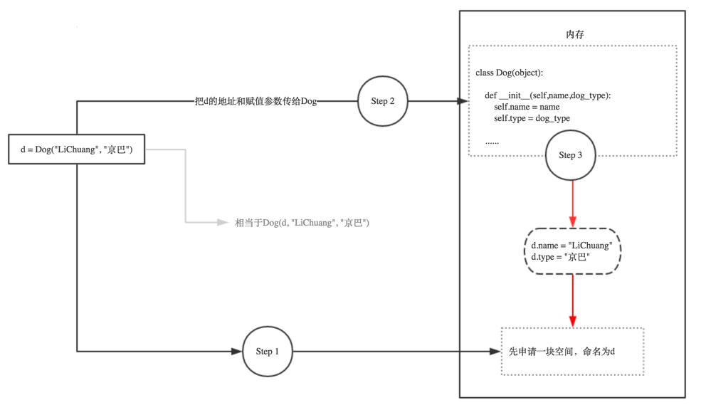

# python

## if \_\_name\_\_ == '\_\_main\_\_' <a id="1%20if%20__name__%20%3D%3D%20&apos;__main__&apos;"></a>

### 逻辑解释

通俗的理解 **name == 'main'**：假如你叫小明.py，在朋友眼中，你是小明\(**name == '小明'**\)；在你自己眼中，你是你自己\(**name == 'main'**\)。

if **name** == '**main**' 的意思是：当.py文件被直接运行时，if **name** == '**main**' 之下的代码块将被运行；当.py文件以模块形式被导入时，if **name** == '**main**' 之下的代码块不被运行。

对于很多编程语言来说，程序都必须要有一个入口，比如C，C++，以及完全面向对象的编程语言Java，C\#等。如果你接触过这些语言，对于程序入口这个概念应该很好理解，C，C++都需要有一个main函数作为程序的入口，也就是程序的运行会从main函数开始。同样，Java，C\#必须要有一个包含Main方法的主类，作为程序入口。

而Python则不同，它属于脚本语言，不像编译型语言那样先将程序编译成二进制再运行，而是动态的逐行解释运行。也就是从脚本第一行开始运行，没有统一的入口。

一个Python源码文件（.py）除了可以被直接运行外，还可以作为模块（也就是库），被其他.py文件导入。不管是直接运行还是被导入，.py文件的最顶层代码都会被运行（Python用缩进来区分代码层次），而当一个.py文件作为模块被导入时，我们可能不希望一部分代码被运行。

### **举例说明**

假设我们有一个const.py文件，内容如下

```python
PI = 3.14
 
def main():
    print("PI:", PI)
 
main()
 
# 运行结果：PI: 3.14
```

现在，我们写一个用于计算圆面积的area.py文件，area.py文件需要用到const.py文件中的PI变量。从const.py中，我们把PI变量导入area.py：

```python
from const import PI
 
def calc_round_area(radius):
    return PI * (radius ** 2)
 
def main():
    print("round area: ", calc_round_area(2))
 
main()
 
'''
运行结果：
PI: 3.14
round area:  12.56
'''
```

我们看到const.py中的main函数也被运行了，实际上我们不希望它被运行，因为const.py提供的main函数只是为了测试常量定义。这时if **name** == '**main**' 派上了用场，我们把const.py改一下，添加if **name** == "**main**"：

```python
PI = 3.14
 
def main():
    print("PI:", PI)
 
if __name__ == "__main__":
    main()
```

运行const.py，输出如下

```python
PI: 3.14
```

运行area.py，输出如下：

```python
round area:  12.56
```

如上，我们可以看到if **name** == '**main**' 相当于Python模拟的程序入口，Python本身并没有这么规定，这只是一种编码习惯。由于模块之间相互引用，不同模块可能有这样的定义，而程序入口只有一个。到底哪个程序入口被选中，这取决于**name** 的值。

## **\_init\_\_与self** <a id="2%20__init__%E4%B8%8Eself"></a>

### **逻辑解释**

self，英文单词意思很明显，表示自己，本身。python的self，是个对象（Object），是当前类的实例。

在类的代码（函数）中，需要访问当前的实例中的变量和函数的，即，访问Instance中的：

* 对应的变量（属性，property\)：Instance.ProperyName，去读取之前的值和写入新的值
* 调用对应函数（function）：Instance.function\(\)，即执行对应的动作

而需要访问实例的变量和调用实例的函数，当然需要对应的实例Instance对象本身。而Python中就规定好了，函数的第一个参数，就必须是实例对象本身，并且建议，约定俗成，把其名字写为self。如果没有用到self，即代码中，去掉self后，那种写法所使用到的变量，实际上不是你所希望的，不是真正的实例中的变量和函数，而是的访问到了其他部分的变量和函数了。甚至会由于没有合适的初始化实例变量，而导致后续无法访问的错误。

下面，就通过代码，来演示，如果去掉self，或者没有合理的使用self，会出现哪些错误。

### **举例说明**

```python
#!/usr/bin/env python
# -*- coding:utf-8 -*-
# Author: antcolonies
 
class Person(object):
    def __init__(self, name, lang, website):
        self.name = name
        self.lang = lang
        self.website = website
 
        print('self: ', self)
        print('type of self: ', type(self))
'''
未实例化时，运行程序，构造方法没有运行
'''
 
p = Person('Tim', 'English', 'www.universal.com')   
 
'''实例化后运行的结果
self:  <__main__.Person object at 0x00000000021EAF98>
type of self:  <class '__main__.Person'>
'''
```

可以看出self为实例变量p，是一个Person类型的对象。

```python
class Dog(object):       
    def __init__(self,name,dog_type):
        self.name = name
        self.type = dog_type
   
    def sayhi(self):
        print("hello,I am a dog, my name is ",self.name)
   
   
d = Dog('LiChuang',"京巴")            # 实例化
d.sayhi()
```

以下是d = Dog\('LiChuang',"京巴"\)实例化的示意图：



如下代码，完整的演示了，如果没有在类Class的最初的**init**函数中，正确的初始化实例变量，则会导致后续没有变量可用，因而出现AttributeError的错误：

```python
#!/usr/bin/env python
# -*- coding:utf-8 -*-
# Author: antcolonies
 
name = 'whole global name'
'''
注：此处全局的变量名，写成name，只是为了演示而用
实际上，好的编程风格，应该写成gName之类的名字，
以表示该变量是Global的变量
'''
 
class Person(object):
    def __init__(self, newPersonName):
        # self.name = newPersonName
        '''
        如果此处不写成self.name
        那么此处的name，只是__init__函数中的局部临时变量name而已
        和全局中的name，没有半毛钱关系
        '''
        name = newPersonName
        '''
        此处只是为了代码演示，而使用了局部变量name，
        不过需要注意的是，此处很明显，由于接下来的代码也没有利用到此处的局部变量name
        则就导致了，此处的name变量，实际上被浪费了，根本没有利用到
        '''
    def sayYourName(self):
        '''
        此处由于找不到实例中的name变量，所以会报错：
        AttributeError: Person instance has no attribute 'name'
        '''
        print('My name is %s' %self.name)
 
def selfAndInitDemo():
    personInstance = Person('Tim')
    personInstance.sayYourName()
 
if __name__ == '__main__':
    selfAndInitDemo()
 
 
'''  未使用self.name时抛异常
Traceback (most recent call last):
  File "E:/python14_workspace/s14/day06/test_1.py", line 18, in <module>
    selfAndInitDemo()
  File "E:/python14_workspace/s14/day06/test_1.py", line 15, in selfAndInitDemo
    personInstance.sayYourName()
  File "E:/python14_workspace/s14/day06/test_1.py", line 11, in sayYourName
    print('My name is %s' %self.name)
AttributeError: 'Person' object has no attribute 'name'
'''
```

从上述代码可见，由于在类的初始化（实例化）的**init**函数中，没有给self.name设置值，使得实例中，根本没有name这个变量，导致后续再去访问self.name，就会出现AttributeError的错误了。

对应的，如果写成self.name，则意思就正确了，就是初始化的时候，给实例中新增加，并且正常设置了正确的值newPersionName了，所以后续再去通过self.name，就可以访问到，当前实例中正确的变量name了。

相应的正确写法的代码如下：

```python
#!/usr/bin/env python
# -*- coding:utf-8 -*-
# Author: antcolonies
 
name = 'whole global name'
'''
注：此处全局的变量名，写成name，只是为了演示而用
实际上，好的编程风格，应该写成gName之类的名字，
以表示该变量是Global的变量
'''
 
class Person(object):
    def __init__(self, newPersonName):
        self.name = newPersonName
        '''
        此处正确的，通过访问self.name的形式，实现了：
            1.给实例中，增加了name变量
            2.并且给name赋了初值，为newPersionName
        '''
    def sayYourName(self):
        '''
        此处由于开始正确的初始化了self对象，使得其中有了name变量，
        所以此处可以正确访问了name值了
        '''
        print('My name is %s' %self.name)
 
def selfAndInitDemo():
    personInstance = Person('Tim')
    personInstance.sayYourName()
 
if __name__ == '__main__':
    selfAndInitDemo()
 
 
'''My name is Tim'''
```

在函数中，使用对应的变量，虽然代码是可以运行的，但是实际上使用的，不是实例中的变量。有时候，虽然你写的代码，可以运行，但是使用到的变量，由于没有加self，实际上是用到的不是实例的变量，而是其他的变量。此类问题，主要和Python中的变量的作用域有关，但是此处例子中，也和是否使用self有关：

```python
#!/usr/bin/env python
# -*- coding:utf-8 -*-
# Author: antcolonies
 
name = 'whole global name'
'''
注：此处全局的变量名，写成name，只是为了演示而用
实际上，好的编程风格，应该写成gName之类的名字，
以表示该变量是Global的变量
'''
 
class Person(object):
    name = 'class global name'
 
    def __init__(self, newPersonName):
        # self.name = newPersonName
        '''
        此处，没有使用self.name
        而使得此处的name，实际上仍是局部变量name
        虽然此处赋值了，但是后面没有被利用到，属于被浪费了的局部变量name
        '''
        name = newPersonName
    def sayYourName(self):
        '''
        此处，之所以没有像之前一样出现：
        AttributeError: Person instance has no attribute 'name'
        那是因为，虽然当前的实例self中，没有在__init__中初始化对应的name变量，实例self中没有对应的name变量
        但是由于实例所对应的类Person，有对应的name变量,所以也是可以正常执行代码的
        对应的，此处的self.name，实际上是Person.name
        '''
        print('My name is %s' %self.name)
        print('Name within class Person is actually the global name: %s' %name)
        print("Only access Person's name via Person.name = %s" %(Person.name))
 
def selfAndInitDemo():
    personInstance = Person('Tim')
    personInstance.sayYourName()
    print('whole global name is %s' %name)
 
if __name__ == '__main__':
    selfAndInitDemo()
 
 
'''
My name is class global name
Name within class Person is actually the global name: whole global name
Only access Person's name via Person.name = class global name
whole global name is whole global name
'''
```

其中，可见，此处开始\_init\_中，没有给self实例初始化对应的name，而后面的函数sayYourName中，虽然可以调用到self.name而没有出现AttributeError错误，但是实际上此处的值，不是所期望的，传入的name，即"Tim"，而是类中的name的值，即"class global name"。

## lambda

### 逻辑解释

lambda原型为：lambda 参数:操作\(参数\)。lambda函数也叫匿名函数，即没有具体名称的函数，它允许快速定义单行函数，可以用在任何需要函数的地方。这区别于def定义的函数。

### 举例说明

```python
#单个参数的：
g = lambda x : x ** 2
print g(3)
"""
9
"""
#多个参数的：
g = lambda x, y, z : (x + y) ** z
print g(1,2,2)
"""
9
"""
```

将一个 list 里的每个元素都平方：

```python
map( lambda x: x*x, [y for y in range(10)] )
```

这个写法要好过

```python
def sq(x):
    return x * x
 
map(sq, [y for y in range(10)])
```

因为后者多定义了一个（污染环境的）函数，尤其如果这个函数只会使用一次的话。进一步讲，匿名函数本质上就是一个函数，它所抽象出来的东西是一组运算。这是什么意思呢？类比

```python
a = [1, 2, 3]
```

和

```python
f = lambda x : x + 1
```

我们会发现，等号右边的东西完全可以脱离等号左边的东西而存在，等号左边的名字只是右边之实体的标识符。如果能习惯 \[1, 2, 3\] 单独存在，那么 lambda x : x + 1 也能单独存在其实也就不难理解了，它的意义就是给「某个数加一」这一运算本身。

现在回头来看 map\(\) 函数，它可以将一个函数映射到一个可枚举类型上面。沿用上面给出的 a 和 f，可以写

```python
map(f, a)
```

也就是将函数 f 依次套用在 a 的每一个元素上面，获得结果 \[2, 3, 4\]。现在用 lambda 表达式来替换 f，就变成：

```python
map( lambda x : x + 1, [1, 2, 3] )
```

会不会觉得现在很一目了然了？尤其是类比

```python
a = [1, 2, 3]
r = []
for each in a:
    r.append(each+1)
```

## apply

### 逻辑解释

python中apply函数的格式为：apply\(func, \*args_,_ \*\*kwargs\)。当然，func可以是匿名函数。

用途：当一个函数的参数存在于一个元组或者一个字典中时，用来间接的调用这个函数，并将元组或者字典中的参数按照顺序传递给参数。

解析：args是一个包含按照函数所需参数传递的位置参数的一个元组，简单来说，假如A函数的函数位置为 A\(a=1,b=2\),那么这个元组中就必须严格按照这个参数的位置顺序进行传递\(a=3,b=4\)，而不能是\(b=4,a=3\)这样的顺序。kwargs是一个包含关键字参数的字典，而其中args如果不传递，kwargs需要传递，则必须在args的位置留空。

apply的返回值就是函数func函数的返回值。

### 举例说明

```python
def function(a,b):
    print(a,b)
apply(function,('good','better'))
apply(function,(2,3+6))
apply(function,('cai','quan'))
apply(function,('cai',),{'b':'caiquan'}) 
apply(function,(),{'a':'caiquan','b':'Tom'})

'''
结果：
('good', 'better')
(2, 9)
('cai', 'quan')
('cai', 'caiquan')
('caiquan', 'Tom')
'''
```

有时候，函数的参数可能是DataFrame中的行或者列。

```python
#函数应用和映射
import numpy as np
import pandas as pd
df=pd.DataFrame(np.random.randn(4,3),columns=list('bde'),index=['utah','ohio','texas','oregon'])
print(df)
"""
               b         d         e
utah   -0.667969  1.974801  0.738890
ohio   -0.896774 -0.790914  0.474183
texas   0.043476  0.890176 -0.662676
oregon  0.701109 -2.238288 -0.154442
"""
 
#将函数应用到由各列或行形成的一维数组上。DataFrame的apply方法可以实现此功能
f=lambda x:x.max()-x.min()
#默认情况下会以列为单位，分别对列应用函数
t1=df.apply(f)
print(t1)
t2=df.apply(f,axis=1)
print(t2)
 
"""
b    1.597883
d    4.213089
e    1.401566
dtype: float64
utah      2.642770
ohio      1.370957
texas     1.552852
oregon    2.939397
dtype: float64
"""
 
#除标量外，传递给apply的函数还可以返回由多个值组成的Series
def f(x):
    return pd.Series([x.min(),x.max()],index=['min','max'])
t3=df.apply(f)
#从运行的结果可以看出，按列调用的顺序，调用函数运行的结果在右边依次追加
print(t3)
 
"""
            b         d         e
min -0.896774 -2.238288 -0.662676
max  0.701109  1.974801  0.738890
"""
 
#元素级的python函数，将函数应用到每一个元素
#将DataFrame中的各个浮点值保留两位小数
f=lambda x: '%.2f'%x
t3=df.applymap(f)
print(t3)
"""
            b      d      e
utah    -0.67   1.97   0.74
ohio    -0.90  -0.79   0.47
texas    0.04   0.89  -0.66
oregon   0.70  -2.24  -0.15
"""
 
#注意，之所以这里用map,是因为Series有一个元素级函数的map方法。而dataframe只有applymap。
t4=df['e'].map(f)
print(t4)
 
"""
utah     0.74
ohio     0.47
texas   -0.66
oregon  -0.15
"""
```

## 引入自定义模块

### 逻辑解释

#### python模块

Python 模块\(Module\)，是一个 Python 文件，以 .py 结尾，包含了 Python 对象定义和Python语句。

模块让你能够有逻辑地组织你的 Python 代码段。

把相关的代码分配到一个模块里能让你的代码更好用，更易懂。

模块能定义函数，类和变量（所以，一开始我认为的函数必须在类里是错的...受java的毒了），模块里也能包含可执行的代码。

#### python包

包是一个分层次的文件目录结构，它定义了一个由模块及子包，和子包下的子包等组成的 Python 的应用环境。简单来说，包就是文件夹，但该文件夹下必须存在 \_init\_.py 文件, 该文件的内容可以为空。\_init\_.py 用于标识当前文件夹是一个包。

### 举例说明

#### 同级目录

如果需要引入同级目录下的文件，则可以采用import一个模块的形式，即可调用。

考虑同一目录下的两个python文件，test.py 需要调用support.py 中的函数，目录结构如下：

```text
|-- test.py
|-- support.py
```

support.py 中的代码如下：

```python
def print_func( par ): 
     print "Hello : ", 
     par return
```

test.py 调用的代码如下：

```python
#!/usr/bin/python
# -*- coding: UTF-8 -*-
 
# 导入模块
import support
 
# 现在可以调用模块里包含的函数了
support.print_func("Runoob")
```

可以看到，上面的support.py 只有一个函数。假如这个函数在类中的话，即support.py 为：

```python
class  supportClass(object):
    def print_func( par ):
        print ("Hello : ", par)
        return 
```

那么如果test.py 中的代码不变，就会报错：

```python
AttributeError: module 'support' has no attribute 'print_func'
```

这是因为，虽然import进来了support这个模块，但是print\_func并不是直接在这个模块中的，而是在类supportClass中。所以直接调用support.print\_func\("Runoob"\)就出错了。最显然的解决方式为，在test.py 中这么写：

```python
#!/usr/bin/python
# -*- coding: UTF-8 -*-
 
# 导入模块
import support #或者写成from support import *
 
# 现在可以调用模块里包含的函数了
support.supportClass.print_func("Runoob") #输出：Hello :  Runoob
```

题外话：无论是import XXX 还是 from XXX import AAA ，XXX都是模块，AAA可以是这个模块中的函数，类或者变量。**不要把类的名字和module的名字设成一样**，否则，会报：

```python
Python AttributeError: 'module' object has no attribute xxxx
```

导致在这个问题的原因是模块名和要引用的类或方法或变量的名字重了。说通俗点就是，python脚本名字（模块名）和要引用的内容（模块内的类，变量等）的名字重复了，导致原本“类-&gt;属性/方法”的引用意图被解析为了"模块-&gt;属性”的引用意图。当模块下面没有这个属性，就抛出了这个错误。解决办法是换不重复的命名。 这与JAVA要求文件名和类名是一样的要求是完全不同的。

#### 子目录

如果需要引入子目录下的文件，则可以采用import一个包的形式，将子目录封装成包，即可调用。考虑一个在 package\_runoob 目录下的 runoob1.py、runoob2.py、\_init\_.py 文件，test.py 为测试调用包的代码，目录结构如下：

```text
test.py
package_runoob
|-- __init__.py
|-- runoob1.py
|-- runoob2.py
```

\_init\_.py可以是空文件。

test.py 调用代码如下：

```python
#!/usr/bin/python
# -*- coding: UTF-8 -*-
 
# 导入 Phone 包
from package_runoob.runoob1 import func1
from package_runoob.runoob2 import func2
 
func1()
func2()
```

也可以采用

```python
#!/usr/bin/python
# -*- coding: UTF-8 -*-
 
# 导入 Phone 包
import package_runoob.runoob1
import package_runoob.runoob2
 
package_runoob.runoob1.func1()
package_runoob.runoob2.func2()
```

## 下划线命名规则

### 变量

#### \_XXX

单下划线开头的变量，表明这是一个受保护（protected）的变量，**原则上不允许直接访问，但是外部类还是可以访问到这个变量**。因为这只是一个程序员之间的约定，用于警告说明这是一个受保护的变量，外部类不要去访问它。 以单下划线'"\_'为前缀的名称，如\_xxx，应该被视为API中非公开的部分（不管是函数，方法还是数据成员）。此时，应该将它们看做一种实现细节，在修改他们时无需对外部通知。 如果你写了代码‘from &lt;模块/包名&gt; import \*’，那么以''\_"开头的名称都不会被导入，除非模块或包中的'\_\_all\_\_'列表显示地包含了它们。不过值得注意的是，如果使用import a\_module这样导入模块，仍然可以用a\_module.\_some\_var这样的形式访问到这样的对象。

#### \_\_XXX

双下划线开头的，表示的是私有类型（private）的变量，**只能允许这个类本身进行访问，甚至它的子类也不可以**，用于命名一个类属性（类变量），调用时名字会被改变（在类Student内部，\_\_name会变成\_student\_\_name，如self.\_Student\_\_name）。双下划线开头的实例变量是不是一定不能从外部访问呢？其实也不是，仍然可以通过\_Student\_\_name来访问\_\_name变量。

```python
>>> class A(object): 
...     def _internal_use(self): 
...         pass
...     def __method_name(self): 
...         pass
... 
>>> dir(A()) 
['_A__method_name', ..., '_internal_use']
```

#### \_\_XXX\_\_

以双下划线开头，并且以双下划线结尾的，是内置变量，内置变量是可以直接访问的，如\_\_init\_\_,\_\_import\_\_或是\_\_file\_\_。所以，不要自己定义这类变量。

#### XXX\_

单下划线结尾的变量一般只是为了避免与Python关键字的命名冲突。

#### XXX\_XXX

USER\_CONSTANT，大写加下划线，对于不会发生改变的全局变量，使用大写加下划线。

### 函数和方法

#### 受保护方法：小写和一个前导下划线

这里和受保护变量一样，并不是真正的受保护权限。同时也应该注意一般函数不要使用两个前导下划线（当遇到两个前导下划线时，Python的名称改编特性将发挥作用）。

```python
def _secrete(self):
    print "don't test me."
```

#### 特殊方法：小写和两个前导下划线，两个后置下划线

这种风格只应用于特殊函数，比如操作符重载等。对Python系统来说，这将确保不会与用户自定义的名称冲突。通常，你将会覆写这些方法，并在里面实现你所需要的功能，以便Python调用它们。例如，当定义一个类时，你经常会覆写'\_\_init\_\_'方法。

```python
def __add__(self, other):
    return int.__add__(other)
```

 这种风格只应用于特殊函数，比如操作符重载等。

### 类

类总是使用驼峰式命名，即所有单词首字母大写其余字母小写。类名应该简写，精确，并足以从中理解类所完成的工作。 常见的一个方法是使用表示其类型或者特性的后缀，例如: SQLEngine、MimeTypes

```python
class UserProfile(object):
    def __init__(self, profile):
        return self._profile = profile
 
    def profile(self):
        return self._profile
```

模块和包

除了特殊模块init之外，模块名称都是用不带下划线的小写字母。若是实现了一个协议，那么通常使用lib作为后缀。

```python
import smtplib
```

## 生成器与yield

### 简单生成器

要创建一个generator，有很多种方法。第一种方法很简单，只要把一个列表生成式的\[\]改成\(\)，就创建了一个generator：

```python
>>> L = [x * x for x in range(10)]
>>> L
[0, 1, 4, 9, 16, 25, 36, 49, 64, 81]
>>> g = (x * x for x in range(10))
>>> g
<generator object <genexpr> at 0x104feab40>
```

创建L和g的区别仅在于最外层的\[\]和\(\)，L是一个list，而g是一个generator。 我们可以直接打印出list的每一个元素，但我们怎么打印出generator的每一个元素呢？ 如果要一个一个打印出来，可以通过generator的next\(\)方法：

```python
>>> g.next()
0
>>> g.next()
1
>>> g.next()
4
>>> g.next()
9
>>> g.next()
16
>>> g.next()
25
>>> g.next()
36
>>> g.next()
49
>>> g.next()
64
>>> g.next()
81
>>> g.next()
Traceback (most recent call last):
  File "<stdin>", line 1, in <module>
StopIteration
```

### 带yeild的生成器

我们先来看一个函数：

```python
def fib(max):
    n, a, b = 0, 0, 1
    while n < max:
        print (b)
        a, b = b, a + b
        n = n + 1
```

调用结果：

```python
fib(6)
1
1
2
3
5
8
```

仔细观察，可以看出，fib函数实际上是定义了斐波拉契数列的推算规则，可以从第一个元素开始，推算出后续任意的元素，这种逻辑其实非常类似generator。 就是说，上面的函数和generator仅一步之遥。要把fib函数变成generator，只需要把print b改为yield b就可以了：

```python
def fib(max):
    n, a, b = 0, 0, 1
    while n < max:
        yield b
        a, b = b, a + b
        n = n + 1
```

这就是定义generator的另一种方法。如果一个函数定义中包含yield关键字，那么这个函数就不再是一个普通函数，而是一个generator：

```python
>>> fib(6)
<generator object fib at 0x104feaaa0>
```

这里，最难理解的就是generator和函数的执行流程不一样。函数是顺序执行，遇到return语句或者最后一行函数语句就返回。而变成generator的函数，在每次调用next\(\)的时候执行，遇到yield语句返回，再次执行时从上次返回的yield语句处继续执行。 举个简单的例子，定义一个generator，依次返回数字1，3，5：

```python
>>> def odd():
...     print ('step 1')
...     yield 1
...     print ('step 2')
...     yield 3
...     print ('step 3')
...     yield 5
...
>>> o = odd()
>>> o.next()
step 1
1
>>> o.next()
step 2
3
>>> o.next()
step 3
5
>>> o.next()
Traceback (most recent call last):
  File "<stdin>", line 1, in <module>
StopIteration
```

可以看到，odd不是普通函数，而是generator，在执行过程中，遇到yield就中断，下次又继续执行。执行3次yield后，已经没有yield可以执行了，所以，第4次调用next\(\)就报错。 回到fib的例子，我们在循环过程中不断调用yield，就会不断中断。当然要给循环设置一个条件来退出循环，不然就会产生一个无限数列出来。 同样的，把函数改成generator后，我们基本上从来不会用next\(\)来调用它，而是直接使用for循环来迭代：

```python
>>> for n in fib(6):
...     print (n)
...
1
1
2
3
5
8
```

### 加强的生成器

生成器中有一些加强特性,所以除了 next\(\)来获得下个生成的值,用户可以将值回送给生成器\[send\(\)\],在生成器中抛出异常,以及要求生成器退出\[close\(\)\]

```python
def gen(x):
    count = x
    while True:
        val = (yield count) 
        if val is not None:
            count = val
        else:
            count += 1
 
f = gen(5)
print (f.next())
print (f.next())
print (f.next())
print ('====================')
print (f.send(9))#发送数字9给生成器
print (f.next())
print (f.next())
```

输出：

```python
5
6
7
====================
9
10
1
```

## Source












