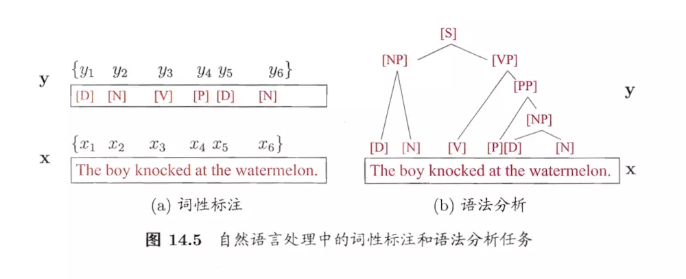
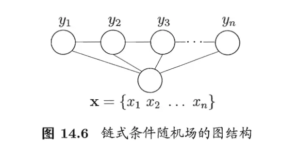

# 条件随机场

## 条件随机场

条件随机场\(Conditional Random Field, CRF\)是一种判别式无向图模型。生成式模型是直接对联合分布进行建模，而判别式模型则是对条件分布进行建模。条件随机场是给定随机变量 $$X$$ 条件下，随机变量 $$Y$$ 的马尔可夫随机场。 

设 $$X$$ 与 $$Y$$ 是随机变量， $$P(Y|X)$$ 是在给 $$X$$ 的条件下 $$Y$$ 的条件概率分布。若随机变量 $$Y$$ 构成一个无向图 $$G = (V,E)$$ 表示的马尔可夫随机场，即

                                                 $$P(Y_v|X,Y_w,w\neq v) = P(Y_v|X,Y_w,w\sim v)$$ 

对任意结点 $$v$$ 成立，则称条件概率分布 $$P(Y|X)$$ 为条件随机场。式中 $$w\sim v$$ 表示在图 $$G=(V,E)$$ 中与结点 $$v$$ 有边连接的所有结点 $$w$$ ， $$w\neq v$$ 表示结点 $$v$$ 以外所有结点， $$Y_v,Y_u,Y_w$$ 为结点 $$v,u,w$$ 对应的随机变量。

## 链式条件随机场

这里主要介绍定义在线性链上的特殊的条件随机场，称为线性链条件随机场\(Linear Chain Conditional Random Field\)。线性链条件随机场可以用于标注问题。这时，在条件随机概率模型 $$P(Y|X)$$ 中， $$Y$$ 是输出变量，表示标记序列， $$X$$ 是输入变量，表示需要标注的观测序列。也把标记序列称为状态序列。学习时，利用训练数据集通过极大似然估计或正则化的极大似然估计得到条件概率模型 $$\hat{P}(Y|X)$$；预测时，对于给定的输入序列 $$x$$ ，求出条件概率 $$\hat{P}(y|x)$$ 最大的输出序列 $$\hat{y}$$。

设 $$X=(X_1,X_2,\dots,X_n)$$ ， $$Y = (Y_1,Y_2,\dots,Y_n)$$ 均为线性链表示的随机变量序列，若在给定随机变量序列 $$X$$ 的条件下，随机变量序列 $$Y$$ 的条件概率分布 $$P(Y|X)$$ 构成条件随机场，即满足马尔可夫性

                         $$P(Y_i|X,Y_1,\dots,Y_{i-1},Y_{i+1},\dots,Y_n)=P(Y_i|X,Y_{i-1},Y_{i+1})$$ 

                                      $$ i=1,2,\dots,n(在i=1和n时只考虑单边)$$ 

则称 $$P(Y|X)$$ 为线性链条件随机场。在标注问题中， $$X$$ 表示输入观测序列， $$Y$$ 表示对应的输出标记序列或状态序列。

