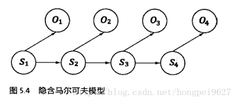
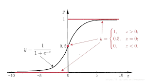

# 隐马尔可夫

## 隐马尔可夫模型

介绍隐马尔可夫模型之前，首先需要明白马尔可夫链。

### 马尔可夫链

假设随机过程中各个状态$$s_t$$的概率分布，只与它之前的一个状态$$s_{t-1}$$有关，即 $$P(s_t|s_1,s_2,s_3,\dots,s_{t-1}) = P(s_t|s_{t-1})$$ 。比如硬性规定今天的气温只跟昨天有关，跟前天或之前的天气无关。这种假设未必适用所有的应用，但是至少对以前很多不好解决的问题给出了近似解。这个假设后来被命名为马尔可夫假设，而符合这个假设的随机过程则称为马尔可夫过程，也称为马尔可夫链。

上图中，四个圈表示四个状态，每条边表示一个可能的状态转换，边上的权值为转移概率。例如，状态 $$m_1$$ 到状态 $$m_2$$ 之间只有一条边，且边上的权重为1.0。这表示从状态 $$m_1$$ 只可能转换到状态 $$m_2$$ ，转移概率为1.0。从 $$m_2$$ 出发的有两条边：到 $$m_3$$ 和到 $$m_4$$ 。其中权值0.6表示：如果某个时刻 $$t$$ 的状态 $$s_t$$是 $$m_2$$ ，则下一个时刻的状态 $$s_{t+1} = m_3$$ 的概率是60%。如果用数学符号表示是 $$P(s_{t+1}=m_3|s_t=m_2) = 0.6$$ 。类似的，有 $$P(s_{t+1}=m_4|s_t=m_2) = 0.4$$ 。随机选择一个状态作为初始状态，随后按照上述规则随机选择后续状态。这样运行一段时间 $$T$$ 后，就会产生一个状态序列： $$s_1,s_2,s_3,\dots,s_T$$ 。

### 隐马尔可夫模型

隐马尔可夫模型是马尔可夫链的一个扩展：任一时刻 $$t$$ 的状态 $$s_t$$ 是不可见的。观察者没法通过观察到一个状态序列 $$s_1,s_2,s_3,\dots s_T$$ 来推测转移概率等参数。但是，隐马尔可夫模型在每个时刻 $$t$$ 会输出一个符号 $$o_t$$ ，而且 $$o_t$$ 跟 $$s_t$$ 相关且仅跟 $$s_t$$ 相关。即，我们观测不到状态变化，只能观测到输出符号。

基于马尔可夫假设和独立输出假设，我们可以计算出某个特定的状态序列 $$s_1,s_2,s_3,\cdots$$ 产生输出符号 $$o_1,o_2,o_3,\cdots$$ 的概率

                               $$P(s_1,s_2,s_3,\cdots,o_1,o_2,o_3,\cdots) = \prod \limits_t P(s_t|s_{t-1})\cdot P(o_t|s_t)$$ 

除了结构信息，想要确定一个隐马尔可夫模型还需要以下三组参数：

* 状态转移概率：模型在各个状态间转换的概率，通常记为矩阵 $$A = [a_{ij}]_{N\times N}$$ 其中
*                             $$a_{ij}=P(y_{t+1}=s_j|y_{t}=s_i),\ \ \ 1\leq i,j\leq N$$ 
*                              表示在任意时刻 $$t$$ ，若状态为 $$s_i$$ ，则下一时刻状态为 $$s_j$$ 的概率
* 输出观测概率：模型根据当前状态获得各个观测值的概率，记矩阵 $$B=[b_{ij}]_{N\times M}$$ 其中
*                             $$b_{ij}=P(x_t=o_j|y_t=s_i),\ \ \ 1\leq i\leq N,1\leq j \leq M$$ 
*                              表示任意时刻 $$t$$ ，若状态为 $$s_i$$ ，则观测值 $$o_j$$ 被获取的概率
* 初始状态概率：模型在初始时刻各状态出现的概率，记为 $$\pi=(\pi_1,\pi_2,\dots,\pi_N)$$ 其中
*                              $$\pi_i = P(y_1=s_i), \ \ \ 1\leq i\leq N$$ 
*                              表示模型的初始状态为 $$s_i$$ 的概率

通过指定状态空间 $$\mathcal{Y}$$ 、观测空间 $$\mathcal{X}$$ 和上面三组参数，就能确定一个隐马尔可夫模型，通常用其参数 $$\lambda=[A,B,\pi]$$ 来指代。给定隐马尔可夫模型 $$\lambda$$ ，它按如下过程产生观测序列 $$\{x_1,x_2,\dots,x_n\}$$ ：

* （1）设置 $$t=1$$ ，并根据初始状态概率 $$\pi$$ 选择初始状态 $$y_1$$ 
* （2）根据状态 $$y_t$$ 和输出观测概率 $$B$$ 选择观测变量取值 $$x_t$$ 
* （3）根据状态 $$y_t$$ 和状态转移矩阵 $$A$$ 转移模型状态，即确定 $$y_{t+1}$$ 
* （4）若 $$t<n$$ 设置 $$t = t+1$$ ，并转到第（2）步，否则停止

其中 $$y_t\in\{s_1,s_2,\dots,s_N\}$$ 和 $$x_t\in\{o_1,o_2,\dots,o_M\}$$ 分别为第 $$t$$ 时刻的状态和观测值

#### 举例如下

假设有4个盒子，每个盒子里都装有红白两种颜色的球：

| 盒子 | 1 | 2 | 3 | 4 |
| :---: | :---: | :---: | :---: | :---: |
| 红球 | 5 | 3 | 6 | 8 |
| 白球 | 5 | 7 | 4 | 2 |

按照下面的方法抽球，产生一个球的颜色的观测序列：

开始，从4个盒子里以等概率随机选取1个盒子，从这个盒子里随机抽出1个球，记录颜色后，放回；然后，从当前盒子随机转移到下一个盒子，规则是：如果当前是盒子1，那么下一个盒子一定是盒子2，如果当前是盒子2或3，那么分别以概率0.4，0.6转移到左边或右边的盒子，如果当前是盒子4，那么各以0.5的概率停留在盒子4或转移到盒子3；确定转移的盒子后，再从这个盒子里随机抽取1个球，记录颜色，放回；如此下去，重复5次，得到一个球的颜色的观测序列：

                                                          $$O = \{红,红,白,白,红\}$$ 

在这个过程中，观察者只能观测到球颜色的序列，观测不到球从哪个盒子取出，即观测不到盒子的序列。

在这个例子中有两个随机序列，一个是盒子的序列（状态序列），一个是球的颜色的观测序列（观测序列）。前者是隐藏的，只有后者是可观测的。这是一个隐马尔可夫模型的例子，根据所给条件，可以明确状态集合、观测集合、序列长度及模型的三要素

状态集合： $$Q=\{盒子1,盒子2,盒子3,盒子4\},\ \ \ N=4$$ 

观测集合： $$V = \{红，白\},\ \ \ M=2$$ 

状态序列和观测序列长度： $$T = 5$$ 

初始状态概率分布为： $$\pi = (0.25,0.25,0.25,0.25)^T$$ 

状态转移概率分布为： $$A =  \left[  \begin{matrix}     0\ \ \  \ 1\ \ \ \ 0\ \ \ \ 0\\ 0.4 \ \  0\ \ 0.6\ \ 0\\ 0 \ \  0.4 \ \ 0 \ \ 0.6\\ 0 \ \  0 \ \ 0.5 \ \ 0.5 \end{matrix}   \right] $$   

观测概率分布为： $$B =  \left[  \begin{matrix}     0.5 \ \ 0.5\\ 0.3 \ \ 0.7\\ 0.6 \ \ 0.4\\ 0.8 \ \ 0.2 \end{matrix}   \right] $$ 

### 隐马尔可夫模型的训练

围绕着隐马尔可夫模型有三个基本问题：

        _1、给定一个模型，如何计算某个特定的输出序列的概率_

        _2、给定一个模型和某个特定的输出序列，如何找到最能产生这个输出序列的状态序列_

        _3、给定足够量的观测数据，如何估计隐马尔可夫模型的参数_

## 三大问题

### 给定模型，计算特定的输出序列的概率

使用前向与后向（Forward-Backward）算法。现实任务中，许多任务需要根据以往的观测序列来推测当前时刻最有可能的观测值，这显然可转化为这个计算特定输出序列的概率的问题。

#### 前向算法

给定隐马尔可夫模型 $$\lambda$$ ，定义到时刻 $$t$$ 部分观测序列为 $$o_1,o_2,\dots,o_t$$ 且状态为 $$q_i$$ 的概率为**前向概率**，记作： $$\alpha_t(i)=P(o_1,o_2,\dots,o_t,i_t=q_i|\lambda)$$ 可以递推地求得前向概率 $$\alpha_t(i)$$ 及观测序列概率$$P(O|\lambda)$$

* 输入：隐马尔可夫模型 $$\lambda$$ ，观测序列 $$O$$ 
* 输出：观测序列概率 $$P(O|\lambda)$$ 
* （1）初值： $$\alpha_1(i)=\pi_ib_i(o_1),\ \ i=1,2,\dots,N$$ 
* （2）递推：对 $$t = 1,2,\dots,T-1$$ 
*                       $$\alpha_{t+1}(i) = [\sum\limits_{j=1}^N\alpha_t(j)\alpha_{ji}]b_i(O_{t+1}), \ \ \ i=1,2,\dots,N$$ 
* （3）终止： $$P(O|\lambda) = \sum\limits_{i=1}^N\alpha_T(i)$$ 

递推部分就是上个状态转移到当前状态的所有可能乘上当前状态出现对应观测的概率；终止部分即把所有可能出现这种观测的可能加起来，即 $$P(O|\lambda)$$ 

**举例如下**

考虑盒子和球模型 $$\lambda=(A,B,\pi)$$ ，状态集合 $$Q = \{1,2,3\}$$ ，观测集合 $$V = \{红,白\}$$，

$$A =  \left[  \begin{matrix} 0.5\ \ \  \ 0.2\ \ \ \ 0.3\\ 0.3\ \ \  \ 0.5\ \ \ \ 0.2\\ 0.2\ \ \  \ 0.3\ \ \ \ 0.5\end{matrix}   \right] $$，     $$B =  \left[  \begin{matrix} 0.5\ \ \  \ 0.5\\ 0.4\ \ \  \ 0.6\\ 0.7\ \ \  \ 0.3\end{matrix}   \right] $$  ，  $$\pi = (0.2,0.4,0.4)^T$$   

设 $$T = 3$$ ， $$O = (红,白,红)$$ ，用前向算法计算 $$P(O|\lambda)$$ 

* （1）初值： $$\alpha_1(1) = \pi_1b_1(o_1)=0.2\times 0.5 = 0.1$$ 
*                        $$\alpha_1(2) = \pi_2b_2(o_1)=0.4\times 0.4 = 0.16$$ 
*                        $$\alpha_1(3) = \pi_3b_3(o_1)=0.4\times 0.7 = 0.28$$ 
* （2）迭代： 
* $$\alpha_2(1)=[\sum\limits_{i=1}^3\alpha_1(i)\alpha_{i1}]b_1(o_2) = [0.1\times 0.5+0.16\times 0.3+0.28\times 0.2]\times 0.5=0.077$$ 
* $$\alpha_2(2)=[\sum\limits_{i=1}^3\alpha_1(i)\alpha_{i2}]b_2(o_2) = [0.1\times 0.2+0.16\times 0.5+0.28\times 0.3]\times 0.6=0.1104$$ 
* $$\alpha_2(3)=[\sum\limits_{i=1}^3\alpha_1(i)\alpha_{i3}]b_3(o_2) = [0.1\times 0.3+0.16\times 0.2+0.28\times 0.5]\times 0.3=0.0606$$
* $$\alpha_3(1)=[\sum\limits_{i=1}^3\alpha_2(i)\alpha_{i1}]b_1(o_3) =0.04187$$ 
* $$\alpha_3(2)=[\sum\limits_{i=1}^3\alpha_2(i)\alpha_{i2}]b_2(o_3) =0.03551$$ 
* $$\alpha_3(3)=[\sum\limits_{i=1}^3\alpha_2(i)\alpha_{i3}]b_3(o_3) =0.05284$$ 
* （3）终止： $$P(O|\lambda)=\sum\limits_{i=1}^3\alpha_3(i)=0.13022$$ 

#### 后向算法

给定隐马尔可夫模型 $$\lambda$$ ，定义在时刻 $$t$$ 状态为 $$q_i$$ 的条件下，从 $$t+1$$ 到 $$T$$ 的部分观测序列为 $$o_{t+1},o_{t+2},\dots,o_{T}$$ 的概率为**后向概率**，记作： $$\beta_t(i)=P(o_{t+1},o_{t+2},\dots,o_T|i_t=q_i,\lambda)$$ 可以用递推地方法求得后向概率 $$\beta_t(i)$$ 及观测序列概率 $$P(O|\lambda)$$ 

* 输入：隐马尔可夫模型 $$\lambda$$ ，观测序列 $$O$$ 
* 输出：观测序列概率 $$P(O|\lambda)$$ 
* （1） $$\beta_T(i)=1,\ \ \ i=1,2,\dots,N$$ 
* （2）对 $$t = T-1,T-2,\dots,1$$ 
*           $$\beta_t(i)=\sum\limits_{j=1}^N\alpha_{ij}b_j(o_{t+1})\beta_{t+1}(j),\ \ \ i=1,2,\dots,N$$ 
* （3） $$P(O|\lambda) = \sum\limits_{i=1}^N\pi_ib_i(o_1)\beta_1(i)$$ 

### 给定模型和特定的输出序列，找到最能产生这个输出序列的状态序列

使用维特比（Viterbi Algorithm）算法。在语音识别等任务中，观测值为语音信号，隐藏状态为文字，目标就是根据观测信号来推断最有可能的状态序列（即对应的文字）。

维特比算法是一种动态规划方法，核心思想是：如果最终的最优路径经过某个 $$o_i$$，那么从初始节点到 $$o_{i-1}$$ 点的路径必然也是一个最优路径，因为每一个节点 $$o_i$$ 只会影响前后两个$$P(o_{i-1}|o_i)$$和 $$P(o_i|o_{i+1})$$ 

维特比算法实际上是用动态规划解隐马尔可夫模型预测问题，即用动态规划求概率最大路径。这时一条路径对应着一个状态序列。根据动态规划原理，最优路径具有这样的特性：如果最优路径在时刻 $$t$$ 通过结点 $$i_t^*$$ ，那么这一路径从结点 $$i_t^*$$ 到终点 $$i_T^*$$ 的部分路径，对于从 $$i_t^*$$ 到 $$i_T^*$$ 的所有可能的部分路径来说，必须是最优的。因为假如不是这样，那么从 $$i_t^*$$ 到 $$i_T^*$$ 就有另一条更好的部分路径存在，如果把它和从 $$i_1^*$$ 到 $$i_t^*$$ 的部分路径连接起来，就会形成一条比原来的路径更优的路径，这是矛盾的。依据这一原理，我们只需从时刻 $$t = 1$$ 开始，递推地计算在时刻 $$t$$ 状态为 $$i$$ 的各条部分路径的最大概率，直至得到时刻 $$t = T$$ 状态为 $$i$$ 的各条路径的最大概率。

* 输入：模型 $$\lambda =(A,B,\pi) $$ 和观测 $$O = (o_1,o_2,\dots,o_T)$$ 
* 输出：最优路径 $$I^* = (i_1^*,i_2^*,\dots,i_T^*)$$ 
* （1）初始化： $$\delta_1(i)=\pi_ib_i(o_1),\ \ \ i=1,2,\dots,N\ \ \ \ \psi_1(i)=0,\ \ \ i=1,2,\dots,N $$ 
* （2）递推：对 $$t = 2,3,\dots,T$$ 
*                       $$\delta_t(i) = \max\limits_{1\leq j\leq N}[\delta_{t-1}(j)a_{ji}]b_i(o_t),\ \ \ i=1,2,\dots,N$$ 
*                       $$\psi_t(i) = \arg\max\limits_{1\leq j \leq N}[\delta_{t-1}(j)a_{ji}],\ \ \ i=1,2,\dots,N$$ 
* （3）终止： $$P^* = \max\limits_{1\leq i\leq N}\delta_T(i)$$    $$i_T^* = \arg\max\limits_{1\leq i \leq N}[\delta_T(i)]$$ 
* （4）最优路径回溯：对 $$t = T-1,T-2,\dots,1$$ 
*                                       $$i_t^* = \psi_{t+1}(i_{t+1}^*)$$ 

**举例如下**

考虑盒子和球模型 $$\lambda=(A,B,\pi)$$ ，状态集合 $$Q = \{1,2,3\}$$ ，观测集合 $$V = \{红,白\}$$，

$$A =  \left[  \begin{matrix} 0.5\ \ \  \ 0.2\ \ \ \ 0.3\\ 0.3\ \ \  \ 0.5\ \ \ \ 0.2\\ 0.2\ \ \  \ 0.3\ \ \ \ 0.5\end{matrix}   \right] $$，     $$B =  \left[  \begin{matrix} 0.5\ \ \  \ 0.5\\ 0.4\ \ \  \ 0.6\\ 0.7\ \ \  \ 0.3\end{matrix}   \right] $$  ，  $$\pi = (0.2,0.4,0.4)^T$$   

已知观测序列 $$O = (红,白,红)$$ ，求最优状态序列，即最优路径 $$I^* = (i_1^*,i_2^*,i_3^*)$$ 

（1）初始化。在 $$t = 1$$ 时，对每一个状态 $$i,\ i=1,2,3$$ ，求状态 $$i$$ 观测 $$o_1$$ 为红的概率，记此概率为 $$\delta_1(i)$$ ，则

                                          $$\delta_1(i) = \pi_ib_i(o_1)=\pi_ib_i(红),\ \ \ i=1,2,3$$ 

代入实际数据

        $$\delta_1(1) = 0.2\times0.5=0.1$$       $$\delta_1(2) = 0.4\times0.4=0.16$$      $$\delta_1(3) = 0.4\times0.7=0.28$$  

记 $$\psi_1(i)=0,\ i=1,2,3$$ 

（2）在 $$t = 2$$ 时，对每个状态 $$i,\ i=1,2,3$$ ，求在 $$t = 1$$ 时状态为 $$j$$ 观测为红并在 $$t = 2$$ 时状态为 $$i$$ 观测 $$o_2$$ 为白的路径的最大概率，记此最大概率为 $$\delta_2(i)$$ ，则

                                                        $$\delta_2(i) = \max\limits_{1\leq j \leq 3}[\delta_1(j)\alpha_{ji}]b_i(o_2)$$ 

同时，对每个状态 $$i,\ i=1,2,3$$ ，记录概率最大路径的前一个状态 $$j$$ 

                                               $$\psi_2(i)=\arg\max\limits_{1\leq j \leq 3}[\delta_1(j)\alpha_{ji}],\ \ \ i=,1,2,3$$ 

计算：        $$\delta_2(1)=\max\limits_{1\leq j\leq 3}[\delta_1(j)a_{j1}]b_1(o_2)$$ 

                               $$=\max\limits_j(0.1\times0.5, 0.16\times0.3, 0.28\times0.2)\times 0.5=0.028$$ 

                   $$\psi_2(1)=3$$ 

                   $$\delta_2(2)=0.0504$$        $$\psi_2(2)=3$$ 

                   $$\delta_2(3)=0.042$$           $$\psi_2(3)=3$$ 

同样，在 $$t = 3$$ 时，

                     $$\delta_3(i)=\max\limits_{1\leq j \leq 3}[\delta_2(j)\alpha_{ji}]b_i(o_3)$$     $$\psi_3(i) = \arg\max\limits_{1\leq j \leq 3}[\delta_2(j)a_{ji}]$$ 

                    $$\delta_3(1) = 0.00756$$     $$\psi_3(1) = 2$$ 

                    $$\delta_3(2) = 0.01008$$     $$\psi_3(2) = 2$$ 

                    $$\delta_3(3) = 0.0147$$       $$\psi_3(3) = 3$$ 

（3）以 $$P^*$$ 表示最优路径的概率，则

                                   $$P^* = \max\limits_{1\leq i \leq 3}\delta_3(i)=0.0147$$ 

最优路径的终点是 $$i_3^*$$ 

                                   $$i_3^* = \arg\max\limits_i[\delta_3(i)]=3$$ 

（4）由最优路径的终点 $$i_3^*$$ ，逆向找到 $$i_2^*,\ i_1^*$$ 

                    在 $$t = 2$$ 时， $$i_2^* = \psi_3(i_3^*)=\psi_3(3)=3$$ 

                    在 $$t = 1$$ 时， $$i_1^* = \psi_2(i_2^*)=\psi_2(3)=3$$ 

于是求得最优路径，即最优状态序列 $$I^* = (i_1^*,i_2^*,i_3^*)=(3,3,3)$$ 

### 给定足够量的观测数据，估计隐马尔可夫模型的参数

使用鲍姆-韦尔奇\(Baum-Welch\)算法，也就是EM算法。在大多数现实应用中，人工指定模型参数已变得越来越不可行，如何根据训练样本学得最优的模型参数，正好就是本问题。

在利用隐马尔可夫模型解决实际问题中，需要先知道每个状态 $$s_t$$ 产生相应输出符号 $$o_t$$ 的概率 $$P(o_t|s_t)$$ ，也称为生成概率；和转移概率，即从前一个状态 $$s_{t-1}$$ 进入当前状态 $$s_t$$ 的概率 $$P(s_t|s_{t-1})$$ 。这些概率被称为马尔可夫模型的参数，而计算或者估计这些参数的过程称为模型的训练。

我们从条件概率的定义出发，知道：

                           $$P(o_t|s_t) = \frac{P(o_t,s_t)}{P(s_t)}$$ 

                           $$P(s_t|s_{t-1}) = \frac{P(s_{t-1},s_t)}{P(s_{t-1})}$$ 

对于上面第一个概率公式（生成概率），状态输出概率，如果有足够多人工标记的数据，知道经过状态 $$s_t$$ 有多少次 $$\#(s_t)$$ ，每经过这个状态时，分别产生的输出 $$o_t$$ 是什么，而且分别有多少次 $$\#(o_t,s_t)$$ 就可以算出（比如语音识别中，符号即每个词对应声波；中英翻译中，中文字为状态，英文字为输出符号）。上述第二个概率公式（转移概率），与前文提到的训练统计语言模型的条件概率完全相同，因此可以依照统计语言模型的训练方法，即数一下出现前一个词后出现这个词的次数（同上文例子，出现“联想”这个词后，出现“公司”的概率是多少，即数一下“联想”的次数，数一下“联想公司”的次数）

                            $$P(o_t|s_t) \approx \frac{\#(o_t,s_t)}{\#(s_t)}$$ 

                            $$P(w_t|w_{i-1}) \approx \frac{\#(w_{i-1},w_i)}{\#(w_{i-1})}$$ 

然而，像语音识别等这种应用大量人工标注不现实，所以这个方法只适用于一部分应用。因此，训练隐马尔可夫模型更实用的方法是仅仅通过大量观测到的信号 $$o_1,o_2,o_3,\cdots$$ 就能推算模型参数的 $$P(s_t|s_{t-1})$$ 和 $$P(o_t|s_t)$$ 的方法，主要是使用 _鲍姆-韦尔奇算法_

两个不同的隐马尔可夫模型可以产生同样的输出信号，因此，仅仅通过观察到的输出信号来倒推它的隐马尔可夫模型可能会得到多个合适的模型，但总会有一个模型 $$M_{\theta_1}$$ 比其他的 $$M_{\theta_2}, M_{\theta_3},\dots$$ 更有可能产生观测到的输出，其中 $$\theta$$ 是隐马尔科夫模型的参数（可理解为最大似然）。鲍姆-韦尔奇算法就是来寻找这个最可能的模型 $$M_{\hat{\theta}}$$ 

鲍姆-韦尔奇算法思想：

鲍姆-韦尔奇算法使用的就是EM算法原理。首先找到一组能够产生输出序列 $$O$$ 的模型参数（显然它们是一定存在的，因为转移概率 $$P$$ 和输出概率 $$Q$$ 为均匀分布时，模型可以产生任何输出，当然包括我们观测到的输出 $$O$$ ）现在，有了这样一个初始模型 $$M_{\theta_0}$$ ，根据上文提到的$$P(o_t|s_t) = \frac{P(o_t,s_t)}{P(s_t)}$$和$$P(s_t|s_{t-1}) = \frac{P(s_{t-1},s_t)}{P(s_{t-1})}$$ 公式计算出一组新的模型参数 $$\theta_1$$ ，为一次迭代，可以证明 $$P(O|M_{\theta_1})>P(O|M_{\theta_0})$$ 。经过不断迭代 $$t$$ 轮，直到模型的质量不再有显著提高，得到的 $$\theta_t$$ 即我们所求参数。

## [马尔可夫随机场](https://www.zhihu.com/question/35866596/answer/74187736)

马尔可夫随机场（Markov Random Field）包含两层意思。

马尔可夫性质：它指的是一个随机变量序列按时间先后关系依次排开的时候，第 $$N+1$$ 时刻的分布特性，与 $$N$$ 时刻以前的随机变量的取值无关。拿天气来打个比方。如果我们假定天气是马尔可夫的，其意思就是我们假设今天的天气仅仅与昨天的天气存在概率上的关联，而与前天及前天以前的天气没有关系。其它如传染病和谣言的传播规律，就是马尔可夫的。

随机场：当给每一个位置中按照某种分布随机赋予相空间的一个值之后，其全体就叫做随机场。我们不妨拿种地来打个比方。其中有两个概念：位置（site），相空间（phase space）。“位置”好比是一亩亩农田；“相空间”好比是种的各种庄稼。我们可以给不同的地种上不同的庄稼，这就好比给随机场的每个“位置”，赋予相空间里不同的值。所以，俗气点说，随机场就是在哪块地里种什么庄稼的事情。

马尔可夫随机场：马尔科夫随机场是具有马尔科夫特性的随机拿种地打比方，如果任何一块地里种的庄稼的种类仅仅与它邻近的地里种的庄稼的种类有关，与其它地方的庄稼的种类无关，那么这些地里种的庄稼的集合，就是一个马尔可夫随机场。

### 模型定义

概率图模型是由图表示概率分布。设有联合概率分布 $$P(Y)$$ ， $$Y\in\mathcal{Y}$$ 是一组随机变量。由无向图 $$G=(V,E)$$ 表示概率分布 $$P(Y)$$ ，即在图 $$G$$ 中，结点 $$v\in V$$ 表示一个随机变量 $$Y_v$$ , $$Y = (Y_v)_{v\in V}$$ ；边 $$e\in E$$ 表示随机变量之间的概率依赖关系。

给定一个联合概率分布 $$P(Y)$$ 和表示它的无向图 $$G$$ 。首先定义无向图表示的随机变量之间存在的成对马尔可夫性、局部马尔可夫性和全局马尔可夫性。

成对马尔可夫性：设 $$u$$ 和 $$v$$ 是无向图 $$G$$ 中任意两个没有边连接的结点，结点 $$u$$ 和 $$v$$ 分别对应随机变量 $$Y_u$$ 和 $$Y_v$$ 。其他所有结点为 $$O$$，对应的随机变量组是 $$Y_O$$ 。成对马尔可夫性是指给定随机变量组 $$Y_O$$ 的条件下随机变量 $$Y_u$$ 和 $$Y_v$$ 是条件独立的，即

                                                 $$P(Y_u,Y_v|Y_O)=P(Y_u|Y_O)P(Y_v|Y_O)$$ 

局部马尔可夫性：设 $$v\in V$$ 是无向图 $$G$$ 中任意一个结点， $$W$$ 是与 $$v$$ 有边连接的所有结点， $$O$$ 是 $$v$$ ， $$W$$ 以外的其他所有结点。

### 模型的因子分解

马尔科夫随机场\(Markov Random Field, MRF\)是典型的马尔可夫网，这是一种著名的无向图模型。图中每个结点表示一个或一组变量，结点之间的边表示两个变量之间的依赖关系。马尔科夫随机场有一组[势函数](https://baike.baidu.com/item/%E5%8A%BF%E5%87%BD%E6%95%B0)，又称为“因子”，这是定义在变量子集上的非负实函数，主要用于定义概率分布函数。

上图就是一个简单的马尔科夫随机场。对于图中结点的一个子集，若其中任意两结点间都有边连接，则称该结点子集为一个“团”\(clique\)。若在一个团中加入另外任何一个结点都不再形成团，则称该团为“极大团”；换言之，极大团就是不能被其他团所包含的团。例如上图 $$\{x_1,x_2\}$$ , $$\{x_1,x_3\}$$ , $$\{x_2,x_4\}$$ , $$\{x_2,x_5\}$$ , $$\{x_2,x_6\}$$ , $$\{x_3,x_5\}$$ , $$\{x_5,x_6\}$$ , $$\{x_2,x_5,x_6\}$$ 都是团，并且除了 $$\{x_2,x_5\}$$, $$\{x_2,x_6\}$$, $$\{x_5,x_6\}$$之外都是极大团。显然，每个结点至少出现在一个极大团中。

在马尔可夫随机场中，多个变量之间的联合概率分布能基于团分解为多个因子的乘积，每个因子仅与一个团相关。具体来说，对于 $$n$$ 个变量 $$x = \{x_1,x_2,\dots,x_n\}$$ ，所有团构成的集合为 $$\mathcal{C}$$ ，与团 $$Q\in\mathcal{C}$$ 对应的变量集合记为 $$x_Q$$ ，则联合概率 $$P(x)$$ 定义为

                                                         $$P(x)=\frac{1}{Z}\prod\limits_{Q\in\mathcal{C}}\psi_Q(x_Q)$$ 

## Source



