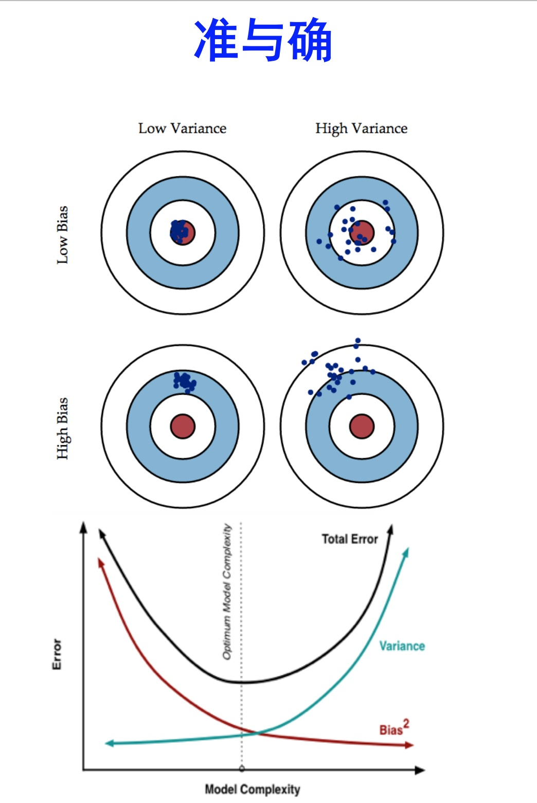

# 集成学习

熟悉集成学习的读者，肯定对bagging和boosting都比较熟悉。在学习这二者的时候，肯定都知道一句话：即bagging是减少variance，而boosting是减少bias。那么，为什么是这样的效果呢？

**准：** bias描述的是训练样本预测结果的期望与真实结果的差距，简单讲就是在样本拟合的好不好。要想low bias，就得复杂化模型，增加模型的参数但这样容易过拟合，过拟合对应上图的high variance，点很分散。low bias对应就是点都打在靶心附近，所以瞄的是准的，但手不一定稳。

**确：**variance描述的是训练出来的模型在测试集上的表现，要想low variance，就要简化模型，但这样容易欠拟合，欠拟合对应上图的high bias，点偏离中心。low variance对应就是点都打的很集中，但不一定是靶心附近，手很稳，但瞄的不准。

## bagging减少variance

Bagging对样本重采样（有放回），对每一重采样得到的子样本集训练一个模型，最后取平均。由于子样本集的相似性以及使用的是同种模型，因此各模型有近似相等的bias和variance（事实上，各模型的分布也近似相同，但不独立）。

为了方便进行讲解，不妨认为各个子模型的bias和variance完全相等。因此 $$E(\frac{\sum X_i}{n})=E(X_i)$$ ，所以bagging后的bias和单个子模型的接近，一般来说不能显著降低bias。另一方面，若各子模型独立，则有 $$\text{Var}(\frac{\sum X_i}{n})=\frac{\text{Var}(X_i)}{n}$$ ，此时可以显著降低variance。若各子模型完全相同，则 $$\text{Var}(\frac{\sum X_i}{n})=\text{Var}(X_i)$$ ，此时不会降低variance。bagging方法得到的各子模型是有一定相关性的，属于上面两个极端状况的中间态，因此可以一定程度降低variance。

为了进一步降低variance，Random forest通过随机选取变量子集做拟合的方式de-correlated了各子模型（树），使得variance进一步降低。用公式可以一目了然：设有i.d.（同分布）的 $$n$$ 个随机变量，方差记为 $$\sigma^2$$ ，两两变量之间的平均相关性为 $$\rho$$ ，则 $$\frac{\sum X_i}{n}$$ 的方差为 $$\rho*\sigma^2+(1-\rho)*\sigma^2/n$$ ，bagging降低的是第二项，random forest是同时降低两项。更多细节见[ESL](https://web.stanford.edu/~hastie/ElemStatLearn//printings/ESLII_print10.pdf)588页。

## boosting减少bias

boosting从优化角度来看，是用forward-stagewise这种贪心法去最小化损失函数 $$L(y,\sum\limits_ia_if_i(x))$$ 。例如，常见的AdaBoost即等价于用这种方法最小化exponential loss： $$L(y,f(x))=\exp(-yf(x))$$ 。所谓forward-stagewise，就是在迭代的第 $$n$$ 步，求解新的子模型 $$f(x)$$ 及步长 $$a$$ （或者叫组合系数），来最小化 $$L(y,f_{n-1}(x)+af(x))$$ ，这里 $$f_{n-1}(x)$$ 是前 $$n-1$$ 步得到的子模型的和。因此boosting是在sequential地最小化损失函数，其bias自然逐步下降。但由于是采取这种sequential、adaptive的策略，各子模型之间是强相关的，于是子模型之和并不能显著降低variance。所以说boosting主要还是靠降低bias来提升预测精度。

## Source







