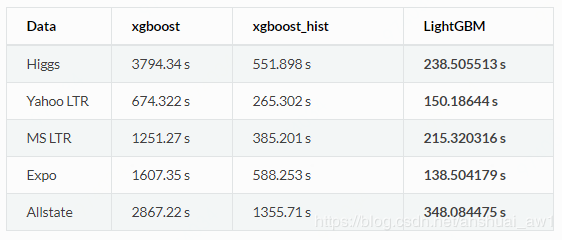
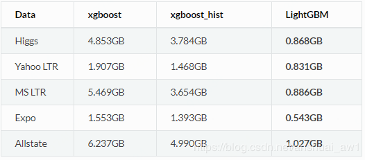
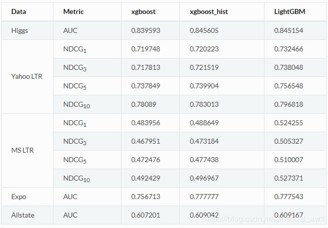

# LightGBM

LightGBM （Light Gradient Boosting Machine）\([官方github](https://github.com/Microsoft/LightGBM)，[英文官方文档](https://lightgbm.readthedocs.io/en/latest/Python-Intro.html)，[中文官方文档](http://lightgbm.apachecn.org/cn/latest/Development-Guide.html)\)是一个实现GBDT算法的轻量级框架，支持高效率的并行训练，并且具有以下优点：

更快的训练速度

低内存使用

准确率方面

还有支持并行化学习、可处理大规模数据

## [Histogram直方图](https://blog.csdn.net/anshuai_aw1/article/details/83040541)

XGBoost中默认的算法对于决策树的学习使用基于 pre-sorted 的算法，这是一个简单的解决方案，但是不易于优化。LightGBM 利用基于histogram的算法，通过将连续特征（属性）值分段为 discrete bins 来加快训练的速度并减少内存的使用。 如下是基于 histogram 算法的优点：

减少分割增益的计算量：Pre-sorted 算法需要 $$O(\#\text{data})$$ 次的计算。即计算最大分裂增益需要 $$O(\#\text{data}*\#\text{features})$$ ；Histogram 算法只需要计算 $$O(\#\text{bins})$$ 次，并且bins的个数远少于data。即计算最大分裂增益需要 $$O(\#\text{bins}*\#\text{features})$$ 

通过直方图的相减来进行进一步的加速：在二叉树中可以通过利用叶节点的父节点和相邻节点的直方图的相减来获得该叶节点的直方图；所以仅仅需要为一个叶节点建立直方图 \(其 $$\#\text{data}$$ 小于它的相邻节点\)就可以通过直方图的相减来获得相邻节点的直方图，而这花费的代价 $$O(\#\text{bins})$$很小。

减少内存的使用：可以将连续的值替换为 discrete bins。 如果bins的个数较小, 可以利用较小的数据类型来存储训练数据, 如uint8\_t；无需为 pre-sorting 特征值存储额外的信息。

减少并行学习的通信代价：减少并行交互次数。

## Leaf-wise \(Best-first\) 决策树生长策略

大部分决策树的学习算法通过 level\(depth\)-wise 策略生长树，即一层一层的生长树，如下图

LightGBM 通过 leaf-wise \(best-first\)策略来生长树。它将选取具有最大 delta loss 的叶节点来生长。 当生长相同的 \#leaf，leaf-wise 算法可以比 level-wise 算法减少更多的损失。

## Source





