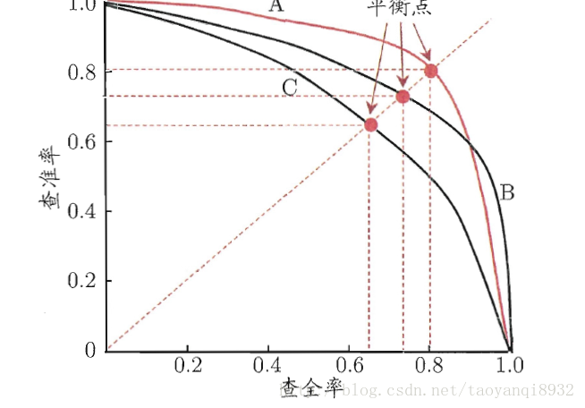
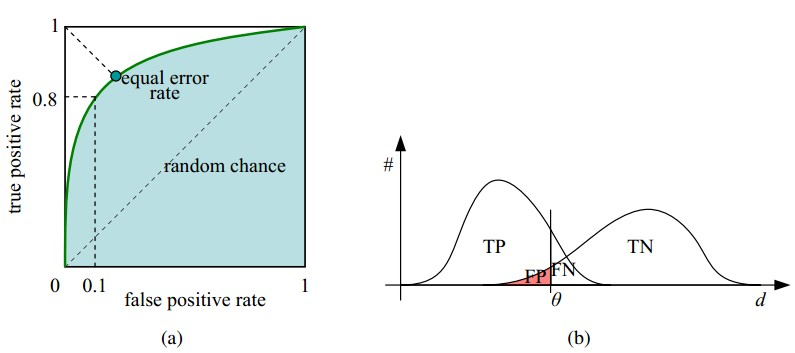
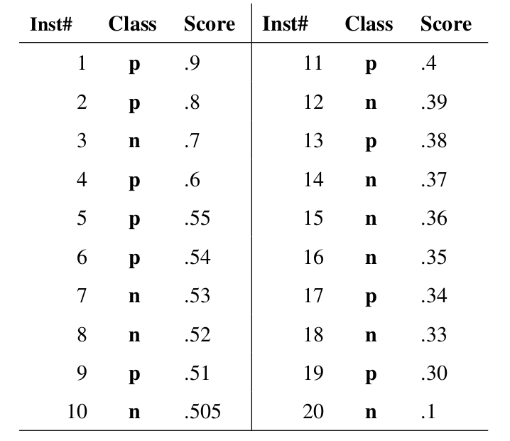
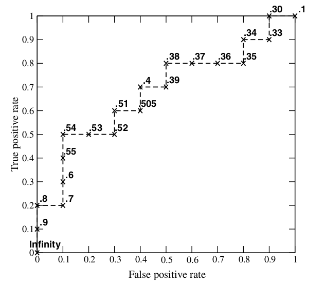
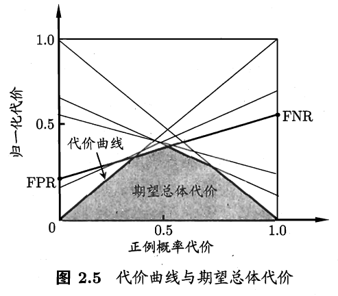
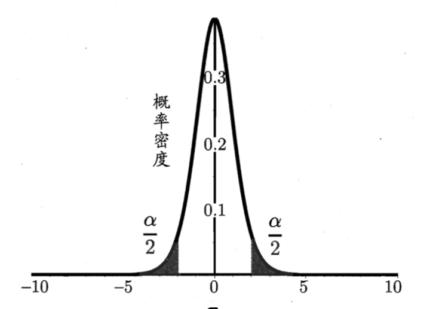

# 模型评估与选择

## 经验误差与过拟合

$$m$$ 个样本中有 $$a $$ 个分类错误，则

                        错误率： $$E = a/m$$              精度： $$Acc = 1 - E = 1 - p/m$$ 

实际预测输出与样本真实输出的差异为“”误差”，在训练集上的误差为“训练误差”\(training error\)或“经验误差”，在新样本上的误差为“泛化误差”。

我们事先并不知道新样本什么样，所以实际能做的是努力使经验误差最小化。然而，我们真正希望的是，在新样本能表现很好的学习器。当一个学习器把训练样本学的“太好了”，很可能把训练样本的特点当成了一般性质，导致泛化能力下降，这种情况成为“过拟合”，相对的“欠拟合”即对训练样本未学好。

## 评估方法

通常我们通过实验测试来对学习器的泛化误差进行评估而做出选择，为此，需要使用一个“测试集”来测试学习器对新样本的判别能力。下面介绍几种常见的数据集 $$D$$ 划分训练集 $$S$$ 及测试集 $$T$$ 的做法。

另外，数据量充足时用留出法或交叉验证法，数据集比较小时可以使用自助法。

### 留出法

直接将数据集 $$D$$ 划分为两个互斥的集合，其中一个为训练集 $$S$$ ，另一个为测试集 $$T$$ ，即 $$D=S\cup T, \ \ S\cap T = \varnothing$$ 。需要注意的是训练/测试集的划分要尽可能保持数据分布的一致性，避免因数据划分过程引入额外的偏差而对最终结果产生影响，例如在分类任务中至少要保持样本的类别比例相似，如果从采样的角度来看，此类采样方式通常称为“分层采样”。

即便在给定训练/测试集的样本比例后，仍存在多种划分数据集 $$D$$ 的方式，且单次使用留出法得到的估计结果往往不够稳定可靠。在使用留出法时，一般采用若干次随机划分、重复进行实验评估后取平均值作为留出法的评估结果。此外，我们将 $$2/3$$ 至 $$4/5$$ 的样本用于训练，剩余样本用于测试，以保证训练集或测试集都不会太小导致结果差别大。

### 交叉验证法

先将数据集 $$D$$ 划分为 $$k$$ 个大小相同的互斥子集，即 $$D = D_1 \cup D_2   \dots \cup D_k,\ D_i\cap D_j = \varnothing \ (i \neq j)$$，每个子集 $$D_i$$ 都尽可能保持数据分布的一致性。然后每次用 $$k-1$$ 个子集的并集作为训练集，余下的哪个子集作为测试集，这样就得到了 $$k$$ 组训练/测试集，从而可进行 $$k$$ 次训练和测试，最终返回的是这 $$k$$ 个结果的均值。

与留出法相似，将数据集 $$D$$ 划分为 $$k$$ 个子集的同样存在多种划分方式。为减少因样本划分不同而引入的差别， $$k$$ 折交叉验证通常要随机使用不同的划分重复 $$p$$ 次。最终的评估结果是这 $$p$$ 次 $$k$$ 折交叉验证结果的均值，例如常见的有“10次10折交叉验证”。

另外留一法，即数据集 $$D$$ 中有 $$m$$ 个样本， $$k = m$$ 即为留一法，留一法训练集与实际数据集 $$D$$ 只差了1个样本，所以评估结果往往被认为较准确。而当数据集很大的时候，即需要计算 $$m$$ 个模型，消耗过大。

### 自助法

给定包含 $$m$$ 个样本的数据集 $$D$$ ，我们对它进行采样产生数据集 $$D'$$ ：每次随机从 $$D$$ 中挑选一个样本，并将其拷贝放入 $$D'$$ ，然后再将该样本放回初始数据集 $$D$$ 中，使得该样本在下次采集时仍有可能被采到；重复执行 $$m$$ 次后，我们就得到了包含 $$m$$ 个样本的数据集 $$D'$$ 。

显然， $$D$$ 中一部分样本会在 $$D'$$ 中出现多次，而另一部分样本不出现，样本在 $$m$$ 次采样中始终不被采到的概率是 $$(1-m)^m$$ ，取极限得到

                                                           $$\mathop{lim} \limits_{m\to \infty} (1- \frac{1}{m})^m \to \frac{1}{e} \approx 0.368$$ 

即初始数据集 $$D$$ 中约有36.8%的样本并未出现在采样数据集 $$D'$$ 中，于是我们可将 $$D$$ \$$D'$$ 用作训练集， $$D$$ 用作测试集。这样，实际评估的模型与期望评估的模型都使用 $$m$$ 个训练样本，而我们仍有数据总量约1/3的、没在训练集中出现的样本用于测试。

自主法在数据集小、难以划分训练/测试集时很有用，且能从初始数据集产生多个不同的训练集，对集成学习等方法有很大好处。但是自助法改变了原始数据分布，会引入估计偏差。

## 性能度量

性能度量：衡量模型泛化能力的评价标准

回归任务最常用的性能度量--“均方差\(Mean Squared Error\)”:

                  $$E(f;D) = \frac{1}{m} \sum \limits_{i=1}^m (f(x_i)-y_i)^2$$               $$E(f;D) = \int_{x~D}(f(x)-y)^2p(x)dx$$ 

### 错误率与精度

错误率是分类错误的样本数占样本总数的比例，精度则是分类正确的样本数占样本总数的比例。

对样例集 $$D$$，分类错误率定义为：

                                          $$E(f;D) = \frac{1}{m} \sum \limits_{i=1}^m \amalg (f(x_i) \neq y_i)$$ 

精度定义为：

                                    $$acc(f;D) = \frac{1}{m} \sum \limits_{i=1}^m \amalg (f(x_i) = y_i) = 1- E(f;D)$$ 

更一般的，对于数据分布 $$D$$ 和概率密度函数 $$p(\cdot)$$，错误率与精度可分别描述为：

$$E(f;D) = \int_{x~D} \amalg (f(x) \neq y)p(x)dx$$      $$acc(f;D) = \int_{x~D} \amalg (f(x) = y)p(x)dx = 1 -E(f;D)$$

### 查准率、查全率与F1

| 真实情况 | 预测结果 | 预测结果 |
| :---: | :---: | :---: |
|  | 正例 | 反例 |
| 正例 | TP（真正例） | FN（假反例） |
| 反例 | FP（假正例） | TN（真反例） |

#### 查准率\(Precision\) ： $$P = \frac{TP}{TP+FP}$$ 

#### 查全率\(Recall\)： $$R = \frac{TP}{TP+FN}$$ 

#### P-R曲线：

#### F1度量： $$F1 = \frac{2\times P \times R}{P+R} = \frac{2 \times TP}{ALL + TP -TN}$$ 

#### F-score： $$F_\beta = \frac{1}{\alpha \times \frac{1}{P}+(1-\alpha)\times \frac{1}{R}} = \frac{(1+\beta^2)\times P \times R}{\beta^2\times P + R}$$ 

### [ROC与AUC](https://www.jianshu.com/p/c61ae11cc5f6)

很多学习器是为测试样本产生一个实值或概率预测，然后将这个预测值与一个分类阈值进行比较，若大于阈值则分为正类，否则为反类。例如我们对每个样本出一个 $$[0.0,1.0]$$ 之间的实值，然后与 $$0.5$$ 比较，大于为正例，否则为反例。这个实值或概率预测结果的好坏直接决定了学习器的泛化能力。实际上，我们根据预测结果将测试样本排序，“最可能”是正例的排在最前面，“最不可能”是正例的排在最后面。这样，分类过程就相当于在这个排序中以某个“截断点”将样本分为两部分，前一部分判作正例，后部分为反例。

我们根据任务需求来采取不同的截断点，例如更重视“查准率”，则在排序靠前位置截断；若重视“查全率”，则选择较后位置。因此排序好坏直接影响学习器泛化能力好坏，ROC曲线既从这个角度出发来研究学习期的泛化能力。

ROC曲线的纵轴是“真正例率”\(True Positive Rate\)，横轴是“假正例率”\(False Positive Rate\)：

                                  $$TPR = \frac{TP}{TP+FN}$$                                     $$FPR = \frac{FP}{TN+FP}$$ 

AUC\(Area Under ROC Curve\)如名字所示，即ROC曲线下面积

理性情况下，我们有无限个样本，ROC是一条平滑的曲线，然而现实中，我们只有有限个数据，所以：

               

### 代价敏感错误率与代价曲线

实践中有不同类型错误造成不同后果：比如体检，将健康人误诊断为患者，虽然增加进一步检查麻烦，但是要把患者误诊为健康人可能会丧失生命；再比如银行人脸识别门禁等等情况。为权衡不同类型错误所造成的不同损失，可为错误赋予“非均等代价”。

| 真实类别 | 预测类别 | 预测类别 |
| :---: | :---: | :---: |
| 真实类别 | 第0类 | 第1类 |
| 第0类 | 0 |  $$cost_{01}$$  |
| 第1类 | $$cost_{10}$$  | 0 |

之前指标我们只计算不同错误次数，代价敏感的错误率是对应错误乘以其错误代价：

$$E(f;D;cost)=\frac{1}{m}\left(\sum_{x_i \in D^+} I(f(x_i) \neq y_i)\times cost_{01} +\sum_{x_i\in D^-}I(f(x_i)\neq y_i)\times cost_{10}\right)$$ 

绘制代价曲线：代价曲线的横轴为正例概率代价 $$P(+)cost$$ ，纵轴为归一化代价 $$cost_{norm}$$ 

$$P(+)cost=\frac{p\times cost_{01}}{p\times cost{01} + (1-p)\times cost_{10}}$$          $$cost_{norm}=\frac{FNR\times p\times cost_{01} + FPR\times (1-p)\times cost_{10}}{p\times cost{01} + (1-p)\times cost_{10}}$$ 

 其中， $$p$$或 $$p(+)$$ 是样例为正例的概率；FNR是假反例率；FPR是假正例率。

## 比较检验

有了实验评估方法和性能度量，就可以对学习器性能进行比较了。但实际操作起来，我们并不能直接取得性能度量的值然后比大小，因为我们希望模型有很好的泛化能力，然而我们实验评估是获得测试集上的性能，两者的对比结果可能未必相同；测试集上的性能与测试集选取有很大关系，怎样论证测试集选取；机器学习算法很多有一定的随机性。

所以就需要用比较检验，基于检验结果我们可推断出有多大的把握学习器A的泛化性能比学习器B好。下面用错误率作为性能度量，用 $$\epsilon$$ 表示。

### 假设检验

泛化错误率为 $$\epsilon$$ 的学习器在一个样本上犯错的概率是 $$\epsilon$$ ；测试错误率 $$\hat{\epsilon}$$ 意味着在 $$m$$ 个测试样本中恰有 $$\hat{\epsilon}\times m$$ 个被误分类。测试误分类概率：

                                                    $$P(\hat{\epsilon};\epsilon)=\binom{m}{\hat{\epsilon}\times m}\epsilon^{\hat{\epsilon}\times m}(1-\epsilon)^{m-\hat{\epsilon}\times m}$$ 

给定测试错误率，则解 $$\partial P(\hat{\epsilon;\epsilon})/\partial \epsilon = 0$$ 可知， $$P(\hat{\epsilon};\epsilon)$$ 在 $$\epsilon=\hat{\epsilon}$$ 时最大， $$|\epsilon-\hat{\epsilon}|$$增大时$$P(\hat{\epsilon;\epsilon})$$减小

#### 二项检验

由上面所述， $$P(\hat{\epsilon;\epsilon})$$ 是符合二项分布的，我们可用二项检验来应对。考虑假设 $$\epsilon \leq \epsilon_0$$ ，则在 $$1-\alpha$$ （这里 $$1-\alpha$$ 反映了结论的“置信度”）的概率内所能观察到的最大错误率如下式计算：

                                              $$\overline{\epsilon} = max\ \epsilon \ \ \ s.t. \ \ \sum \limits_{i=\epsilon_0\times m+1}^m\binom{m}{i}\epsilon^i(1-\epsilon)^{m-i} <\alpha$$ 

此时若测试错误率 $$\hat{\epsilon}$$ 小于临界值 $$\overline{\epsilon}$$，则根据二项检验可得出结论：在 $$\alpha$$ 的显著度下，假设 $$\epsilon \leq \epsilon_0$$ 不能被拒绝，即能以 $$1-\alpha$$ 的置信度认为，学习器的泛化错误率不大于 $$\epsilon_0$$ ；否则该假设可被拒绝，即在 $$\alpha$$ 的显著度下可任务学习器的泛化错误率大于 $$\epsilon_0$$ 。

#### t检验

在很多时候我们并非仅做一次留出法估计，而是通过多次重复留出法或是交叉验证法等进行多次训练/测试，这样会得到多个测试错误率，此时可使用t检验\(t-test\)。

假定我们得到了 $$k$$ 个测试错误率， $$\hat{\epsilon_1},\hat{\epsilon_2},\dots,\hat{\epsilon_k}$$，则平均测试错误率 $$\mu$$ 和方差 $$\sigma^2$$ 为

                                                     $$\mu = \frac{1}{k}\sum \limits_{i=1}^{k}\hat{\epsilon_i}$$          $$\sigma^2 = \frac{1}{k-1}\sum \limits_{i=1}^{k}(\hat{\epsilon_i}-\mu)^2$$ 

考虑到这 $$k$$ 个测试错误率可看作泛化错误率 $$\epsilon_0$$ 的独立采样，则变量：

                                                                      $$\tau_t = \frac{\sqrt{k}(\mu-\epsilon_0)}{\sigma}$$ 

下图为服从自由度为 $$k-1$$ 的t分布，其中 $$k = 10$$ 

### 交叉验证t检验

### McNemar检验

### Friedman检验与Nemenyi后续检验

## 偏差与方差

## Source







