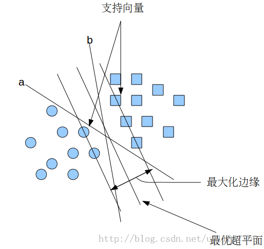
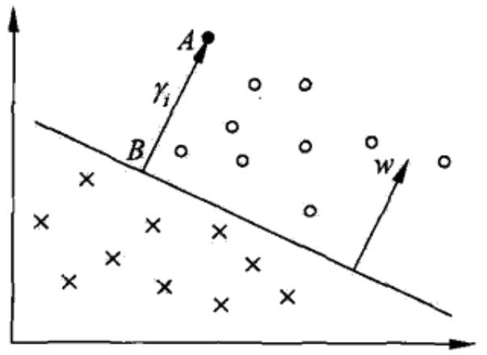
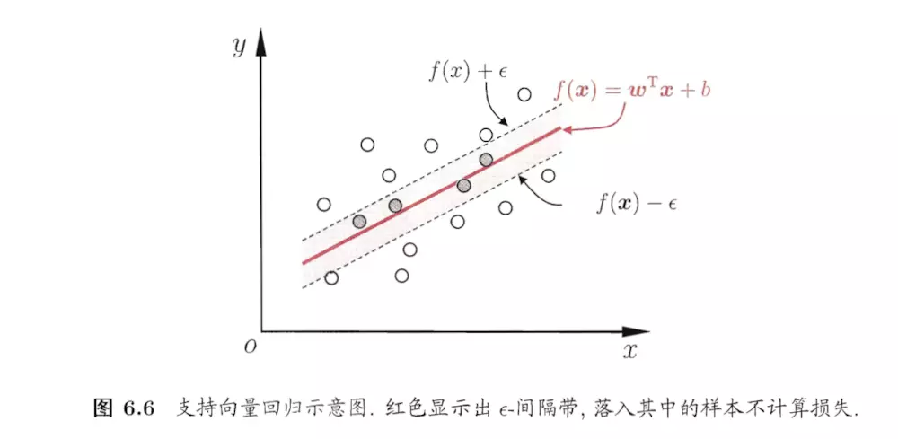
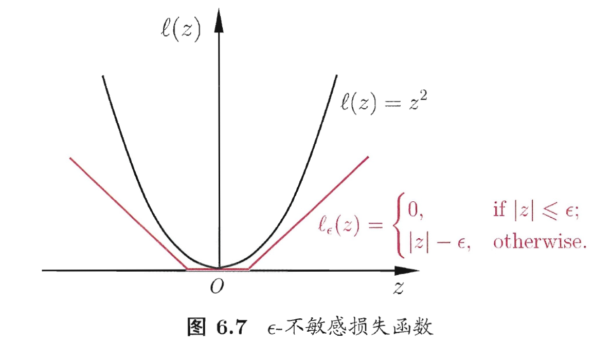

# 支持向量机

支持向量机将向量映射到一个更高维的空间里，在这个空间里建立有一个最大间隔超平面。在分开数据的超平面的两边建有两个互相平行的超平面，分隔超平面使两个平行超平面的距离最大化。假定平行超平面间的距离或差距越大，分类器的总误差越小。

在上面的图中，a和b都可以作为分类超平面，但最优超平面只有一个，最优分类平面使间隔最大化。 那是不是某条直线比其他的更加合适呢? 我们可以凭直觉来定义一条评价直线好坏的标准: 距离样本太近的直线不是最优的，因为这样的直线对噪声敏感度高，泛化性较差。 因此我们的目标是找到一条直线（图中的最优超平面），离所有点的距离最远。 由此， SVM算法的实质是找出一个能够将某个值最大化的超平面，这个值就是超平面离所有训练样本的最小距离。这个最小距离用SVM术语来说叫做间隔\(margin\) 。

## 线性可分支持向量机与硬间隔最大化

### 线性可分支持向量机

给定训练样本集 $$D=\{(x_1,y_1),(x_2,y_2),\dots(x_m,y_m)\},y_i\in\{-1,+1\}$$ ，分类学习最基本的想法就是基于训练集 $$D$$ 在样本空间中找到一个划分超平面，将不同类别的样本分开。但能将训练样本分开的划分超平面可能有很多，如下图

直观上看，应该去找位于两类训练样本“正中间”的划分超平面，即上图红色那个，因为该划分超平面对训练样本局部扰动的“容忍”性最好。例如，由于训练集的局限性或噪声的因素，训练集外的样本可能比上图中的训练样本更接近两个类的分隔界，这将使许多划分超平面出现错误，而红色的超平面受影响最小。换言之，这个超平面所产生的分类结果是最鲁棒的，对未见示例的泛化能力最强。

在样本空间中，划分超平面可通过如下线性方程来描述：

                                                                     $$w\cdot x+b=0$$ 

以及相应的分类决策函数：

                                                               $$f(x)=\mathop{sign}(w\cdot x+b)$$ 

其中 $$w=(w_1;w_2;\dots;w_d)$$ 为法向量，决定了超平面的方向； $$b$$ 为位移项，决定了超平面与原点间的距离。显然，划分超平面可被法向量 $$w$$ 和位移 $$b$$ 确定，下面我们将其记为 $$(w,b)$$ 。样本空间中任意点 $$x$$到超平面 $$(w,b)$$ 的距离可写为：      $$r= \frac{|w\cdot x+b|}{||w||}$$ 

### 函数间隔和几何间隔

#### 函数间隔\(Functional margin\)

一般来说，一个点距离分离超平面的远近可以表示分类预测的确信程度。在超平面 $$w^Tx+b=0$$ 确定的情况下， $$|w^Tx+b|$$ 能够相对地表示点 $$x$$ 距离超平面的远近。而 $$w^Tx+b$$ 的符号标记与类标记 $$y$$ 是否一致能够表示分类是否正确。所以可用量 $$y(w^Tx+b)$$ 来表示分类的正确性及确信度，这就是函数间隔。

_定义_：对于给定的训练数据集 $$T$$ 和超平面 $$(w,b)$$ ，定义超平面 $$(w,b)$$ 关于样本点 $$(x_i,y_i)$$ 的函数间隔为： $$a = b$$ ；超平面 $$(w,b)$$ 关于训练数据集 $$T$$ 的函数间隔为超平面关于 $$T$$ 中所有样本点 $$(x_i,y_i)$$ 的函数间隔之最小值\(离超平面最近的点都分对了，其他的点肯定也对\)，即 $$\hat{\gamma} = \mathop{min}\limits_{i=1,\dots,N}\hat{\gamma}_i$$ 

#### 几何间隔\(Geometric margin\)

函数间隔可以表示分类预测的正确性及确信度，但是选择分离超平面时，只有函数间隔还不够。因为只要成比例地改变 $$w$$ 和 $$b$$ ，例如将它们改为 $$2w$$ 和 $$2b$$ ，超平面并没有改变，但函数间隔却成为原来的2倍。这一事实启示我们，可以对分离超平面法向量 $$w$$ 加某些约束，如规范化， $$||w||=1$$ ，使得间隔是确定的。这时函数间隔称为几何间隔。

下图给出了超平面 $$(w,b)$$ 及其法向量 $$w$$ 。点 $$A$$ 表示某一实例 $$x_i$$ ，其类标记为 $$y_i=+1$$ 。点 $$A$$ 与超平面 $$(w,b)$$ 的距离由线段 $$AB$$ 给出，记作 $$\gamma_i$$ ：

                                                               $$\gamma_i=\frac{w}{||w||}\cdot x_i+\frac{b}{||w||}$$ 

其中， $$||w||$$ 为 $$w$$ 的 $$L_2$$ 范数。这是点 $$A$$ 在超平面正的的一侧的情形。如果点 $$A$$ 在超平面负的一侧，即 $$y_i=-1$$ ，那么点与超平面的距离为\(因为我们的超平面在两类的“正中央”，即距离相同\)：

                                                             $$\gamma_i=-(\frac{w}{||w||}\cdot x_i+\frac{b}{||w||})$$ 

一般地，当样本点 $$(x_i,y_i)$$ 被超平面 $$(w,b)$$ 正确分类时，点 $$x_i$$ 与超平面的距离是：

                                                             $$\gamma_i=y_i(\frac{w}{||w||}\cdot x_i+\frac{b}{||w||})$$ 

_定义_：对于给定的训练数据集 $$T$$ 和超平面 $$(w,b)$$ ，定义超平面关于样本点 $$(x_i,y_i)$$ 的几何间隔为： $$\gamma_i=y_i(\frac{w}{||w||}\cdot x_i+\frac{b}{||w||})$$ ；超平面 $$(w,b)$$ 关于训练数据集 $$T$$ 的几何间隔为超平面关于 $$T$$ 中所有样本点 $$(x_i,y_i)$$ 的函数间隔之最小值\(离超平面最近的点都分对了，其他的点肯定也对\)，即 $$\gamma = \mathop{min}\limits_{i=1,\dots,N}\gamma_i$$ 

#### 两间隔关系

超平面 $$(w,b)$$ 关于样本点 $$(x_i,y_i)$$ 的几何间隔一般是实例点到超平面的带符号的距离\(signed distance\)，当样本点被超平面正确分类时就是实例点到超平面的距离。从函数距离和几何距离的定义可知两者的关系\( $$\hat{\gamma}$$ 为函数距离， $$\gamma$$ 为几何距离\)：

                                                            $$\gamma_i = \frac{\hat{\gamma}_i}{||w||} \ \    \mathop{\to}\limits^{min}\ \  \gamma = \frac{\hat{\gamma}}{||w||}$$ 

如果 $$||w||=1$$ ，那么函数间隔和几何间隔相等。如果超平面参数 $$w$$ 和 $$b$$ 成比例地改变\(超平面没有改变\)，函数间隔也按此比例改变，而几何间隔不变。

### 间隔最大化

支持向量机学习的基本想法是求解能够正确划分训练数据集并且几何间隔最大的分离超平面。对线性可分的训练数据集而言，线性可分分离超平面有无穷多个\(等价于感知机\)，但是几何间隔最大的分离超平面是唯一的。这里的间隔最大化又称为硬间隔最大化\(与将要讨论的训练数据集近似线性可分时的软间隔最大化相对应\)。

#### 最大间隔分离超平面

如何求得一个几何间隔最大的分离超平面，即最大间隔分离超平面。具体地，这个问题可以表示为下面的约束最优化问题：

                                     $$\mathop{max}\limits_{w,b}\gamma \ \ \ s.t. \ y_i(\frac{w}{||w||}\cdot x_i+\frac{b}{||w||})\geq\gamma,\ i=1,2,\dots,N$$ 

我们希望最大化超平面 $$(w,b)$$ 关于训练数据集的几何间隔 $$\gamma$$ ，约束条件表示的是超平面关于每个训练样本点的几何间隔至少是 $$\gamma$$ ，结合几何间隔与函数间隔的关系式，可将上式改写为：

                                     $$\mathop{max}\limits_{w,b}\frac{\hat{\gamma}}{||w||} \ \ \ s.t. \ y_i(w\cdot x_i+b)\geq\hat{\gamma},\ i=1,2,\dots,N$$ 

函数间隔 $$\hat{\gamma}$$ 的取值并不影响最优化问题的解。实际上，假设将 $$w$$ 和 $$b$$ 按比例改变为 $$\lambda w$$ 和 $$\lambda b$$ ，这时函数间隔成为 $$\lambda \hat{\gamma}$$ 。函数间隔的这一改变对上面最优化问题的不等式约束并没产生影响，对目标函数的优化也没有影响，也就是说，它产生一个等价的优化问题。这样，就可以取 $$\hat{\gamma} =1$$ 。将 $$\hat{\gamma} =1$$ 代入上面的最优化问题，就是最大化 $$\frac{1}{||w||}$$ ，为方便计算，我们转化为最小化 $$\frac{1}{2}||w||^2$$ \(两者等价，因为求最大化 $$\frac{1}{||w||}$$ 即最小化 $$||w||$$ ，即 $$\frac{1}{2}||w||^2$$ \)，于是就得到下面的线性可分支持向量机学习的最优化问题：

                                      $$\mathop{min}\limits_{wb}\frac{1}{2}||w||^2\ \ \ s.t.\ y_i(w\cdot x+b)\geq1,\ i=1,2,\dots,N$$ 

所以求解出最优解 $$w^*,\ b^*$$ ，就可以得到分离超平面

                                                                    $$w^*\cdot x+b^*= 0$$ 

从而得到分类决策函数

                                                           $$f(x)=\mathop{sign}(w^*\cdot x+b^*)$$ 

### 对偶问题

我们希望求解 $$\mathop{min}\limits_{wb}\frac{1}{2}||w||^2\ \ \ s.t.\ y_i(w\cdot x+b)\geq1,\ i=1,2,\dots,N$$ 来得到最大间隔超平面所对应的模型。对其使用拉格朗日乘子法可得其“对偶问题”。具体来说，对上式的每条约束添加拉格朗日乘子$$\alpha_i\geq0$$ ，则该问题的拉格朗日函数可写为

                                       $$\mathcal{L}(w,b,\alpha) = \frac{1}{2}||w||^2+\sum\limits_{i=1}^N\alpha_i(1-y_i(w\cdot x_i+b))$$ 

其中 $$\alpha=(\alpha_1;\alpha_2;\dots;\alpha_N)$$ 。令 $$\mathcal{L}(w,b,\alpha)$$ 对 $$w$$ 和 $$b$$ 的偏导为零可得

                                                    $$w = \sum\limits_{i=1}^N\alpha_iy_ix_i$$        $$0 = \sum\limits_{i=1}^N\alpha_yy_i$$ 

将 $$w = \sum\limits_{i=1}^N\alpha_iy_ix_i$$ 代入拉格朗日函数，再考虑约束 $$0 = \sum\limits_{i=1}^N\alpha_yy_i$$ ，就得到原问题

 $$\mathop{min}\limits_{wb}\frac{1}{2}||w||^2\ \ \ s.t.\ y_i(w\cdot x+b)\geq1,\ i=1,2,\dots,N$$ 的对偶问题

      $$\mathop{max}\limits_{\alpha}\sum\limits_{i=1}^N\alpha_i-\frac{1}{2}\sum\limits_{i=1}^N\sum\limits_{j=1}^N\alpha_i\alpha_jy_iy_jx_i^Tx_j\ \ \ s.t.\ \sum\limits_{i=1}^N\alpha_iy_i=0,\ \alpha_i\geq0,\ i=1,2,\dots,N$$ 

解出 $$\alpha$$ 后，求出 $$w$$ 与 $$b$$ 即可得到模型

                                          $$f(x)=w\cdot x+b = \sum\limits_{i=1}^N\alpha_iy_ix_i^Tx+b$$ 

从对偶问题解出的 $$\alpha_i$$ 是拉格朗日函数中的拉格朗日乘子，它恰对应着训练样本 $$(x_i,y_i)$$ .原问题中有不等式约束 $$\ y_i(w\cdot x+b)\geq1,\ i=1,2,\dots,N$$ ，因此上述过程需满足KKT条件，即要求

                                                          $$\begin{cases}\alpha_i\geq0\\ y_if(x_i)-1\geq0\\ \alpha_i(y_if(x_i)-1)=0\end{cases}$$ 

于是，对任意训练样本 $$(x_i,y_i)$$ ，总有 $$\alpha_i=0$$ 或 $$y_if(x_i)=1$$ \(即需要满足最上面最后一个等式约束\)。若 $$\alpha_i=0$$ ，则该样本将不会在 $$f(x)=w\cdot x+b = \sum\limits_{i=1}^N\alpha_iy_ix_i^Tx+b$$ 的求和中出现，也就不会对 $$f(x)$$ 有任何影响；若 $$\alpha_i>0$$ ，则必有 $$y_if(x_i)=1$$ ，所对应的样本点位于最大间隔边界上，是一个支持向量。这显示出支持向量的一个重要性质：训练完成后，大部分的训练样本都不需要保留，最终模型仅与支持向量有关。

## 线性支持向量机与软间隔最大化

### 线性支持向量机

线性可分问题的支持向量机学习方法对线性不可分训练数据是不适用的，因为这时上述方法中的不等式约束不能成立。为了扩展到线性不可分问题，就需要修改硬间隔最大化，使其成为软间隔最大化。

线性不可分意味着某些样本点 $$(x_i,y_i)$$ 不能满足函数间隔大于等于 $$1$$ 的约束条件。为了解决这个问题，可以对每个样本点引进一个松弛变量 $$\xi_i\geq0$$ ，使函数间隔加上松弛变量大于等于 $$1$$ 这样，约束条件变为：

                                                             $$y_i(w\cdot x+b)\geq1-\xi_i$$ 

同时，对每个松弛变量 $$\xi_i$$ ，支付一个代价 $$\xi_i$$ 。目标函数由原来的 $$\frac{1}{2}||w||^2$$ 变成

                                                                  $$\frac{1}{2}||w||^2+C\sum\limits_{i=1}^N\xi_i$$ 

这里， $$C>0$$ 称为惩罚参数，一般由应用问题决定， $$C$$ 值大时对误分类的惩罚增大， $$C$$ 值小时对误分类的惩罚减小。最小化目标函数包含两层含义：使 $$\frac{1}{2}||w||^2$$ 尽量小即间隔尽量大，同时使误分类点的个数尽量小， $$C$$ 是调和两者的系数。

有了上面的思路，可以和训练数据集线性可分时一样来考虑训练数据集线性不可分时的线性支持向量机学习问题。相应于硬间隔最大化，它成为软间隔最大化。线性不可分的线性支持向量机的学习问题变成如下凸二次规划问题：

 $$\mathop{min}\limits_{w,b,\xi}\frac{1}{2}||w||^2+C\sum\limits_{i=1}^N\xi_i\ \ \ s.t.\ y_i(w\cdot x_i+b)\geq1-\xi_i,\ i=1,2,\dots,N\ \ \xi_i\geq0, i=1,2,\dots,N$$ 

问题是一个凸二次规划问题，因而关于 $$(w,b,\xi)$$ 的解是存在的。可以证明 $$w$$ 的解是唯一的，但 $$b$$ 的解可能不唯一，而是存在于一个区间。设问题的解是 $$w^*,\ b^*$$ 。于是可以得到分离超平面 $$w^*\cdot x+b^*=0$$ 及分类决策函数 $$f(x)=sign(w^*\cdot x+b^*)$$ ，称这样的模型为训练样本线性不可分时的线性支持向量机，简称线性支持向量机。显然，线性支持向量机包含线性可分支持向量机。由于现实中训练数据集往往是线性不可分的，线性支持向量即具有更广的适用性。

优化目标函数可写为

                                          $$\mathop{min}\limits_{w,b}\frac{1}{2}||w||^2+C\sum\limits_{i=1}^N\ell_{0/1}(y_i(w\cdot x_i+b)-1)$$ 

其中 $$C>0$$ 是一个常数， $$\ell_{0/1}$$ 是“0/1损失函数”

                                                            $$\ell_{0/1}(z)=\begin{cases}1,\ if\ z<0\\ 0,\ otherwise\end{cases}$$ 

显然， $$C$$ 为无穷大时，优化目标函数迫使所有样本均满足约束 $$y_i(w\cdot x_i+b)\geq1$$ ；当 $$C$$ 取有限值时，优化目标函数允许一些样本不满足约束。然而， $$\ell_{0/1}$$ 非凸、非连续，数学性质不太好，使得优化目标函数不易直接求解。于是，通常用其他一些函数来代替 $$\ell_{0/1}$$ 称为“替代损失”。替代损失函数一般具有较好的数学性质，如通常它们是凸的连续函数且是 $$\ell_{0/1}$$ 的上界。常用三种替代损失函数：

1. 1、 hinge损失： $$\ell_{hinge}(z)=max(0,1-z)$$ 
2. 2、 指数损失： $$\ell_{\exp}(z)=\exp(-z)$$ 
3. 3、 对率损失： $$\ell_{\log}(z)=\log(1+\exp(-z))$$ 

### 对偶问题

每个样本都有一个对应的松弛变量，用以表征该样本不满足约束的程度。但是仍是一个二次规划问题.于是，通过拉格朗日乘子法可得到拉格朗日函数

          $$\mathcal{L}(w,b,\alpha,\xi,\mu)=\frac{1}{2}||w||^2+C\sum\limits_{i=1}^N\xi_i+\sum\limits_{i=1}^N\alpha_i(1-\xi_i-y_i(w\cdot x_i+b))-\sum\limits_{i=1}^N\mu_i\xi_i$$ 

其中 $$\alpha_i \geq0, \mu_i\geq0$$ 是拉格朗日乘子

令 $$\mathcal{L}(w,b,\alpha,\xi,\mu)$$ 对 $$w,b,\xi_i$$ 的偏导为零可得

                                      $$w=\sum\limits_{i=1}^N\alpha_iy_ix_i$$     $$0 = \sum\limits_{i=1}^N\alpha_iy_i$$     $$C=\alpha_i+\mu_i$$ 

将上面三式代入拉格朗日函数即可得对偶问题

    $$\mathop{max}\limits_{\alpha}\sum\limits_{i=1}^N\alpha_i-\frac{1}{2}\sum\limits_{i=1}^N\sum\limits_{j=1}^N\alpha_i\alpha_jy_iy_jx_i^Tx_j\ \ \ \ \ s.t.\ \sum\limits_{i=1}^N\alpha_iy_i=0,\ 0\leq\alpha_i\leq C,\ i=1,2,\dots,N$$ 

可以看出软间隔和硬间隔唯一的差别就在于对偶变量的约束不同：前者是 $$0\leq\alpha_i\leq C$$ ，后者是 $$0\leq\alpha_i$$ 于是，可采用同样的算法求解上式。对软间隔支持向量机，KKT条件要求

                                                        $$\begin{cases}\alpha_i\geq0,\ \mu_i\geq0\\ y_if(x_i)-1+\xi_i\geq 0\\ \alpha_i(y_if(x_i)-1+\xi_i)=0\\ \xi_i\geq0,\ \mu_i\xi_i=0\end{cases}$$ 

于是，对任意训练样本$$(x_i,y_i)$$，总有$$\alpha_i=0$$或$$y_if(x_i)=1-\xi_i$$，且$$C=\alpha_i+\mu_i$$所以参数含义：

1. 若 $$\alpha_i=0$$，则该样本不会对 $$f(x)$$ 有任何影响。
2. 若 $$\alpha_i>0$$，则必有 $$y_if(x_i)=1-\xi_i$$ ，即该样本是支持向量。
3. 若 $$\alpha_i<C$$ ，则 $$\mu_i>0$$ ，进而有 $$\xi_i=0$$ ，即该样本恰在最大间隔边上。
4. 若 $$\alpha_i=C$$ ，则 $$\mu_i=0$$ ，此时若 $$\xi_i\leq1$$ ，即该样本落在最大间隔内部。
5. 若 $$\xi_i>1$$ ，则该样本被错误分类。

由此可看出，软间隔支持向量机的最终模型仅与支持向量有关，即通过采用hinge损失函数仍保持了稀疏性

## 非线性支持向量机与核函数

对解线性分类问题，线性支持向量机是一种非常有效的方法。但是，有时分类问题是非线性的，这时可以使用非线性支持向量机。本节叙述非线性支持向量机，其主要特点是利用核技巧。

### 核技巧

非线性分类问题是指通过利用非线性模型才能很好地进行分类的问题。比如下图

非线性问题往往不好求解，所采取的方法是进行一个非线性变换，将非线性问题变换为线性问题，通过解变换后的线性问题的方法求解原来的非线性问题。用线性分类方法求解非线性分类问题分为两步：

1. 1、首先使用一个变换将原空间的数据映射到新空间
2. 2、然后在新空间里用线性分类学习方法从训练数据中学习分类模型

核技巧应用到支持向量机，其基本想法就是通过一个非线性变换将空间\(欧氏空间或离散集合\)对应于一个特征空间\(希尔伯特空间\)，使得在输入空间中的超曲面模型对应特征空间中的超平面模型。这样，分类问题的学习任务通过在特征空间中求解线性支持向量机就可以完成。

#### 核函数的作用

比如下面这张图位于第一、二象限内。我们关注红色的门，以及“北京四合院”这几个字下面的紫色的字母。我们把红色的门上的点看成是“+”数据，紫色字母上的点看成是“-”数据，它们的横、纵坐标是两个特征。显然，在这个二维空间内，“+”“-”两类数据不是线性可分的。

我们现在考虑核函数 $$K(v_1,v_2)=<v_1,v_2>^2$$ ，即“内积平方”。这里面 $$v_1=(x_1,y_1),v_2=(x_2,y_2)$$ 是二维空间中的两个点。

这个核函数对应着二维到三维空间的映射，它的表达式是： $$P(x,y)=(x^2,\sqrt{2}xy,y^2)$$，可以验证：  
 $$<P(v_1),P(v_2)>=<(x_1^2,\sqrt{2}x_1y_1,y_1^2),(x_2^2,\sqrt{2}x_2y_2,y_2^2)>$$ 

                                      $$=x_1^2x_2^2+2x_1x_2y_1y_2+y_1^2y_2^2=(x_1x_2+y_1y_2)^2 = <v_1,v_2>^2=K(v_1,v_2)$$ 

在P这个映射下，原来二维空间中的图在三维空间中的像是这个样子：

注意到绿色的平面可以完美地分割红色和紫色，也就是说，两类数据在三维空间中变成线性可分的了。

而三维中的这个判决边界，再映射回二维空间中是这样的：

这是一条双曲线，它不是线性的。核函数的作用就是隐含着一个从低维空间到高维空间的映射，而这个映射可以把低维空间中线性不可分的两类点变成线性可分的。它们映射到的高维空间的维数也比例子（三维）高得多，甚至是无穷维的。这样，就可以期待原来并不线性可分的两类点变成线性可分的了。

在机器学习中常用的核函数，一般有这么几类，也就是LibSVM中自带的这几类：  
1\) 线性：  
2\) 多项式：  
3\) Radial basis function：  
4\) Sigmoid：

上面的例子是 2\)多项式核函数中的情况。

#### 核技巧在支持向量机中的应用

我们注意到在线性支持向量机的对偶问题中，无论是目标函数还是决策函数\(分离超平面\)都只涉及输入实例与实例之间的内积。在对偶问题的目标函数中的内积 $$x_i\cdot x_j$$ 可以用核函数 $$K(x_i,x_j)=\phi(x_i)\cdot\phi(x_j)$$ 来代替。此时对偶问题的目标函数称为

                                        $$W(\alpha)=\frac{1}{2}\sum\limits_{i=1}^N\sum\limits_{j=1}^N\alpha_i\alpha_jy_iy_jK(x_i,x_j)-\sum\limits_{i=1}^N\alpha_i$$ 

同样，分类决策函数中的内积也可以用核函数代替，而分类决策函数式成为

                   $$f(x)=\mathop{sign}(\sum\limits_{i=1}^N\alpha^*_iy_i\phi(x_i)\cdot\phi(x)+b^*)=\mathop{sign}(\sum\limits_{i=1}^N\alpha^*_iy_iK(x_i,x)+b^*)$$ 

这等价于经过映射函数 $$\phi$$ 将原来的输入空间变换到一个新的特征空间，将输入空间中的内积 $$x_i\cdot x_j$$ 变换为特征空间中的内积 $$\phi(x_i)\phi(x_j)$$ ，在新的特征空间里从训练样本中学习线性支持向量机。当映射函数是非线性函数时，学习到的含有核函数的支持向量机是非线性分类模型。

也就是说，在核函数 $$K(x,z)$$ 给定的条件下，可以利用解线性分类问题的方法求解非线性分类问题的支持向量机。学习是隐式地在特征空间进行的，不需要显式地定义特征空间和映射函数。这样的技巧称为核技巧，它是巧妙地利用线性分类学习方法与核函数解决非线性问题的技术。在实际应用中，往往依赖领域知识直接选择核函数，核函数选择的有效性需要通过实验验证。

### 非线性支持向量分类机

如上所述，利用核技巧，可以将线性分类的学习方法应用到非线性分类问题中去。将线性支持向量机扩展到非线性支持向量机，只需将线性支持向量机对偶形式中的内积换成核函数。

从非线性分类训练集，通过核函数与软间隔最大化，或凸二次规划，学习得到的分类决策函数

                                            $$f(x)=\mathop{sign}(\sum\limits_{i=1}^N\alpha^*_iy_iK(x,x_i)+b^*)$$ 

称为非线性支持向量， $$K(x,z)$$ 是正定核函数。

具体算法如下

1. 输入：训练数据集 $$T=\{(x_1,y_1),(x_2,y_2),\dots,(x_N,y_N)\}$$ ，其中 $$x_i\in \mathcal{X}=R^n$$ ， $$y_i\in \mathcal{Y}=\{-1,+1\},i=1,2,\dots,N$$ 
2. 输出：分类决策函数
3. \(1\) 选取适当的核函数 $$K(x,z)$$ 和适合的参数 $$C$$ ，构造并求解最优化问题
4.  $$\mathop{min}\limits_\alpha\frac{1}{2}\sum\limits_{i=1}^N\sum\limits_{j=1}^N\alpha_i\alpha_jy_iy_jK(x,z)-\sum\limits_{i=1}^N\alpha_i\ \ \ \ s.t.\ \sum\limits_{i=1}^N\alpha_iy_i=0,\ 0\leq\alpha_i\leq C,\ i=1,2,\dots,N$$ 
5. 得到最优解 $$\alpha^*=(\alpha^*_1,\alpha^*_2,\dots,\alpha^*_N)^T$$ 
6. \(2\) 选择 $$\alpha^*$$ 的一个正分量 $$0<\alpha_j^*<C$$ ，计算
7.                                                    $$b^*=y_j-\sum\limits_{i=1}^N\alpha_i^*y_iK(x_i,x_j)$$ 
8. \(3\) 构造决策函数
9.                                            $$f(x)=\mathop{sign}(\sum\limits_{i=1}^N\alpha_i^*y_iK(x\cdot x_i)+b^*)$$ 

## 序列最小最优化算法\(SMO\)

支持向量机的学习问题可以形式化求解凸二次规划问题。这样的凸二次规划问题具有全局最优解，并且有许多最优化算法可以用于这一问题的求解。但是当训练样本容量很大时，这些算法往往变得非常低效，以致无法使用。序列最小最优化算法\(Sequential Minimal Optimization, SMO\)为高效地实现支持向量机学习提供一个解决途径。

SMO算法要解如下凸二次规划的对偶问题：

  $$\mathop{min}\limits_\alpha\frac{1}{2}\sum\limits_{i=1}^N\sum\limits_{j=1}^N\alpha_i\alpha_jy_iy_jK(x_i,x_j)-\sum\limits_{i=1}^N\alpha_i\ \ \ s.t.\ \sum\limits_{i=1}^N\alpha_iy_i=0,\ 0\leq\alpha_i\leq C,\ i=1,2,\dots,N$$ 

在这个问题中，变量是拉格朗日乘子，一个变量 $$\alpha_i$$ 对应于一个样本点 $$(x_i,y_i)$$ ；变量的总数等于训练样本总量 $$N$$ 

SMO算法是一种启发式算法，其基本思路是：如果所有变量的解都满足此最优化问题的KKT条件，那么这个最优化问题的解就得到了。因为KKT条件是该优化问题的充分必要条件。否则，选择两个变量，固定其他变量，针对这两个变量构建一个二次规划问题。这个二次规划问题关于这两个变量的解应该更接近原始二次规划问题的解，因为这会使得原始二次规划问题的目标函数值变得更小。重要的是，这时子问题可以通过解析方法求解，这样就可以大大提高整个算法的计算速度。子问题有两个变量，一个是违反KKT条件最严重的那一个，另一个由约束条件自动确定。如此，SMO算法将原问题不断分解成子问题并对子问题求解，进而达到求解原问题的目的。

注意，子问题的两个变量中只有一个是自由变量。假设 $$\alpha_1,\alpha_2$$ 为两个变量， $$\alpha_3,\alpha_4,\dots,\alpha_N$$ 固定，那么由等式约束 $$\sum\limits_{i=1}^N\alpha_iy_i=0$$ 可知

                                                               $$\alpha_1=-y_i\sum\limits_{i=2}^N\alpha_iy_i$$ 

如果 $$\alpha_2$$ 确定，那么 $$\alpha_1$$ 也随之确定。所以子问题中同时更新两个变量。

整个SMO算法包括两个部分：求解两个变量二次规划的解析方法和选择变量的启发式方法。

### 两个变量二次规划的求解方法

SMO算法之所以高效，恰由于在固定其他参数后，仅优化两个参数的过程能做到非常高效。具体来说，仅考虑 $$\alpha_i,\alpha_j$$ 时，约束 $$\sum\limits_{i=1}^N\alpha_iy_i=0,\ \alpha_i\geq0,i=1,2,\dots,N$$ 可重写为

                                       $$\alpha_iy_i+\alpha_jy_j+\sum\limits_{k\neq i,j}\alpha_ky_k=0,\ \alpha_i\geq0,\alpha_j\geq0$$ 

设 $$c = -\sum\limits_{k\neq i,j}\alpha_ky_k$$ ，就变成了

                                                             $$\alpha_iy_i+\alpha_jy_j=c$$ 

代入对偶问题 $$\mathop{max}\limits_{\alpha}\sum\limits_{i=1}^N\alpha_i-\frac{1}{2}\sum\limits_{i=1}^N\sum\limits_{j=1}^N\alpha_i\alpha_jy_iy_jx_i^Tx_j$$ 中消去变量 $$\alpha_j$$ ，则得到一个关于 $$\alpha_i$$ 的单变量二次规划问题，仅有的约束是 $$\alpha_i\geq0$$ 。不难发现，这样的二次规划问题具有闭式解，于是不必调用数值优化算法即可高效地计算出更新后的 $$\alpha_i,\alpha_j$$ 

如何确定偏移项 $$b$$ 呢？注意到对任意支持向量 $$(x_s,y_s)$$ 都有 $$y_sf(x_s)=1$$ ，即

                                                       $$y_s(\sum\limits_{i\in S}\alpha_iy_ix_i^Tx_s+b)=1$$ 

其中 $$S=\{i|\alpha_i>0,i=1,2,\dots,N\}$$ 为所有支持向量的下标集。理论上，可选任意支持向量并通过求解上式获得 $$b$$ ，但现实任务中常采用一种更鲁棒的做法：使用所有支持向量求解平均值

                                                    $$b=\frac{1}{|S|}\sum\limits_{s\in S}(\frac{1}{y_s}-\sum\limits_{s\in S}\alpha_iy_ix^T_ix_s)$$ 

### 变量的选择方法

注意到只需选取的 $$\alpha_1,\alpha_2$$ 中有一个不满足KKT条件，目标函数就会在迭代后增大。直观来看，KKT条件违背的程度越大，则变量更新后可能导致的目标函数值增幅越大。于是，SMO先选取违背KKT条件程度最大的变量。第二个变量应选择一个使目标函数值增长最快的变量，但由于比较各变量所对应的目标函数值增幅的复杂度过高，因此SMO采用了一个启发式：使选取的两变量所对应样本之间的间隔最大。一种直观的解释是，这样的两个变量有很大的差别，与对两个相似的变量进行更新相比，对它们进行更新会带给目标函数值更大的变化。

## 支持向量回归

传统回归模型通常直接基于模型输出 $$f(x)$$ 与真实输出 $$y$$ 之间的差别来计算损失，当且仅当 $$f(x)$$ 与 $$y$$ 完全相同时，损失才是令零。与此不同，支持向量回归\(Support Vector Regression, SVR\)假设我们能容忍 $$f(x)$$ 与 $$y$$ 之间最多有 $$\epsilon$$ 的偏差，即仅当 $$f(x)$$ 与 $$y$$ 之间的差别绝对值大于 $$\epsilon$$ 时才计算损失。如下图所示，这相当于以 $$f(x)$$ 为中心，构建了一个宽度为 $$2\epsilon$$ 的隔离带，若训练样本落入此间隔带，则认为是被预测正确的

于是，SVR问题可形式化为

                                                     $$\mathop{min}\limits_{w,b}\frac{1}{2}||w||^2+C\sum\limits_{i=1}^N\ell_\epsilon(f(x_i)-y_i)$$ 

其中 $$C$$ 为正则化常数， $$\ell_\epsilon$$ 是上图所示不敏感损失函数

                                                  $$\ell_\epsilon(z)=\begin{cases}0,\ \ \ \ \ \ \ \ \ \ if\ |z|\leq\epsilon\\ |z|-\epsilon, \ otherwise\end{cases}$$ 

引入松弛变量 $$\xi_i$$ 和 $$\hat{\xi}_i$$ ，可将问题重写为

                                               $$\mathop{min}\limits_{w,b,\xi_i,\hat{\xi}_i}\frac{1}{2}||w||^2+C\sum\limits_{i=1}^N(\xi_i+\hat{\xi}_i)$$ 

      $$s.t.\ f(x_i)-y_i\leq\epsilon+\xi_i,\ \ \ \ y_i-f(x_i)\leq\epsilon+\hat{\xi}_i,\ \ \ \ \xi_i\geq0,\ \hat{\xi}_i\geq0,\ i=1,2,\dots,N$$ 

引入拉格朗日乘子 $$\mu_i\geq0, \hat{\mu}_i\geq0,\ \alpha_i\geq0,\ \hat{\alpha}_i\geq0$$ ，由拉格朗日乘子法可得到拉格朗日函数

                $$\mathcal{L}(w,b,\alpha,\hat{\alpha},\xi,\hat{\xi},\mu,\hat{\mu})$$ 

                $$=\frac{1}{2}||w||^2+C\sum\limits_{i=1}^N(\xi_i+\hat{\xi}_i)-\sum\limits_{i=1}^N\mu_i\xi_i-\sum\limits_{i=1}^N\hat{\mu}_i\hat{\xi}_i$$ 

                     $$+\sum\limits_{i=1}^N\alpha_i(f(x_i)-y_i-\epsilon-\xi_i)+\sum\limits_{i=1}^N\hat{\alpha}_i(y_i-f(x_i)-\epsilon-\hat{\xi}_i)$$ 

将 $$f(x)=w\cdot x+b$$ 代入，再令 $$\mathcal{L}(w,b,\alpha,\hat{\alpha},\xi,\hat{\xi},\mu,\hat{\mu})$$ 对 $$w,b,\xi_i,\hat{\xi}_i$$ 的偏导为零

           $$w = \sum\limits_{i=1}^N(\hat{\alpha}_i-\alpha_i)x_i$$     $$0 = \sum\limits_{i=1}^N(\hat{\alpha}_i-\alpha_i)$$     $$C = \alpha_i+\mu_i$$     $$C = \hat{\alpha}_i+\hat{\mu}_i$$ 

代入拉格朗日函数，即可得到SVR的对偶问题

                $$\mathop{max}\limits_{\alpha,\hat{\alpha}}\sum\limits_{i=1}^Ny_i(\hat{\alpha}_i-\alpha_i)-\epsilon(\hat{\alpha}_i+\alpha)-\frac{1}{2}\sum\limits_{i=1}^N\sum\limits_{j=1}^N(\hat{\alpha}_i-\alpha_i)(\hat{\alpha}_j-\alpha_j)x^T_ix_j$$ 

                                      $$ s.t.\ \sum\limits_{i=1}^N(\hat{\alpha}_i-\alpha_i)=0,\ \ 0\leq\alpha_i,\hat{\alpha}_i\leq C$$ 

上述过程中需满足KKT条件，即要求

                                              $$\begin{cases}\alpha_i(f(x_i)-y_i-\epsilon-\xi_i)=0\\ \hat{\alpha}_i(y_i-f(x)-\epsilon-\hat{\xi}_i)=0\\ \alpha_i\hat{\alpha}_i=0,\ \xi_i\hat{\xi}_i=0\\ (C-\alpha_i)\xi_i=0,\ (C-\hat{\alpha}_i)\hat{\xi}_i=0\end{cases}$$ 

可以看出，当且仅当 $$f(x_i)-y_i-\epsilon-\xi_i=0$$ 时 $$\alpha_i$$ 能取非零值，当且仅当 $$y_i-f(x)-\epsilon-\hat{\xi}_i=0$$ 时 $$\hat{\alpha}_i$$ 能取非零值。换言之，仅当样本不落入 $$\epsilon$$ 区间隔带中，相应的 $$\alpha_i$$ 和 $$\hat{\alpha}_i$$ 才能取非零值。此外，约束 $$f(x)-y_i-\epsilon-\xi_i=0$$ 和 $$y_i-f(x)-\epsilon-\hat{\xi}_i=0$$ 不能同时成立，因此 $$\alpha_i$$ 和 $$\hat{\alpha}_i$$ 中至少有一个为零。SVR的解形如

                                                    $$f(x)=\sum\limits_{i=1}^N(\hat{\alpha}_i-\alpha_i)x^T_ix+b$$ 

能使上式中的 $$(\hat{\alpha}_i-\alpha)\neq0$$ 的样本即为SVR的支持向量，它们必落在 $$\epsilon$$ 间隔带之外。显然，SVR的支持向量仅是训练样本的一部分，即其解仍具有稀疏性。

由KKT条件可看出，对每个样本都有 $$(C-\alpha_i)\xi_i=0$$ 且 $$\alpha_i(f(x_i)-y_i-\epsilon-xi_i)=0$$ 。于是，在得到 $$\alpha_i$$ 后，若 $$0<\alpha_i<C$$ ，则必有 $$\xi_i=0$$ ，进而有

                                                  $$b=y_i+\epsilon-\sum\limits_{j=1}^N(\hat{\alpha}_j-\alpha_j)x^T_jx_i$$ 

因此，在求解式子得到 $$\alpha_i$$ 后，理论上来说，可任意选取满足 $$0<\alpha_i<C$$ 的样本通过上式求得 $$b$$ 。实践中常采用一种更鲁棒的方法：选取多个\(或所有\)满足条件 $$0<\alpha_i<C$$ 的样本求解 $$b$$ 后取均值。

若考虑特征映射形式，则式形如 $$w = \sum\limits_{i=1}^N(\hat{\alpha}_i-\alpha_i)\phi(x_i)$$ ，则SVR可表示为 $$f(x)=\sum\limits{i=1}^N(\hat{\alpha}_i-\alpha_i)K(x,x_i)+b$$ ，其中 $$K(x_i,x_j)=\phi(x_i)^T\phi(x_j)$$ 为核函数。

## Source



