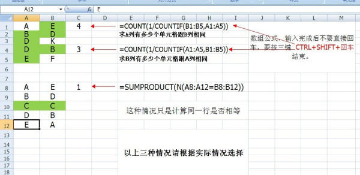
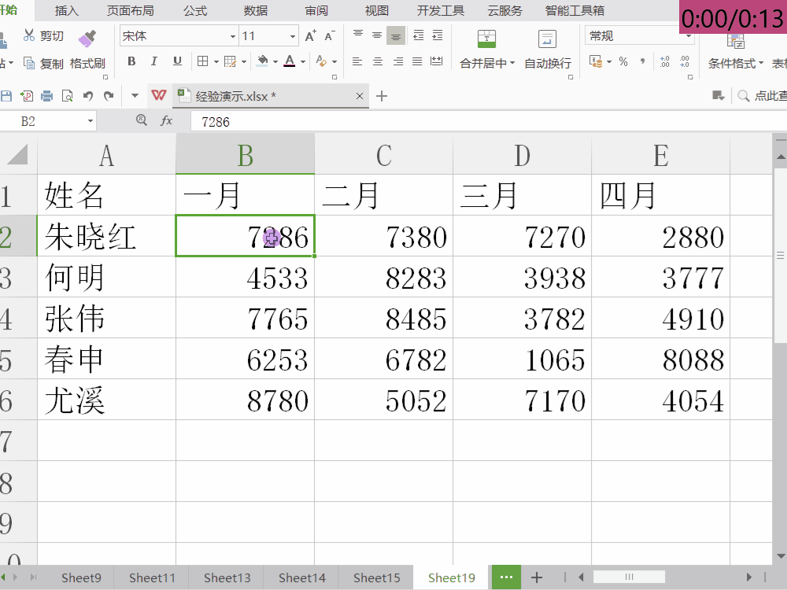

# Excel

## [计算两列中相同内容单元格的个数](https://zhidao.baidu.com/question/554732002.html)

求A列有多少个单元格跟B列相同 =COUNT\(1/COUNTIF\(B1:B5,A1:A5\)\)

求B列有多少个单元格跟A列相同 =COUNT\(1/COUNTIF\(A1:A5,B1:B5\)\)

只计算同一行是否相等 =SUMPRODUCT\(N\(A8:A12=B8:B12\)\)

以上是数组公式，输入完成后不要直接回车，要按三键  CTRL+SHIFT+回车  结束。

## [高亮显示每行或每列的最小值或最大值](https://www.taodabai.com/how/504546652.html)

