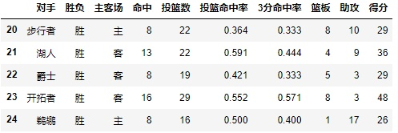
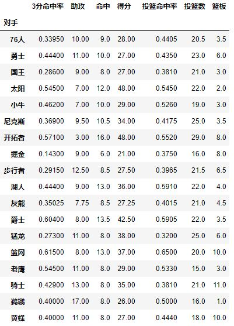
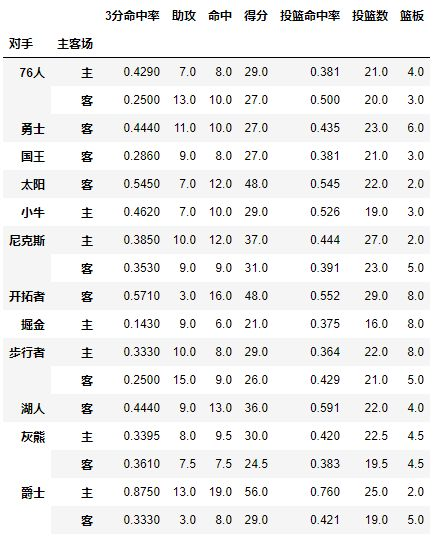
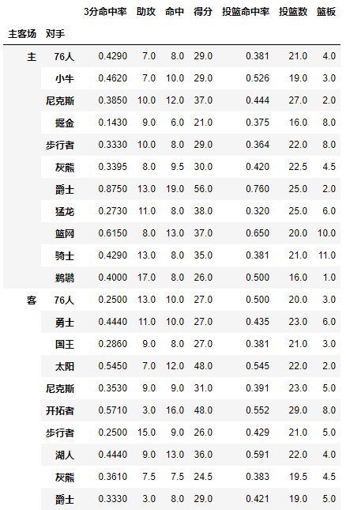
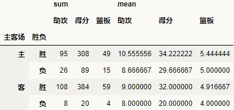
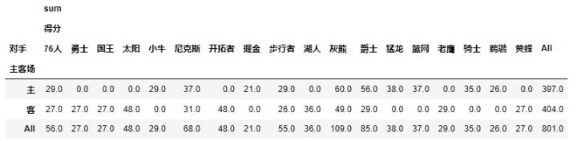
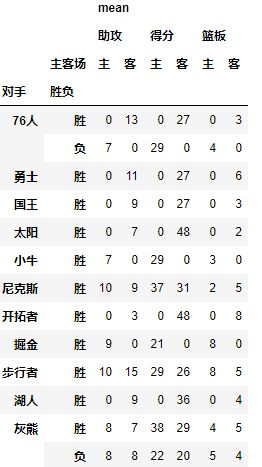
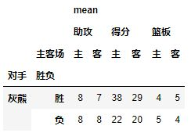

# pandas

## 透视表\(pivot\_table\)

[透视表](https://baike.baidu.com/item/%E6%95%B0%E6%8D%AE%E9%80%8F%E8%A7%86%E8%A1%A8/4013030?fr=aladdin)是一种可以对数据**动态排布**并且**分类汇总**的表格格式。或许大多数人都在Excel使用过数据透视表（如下图），也体会到它的强大功能，而在pandas中它被称作pivot\_table。


```text
import pandas as pd
import numpy as np
df = pd.read_csv('h:/James_Harden.csv',encoding='utf8')
df.tail()
```



pivot\_table\(data, values=None, index=None, columns=None,**aggfunc='mean'**, fill\_value=None, margins=False, dropna=True, margins\_name='All'\)

[pivot\_table](https://pandas.pydata.org/pandas-docs/stable/reference/api/pandas.pivot_table.html)有四个最重要的参数**index、values、columns、aggfunc**，本文以这四个参数为中心讲解pivot操作是如何进行。

### Index

每个pivot\_table必须拥有一个**index，**如果想查看哈登对阵每个队伍的得分，首先我们将**对手**设置为**index：**

```text
pd.pivot_table(df,index=[u'对手'])
```



**对手**成为了第一层索引，还想看看对阵同一对手在不同主客场下的数据，试着将**对手**与**胜负**与**主客场**都设置为**index**

```text
pd.pivot_table(df,index=[u'对手',u'主客场'])
```



试着交换下它们的顺序，数据结果一样：

```text
pd.pivot_table(df,index=[u'主客场',u'对手'])
```



看完上面几个操作，**Index就是层次字段，要通过透视表获取什么信息就按照相应的顺序设置字段**，所以在进行pivot之前你也需要足够了解你的数据。

### **Values**

通过上面的操作，我们获取了james harden在对阵对手时的**所有数据**，而Values可以对需要的计算数据进行筛选，如果我们只需要james harden在主客场和不同胜负情况下的得分、篮板与助攻三项数据：

```text
pd.pivot_table(df,index=[u'主客场',u'胜负'],values=[u'得分',u'助攻',u'篮板'])
```


### **Aggfunc**

aggfunc参数可以设置我们对数据聚合时进行的函数操作。

当我们未设置aggfunc时，它默认**aggfunc='mean'**计算均值。我们还想要获得james harden在主客场和不同胜负情况下的**总**得分、**总**篮板、**总**助攻时：

```text
pd.pivot_table(df,index=[u'主客场',u'胜负'],values=[u'得分',u'助攻',u'篮板'],aggfunc=[np.sum,np.mean])
```



### **Columns**

Columns类似Index可以设置**列层次字段**，它不是一个必要参数，作为一种分割数据的可选方式

```text
#fill_value填充空值,margins=True进行汇总
pd.pivot_table(df,index=[u'主客场'],columns=[u'对手'],values=[u'得分'],aggfunc=[np.sum],fill_value=0,margins=1)
```



```text
table=pd.pivot_table(df,index=[u'对手',u'胜负'],columns=[u'主客场'],values=[u'得分',u'助攻',u'篮板'],aggfunc=[np.mean],fill_value=0)
```



## pivot\_table vs. groupby

```text
pd.pivot_table(df,index=[字段1],values=[字段2],aggfunc=[函数],fill_value=0)
df.groupby([字段1])[字段2].agg(函数).fillna(0)
```

上面两个函数完全等价，pivot\_table仿佛是加入了columns与margin功能的groupby函数，比groupby更加灵活。

### query

当表格生成后如何查询某一项数据呢？举例：根据上表查询哈登对阵灰熊时的数据

```text
table.query('对手 == ["灰熊"]')
```



## Cheat Sheet


## Source






