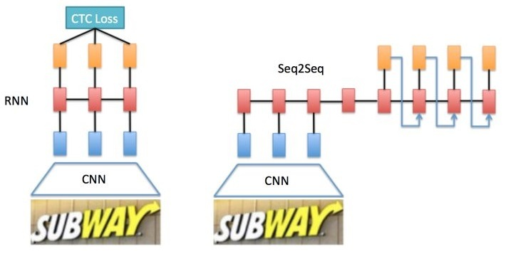

# CTC解码

近年来，LSTM在很多任务上都取得了突破性的进展。而CTC则是RNN模型用于时序分类任务时理想的解码模型之一，使用CTC不需要对输入序列进行预分割，也不需要对输出序列进行额外的后处理。手写识别合语音识别等相关实验表明，CTC+BiLSTM的网络结构比HMM+RNN的混合解决方案更好。

利用RNN等模型进行时序分类，不可避免地会出现很多冗余信息，比如一个字母被连续识别两次，这就需要一套去冗余的机制，但是简单地看到两个连续字母就去冗余的方法胡会有问题，因为存在cook、geek之类的单词。

给定一个序列标注问题，其输出标注来自于一个字母集合 $$L$$ ，CTC则是一个Softmax输出层，其标注字符集大小为 $$|L|+1$$ ，即增加一个空白字符（blank）。为了方便起见，后面我们统一记为blank。也就是每个输出单元要么为 $$L$$ 中的一个元素，要么是blank。 $$y_k^t$$ 表示 $$t$$ 时刻输出单元为字符 $$k$$ 的概率。给定长度为 $$T$$ 的输入序列 $$x$$ 以及训练集 $$S$$ ， $$\pi$$ 表示元素来自于集合 $$L'=L\cup\{\text{blank}\}$$ 的长度为 $$T$$ 的序列集合，一般 $$\pi$$ 称为路径，其对应的概率为：

                                                                      $$p(\pi|x,S)=\prod\limits_{t=1}^Ty^t_{\pi_t}$$ 

其中 $$T$$ 为路径 $$\pi$$ 对应的长度， $$y^t_{\pi_t}$$ 为路径上第 $$t$$ 个节点为 $$\pi_t$$ 的概率。

假设时序分类任务是要识别手写英文Mary。先假设CTC的输入 $$x$$ 长度为7，RNN字母集合为52个字母即标点符号，路径 $$\pi$$ 为 $$M\_a\_r\_y$$ （下划线"\_"表示blank），则其对应的概率为：

                   $$p(\pi=M\_a\_r\_y|x,S)=\prod\limits_{t=1}^Ty_{\pi_t}^t=y_M^1\cdot y_{\text{blank}}^2\cdot y_a^3\cdot y_{\text{blank}}^4\cdot y_{r}^5\cdot  y_{\text{blank}}^6\cdot y_{y}^7$$ 

当然， $$\pi$$ 也可能是 $$NN\_ar\_y$$ 或其他，这取决于前面RNN模型的识别效果。如果是一个比较好的识别模型，我们一般会期望 $$M\_a\_r\_y$$ 的合法路径的概率比 $$NN\_ar\_y$$ 之类的更高一些。

这样标识后规则就很简单了：先将相邻的重复字母保留一个，再移除所有的blank。

例如 $$M\_a\_r\_y=M\_\_aa\_r\_y=Maa\_r\_y \to Mary$$ 。从直观上说，相邻的重复字母往往是因为窗口太小导致同一元素被识别多次，所以相邻的重复字母只保留一个。但如果目标字符串含有连续的重复字母，比如cook、doom等，则重复字母之间必须引入blank，这样CTC才可以正确地解码。例如 $$c\_o\_o\_k\to cook$$ ，但是 $$c\_oo\_k\to cok$$ 。blank可以避免噪声带来影响，比如语音识别的因素之间存在停顿或背景噪声、OCR的字符之间存在背景或噪声。新的输出字母要么出现在blank变字母的时候，要么吃现在一个字母变成另一个不一样的字母的时候。这种直观的理解很重要，可以帮助理解后面的动态规划算法。

## Source

[ftp://ftp.idsia.ch/pub/juergen/icml2006.pdf](ftp://ftp.idsia.ch/pub/juergen/icml2006.pdf)





