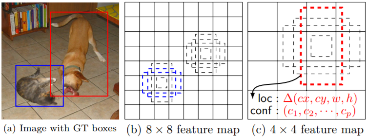
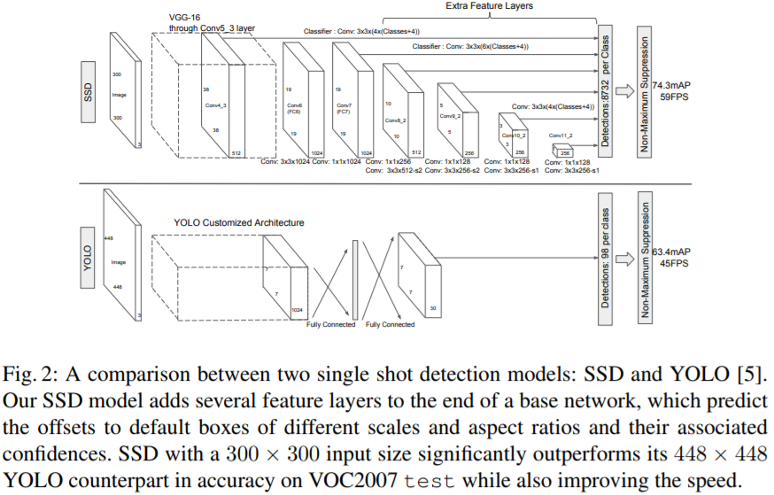

# SSD

SSD的全称是Single Shot MultiBox Detector，是冲着YOLO的缺点来的。SSD的基本框架如下图所示，其中图（a）表示带有两个Ground Truth边框的输入图片，图（b）和（c）分别表示8\*8和4\*4的网格，显然前者适合检测小的目标（因为网格更多，分的细啊），比如图片中的猫。后者适合检测大的目标，比如图中的狗。在每个格子上有一系列固定大小的Box（有点类似于前面提到的矩形框），这些在SSD中称为Default Box，用来框定目标物体的位置，在训练时Ground Truth会赋给某个固定的Box，比如图（b）中的深色框和图（c）中的深色框。

SSD网络分为两部分，前面的网络是用于图像分类的标准网络（去掉了与分类相关的层）；后面的网络是用于检测的多尺度特征映射层，从而实现检测不同大小的目标。SSD和YOLO的网络结构对比如下。

SSD在保持YOLO高速的同时效果也提升很多，主要是借鉴了Faster R-CNN中的Anchor机制，同时使用了多尺度。但是从原理依然可以看出，Default Box的形状以及网格大小是事先固定的，那么对特定的图片小目标的提取会不够好。

## Source







