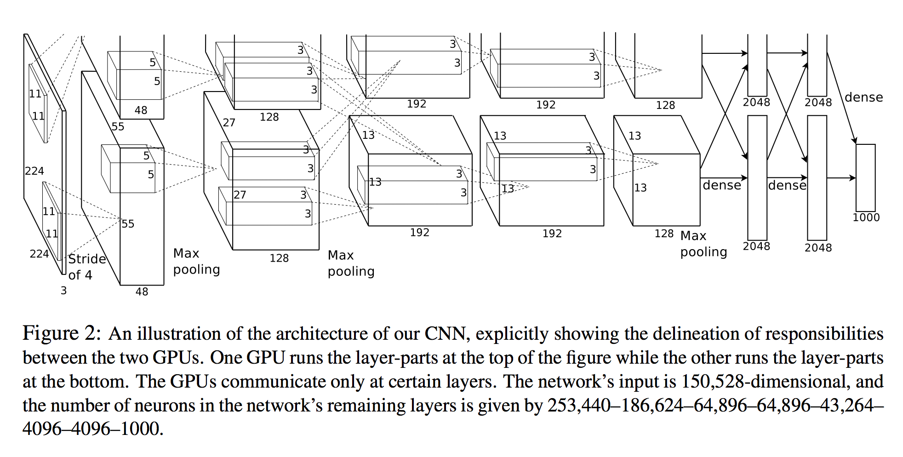
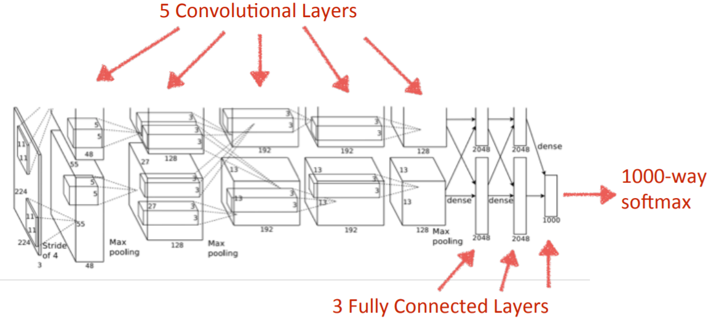
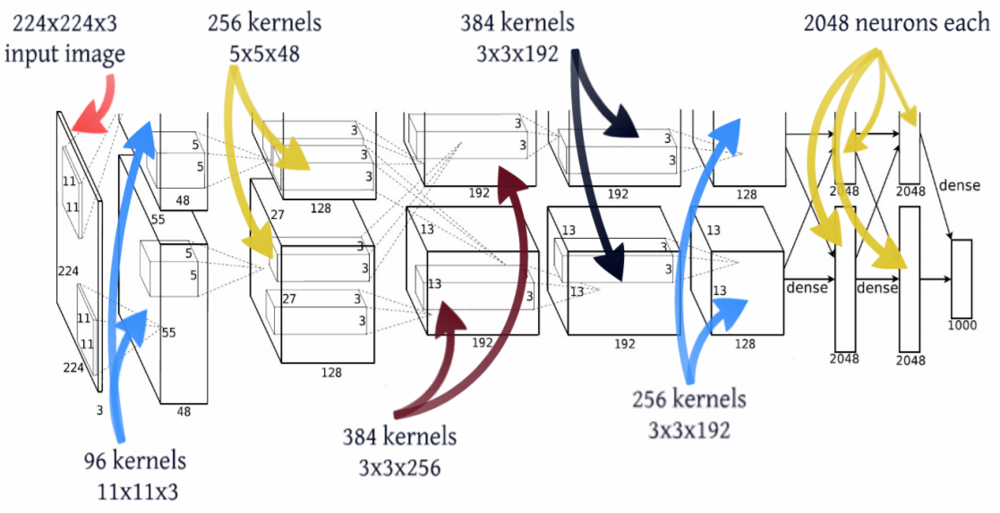
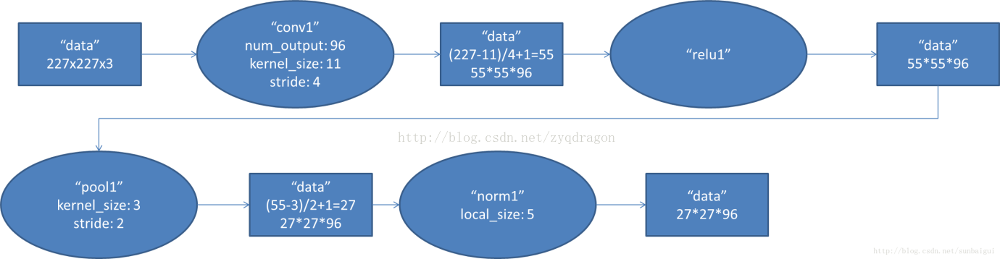

# AlexNet

AlexNet可以说是一个具有里程碑意义的网络结构。在2012年的ILSVRC 2012中一举刷新了纪录，Top-5错误率比上一年的冠军下降了十多个百分点，而且远远超过当年的第二名ISI，从而奠定了深度学习在计算机视觉领域的霸主地位。

AlexNet网络包含8个学习层：5个卷积层和3个全连接层，最后的输出层为一个1000类的Softmax层。AlexNet模型中间层分为两路，明确显示了两块GPU之间的职责划分——一块GPU运行图中顶部模型部分，另一块GPU则运行图中底部模型部分。GPU之间仅在某些层相互通信。该网络的输入是150528维的，且该网络剩下的各层的神经元数分别为253440-186624-64896-64896-43264-4096-1000。

## AlexNet结构

结构如下图所示，5个卷积阶段（这里我不称为卷积层是因为这5部分不仅进行了卷积操作，还有其他运算），再接3个全连接层，最后1000维的Softmax输出。每层的维度及核数量如下下图所示。

### 第一层\(卷积\)

第一层输入数据为227\*227\*3（原始为224\*224\*3，加了padding，为了保证卷积之后图像尺寸依然是整数）的图像，这个图像被11\*11\*3的卷积核进行卷积运算，卷积核对原始图像的每次卷积都生成一个新的像素。卷积核沿原始图像的 $$x$$ 轴方向和 $$y$$ 轴方向两个方向移动，移动的步长是4个像素。因此，卷积核在移动的过程中会生成 $$(227-11)/4+1=55$$ 个像素\(227个像素减去11，正好是54，即生成54个像素，再加上被减去的11也对应生成一个像素\)，行和列的55\*55个像素形成对原始图像卷积之后的像素层。共有96个卷积核，会生成55\*55\*96个卷积后的像素层。96个卷积核分成2组，每组48个卷积核。对应生成2组55\*55\*48的卷积后的像素层数据。这些像素层经过ReLU单元的处理，生成激活像素层，尺寸仍为2组55\*55\*48的像素层数据。

这些像素层经过池化处理，池化的尺寸为3\*3，运算的步长为2，则池化有图像的尺寸为 $$(55-3)/2+1=27$$ 。即池化后像素的规模为27\*27\*96；然后经过归一化处理，归一化运算的尺度为5\*5；第一卷积层运算结束后形成的像素层的规模为27\*27\*96。分别对应96个卷积核所运算形成。这96层像素层分为2组，每组48个像素层，每组在一个独立的GPU上进行运算。

反向传播时，每个卷积核对应一个偏差值。即第一层的96个卷积核对应上层输入的96个偏差值。

### 第二层\(卷积\)

### 第三层\(卷积\)

### 第四层\(卷积\)

### 第五层\(卷积\)

### 第六层\(全连接\)

### 第七层\(全连接\)

### 第八层\(全连接\)

## Source







