# GoogLeNet

GoogLeNet是2014年ILSVRC图像分类和定位两个任务的挑战赛冠军，用一个22层的深度网络将图像分类Top-5的错误率降低到6.67%。为了直径卷积网络的经典结构LeNet-5，同时兼顾Google的品牌，Google团队为竞赛模型齐了GoogLeNet的名字。

GoogLeNet通过精巧的网络结构设计，在保持一定计算开销的前提下增加了网络深度和宽度，有效提高了网络内计算资源的利用效率。与两年前的AlexNet相比，GoogLeNet在精度上获得了显著提升，同时模型参数减少12倍。

231n中对GoogLeNet的评价：

* **GoogLeNet**. The ILSVRC 2014 winner was a Convolutional Network from [Szegedy et al.](http://arxiv.org/abs/1409.4842) from Google. Its main contribution was the development of an _Inception Module_ that dramatically reduced the number of parameters in the network \(4M, compared to AlexNet with 60M\). Additionally, this paper uses Average Pooling instead of Fully Connected layers at the top of the ConvNet, eliminating a large amount of parameters that do not seem to matter much. There are also several followup versions to the GoogLeNet, most recently [Inception-v4](http://arxiv.org/abs/1602.07261).

## GoogLeNet/Inception-v1结构

GoogLeNet 扩大网络（多达 22 层），但也希望减少参数量和计算量。最初的 Inception 架构由 Google 发布，重点将 CNN 应用于大数据场景以及移动端。GoogLeNet 是包含 Inception 模块的全卷积结构。这些模块的目的是：通过构建由多个子模块（比如嵌套网络 - Inception）组成的复杂卷积核来提高卷积核的学习能力和抽象能力。GoogLeNet有9个线性堆叠的Inception模块。它有 22 层（包括池化层的话是 27 层）。该模型在最后一个 inception 模块处使用全局平均池化。


不用多说，这是一个深层分类器。和所有深层网络一样，它也会遇到梯度消失问题。为了阻止该网络中间部分梯度的消失过程，作者引入了两个辅助分类器（下图紫色框）来提高稳定性和收敛速度。辅助分类器的想法是使用几个不同层的图像表征来执行分类任务，它们对其中两个Inception模块的输出执行Softmax操作，然后在同样的标签上计算辅助损失。总损失即辅助损失和真实损失的加权和。该论文中对每个辅助损失使用的权重值是 0.3。因此，模型中的不同层都可以计算梯度，然后使用这些梯度来优化训练。辅助损失只是用于训练，在推断过程中并不使用。

```text
# The total loss used by the inception net during training.
total_loss = real_loss + 0.3 * aux_loss_1 + 0.3 * aux_loss_2
```

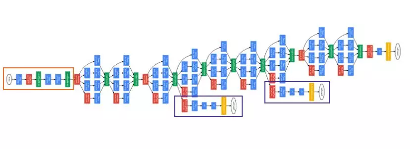

## GoogLeNet/Inception-v1特点

为了优化网络质量，GoogLeNet的设计基于[赫布理论](https://baike.baidu.com/item/%E8%B5%AB%E5%B8%83%E7%90%86%E8%AE%BA)和多尺度处理的观点。GoogLeNet采用了一种高效的机器视觉深度神经网络结构，将其称为“Inception”。在这里，更“深”具有两层含义：一是提出了一种新的网络层形式——“Inception Module”；二是直观地增加了网络深度。

在AlexNet和VGGNet中，全连接层占据了90%的参数量，而且容易引起过拟合；而GoogLeNet用全局平均池化取代全连接层，这种组发借鉴了NIN（Network in Network）。此外，其精心设计的Inception结构如下

### NIN

NIN（Network in Network）的一个动机是，在传统的CNN中卷积层实质上是一种广义的线性模型，其表达和抽象能力不足，能否使用一种表达能力更强当然也更复杂的子网络代替卷积操作，从而提升传统CNN的表达能力。一种比较简单的子网络就是多层感知机（MLP）网络，MLP由多个全连接层和非线性激活函数组成，如下图所示

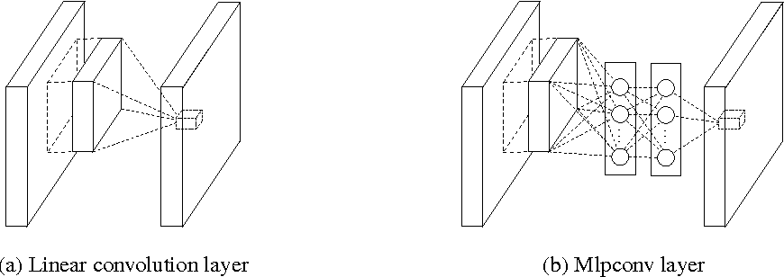

相比普通的卷积网络，MLP网络能够更好地拟合局部特征，也就是增强了输入局部的表达能力。在此基础上，NIN不再像卷积一样在分层之前采用全连接网络，而是采用全局平均池化，这种全局平均池化比全连接层更具可解释性，同时不容易过拟合。

### GoogLeNet动机

提高深度神经网络效果最直接的方式是增大网络尺寸，包括增加深度（使用更多的层），也包括增加宽度（在层内使用更多的计算单元）。这种方法简单、稳妥，特别是当有足够标注数据时。但简单的方法也带来了两个缺陷：

1. 更大的网络尺寸，通常意味着更多的参数，使得膨胀的网络更容易过拟合。在标注数据有限的场景中，这种情况更明显。类似于ILSVRC这样需要人工甚至专业知识（有的类别很难区分）进行强标注的数据集，增大数据规模是非常昂贵的。这也成为这类思路的主要瓶颈。
2. 整体增大网络尺寸会显著提高对计算资源的需求。如在深度视觉网络中，两个卷积层级联，如果统一增加卷积核数量，那么计算量的增大将与卷积核数的增加成平方关系。更坏的情况是，如果新增的网络单元不能发挥足够的作用（如大部分权重最终被优化成0），那么大量的计算资源将被浪费。计算资源是有限的，尽管目标都是提高模型质量，但有效地分配这些资源总是优于盲目扩大网络参数的。

解决这些问题的一个基本方法是引入稀疏性，用稀疏的链接形式取代全连接，甚至在卷积内部也可以这样做。遗憾的是，今天的设备对非一致性稀疏数据的数值计算是十分低效的。就算将算数操作降到几百量级，查找和缓存未命中的开销仍为主导——使用稀疏矩阵或许得不偿失。是否存在一种折中的方法，既具有结构上的稀疏性，又能利用密集矩阵计算呢？在大量稀疏矩阵计算的文献中提到，将稀疏矩阵聚集成相对稠密的子矩阵能带来可观的性能提升。不难想象，使用相似的方法自动构建非一致结构的神经网络并不遥远。GoogLeNet中的Inception模块就可以达到此等效果。

### Inception-v1解决问题

分析完动机，我们具体的来说针对问题，图像中突出部分的大小差别很大。例如，狗的图像可以是以下任意情况。每张图像中狗所占区域都是不同的。


由于信息位置的巨大差异，为卷积操作选择合适的卷积核大小就比较困难。信息分布更全局性的图像偏好较大的卷积核，信息分布比较局部的图像偏好较小的卷积核。非常深的网络更容易过拟合。将梯度更新传输到整个网络是很困难的。简单地堆叠较大的卷积层非常消耗计算资源。

### [Inception细节](https://arxiv.org/pdf/1409.4842v1.pdf)

为什么不在同一层级上运行具备多个尺寸的滤波器呢？网络本质上会变得稍微“宽一些”，而不是“更深”。作者因此设计了Inception模块。“Inception”结构的主要思想是用便捷可得的密集原件取近似卷积视觉网络的最优局部稀疏结构。接下来需要做的就是找到一种最优的局部结构，重复这种结构把它们拼接在一起组成网络。

如果前一层输出的每个单元都可以认为对应着原始输入图像中的某个区域，那么这些单元共同组成当前的特征图组。在较低层相关单元会集中在局部区域。这样，我们能得到很多集中在一个区域的簇，这些簇形成一个单元并与上一个单元相连。Arora等人提出一种层与层的结构，在结构的最后一层进行相关性统计，将相关性高的单元聚集到一起。这些簇构成下一层的单元，与上一层的单元连接。

假设前面层的每个单元对应输入图像的某些区域，这些单元被滤波器进行分组。如前所述，深度神经网络需要耗费大量计算资源。为了降低算力成本，作者在 3\*3 和 5\*5 卷积层之前添加额外的 1\*1 卷积层，来限制输入信道的数量。尽管添加额外的卷积操作似乎是反直觉的，但是 1\*1 卷积比 5\*5 卷积要廉价很多，而且输入信道数量减少也有利于降低算力成本。不过一定要注意，1\*1卷积是在最大池化层之后，而不是之前。低层（接近输入层）的单元集中在某些局部区域，这意味着最终会得到在单个区域的大量群，它们能在下一层通过1\*1卷积覆盖。然而，也可以通过一个簇覆盖更大的空间来减少簇的数量。为了避免patch-alignment问题，将滤波器大小限制在1\*1、3\*3和5\*5（主要为了方便，非必要）。在池化层添加一个备用的池化路径可以提高效率。

下图是原始Inception模块。它使用 3 个不同大小的滤波器（1\*1、3\*3、5\*5）对输入执行卷积操作，此外它还会执行最大池化。所有子层的输出最后会被级联起来，并传送至下一个 Inception 模块。


由于这些Inception模块一层叠一层，它们输出的相关性统计必然有所不同：更高的层用于提取更抽象的特征，空间上的集中程度应该相应地发生退化。这意味着，更高的层3\*3和5\*5的卷积核比例就应该更高。

上面模块存在的一个显著问题是（至少在这种朴素模式下），即使5\*5的卷积核数增加不明显，也会导致最高层的卷积核数激增。如果再加上池化单元，问题会更加严重。

另一种方式是在需要大量计算的地方谨慎的进行降维，压缩信息以聚合。

得益于Embedding技术的成功，即使低维度的Embedding也能包含相对大的图像区域中的丰富信息。然而，Embedding将信息表达为稠密压缩的模式，处理起来更困难。我们期望的是在大部分地方保持稀疏，只在需要放大的位置产生稠密信号。

于是，1\*1卷积放在计算昂贵的3\*3和5\*5卷积层前，用于减少计算量。1\*1卷积不仅用来降维，还用来修正线性特征。


总的来说，将Inception模块进行堆叠形成网络。其中一些最大池化层的步长设为2，减半网络的分辨率。出于技术原因（训练时内存效率），只在高层采用Inception模块，低层保持传统卷积层的形式。

对计算昂贵的大图像块卷积先降维。对于这样的框架，一个有用的特征是：增加神经元数量，不会导致下一阶段计算复杂度显著增加。

此外，这种设计也符合实际操作的直觉：视觉信息需要在不同尺度上进行处理并合并，这样下一阶段就能同时从不同尺度上抽象特征。

对计算资源的优化，可以在不显著增加计算难度的前提下，使得网络每个阶段的宽度和阶段的数量都得以增加。使用精心设计的Inception结构网络比相似的非Inception结构网络提速3~10倍。

## 后续改进版本


### [Inception-v2](https://arxiv.org/pdf/1512.00567v3.pdf)

在之前的版本中主要加入Batch Normalization。减少特征的表征性瓶颈。直观上来说，当卷积不会大幅度改变输入维度时，神经网络可能会执行地更好。过多地减少维度可能会造成信息的损失，这也称为"表征性瓶颈"。使用更优秀的因子分解方法，卷积才能在计算复杂度上更加高效。

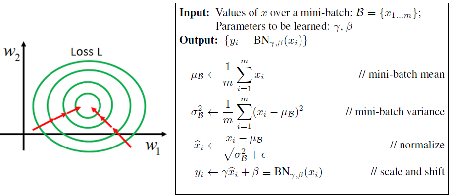

另外也借鉴了VGGNet的思想，用两个3\*3的卷积代替了5\*5的卷积，不仅降低了训练参数，而且提升了速度。将5\*5的卷积分解为两个3\*3的卷积运算以提升计算速度。尽管这有点违反直觉，但一个5\*5的卷积在计算成本上是一个3\*3卷积的 2.78 倍。所以叠加两个3\*3卷积实际上在性能上会有所提升，如下图所示：

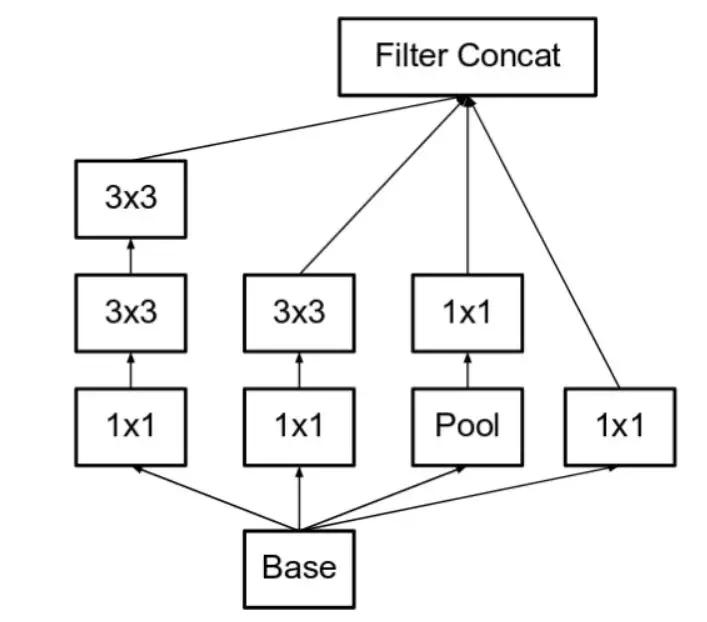

### [Inception-v3](https://arxiv.org/pdf/1512.00567v3.pdf)

在v2的基础上进一步分解大的卷积，比如把 $$n*n$$ 的卷积拆分成两个一维的卷积： $$1*n$$ ， $$n*1$$ 。例如7\*7的卷积可以被拆分为1\*7和7\*1两个卷积。此外，采用了一些巧妙的方法进一步优化了部分卷积层的设计。


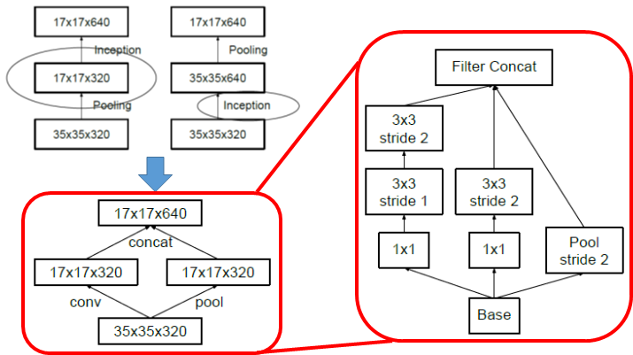

综上所述，我们现在就有三种不同类型的Inception模块（这里我们按引入顺序称之为模块 A、B、C，这里使用A、B、C作为名称只是为了清晰期间，并不是它们的正式名称）。架构如下所示。这里，figure 5是模块 A，figure 6是模块 B，figure 7是模块 C。

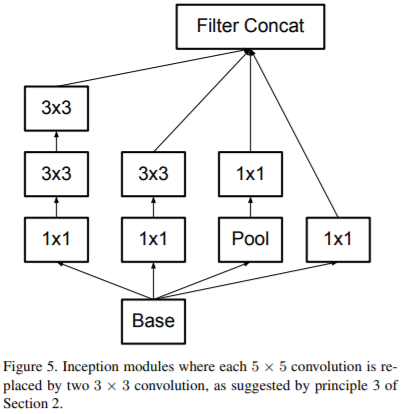 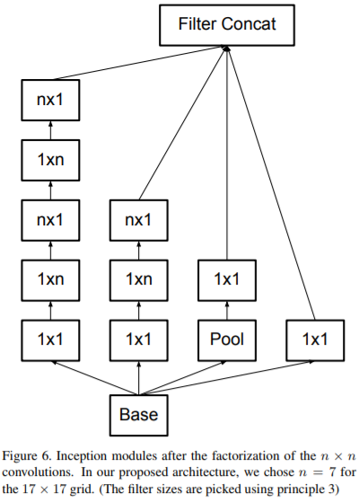 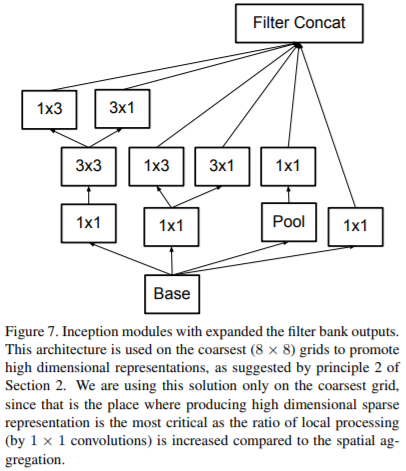 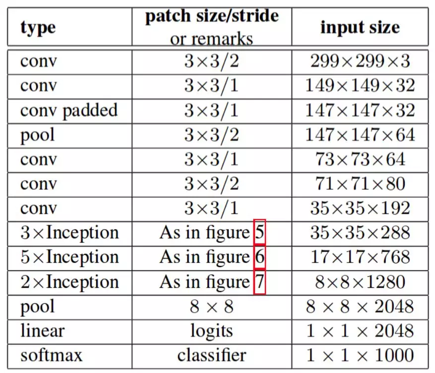 

其中A就是常规Inception，把5\*5换成了两个3\*3；B就是把n\*n换为1\*n和n\*1形式；C即在n\*n后面又分开了1\*n和n\*1。模块中的滤波器组被扩展（即变得更宽而不是更深，C为更宽，B为更深），以解决表征性瓶颈。如果该模块没有被拓展宽度，而是变得更深，那么维度会过多减少，造成信息损失。

### [Inception-v4](https://arxiv.org/pdf/1602.07261.pdf)

借鉴了ResNet可以构建更深网络的思想，设计了更深、更优化的模型。目的是为了使模块更加一致。作者还注意到某些模块有不必要的复杂性。这允许我们通过添加更多一致的模块来提高性能。


它们有三个主要的Inception模块（即上图右面三个，或看下图），称为 A、B 和 C（和 Inception-v2 不同，这些模块确实被命名为 A、B 和 C）。它们看起来和 Inception-v2（或 v3）变体非常相似。

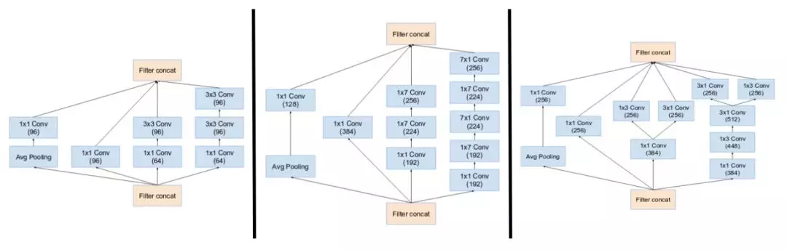

Inception-v4 引入了专用的“缩减块”（reduction block），它被用于改变网格的宽度和高度。早期的版本并没有明确使用缩减块，但也实现了其功能。

### Inception-ResNet v1和v2

受 ResNet 的优越性能启发，研究者提出了一种混合 Inception 模块。Inception ResNet 有两个子版本：v1 和 v2。在我们分析其显著特征之前，先看看这两个子版本之间的微小差异。

* Inception-ResNet v1 的计算成本和 Inception v3 的接近。
* Inception-ResNet v2 的计算成本和 Inception v4 的接近。

两个子版本都有相同的模块 A、B、C 和缩减块结构。唯一的不同在于超参数设置。在这一部分，我们将聚焦于结构，并参考论文中的相同超参数设置。下图上部是Inception-ResNet-v1的stem。图下部是Inception-v4和Inception-ResNet-v2的stem。


Inception-ResNet引入残差连接，它将Inception模块的卷积运算输出添加到输入上。为了使残差加运算可行，卷积之后的输入和输出必须有相同的维度。因此，我们在初始卷积之后使用1\*1卷积来匹配深度（深度在卷积之后会增加）。


主要Inception模块的池化运算由残差连接替代。然而，你仍然可以在缩减块中找到这些运算。缩减块 A 和 Inception-v4中的缩减块相同。

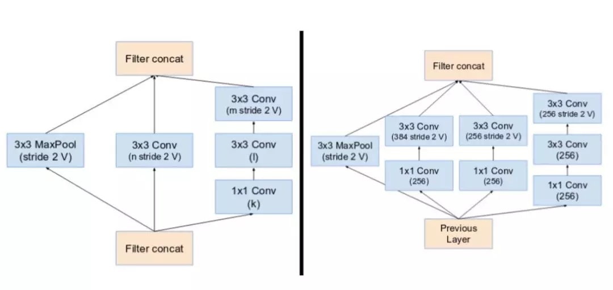

如果卷积核的数量超过 1000，则网络架构更深层的残差单元将导致网络崩溃。因此，为了增加稳定性，作者通过 0.1 到 0.3 的比例缩放残差激活值。

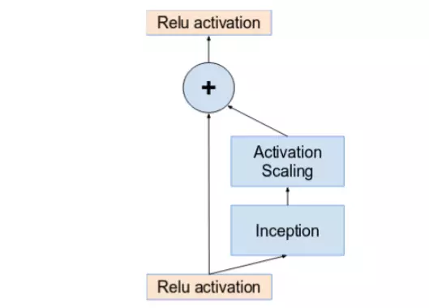

Inception v4 （下图上部）和 Inception-ResNet （下图下部）的网络完整架构如下图所示：

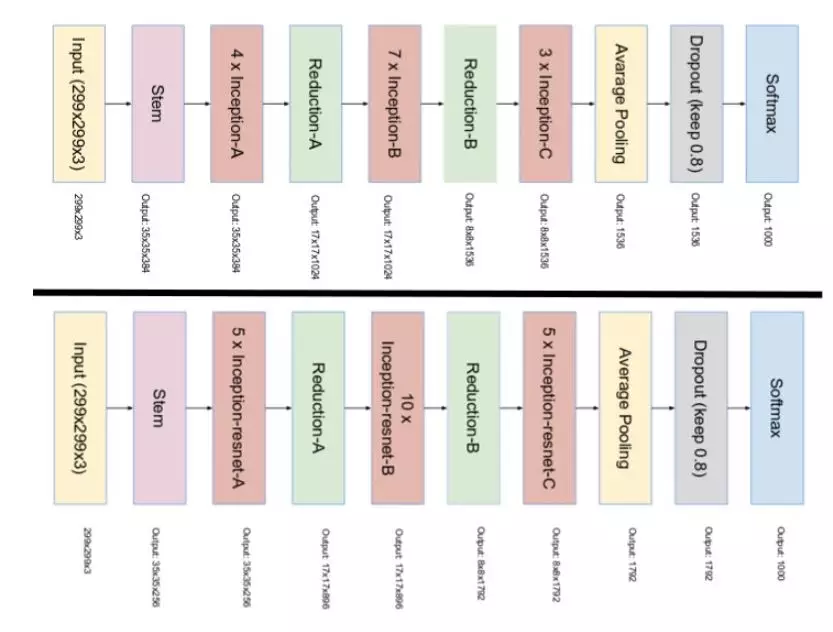

## Code实现

```python
def Conv2d_BN(x, nb_filter,kernel_size, padding='same',strides=(1,1),name=None):
    if name is not None:
        bn_name = name + '_bn'
        conv_name = name + '_conv'
    else:
        bn_name = None
        conv_name = None

    x = Conv2D(nb_filter,kernel_size,padding=padding,strides=strides,activation='relu',name=conv_name)(x)
    x = BatchNormalization(axis=3,name=bn_name)(x)
    return x

def Inception(x,nb_filter):
    branch1x1 = Conv2d_BN(x,nb_filter,(1,1), padding='same',strides=(1,1),name=None)

    branch3x3 = Conv2d_BN(x,nb_filter,(1,1), padding='same',strides=(1,1),name=None)
    branch3x3 = Conv2d_BN(branch3x3,nb_filter,(3,3), padding='same',strides=(1,1),name=None)

    branch5x5 = Conv2d_BN(x,nb_filter,(1,1), padding='same',strides=(1,1),name=None)
    branch5x5 = Conv2d_BN(branch5x5,nb_filter,(1,1), padding='same',strides=(1,1),name=None)

    branchpool = MaxPooling2D(pool_size=(3,3),strides=(1,1),padding='same')(x)
    branchpool = Conv2d_BN(branchpool,nb_filter,(1,1),padding='same',strides=(1,1),name=None)

    x = concatenate([branch1x1,branch3x3,branch5x5,branchpool],axis=3)

    return x

def GoogLeNet():
    inpt = Input(shape=(224,224,3))
    #padding = 'same'，填充为(步长-1）/2,还可以用ZeroPadding2D((3,3))
    x = Conv2d_BN(inpt,64,(7,7),strides=(2,2),padding='same')
    x = MaxPooling2D(pool_size=(3,3),strides=(2,2),padding='same')(x)
    x = Conv2d_BN(x,192,(3,3),strides=(1,1),padding='same')
    x = MaxPooling2D(pool_size=(3,3),strides=(2,2),padding='same')(x)
    x = Inception(x,64)#256
    x = Inception(x,120)#480
    x = MaxPooling2D(pool_size=(3,3),strides=(2,2),padding='same')(x)
    x = Inception(x,128)#512
    x = Inception(x,128)
    x = Inception(x,128)
    x = Inception(x,132)#528
    x = Inception(x,208)#832
    x = MaxPooling2D(pool_size=(3,3),strides=(2,2),padding='same')(x)
    x = Inception(x,208)
    x = Inception(x,256)#1024
    x = AveragePooling2D(pool_size=(7,7),strides=(7,7),padding='same')(x)
    x = Dropout(0.4)(x)
    x = Dense(1000,activation='relu')(x)
    x = Dense(1000,activation='softmax')(x)
    model = Model(inpt,x,name='inception')
    return model
```

## Source












