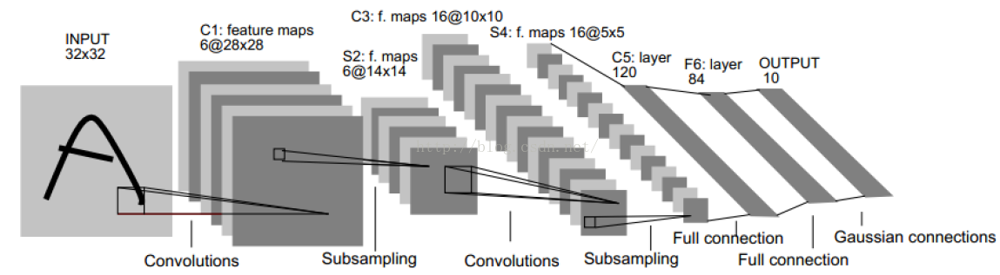

# LeNet-5

## LeNet-5简介

LeNet-5是1998年LeCun发表的用于手写字符识别的经典卷积神经网络模型。当年美国很多银行就采用了这种模型来识别支票上的手写数字，能够达到如此高的商业程度，可见其识别精准和在深度学习发展史上的重要地位。

LeNet-5在论文中被用于识别MNIST数据集提供的0~9共10个手写数字。MNIST是当时Google实验室的Corinna Cortes和纽约大学柯朗研究所的Yann LeCun共同建立的手写数字数据库，包含训练集60000张即测试集10000张手写数字图片。该数据集提供的图片尺寸统一为28\*28，图中包含字符的最大尺寸为20\*20。

## LeNet-5详解

LeNet-5网络除输入层外包含7层，每层都含有可学习的参数。如下图所示，卷积层标记为 $$C_x$$ ，下采样层标记为 $$S_x$$ ，全连接层标记为 $$F_x$$ ，其中 $$x$$ 表示层下标。

输入：32\*32的手写字体图片，这些手写字体包含0~9数字，也就是相当于10个类别的图片。网络输入是32\*32像素的图片，这一尺寸明显大于MNIST

## Source



