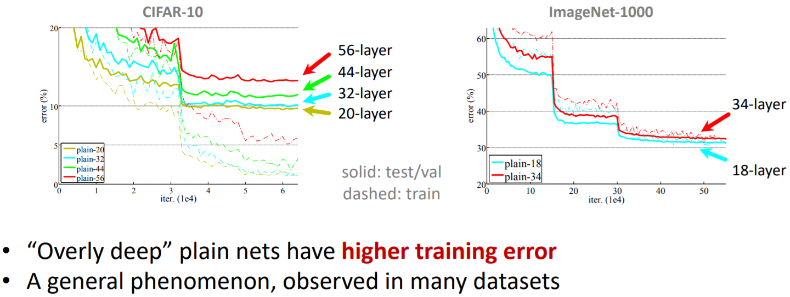
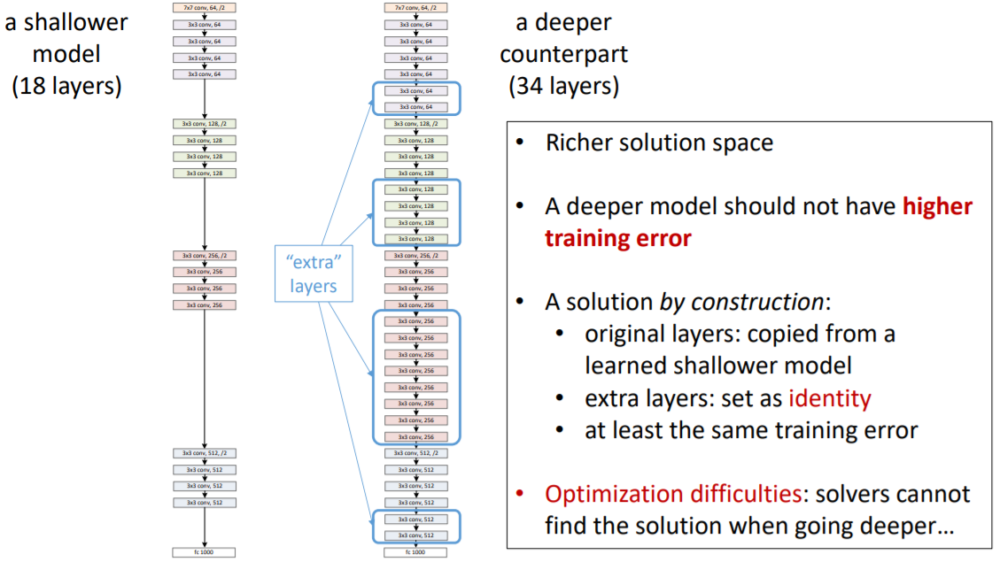
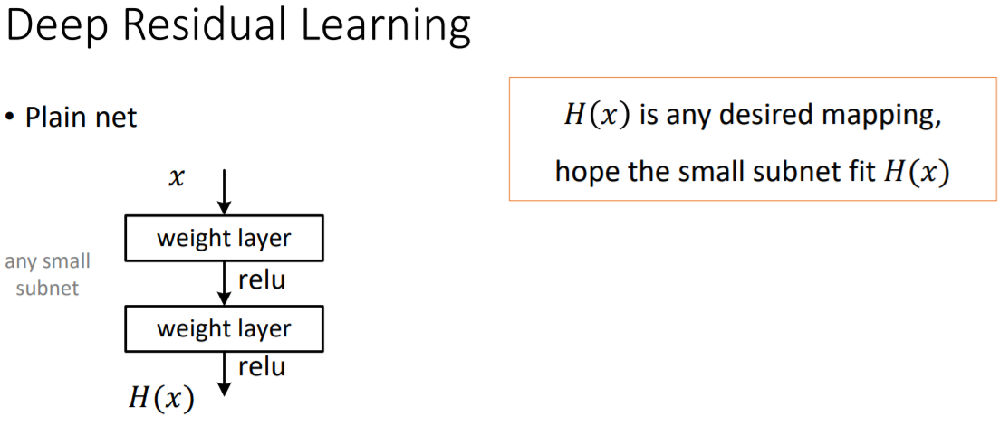
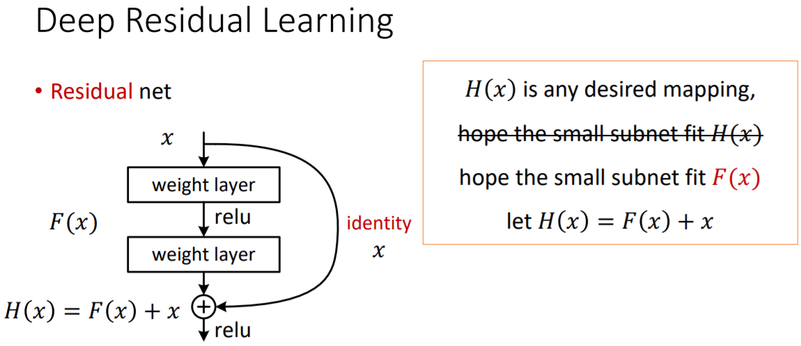
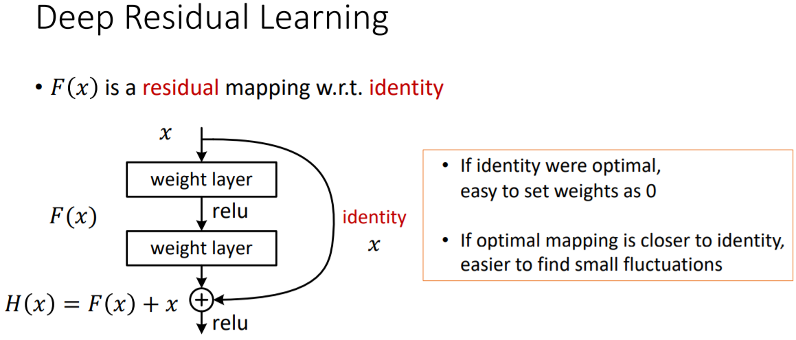

# ResNet

MSRA的深度残差网络在2015年ImageNet和COCO的5个领域：ImageNet识别、ImageNet检测、ImageNet定位、COCO检测以及COCO分割取得第一名。

231n中对ResNet的评价：

* **ResNet**. [Residual Network](http://arxiv.org/abs/1512.03385) developed by Kaiming He et al. was the winner of ILSVRC 2015. It features special _skip connections_ and a heavy use of [batch normalization](http://arxiv.org/abs/1502.03167). The architecture is also missing fully connected layers at the end of the network. The reader is also referred to Kaiming’s presentation \([video](https://www.youtube.com/watch?v=1PGLj-uKT1w), [slides](http://research.microsoft.com/en-us/um/people/kahe/ilsvrc15/ilsvrc2015_deep_residual_learning_kaiminghe.pdf)\), and some [recent experiments](https://github.com/gcr/torch-residual-networks) that reproduce these networks in Torch. ResNets are currently by far state of the art Convolutional Neural Network models and are the default choice for using ConvNets in practice \(as of May 10, 2016\). In particular, also see more recent developments that tweak the original architecture from [Kaiming He et al. Identity Mappings in Deep Residual Networks](https://arxiv.org/abs/1603.05027) \(published March 2016\).

## ResNet结构

论文中测试了不同的普通网络和残差网络，它们的具体结构如下。

### 普通网络

主要受VGGNet启发，卷积层主要采用3\*3的卷积核，并遵循以下两个设计原则。

* 如果网络层具有相同数量的特征图输出，那么它们的卷积核数量也一致。
* 如果特征图数量减半，那么卷积核数量就翻倍，从而保持每一层的时间复杂度。

ResNet通过直接将卷积层的步长设为2来实现降采样。网络的最后是一个全局的均值池化层和一个1000层路的Softmax全连接层。网络中共有34个参数层。

值得注意的是，这个配置相比VGGNet，卷积核更少，复杂度更低。34层的基础网络包含360万次乘加操作，仅是19层VGGNet网络的18%（1960万次乘加）。

### 残差网络

基于上面的普通网络，插入快捷连接，将网络转化为对应的残差版本。当输入输出维度相同时，可以直接采用恒等快捷连接（Identity Shortcut Connection），如下图右侧实现所示。当维度增加时（虚线），考虑两种选择：（1）仍然使用恒等快捷连接，增加的维度直接补0，这种方式不会引入新的参数；（2）将维度较少的低层输出映射到与高层相同的维度上（通过1\*1卷积实现）。无论怎样选择，当快捷连接跨过两层特征图时，步长设为2.

## ResNet特点

ResNet解决了超深层CNN网络的训练问题，多达152层，甚至尝试了1000层。

那么更深的网络是否更好？回答这个问题的一大障碍是梯度爆炸、消失。

当更深的网络开始收敛时，“退化”（Degradation）现象便暴露出来：随着网络深度的增加，准确率不出意料地开始饱和，随后便快速下降。

               

ResNet通过引入“深度残差学习”的框架来解决退化问题。

ResNet放弃直接拟合某个函数 $$y=H(x)$$ 的传统思路（下左图），转而拟合残差 $$F(x)=H(x)-x$$（下右图），原始映射就变成 $$H(x)=F(x)+x$$ 。ResNet的假设是残差映射比原始映射更容易优化。

                  

在极限的情况下，如果优化得到单位映射，那么继续堆叠的非线性层能很容易地你好处趋向于0的残差，而不是再学一个单位映射。

在实际情况下，单位映射不太可能是最优的情况，但是改写为残差能帮助预处理整个问题。当一个最优的函数接近于单位映射而不是零时，找到一个参照单位映射的扰动比学习一个新的函数要更容易。在实验中观察到学到的残差总体上响应很小，也证明了单位映射是一个合理的先验假设。

## Source





