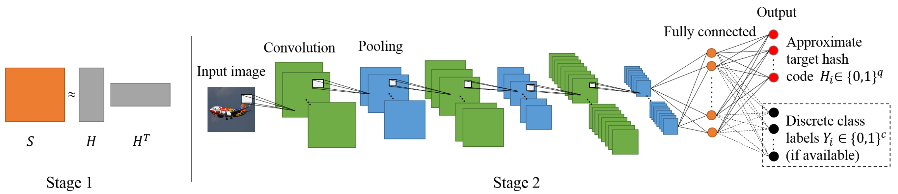

# CNNH

在深度学习进行哈希编码压缩的第一篇代表性[文章](https://www.aaai.org/ocs/index.php/AAAI/AAAI14/paper/view/8137)中提出了CNNH（CNN-Hashing）方法。顾名思义，此方法应用了CNN卷积神经网络来优化哈希编码。方法流程如下图所示，虽然看起来很复杂，但实际思路非常简单，即用CNN代替传统方法来进行特征提取，以及将特征表达映射至哈希编码上。

具体来看，CNNH的方法由两大步骤组成。其中Stage 1是将相似度矩阵拆解成哈希编码矩阵及其转置的乘积。这一步与传统方法的第2步完全相同。不同的是，在Stage 2利用CNN一并完成了传统方法的1、3步。CNN可以完成从输入图像至输出类别的映射过程。而其中的最后几个卷积层、全连接层都分别对应一组高度抽象后的特征表达。在上图中，输出类别对应的是最右侧的黑色的点。而在图像的哈希编码问题上，我们也可以同样建模，即输入图片，输出位在Stage 1已得到的哈希编码矩阵 $$H$$ 。整个Stage 2完成了从图像提取特征表达，直至映射到哈希编码的过程。其中哈希编码用途中最右侧的红色点表示。

由此可知，此方法对传统方法的改进在于利用深度神经网络更有效地提取特征并加以映射。但另一方面，相似度矩阵分解依然是问题的瓶颈；而且分解后的哈希编码在Stage 2无法继续改进，整个流程仍然不是端到端的简洁模型。

因此，随后的深度哈希研究更加大胆，直接抛弃了传统方法的束缚，得出由损失函数控制、由图像到哈希编码的端到端的训练模型。

