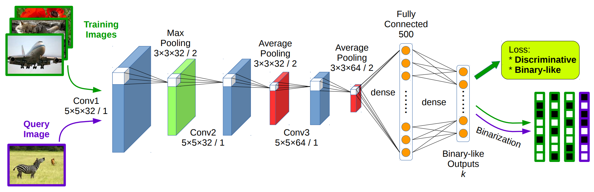

# DSH

[DSH（Deep Supervised Hashing）](https://www.cv-foundation.org/openaccess/content_cvpr_2016/papers/Liu_Deep_Supervised_Hashing_CVPR_2016_paper.pdf)是2016年提出的方法，它的网络结构及方法流程如下图。

由上图可以看出，DSH方法不再包含分解相似度矩阵的步骤，而是从图片到二值哈希编码的一气呵成。它的网络结构为三层卷及网络接两个全连接层，最后的全连接层就是哈希编码了。每层的具体结构在图中已经标示。

那么，在图中与CNNH中的Stage 2无太大区别的情况下，是如何省掉了Stage 1分解相似度矩阵这一步的呢？

首先，在CNNH中Stage 2是单路模型，即输入为一张图片，对应的是该图片的哈希编码。而在DSH方法其实是双路模型，即输入为一对图片，输出为这一对图片的距离，对应于其相似、不相似的标签。这种双路模型也被称为Siamese模型，源于LeCun最早的一篇双路网络模型的[文献](http://www.cs.utoronto.ca/~hinton/csc2535_06/readings/chopra-05.pdf)。因此，DSH是按图片对及它们的相似标签进行训练的，两路网络的参数共享，因此它们是一模一样的。在测试时，待检索的图片只需经过单路模型，得到其哈希编码。

因此，图片对的当前哈希编码距离是在最后一层的基础上得到的，网络训练的损失函数则围绕这个距离的大小与实际相似与否的标签来进行。大体思路是，如果标签相同，哈希编码距离越小则损失函数越小；繁殖，如果标签不同，则距离越大越好。此外，由于哈希编码要限制在0或1上，还需要补充损失函数完成这样的偏好选择。具体的损失函数表达式如下：

                                   $$L_r(b_1,b_2,y)=\frac{1}{2}(1-y)||b_1-b_2||^2_2+$$ 

                                                                  $$\frac{1}{2}y\max(m-||b_1-b_2||^2_2,0)+$$ 

                                                                   $$\alpha(|||b_1-1|||_1+|||b_2-1|||_1)$$ 

其中 $$y$$ 为标注结果， $$y = 0$$ 表示图片相同， $$y = 1$$ 表示图片不同。所以损失函数表达式的第一部分对应的是在标注结果“相同”的情况下，图片的哈希编码距离的损失以欧式距离来表示，即距离约小损失函数越小；第二部分实在标注结果“不同”的情况下，以折页损失函数（Hinge Loss Function）来表示，即距离小于 $$m$$ 时，距离越小则损失函数数值越大，而当距离大于阈值 $$m$$ 后，认为已经分开得足够远了，损失降为 $$0$$ ；第三部分则为与“二值化”相关的损失，在DSH中，将哈希值的二值规定为 $$-1$$ 、 $$1$$ ，因此，如果哈希编码的各个位的值的绝对值越接近于 $$1$$ ，则损失函数值越小。第三部分以一个权重和前边的损失结合起来，形成总体的损失函数。

在DSH的训练过程中，随着不断降低损失函数值，不仅实现了相同、不同图像的哈希距离的优化，而且还使得其编码值靠近二值 $$(-1,+1)$$ ，从而简捷地完成了端到端的哈希编码，此方法不仅绕开了传统方法在分解相似度矩阵时所面临的困难和限制，而且由于它可以充分利用大规模的训练数据，使得其结果比传统方法反而提高很多。这也显示了深度学习应用于此领域的成功。

