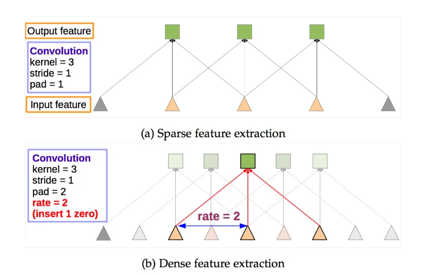
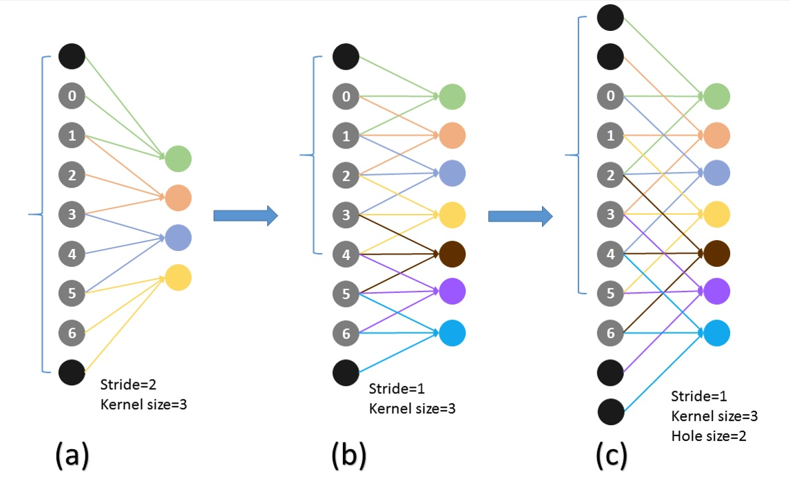
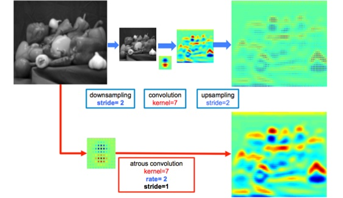

# DeepLab

首先这里我们将指出一个第一个结构FCN的粗糙之处：为了保证之后输出的尺寸不至于太小，FCN的作者在第一层直接对原图加了100的padding，可想而知，这会引入噪声。

而怎样才能保证输出的尺寸不会太小而又不会产生加100 padding这样的做法呢？可能有人会说减少池化层不就行了，这样理论上是可以的，但是这样直接就改变了原先可用的结构了，而且最重要的一点是就不能用以前的结构参数进行fine-tune了。所以，Deeplab这里使用了一个非常优雅的做法：将pooling的stride改为1，再加上 1 padding。这样池化后的图片尺寸并未减小，并且依然保留了池化整合特征的特性。

但是，事情还没完。因为池化层变了，后面的卷积的感受野也对应的改变了，这样也不能进行fine-tune了。所以，Deeplab提出了一种新的卷积，带孔的卷积：Atrous Convolution。即：

而具体的感受野变化如下：

a为普通的池化的结果，b为“优雅”池化的结果。我们设想在a上进行卷积核尺寸为3的普通卷积，则对应的感受野大小为7.而在b上进行同样的操作，对应的感受野变为了5.感受野减小了。但是如果使用hole为1的Atrous Convolution则感受野依然为7。所以，Atrous Convolution能够保证这样的池化后的感受野不变，从而可以fine tune，同时也能保证输出的结果更加精细。即：

## Source



