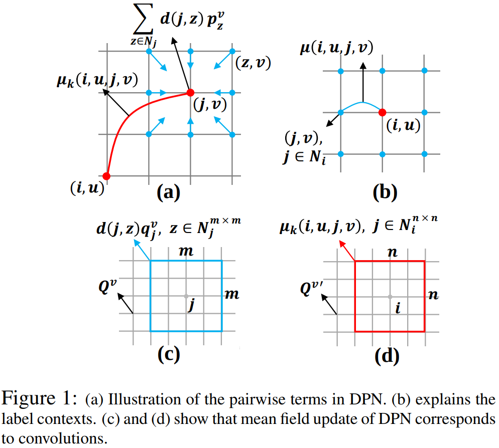

# DPN

DPN（Deep Parsing Network）使用现有的CNN来完成一元问题，然后又精心设计了其他层来模拟平均场算法的二元问题。DPN的优点如下：

* 在综合使用了CNN和随机场的一般工作中，需要对随机场做多次迭代，然而DPN只做一次迭代就可以获得比较好的效果。
* DPN同时考虑了空间上下文关系如高阶关系，有能力对各种二元问题进行建模，使得很多二元问题成为DPN的特例。
* DPN使得马尔可夫场问题能够并行化解决，通过GPU来加速计算。DPN使用卷积和池化操作来近似MF，可以通过近似来加速。

二元势函数都是通过考虑任意两个像素点之间的关系来构造的。如 $$\psi(y_i^{u},y_j^{u})=\mu(u,v)d(i,j)$$ 中的 $$y_i^{u}$$ 表示像素点 $$i$$ 是否被标记为 $$u$$ ； $$d(i,j)$$ 表示像素点 $$i,j$$ 之间的关系，比如RGB像素点的距离或者空间距离； $$\mu(u,v)$$ 则表示 $$u,v$$ 这两个标记全局共现的惩罚。在空间上相近且看起来相似的两个点，应该更容易获得相同的标签。然而这种建模方式的两个缺点：（1）它只考虑了共现的频率，却没有考虑空间上下文关系，比如，当人和椅子一起出现的时候，人应该是坐在椅子上的，而不太可能在椅子下；（2）它只考虑了像素点之间成对（Pairwise）的关系，却没有考虑更高阶的关系。为了解决这些缺点，在二元势函数中引入了三元惩罚项：

                                       $$\Psi(y_i^u,y_j^u)=\sum\limits_{k=1}^K\lambda_k\mu_k(i,u,j,v)\sum\limits_{\forall z\in \mathcal{N}_j}d(j,z)p_z^v$$ 

这个式子学习了局部标记上下文的混合。 $$K$$ 是混合组件的数量， $$\lambda_k$$ 取值为 $$0$$ 或 $$1$$ ，表示哪个组件被激活，且 $$\sum\limits_{k=1}^K\lambda_k=1$$ 。如下图（b）所示，红色点和蓝色点描述了中心点 $$i$$ 和它的邻域 $$j$$ 。 $$(i,u)$$ 表示像素点 $$i$$ 被标记为 $$u$$ 。 $$\mu(i,u,j,v)$$ 表示根据 $$i$$ 和 $$j$$ 的相对关系， $$(i,u)$$ 和 $$(j,v)$$ 同时存在的代价。上式的第二项就为三元惩罚项，表示像素点 $$i,j$$ 以及 $$j$$ 的邻域的关系。当 $$(i,u)$$ 和 $$(j,v)$$ 相容时， $$(i,u)$$ 也应该相容于 $$(z,v)$$ ，其中 $$z$$ 是 $$j$$ 的邻域，如下图（a）所示。所以DPN的主要贡献就是把上式分两步建模成CNN。第一步如图（c）所示，用m\*m的卷积核作用于每个点 $$j$$ 来表示 $$d(j,z)q_j^v$$ ，平滑了像素点 $$j$$ 和它的邻域之间的预测。第二步使用n\*n的卷积核作用于每个点 $$i$$ 来表示 $$\mu_k(i,u,j,v)$$ ，如图（d）所示。

