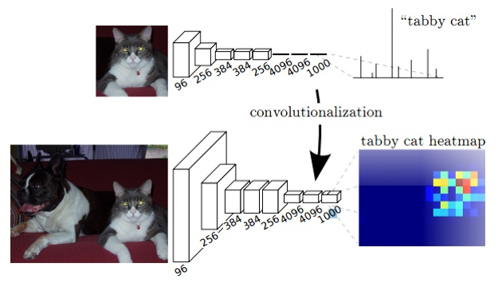

# FCN

语义分割面临着语义和位置的内在矛盾：全局信息解答是什么，局部信息解答在哪里。FCN（Fully Convolutional Networks）定义了一个“skip”结构来合并深层的、粗粒度的语义信息和浅层的、细粒度的位置信息。FCN的成功是建立在深度网络在图像分类和迁移学习基础上的。FCN使用并拓展了现有的图像分类模型，然后通过整张图片的输入和Ground Truth来微调卷积层的参数。

## FCN贡献

### 卷积化

即如何把图片分类中粗粒度的特征图还原到像素级别。卷积化即是将普通的分类网络，比如VGG16，ResNet50/101等网络丢弃全连接层，换上对应的卷积层即可。如下图所示，在FCN中直接把最后的全连接层用卷积层代替，第一个卷积层对应的卷积核的kernel是7\*7，第二个卷积层对应的卷积核的kernel是1\*1.这两个卷积层后都是跟着Dropout层。全卷积网络的输出天然就很适合解决这种稠密的问题。由于网络是全卷积网络，所以它可以使用任意尺寸的输入图片，但是输出维度被下采样所减小。

### 上采样

除全卷积网络以外，另一个能够将粗粒度输出变为稠密输出的方式是上采样。最简单的，比如双线性插值，可以从最近的几个点估计填充的点的值。另外，上采样 $$f$$ 倍，可以看作卷积操作的步长是 $$\frac{1}{f}$$ 。一种直观的方式是使用反卷积（Deconvolution），它的前向、后向传播方式与卷积的后向、前向传播方式一致。一组反卷积和激活函数可以构造非线性的上采样。当然关于这个名字不同框架不同，Caffe和Keras里叫Deconvolution，而tensorflow里叫conv\_transpose。CS231n这门课中说，叫conv\_transpose更为合适。

众所诸知，普通的池化（为什么这儿是普通的池化请看后文）会缩小图片的尺寸，比如VGG16五次池化后图片被缩小了32倍。为了得到和原图等大的分割图，我们需要上采样/反卷积。反卷积和卷积类似，都是相乘相加的运算。只不过后者是多对一，前者是一对多。而反卷积的前向和后向传播，只用颠倒卷积的前后向传播即可。所以无论优化还是后向传播算法都是没有问题。图解如下：

但是，虽然论文中说是可学习的反卷积，但是作者实际代码并没有让它学习，可能正是因为这个一对多的逻辑关系。

### 跳跃结构

这个网络结构的一大亮点在于浅层信息和深层信息的合并，也就解决了本节开始提出的如何把全局的语义信息与局部的分割信息相融合的问题。

下图中的FCN-32直接在最后一个卷积层的特征图后做了上采样，这一步采用的是不可学习的双线性插值上采样。FCN-16和FCN-8分别对最后一个卷积层的特征图做了2倍和4倍的上采样，这里的上采样的参数初始化为双线性插值，在学习过程中参数可学。实验证明，FCN-8的效果最好。由于这个网络的参数太多了，而用于分割的训练样本数又较少，所以作者使用其他的分类问题来训练好初始的网络，然后再微调后面的上采样过程。

## Source









