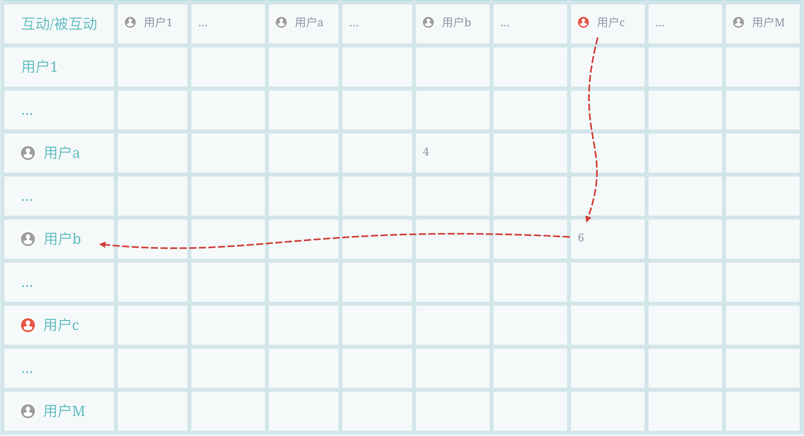
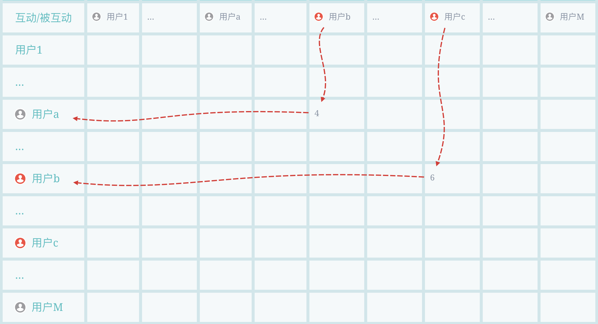
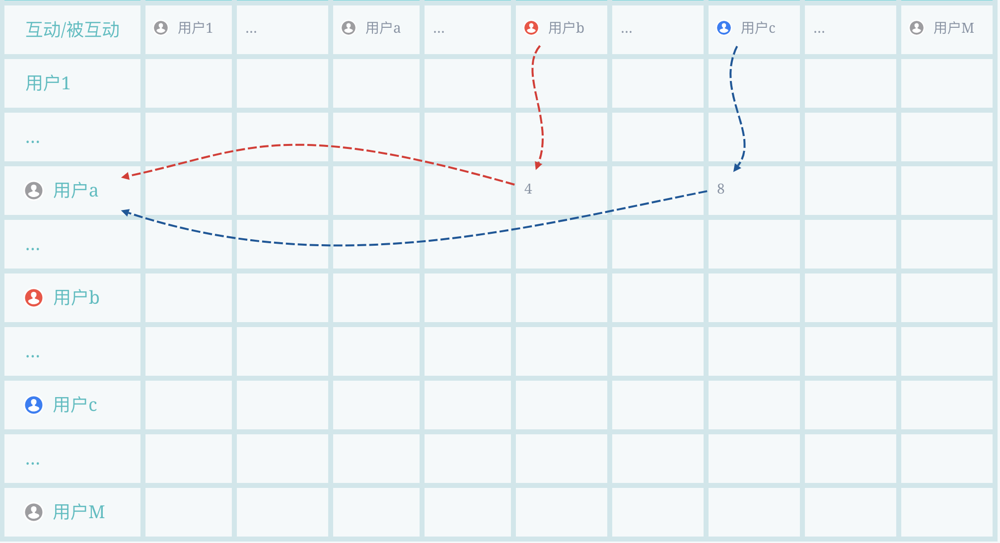
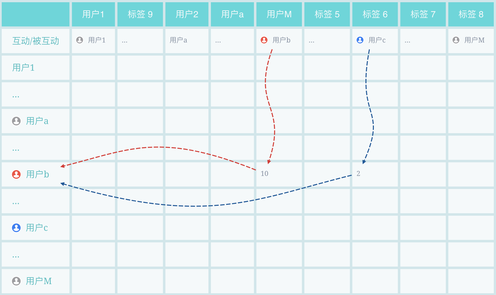

# 标签传播

标签体系是各大公司业务系统最重要的基石，无论是user标签还是item标签。可以这样说，评价一个公司技术能力强弱，其构建起的标签体系是最关键的评价指标。这里基于个人经验，借鉴GNetMine以及PageRank算法，阐述自己设计的基于社交图谱的标签传播算法。

标签体系最基础也是最难的两个目标，就是准和全。准即准确率，要求算法打的标签要准确，毕竟标签体系很大一部分是作为其他后续算法的输入，如果后续算法的数据源都不准确，何谈产出好效果；全即覆盖率，要求覆盖一定量数据集，如果数据集很少那人工打标即可，还特别准，然而现实业务场景应用中，数据集非常大，人工只能打标其中一部分，这就要求算法要具有一般性。**这里我利用知识图谱的信息传递性，尤其社交网络中的关系传递，只用约万分之一的已标注样本量给大量待标注数据进行标签标注\(约十万已标注账号给数十亿账号打标\)，且效果准确，可用于商业推广。**

## 算法概述

基于约十万已标注账号信息，一段时间内账号间社交互动\(关注、转发、评论等\)信息，输出预测未标注账号属于各类别概率，设计了基于社交网络的多轮迭代标签传播算法。分为损失函数、标签传播、结果汇集三部分解释。总流程如下：

```text
初始化: f(0)=y, Loss(0)=Inf

while Loss变小:
    标签传播: 由第t-1轮结果f(t-1)和社交互动关系R，得到第t轮结果f(t)
    结果汇集: 基于第t轮结果f(t)汇集成p(t)
    损失计算: 基于p(t)计算Loss(t)

输出Loss最小一轮结果p
```

算法基于知识图谱的信息传递性（相关知识在我上一篇里可以找到，这里我就不展开赘述了），可以想象农田水渠灌溉，标签传播就像水流随着水渠流动，只不过算法中是类别信息按照社交互动行为进行流动，且是多源头的，比如下图，大的几个图标是源头，他们的标签信息会随着和他们进行互动的路径传播出去。这里的多源既是多类别源头\(比如下面红绿蓝3个最大的图标各代表1类的源头，共3类\)，也指的单类别多源头\(假设下面是黑色的，都是一个类别，这个类别有3个信息源\)。


### **多跳传播**

灰色为未知类别，用户b对用户c进行过互动\(比如6次转发等\)，用户c的类别就会传递给b\(下图1\)。经过上一轮的传递后，用户b从c那里获得了类别信息，用户a对b也进行过互动\(比如4次评论等\)，c的类别信息就由经b也流向了a，即完成了2 hop传播\(下图2\)。现实网络里肯定存在环，所以会有无穷尽hop传播，我们基于Loss在合适的时刻进行切断。





### **跨类与自传播**

就如我们前面说多源部分说的，可能一个用户\(如下图用户a\)和多个类别的\(用户b、c\)进行过互动，那b和c的标签信息都流给a，a也会将他们两个信息也再往后传\(下图1\)。还有一些自传播\(用户b转发10次自己的文章\)，已标注另一类别的传播给本类别节点\(用户c传播给用户b\)等等\(下图2\)。





## 算法设计

### 损失函数

损失如下公式，由精度损失和泛化损失两部分组成，其中 $$\alpha$$和 $$\beta$$ 调节更关注准确还是泛化：

                             $$\text{Loss}=\alpha\sum\limits_{i=1}^I\sigma_i|\hat{y_i}-y_i|+\beta\sum\limits_{a,b}^S\omega_{a,b}|\hat{y_a}-\hat{y_b}|\\  =\alpha \sum\limits_{i=1}^I\sigma_i|\cos(\hat{p(t)_i},y_i)|+\beta\sum\limits_{a,b}^S\omega_{a,b}|\cos(\hat{p(t)_a},\hat{p(t)_b})|$$ 

1、精度损失 $$\alpha \sum\limits_{i=1}^I\sigma_i|\cos(\hat{p(t)_i},y_i)|$$ 。

* 集合 $$I$$ 为Ground Truth集合；
* 参数 $$\sigma_i$$ 表示 $$i$$ 个已标注样本账号的重要程度，比如在微博场景下是此账号的粉丝数等，我们更倾向于将粉丝量大的账号类别预测准；
* 余弦距离 $$|\cos(\hat{p(t)_i},y_i)|$$ 即第 $$t$$ 轮账号 $$i$$ 的预测向量和其Ground Truth向量的余弦距离，向量每一列对应一个类别，比如分成语数外三类， $$\hat{p(t)_i}=(0.2,0.7,0.1)$$ ，账号 $$y_i=(0,1,0)$$ 实际属于数学类别。

2、泛化损失 $$\beta\sum\limits_{a,b}^S\omega_{a,b}|\cos(\hat{p(t)_a},\hat{p(t)_b})|$$ 。

* 集合 $$S$$ 为相似账号的集合；
* 参数 $$w_{a,b}$$ 表示账号 $$a$$ 和 $$b$$ 的相似程度，可以使用SimRank，Random Walk，PathSim等等，这里我采用了粉丝重合度 $$w_{a,b}=\frac{A\cap B}{A\cup B}$$ ，两账号粉丝交集数/两账号粉丝并集数，我们更倾向于关注粉丝重合度高的账号对，物理意义即若两账号粉丝相同，则两账号类别大概率相似；
* 余弦距离 $$|\cos(\hat{p(t)_a},\hat{p(t)_b})|$$ 即第 $$t$$ 轮账号 $$a$$ 的预测向量和第 $$t$$ 轮账号 $$b$$ 的预测向量的余弦距离。

### 标签传播

具体标签传播过程可以由下面公式表达，第t+1轮结果由第t轮结果进行传播加Ground Truth：

                                         $$f(t+1)=\sum\limits_{r\in R} W_r*f(t)+W_y*y \\ =\sum\limits_{r\in R} (\alpha_r*P_r*Q_r)*f(t)+W_y*y$$ 

1、标签传播 $$\sum\limits_{r\in R} (\alpha_r*P_r*Q_r)*f(t)$$ 。

* 集合 $$R$$ 为社交互动类型集合，比如 $$R = \{关注、转发、评论\}$$ ， $$r$$ 即其中一种互动类型；
*  $$\alpha_r$$ 即互动类型 $$r$$ 的影响因子，比如微博场景下关注、转发、评论的社交成本是不一样的，转发的少，而评论和关注次之，而大家经常随意点赞，这个因子是调节不同社交互动的融合权重；
*  $$P_r$$ 为账号影响力矩阵，一百万个粉丝的账号和一万个粉丝的账号影响力不同，使用这个矩阵进行调节影响力权重，比如账号的对应影响力权重为其粉丝量。
*  $$Q_r$$ 矩阵就是标签传播的路径。以关注关系简单举例，假设社交网络中有 $$M$$ 个账号节点，行表示关注人，列表示被关注人，矩阵 $$Q_r$$ 为 $$M*M$$ 维，假设账号 $$m$$ 共关注了 $$a$$ 、 $$b$$ 和 $$c$$ 三个账号，则 $$Q_r$$ 矩阵中对应 $$m$$ 账号行，对应$$a$$ 、 $$b$$ 和 $$c$$ 账号列的值各为 $$\frac{1}{3}$$ ，其余均为 $$0$$ 。
*  $$f(t)$$ 即第 $$t$$ 轮结果，若 $$M$$ 个账号分为 $$N$$ 类，则 $$f(t)$$是一个 $$M*N$$ 的矩阵，第 $$m$$ 行第 $$n$$ 列即代表账号 $$m$$ 属于第 $$n$$ 类的权值，其中第0轮结果 $$f(0)=y$$ ，即假设有 $$K$$个已标注账号， $$f(0)$$ 的这 $$K$$ 行对应的第 $$n$$ 列为 $$1$$ ，其他为 $$0$$ ，剩下的 $$M-K$$ 行全为 $$0$$ 。

2、加入Ground Truth， $$W_y*y$$ 。

* 每轮结果再加入Ground Truth， $$W_y$$ 为行业及账号权重调节，比如微博场景下，文娱和金融和教育几个类别量级是不一样的，这里做标准化；
*  $$y$$ 即Ground Truth的矩阵。

### 结果汇集

获得第 $$t$$ 轮的结果 $$f(t)$$ 后，根据关系对聚合成对应账号的结果向量：

                                                        $$p(t)_x=\sigma(\sum\limits_{a}^Af(t)_a)$$ 

账号 $$x$$ 结果通过其粉丝集合 $$A$$求和，然后经过标准化得到，标准化 $$\sigma$$ 函数任选，比如softmax，数据量太大可以直接计算对应值除以总和得到占比。

## 算法解释

**具体实现：**可以看到，算法基于矩阵运算，可以使用GPU加速。当然，直接用Hive也可以实现，矩阵加法用union+sum group by，乘法用inner join，稀疏矩阵里的 $$0$$ 在数据表里不存在此记录，所以数据量、计算速度也都可以接受。

**标签传播：**算法下一轮结果 $$f(t +1)$$ 都由当前轮结果 $$f(t)$$ 进行标签传播再加Ground Truth $$y$$ ，可以想象为农田水渠灌溉，每轮加Ground Truth就像水源头，标签传播就像水流随着水渠流动，只不过算法中是类别权重按照社交互动行为进行流动。

**多跳传播：**第 $$t$$ 轮，会进行 $$1\dots t$$ 跳传播，例如 $$t = 1$$ 时，只有 $$1$$ 跳传播，已标注账号的信息传播至与其进行过社交互动的账号；当 $$t = 2$$ 时，已标注账号的信息依旧传播至与其进行过社交互动的账号\( $$1$$ 跳\)，此时上一轮通过1跳得到信息的账号，在这一轮将信息传给了与他互动的账号，即已标注账号信息通过1跳媒介又将信息传播了出去\( $$2$$ 跳\)...

**Loss表现：**1、对于精度损失\(已标注账号和其预估结果\)，每个账号的 $$n$$ 维向量 $$p(t)_x$$ 是由其粉丝向量聚合得到，已标注账号 $$x$$ 的标签传给其粉丝，粉丝又将标签汇集给已标注账号 $$x$$ ；对于泛化损失\(粉丝相同两账号分类应相似\)，粉丝重合越高，两账号 $$a$$ 和 $$b$$ 越相似，获得的 $$n$$ 维向量 $$p(t)_a$$ 和 $$p(t)_b$$ 由粉丝向量聚合得到，所以也会约接近。随着轮数越来越多，标签传播hop增多，噪声干扰会越来越多，会导致Loss上升。所以模型经多轮计算，Loss逐渐下降，待到开始上升时停止迭代，输出Loss最小轮时所生成的结果。

**应用方式：**算法最后得出的是一个 $$M*N$$ 维的矩阵，其中 $$M$$ 是账号数，每个账号对应一行， $$N$$ 是类别数，第 $$n$$ 列的值为属于这个类别的权值。所以，一个账号对应一个可解释的 $$N$$ 维向量。

* 账号分类，比如进行广告行业分类，一个娱乐搞笑账号投什么行业广告比较好也就知道了 
* 通过计算向量间余弦距离，获得相似账号，进行账号聚类，Lookalike扩充等
* 当然，向量可以作为后续算法的输入，为匹配，点击等等模型提供源数据
* 结果发现会有向量值全 $$0$$ 的异常账号，查验这些是刷的僵尸号，也可用于甄别异常号


