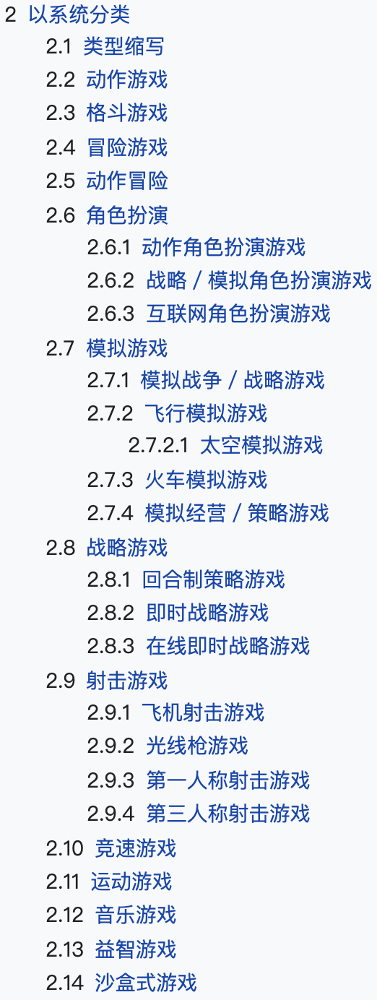

# 人群定向

最近负责广告人群定向\(兴趣/行业\)体系的重构，写本篇记录一下工作。人群兴趣标签可以说是用户画像中最重要的一环，既可直接商业化又能作为基础特征数据输入后续算法，但用于商业化的人群兴趣标签和UGC\(用户原创内容\)标签的差别相当大\(商业化的多为和广告主行业相关的标签，且正样本多采用广告计划导流人群等作为样本\)，很值得去深入探讨和挖掘。

## 体系框架

大部分开发同学都是等产品将标签体系框架定下来，然后进行人群定向的工作。这是一个很不健康的做法，一定要参与体系框架的制定，甚至50%以上的时间都要在这一部分。如果体系制定的不好，会造成两个后果：

1. 开发同学疯狂加班，但效果就是不好，累死三军
2. 广告主使用困惑，此功能性价比极低不好用，慢慢不用了

  

这里举个例子说明一下，上面两张图是巨量的兴趣定向，其游戏类下三级有益智类游戏、卡牌类游戏、棋类游戏等等。

1. 可以看到，基于当前体系类别的界定，同级下卡牌类和棋类这两类别人群量级差了10倍以上，分布不是很好看。上面的例子只是其中的一个，有大量同级下不同标签人群量级差别大的情况。首先我们来讨论，这是不是个问题？如果同级下各标签区分明确，那完全不是问题，因为实际情况就是这样，按玩法维度，卡牌就是比棋类小众，喜欢下棋的人就是比玩卡牌的人多。但问题在于这里还有一个益智类，让这三个类的界限很模糊，量级差别大就很成问题了。
2. 对于广告主来说，一个卡牌类广告主，150万不够我的广告跑量，我需要再选几个标签以补充人群数量，但我跑量的同时也想保效果，所以除了卡牌类这个标签，剩下的哪个和我最相关呢？按大多数人理解\(百科\)，卡牌、棋类是属于益智类的，我选择益智类游戏这个标签扩人群？不对，他们在平台上是同级并列的，不是父子类关系，定体系的时候有意将其区分开，可能益智游戏指的专门给小朋友开发智力的游戏？我到底该选啥？

综上，一个好的体系十分重要。那什么算是好的合理的体系呢？就是符合大众认知即可，概括来说两点：1、父子类高关联；2、同级区分明显。我基于图谱构建经验制定了指标：

* 父子类高关联： $$p(A|B)*p(B|A)$$ ，其中， $$A$$ 为父类 $$B$$ 为子类，乘积越高关联越高
* 同级区分明显： $$A\cap B$$ 占同级标签 $$A$$ 和 $$B$$ 各自的30%以下

指标定下来后，再往下做就比较简单了，但是还有一些小trick，分类过细人群会很少不利于投放，合并至上一级别又会过多。广点通的做法\(下图左\)是兴趣培训下只有一个三级叫科技与编程，但是兴趣培训一千三百多万人，唯一的科技与编程三级有九百万人，其他的兴趣隐式的放在了兴趣培训二级下\(不推荐这种一个父类下只有一个子类的情况\)；巨量的做法是合并成一个三级，但是有另外维度的切分，即\(下图右\)素质教育，涵盖兴趣培训，但又限定在针对中小学生。

  

我们的做法借鉴了巨量，在兴趣培训二级下设置艺术类、技能类两个三级，若某一类人群依旧过多，可以拆分成四级\(体育与运动、声乐与乐器、美术与书法、花艺与手工、舞蹈与表演等\)，为自己留后路，做到大类不调整，调整通过增删子类别微调。

再有就是要契合广告，像上图两家的中小学教育\(K12\)都按教育年级划分小学、初中、高中，符合人们认知。但实际各广告主投的广告划分多为3-12岁，小学至初二，初三至高二。当然按年级划分比较符合自然认知，但按小学至初二，初三至高二划分，可以方便我们基于广告计划做指标监控和人群优化。

  

  

再让我们回到游戏标签，对于商业标签来说最最重要的一个原则：听金主的。下图是百科的分类，可以代表一般人认知了。巨量在此基础上加了消除、卡牌、解谜、跑酷、棋类，可能是这几个类有大的广告主来，故而又开发出这几类。所以用于广告的兴趣标签画像体系，合理只是基础原则，根本还是给广告主服务。

当然再合理的体系设置，每个人理解总会有偏差，比如基础教育，有人理解为学前教育，有人理解为中小学教育，有人理解为面向全年龄的各种科普...所以展示标签的关键词是十分必要的。在这方面走在前面的是巨量，将对应标签的广告的分词作为关键词，但可能还未进行优化，现在不同标签关键词重合有些多，但是一个很好的功能。我们是通过人工筛选部分词汇，作为标签关键词用来给标签释义\(这部分词也作为文本匹配等的词库，虽然繁杂但一举多得，标注一小时，节省调参一整天，有多人工就有多智能\)。

## 人群挖掘

### 算法模型

人群画像各公司多是基于规则挖掘，我们也不例外，这里用算法模型仅是完善解决两个问题：

* 规则挖掘出人数过多的标签类别：进行排序取部分人群，保广告投放效果
* 规则挖掘出人群过少的标签类别：进行扩量增加人数，以供广告进行跑量

基于上述目标，有几种思路可选：

* 当成相似用户挖掘来做，使用Lookalike进行相似用户排名
* 当成多个二分类来做，每个标签训练一个二分类模型
* 当成一个多标签来做，构建一个多标签任务模型针对全部标签类别
* 当成图谱社区拓展来做，根据样本数据找到图谱社区再进行社区拓展

#### 相似计算

问题转化成相似用户计算问题，即计算出最具代表性用户的用户表示，其他用户根据差异大小或距离远近进行排序，再倒排取一定量级用户。

#### 二分类

#### 多标签

### 特征处理

采用的特征可分为四大类：

* 用户基础画像：性别、年龄、地域、手机型号、登陆频次、在线时长...
* 用户社交行为：关注、转发、评论、点赞、收藏...
* 广告反馈信息：各类别广告不同场景\(广告位置...\)下此用户反馈\(关转评赞点击转化...\)
* 自然热门数据：用户对频道标签排序、不同频道下时长/行为、原创度、图文...

由于也是采用的Embedding&MLP框架，所以先将特征Embedding生成向量。这里其他三类特征都比较好处理，重点说一下用户社交行为。用户社交行为是广告/推荐系统中极有价值的特征，尤其在微博这样的偏社交的平台下。难点也显而易见，用户社交行为数量巨大，如何既兼顾效率又能产出好的效果。常规的套路分为两种：

* 将社交行为进行one-hot，直接使用sparse向量，或采用PCA等降维方法产出dense的向量
* 利用序列或图谱等信息进行Embedding，直接生成dense的向量

之前的方法采用了第一种，比如粉丝量大于10万的账号有100万个，则建立一个100万维的one hot向量，当前用户关注了哪些粉丝大于10万的账号，其对应维度值为1，否则为0，同理转评赞也这样构建，再进行多类型行为向量的拼接进行使用。或着采用PCA进行降维后再拼接，或拼接后降维进行使用。方案可行，但由于向量过于稀疏，且丢失了大量信息，比如时序信息\(先关注后关注等\)还有只是考虑了部分账号\(如果全网20亿账号，应当建立20亿维度\)，效果比较一般。本次重构是想进行提升，所以直接舍弃第一种，采用了第二种利用序列或图谱等信息直接进行Embedding生成dense的向量。

现在有很多比较fancy的文章，但实际上能参考的不多，工业界数据过于巨大，十亿级的用户，千亿级的关注关系，转评赞行为更甚且增量巨大。所以我们结合工业界的几篇论文，根据自身特点进行了用户社交行为的Embedding。

让我们来分析一下现状。首先，不论什么方法，不太可能也没有必要使用用户全部历史社交行为数据，一个是计算成本过高，其次是不论男女都善变，兴趣会随着时间变化。--- EGES, Alibaba。其次，我们有关转评赞\(还有收藏等等\)，至少四种维度的关系，是异构的。

我们先设想一个比较完美的特征 Embedding 分配方案，如果它存在，应该是这个样子的：对于高频出现的特征，能够分配给它较长的 Embedding 大小，使其能更充分地编码和表达信息。而对于低频的特征，则希望分配较短的 Embedding，因为对于低频特征，它在训练数据中出现次数少，如果分配了较长的 Embedding，更容易出现过拟合现象，影响模型泛化性能。而对于那些极低频的特征，基本学不了什么知识，反而会带来各种噪音，那么我们可以不分配或者让它们共享一个公有 Embedding 即可。

## 相关任务

### 冷启动

对于冷启动问题，即，新用户，身上无任何标签，但我们也要通过人群定向给他曝光广告。给他打什么标签？曝光什么广告？这里我们基于模拟退火思想，制定了一系列冷启动解决方案。

思路简单来说即先试探性给用户打上兴趣标签，根据其对相应UGC内容和广告的反馈，调节之前的兴趣标签。所以核心点就是两个: 1、试探策略怎样制定；2、反馈调节怎样制定。

#### 试探策略

#### 反馈调节

### 指标监控

如何评价人群定向\(兴趣/行业\)做的好坏，也是一个值得探索的问题，有很多trick的点。

