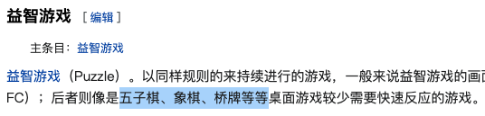

# 人群定向

最近负责广告人群定向\(兴趣/行业\)体系的重构，写本篇记录一下工作。

## 体系框架

大部分开发同学都是等产品将标签体系框架定下来，然后进行人群定向的工作。这是一个很不健康的做法，一定要参与体系框架的制定，甚至50%以上的时间都要在这一部分。如果体系制定的不好，会造成两个后果：

1. 开发同学疯狂加班，但效果就是不好，累死三军
2. 广告主使用困惑，此功能性价比极低不好用，慢慢不用了

  

这里举个例子说明一下，上面两张图是巨量的兴趣定向，其游戏类下三级有益智类游戏、卡牌类游戏、棋类游戏等等。

1. 可以看到，基于当前体系类别的界定，同级下卡牌类和棋类这两类别人群量级差了10倍以上，算法同学都知道，分布差的话，需要付出多大的努力才能效果。简单理解，如果同级下有两类，两类分布比为999:1。那还用什么算法，来1000个人，我都归到第一类，准确率99.9%！（当然，这只是举个例子，实际任务是个多标签任务，而非多分类）
2. 对于广告主来说，一个卡牌类广告主，150万不够我的广告跑量，我需要再选几个标签以补充人群数量，我跑量的同时也想要效果啊，所以，除了卡牌类这个标签，剩下的哪个和我最相关呢？我只能根据大多数人的理解或咨询运营销售同学。按大多数人理解\(百科\)，卡牌、棋类是属于益智类的，我选择益智类游戏这个标签扩人群？不对，他们在平台上是同级并列的，不是父子类关系，定体系的时候有意将其区分开，可能益智游戏指的专门给小朋友开发智力的游戏？所以我到底选啥？...

所以，一个好的体系十分重要，用简单的模型就可以获得很好的效果；广告主使用起来也不会有困惑，功能好用了会养成使用习惯，用的越来越多。调研了几个重点竞品，可以明显看出兴趣体系框架是由产品同学定的，所以或多或少的会掺杂一些主观因素。当然一个好的产品能让体系较为合理，但总有需要调整的地方，具体怎么调，就需要用数据说话了，所以我们先制定了兴趣体系框架制定原则。

<table>
  <thead>
    <tr>
      <th style="text-align:center">&#x539F;&#x5219;</th>
      <th style="text-align:center">&#x89E3;&#x91CA;</th>
    </tr>
  </thead>
  <tbody>
    <tr>
      <td style="text-align:center">&#x9002;&#x7528;</td>
      <td style="text-align:center">
        
&#x529F;&#x80FD;&#x4F5C;&#x51FA;&#x6765;&#x662F;&#x7ED9;&#x5E7F;&#x544A;&#x4E3B;&#x670D;&#x52A1;&#x7684;&#xFF0C;&#x8981;&#x8D34;&#x5408;&#x5E7F;&#x544A;&#x4E3B;&#x4F7F;&#x7528;&#x4E60;&#x60EF;

        
&#x6240;&#x4EE5;&#x80FD;&#x5BF9;&#x6807;&#x7ADE;&#x54C1;&#x7684;&#x5C3D;&#x91CF;&#x5BF9;&#x6807;&#x7ADE;&#x54C1;&#xFF0C;&#x65B9;&#x4FBF;&#x5E7F;&#x544A;&#x4E3B;&#x591A;&#x5E73;&#x53F0;&#x8FC1;&#x79FB;

      </td>
    </tr>
    <tr>
      <td style="text-align:center">&#x4EF7;&#x503C;</td>
      <td style="text-align:center">&#x56E0;&#x4E3A;&#x662F;&#x7528;&#x505A;&#x5E7F;&#x544A;&#x4EBA;&#x7FA4;&#x5B9A;&#x5411;&#xFF0C;&#x5174;&#x8DA3;&#x7C7B;&#x522B;&#x8981;&#x6709;&#x5546;&#x4E1A;&#x4EF7;&#x503C;&#xFF0C;&#x4E0D;&#x9700;&#x8981;&#x505A;UGC&#x5168;&#x90E8;&#x5174;&#x8DA3;</td>
    </tr>
    <tr>
      <td style="text-align:center">&#x4F4E;&#x91CD;&#x5408;</td>
      <td style="text-align:center">&#x6807;&#x7B7E;&#x6807;&#x7B7E;&#x610F;&#x4E49;&#x660E;&#x786E;&#xFF0C;&#x4E14;&#x8981;&#x4EBA;&#x7FA4;&#x91CD;&#x5408;&#x4F4E;&#xFF0C;&#x4E24;&#x7C7B;&#x522B;A&#x548C;B&#xFF0C;&#x6700;&#x7EC8;A&#x2229;B&#x4EBA;&#x7FA4;&#x5360;A&#x7C7B;&#x548C;B&#x7C7B;&#x7684;&#x5404;&#x81EA;30%&#x4EE5;&#x4E0B;&#x3002;&#x521A;&#x5F00;&#x59CB;&#x6CA1;&#x8BA1;&#x7B97;&#x51FA;&#x4EBA;&#x7FA4;&#x65F6;&#xFF0C;&#x53EF;&#x4EE5;&#x8BA1;&#x7B97;&#x5173;&#x952E;&#x8BCD;&#x91CD;&#x5408;&#x4F4E;&#x4E8E;30%</td>
    </tr>
    <tr>
      <td style="text-align:center">&#x8986;&#x76D6;&#x5168;</td>
      <td style="text-align:center">&#x6BCF;&#x4E2A;&#x5E7F;&#x544A;&#x4E3B;&#x81F3;&#x5C11;&#x80FD;&#x627E;&#x5230;&#x4E00;&#x4E2A;&#x76F8;&#x5173;&#x5174;&#x8DA3;&#x7C7B;&#x522B;&#x6807;&#x7B7E;</td>
    </tr>
    <tr>
      <td style="text-align:center">&#x4ECE;&#x5C5E;&#x5408;&#x7406;</td>
      <td style="text-align:center">
        
&#x591A;&#x7EA7;&#x5212;&#x5206;&#x57FA;&#x4E8E;&#x7528;&#x6237;&#x7684;&#x81EA;&#x7136;&#x7406;&#x89E3;&#xFF0C;&#x901A;&#x8FC7;A&#x7C7B;&#x522B;(&#x5B50;&#x7C7B;)&#x8BCD;&#x548C;

        
B&#x7C7B;&#x522B;(&#x7236;&#x7C7B;)&#x8BCD;&#x7684;&#x6761;&#x4EF6;&#x6982;&#x7387;p(A|B)*p(B|A)&#x8BA1;&#x7B97;

      </td>
    </tr>
    <tr>
      <td style="text-align:center">&#x91CF;&#x7EA7;&#x9002;&#x4E2D;</td>
      <td style="text-align:center">
        
&#x82E5;&#x91CF;&#x7EA7;&#x8FC7;&#x5927;&#xFF0C;&#x5C06;&#x5176;&#x5347;&#x7EA7;&#x6216;&#x8FDB;&#x884C;&#x7EC6;&#x7C92;&#x5EA6;&#x62C6;&#x5206;&#xFF0C;

        
&#x82E5;&#x7C7B;&#x522B;&#x4E0B;&#x91CF;&#x7EA7;&#x8FC7;&#x5C0F;&#x6216;&#x53EF;&#x62C6;&#x5206;&#x7C7B;&#x522B;&#x8FC7;&#x5C11;&#xFF0C;&#x8FDB;&#x884C;&#x964D;&#x7EA7;

      </td>
    </tr>
  </tbody>
</table>原则定下来后，再往下做就比较简单了，但是还有一些小trick，比如教育培训-兴趣培训-绘画、书法、陶艺、乐器、表演、跆拳道、游泳、烹饪、编程...分类过细人群会很少不利于投放，全都合并到教育培训-兴趣培训级别人群又会过多。

广点通的做法是兴趣培训下只有一个三级叫科技与编程，但是兴趣培训一千三百多万人，唯一的科技与编程三级有九百万人，其他的兴趣隐式的放在了兴趣培训二级下；巨量的做法\(如下图\)是合并成一个三级，但是有另外维度的切分，即下图素质教育，涵盖兴趣培训，但又限定在针对中小学生。

  

我们的做法借鉴了巨量，在兴趣培训二级下设置艺术类、技能类两个三级，若某一类人群依旧过多，可以拆分成四级\(体育与运动、声乐与乐器、科技与编程、美术/书法与手工艺、舞蹈与表演\)，为自己留后路，**做到大类尽量不调整，调整的话通过增加子类别微调。**

当然这种主观的体系设置，每个人理解总会有偏差，比如基础教育，有人理解为学前教育，有人理解为中小学教育，有人理解为面向全年龄的各种科普...所以像上图巨量的示例展示关键词是十分必要的。但巨量采用了比较naive的方法，我简单看了一下其展示的相关词，仅是分词了广告内容作为相关词，会造成不同类别相关词重合大，意义模糊，比如上图中的培训班、暑假班。我们的做法是采用内容定向数据结合爬取的竞品关键词、微博高频词、其他专业性信息源的词，每个类别人工标注了20至50个具有区分度词帮助广告主理解释义，也可用于词匹配增加样本等。

## 数据处理

### 样本采样

#### 正样本

因为我们的最终目的，是想对应类别的广告主的广告曝光给用户后，用户会进行互动或导流转化等。所以，最理想的正样本为与此类别广告进行过互动或导流转化人群。然而这类用户非常非常少，这也是广告的难点之一。所以我们做了以下的扩充操作：

<table>
  <thead>
    <tr>
      <th style="text-align:center">&#x9014;&#x5F84;</th>
      <th style="text-align:left">&#x8BF4;&#x660E;</th>
    </tr>
  </thead>
  <tbody>
    <tr>
      <td style="text-align:center">&#x5B98;&#x65B9;&#x53F7;</td>
      <td style="text-align:left">
        
&#x901A;&#x8FC7;&#x4E00;&#x4E9B;&#x6CA1;&#x6709;&#x6295;&#x8FC7;&#x5E7F;&#x544A;&#x4F46;&#x7C7B;&#x522B;&#x660E;&#x786E;&#x7684;&#x5B98;&#x65B9;&#x8D26;&#x53F7;&#xFF0C;&#x5176;&#x7C89;&#x4E1D;&#x4F5C;&#x4E3A;&#x6F5C;&#x5728;&#x6B63;&#x6837;&#x672C;&#x96C6;

        
eg.&#x5047;&#x8BBE;&#x675C;&#x857E;&#x65AF;&#x6CA1;&#x6295;&#x5E7F;&#x544A;&#xFF0C;&#x4F46;&#x5176;&#x4E3A;&#x65E5;&#x7528;&#x767E;&#x8D27;&#x7C7B;&#x522B;&#xFF0C;&#x5176;&#x7C89;&#x4E1D;&#x4E3A;&#x6F5C;&#x5728;&#x6B63;&#x6837;&#x672C;

      </td>
    </tr>
    <tr>
      <td style="text-align:center">&#x5173;&#x952E;&#x8BCD;</td>
      <td style="text-align:left">
        
&#x901A;&#x8FC7;&#x5404;&#x7C7B;&#x522B;&#x6709;&#x533A;&#x5206;&#x5EA6;&#x7684;&#x5173;&#x952E;&#x8BCD;&#x4E0E;&#x7C7B;&#x522B;&#x6620;&#x5C04;&#xFF0C;&#x8FDB;&#x884C;&#x8BCD;&#x5339;&#x914D;&#x7B49;&#x589E;&#x52A0;&#x6F5C;&#x5728;&#x6B63;&#x6837;&#x672C;

        
eg.&#x8FD9;&#x79CD;&#x505A;&#x6CD5;&#x6BD4;&#x8F83;&#x5E38;&#x89C4;&#xFF0C;&#x5C31;&#x4E0D;&#x4E3E;&#x4F8B;&#x4E86;

      </td>
    </tr>
    <tr>
      <td style="text-align:center">&#x76F4;&#x64AD;&#x95F4;</td>
      <td style="text-align:left">
        
&#x901A;&#x8FC7;&#x76F4;&#x64AD;&#x95F4;&#x7684;&#x76F4;&#x64AD;&#x5185;&#x5BB9;&#xFF0C;&#x786E;&#x5B9A;&#x76F4;&#x64AD;&#x95F4;&#x4E0E;&#x7C7B;&#x522B;&#x5173;&#x7CFB;&#xFF0C;&#x5176;&#x89C2;&#x4F17;&#x4F5C;&#x4E3A;&#x6F5C;&#x5728;&#x6B63;&#x6837;&#x672C;

        
eg.&#x8003;&#x7814;&#x6570;&#x5B66;&#x8F85;&#x5BFC;&#x76F4;&#x64AD;&#x95F4;&#x7684;&#x89C2;&#x4F17;&#x4F5C;&#x4E3A;&#x8003;&#x7814;&#x57F9;&#x8BAD;&#x7684;&#x6F5C;&#x5728;&#x6B63;&#x6837;&#x672C;

      </td>
    </tr>
    <tr>
      <td style="text-align:center">LBS</td>
      <td style="text-align:left">
        
&#x901A;&#x8FC7;LBS&#x7535;&#x5B50;&#x56F4;&#x680F;&#x5B9A;&#x4F4D;&#x7279;&#x6B8A;&#x4F4D;&#x7F6E;&#x4E0A;&#x7EBF;&#x7684;&#x8D26;&#x53F7;&#x4F5C;&#x4E3A;&#x6F5C;&#x5728;&#x6B63;&#x6837;&#x672C;&#x96C6;

        
eg.&#x4E07;&#x901A;&#x6C7D;&#x4FEE;&#x5B66;&#x6821;&#x56F4;&#x680F;&#x5185;&#x591A;&#x6B21;&#x4E0A;&#x7EBF;&#x7684;&#x7528;&#x6237;&#x4F5C;&#x4E3A;&#x6C7D;&#x4FEE;&#x57F9;&#x8BAD;&#x6F5C;&#x5728;&#x6B63;&#x6837;&#x672C;

      </td>
    </tr>
    <tr>
      <td style="text-align:center">APP</td>
      <td style="text-align:left">
        
&#x901A;&#x8FC7;&#x7528;&#x6237;&#x624B;&#x673A;&#x4E0A;&#x7684;APP&#x5217;&#x8868;&#x786E;&#x5B9A;&#x8D26;&#x6237;&#x4E3A;&#x67D0;&#x7C7B;&#x522B;&#x6F5C;&#x5728;&#x6B63;&#x6837;&#x672C;

        
eg.&#x5B89;&#x88C5;&#x4E86;&#x6C7D;&#x8F66;&#x8FDD;&#x7AE0;&#x67E5;&#x8BE2;APP&#x7684;&#x4F5C;&#x4E3A;&#x6C7D;&#x8F66;&#x4FDD;&#x517B;&#x7684;&#x6F5C;&#x5728;&#x6B63;&#x6837;&#x672C;

      </td>
    </tr>
  </tbody>
</table>#### 负样本

### 特征处理

采用的特征可分为四大类：

* 用户基础画像：性别、年龄、地域、手机型号、登陆频次、在线时长...
* 用户社交行为：关注、转发、评论、点赞、收藏...
* 广告反馈信息：各类别广告不同场景\(广告位置...\)下此用户反馈\(关转评赞点击转化...\)
* 自然热门数据：用户对频道标签排序、不同频道下时长/行为、原创度、图文...

由于也是采用的Embedding&MLP框架，所以先将特征Embedding生成向量。这里其他三类特征都比较好处理，重点说一下用户社交行为。用户社交行为是广告/推荐系统中极有价值的特征，尤其在微博这样的偏社交的平台下。难点也显而易见，用户社交行为数量巨大，如何既兼顾效率又能产出好的效果。常规的套路分为两种：

* 将社交行为进行one-hot，直接使用sparse向量，或采用PCA等降维方法产出dense的向量
* 利用序列或图谱等信息进行Embedding，直接生成dense的向量

之前的方法采用了第一种，比如粉丝量大于10万的账号有100万个，则建立一个100万维的one hot向量，当前用户关注了哪些粉丝大于10万的账号，其对应维度值为1，否则为0，同理转评赞也这样构建，再进行多类型行为向量的拼接进行使用。或着采用PCA进行降维后再拼接，或拼接后降维进行使用。方案可行，但由于向量过于稀疏，且丢失了大量信息，比如时序信息\(先关注后关注等\)还有只是考虑了部分账号\(如果全网20亿账号，应当建立20亿维度\)，效果比较一般。本次重构是想进行提升，所以直接舍弃第一种，采用了第二种利用序列或图谱等信息直接进行Embedding生成dense的向量。

现在有很多比较fancy的文章，但实际上能参考的不多，工业界数据过于巨大，十亿级的用户，千亿级的关注关系，转评赞行为更甚且增量巨大。所以我们结合工业界的几篇论文，根据自身特点进行了用户社交行为的Embedding。

让我们来分析一下现状。首先，不论什么方法，不太可能也没有必要使用用户全部历史社交行为数据，一个是计算成本过高，其次是不论男女都善变，兴趣会随着时间变化。--- EGES, Alibaba。其次，我们有关转评赞\(还有收藏等等\)，至少四种维度的关系，是异构的。

我们先设想一个比较完美的特征 Embedding 分配方案，如果它存在，应该是这个样子的：对于高频出现的特征，能够分配给它较长的 Embedding 大小，使其能更充分地编码和表达信息。而对于低频的特征，则希望分配较短的 Embedding，因为对于低频特征，它在训练数据中出现次数少，如果分配了较长的 Embedding，更容易出现过拟合现象，影响模型泛化性能。而对于那些极低频的特征，基本学不了什么知识，反而会带来各种噪音，那么我们可以不分配或者让它们共享一个公有 Embedding 即可。

## 算法模型

## 相关任务

### 冷启动

对于冷启动问题，即，新用户，身上无任何标签，但我们也要通过人群定向给他曝光广告。给他打什么标签？曝光什么广告？这里我们基于模拟退火思想，制定了一系列冷启动解决方案。

思路简单来说即先试探性给用户打上兴趣标签，根据其对相应UGC内容和广告的反馈，调节之前的兴趣标签。所以核心点就是两个: 1、试探策略怎样制定；2、反馈调节怎样制定。

#### 试探策略

#### 反馈调节

### 指标监控

如何评价人群定向\(兴趣/行业\)做的好坏，也是一个值得探索的问题，有很多trick的点。

