# 人群定向

最近负责广告人群定向\(兴趣/行业\)体系的重构，写本篇记录一下工作。人群兴趣标签可以说是用户画像中最重要的一环，既可直接商业化又能作为基础特征数据输入后续算法，但用于商业化的人群兴趣标签和UGC\(用户原创内容\)标签的差别相当大\(商业化的多为和广告主行业相关的标签，且正样本多采用广告计划导流人群等作为样本\)，很值得去深入探讨和挖掘。

## 体系框架

大部分开发同学都是等产品将标签体系框架定下来，然后进行人群定向的工作。这是一个很不健康的做法，一定要参与体系框架的制定，甚至50%以上的时间都要在这一部分。如果体系制定的不好，会造成两个后果：

1. 开发同学疯狂加班，但效果就是不好，累死三军
2. 广告主使用困惑，此功能性价比极低不好用，慢慢不用了

 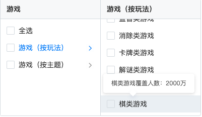 

这里举个例子说明一下，上面两张图是巨量的兴趣定向，其游戏类下三级有益智类游戏、卡牌类游戏、棋类游戏等等。

1. 可以看到，基于当前体系类别的界定，同级下卡牌类和棋类这两类别人群量级差了10倍以上，分布不是很好看。上面的例子只是其中的一个，有大量同级下不同标签人群量级差别大的情况。首先我们来讨论，这是不是个问题？如果同级下各标签区分明确，那完全不是问题，因为实际情况就是这样，按玩法维度，卡牌就是比棋类小众，喜欢下棋的人就是比玩卡牌的人多。但问题在于这里还有一个益智类，让这三个类的界限很模糊，量级差别大就很成问题了。
2. 对于广告主来说，一个卡牌类广告主，150万不够我的广告跑量，我需要再选几个标签以补充人群数量，但我跑量的同时也想保效果，所以除了卡牌类这个标签，剩下的哪个和我最相关呢？按大多数人理解\(百科\)，卡牌、棋类是属于益智类的，我选择益智类游戏这个标签扩人群？不对，他们在平台上是同级并列的，不是父子类关系，定体系的时候有意将其区分开，可能益智游戏指的专门给小朋友开发智力的游戏？我到底该选啥？


综上，一个好的体系十分重要。那什么算是好的合理的体系呢？就是符合大众认知即可，概括来说两点：**1、父子类高关联；2、同级区分明显**。我基于图谱构建经验制定了指标：

* 父子类高关联： $$p(A|B)*p(B|A)$$ ，其中， $$A$$ 为父类 $$B$$ 为子类，乘积越高关联越高
* 同级区分明显： $$A\cap B$$ 占同级标签 $$A$$ 和 $$B$$ 各自的30%以下

指标定下来后，再往下做就比较简单了，但是还有一些小trick，分类过细人群会很少不利于投放，合并至上一级别又会过多。广点通的做法\(下图左\)是兴趣培训下只有一个三级叫科技与编程，但是兴趣培训一千三百多万人，唯一的科技与编程三级有九百万人，其他的兴趣隐式的放在了兴趣培训二级下\(不推荐这种一个父类下只有一个子类的情况\)；巨量的做法是合并成一个三级，但是有另外维度的切分，即\(下图右\)素质教育，涵盖兴趣培训，但又限定在针对中小学生。

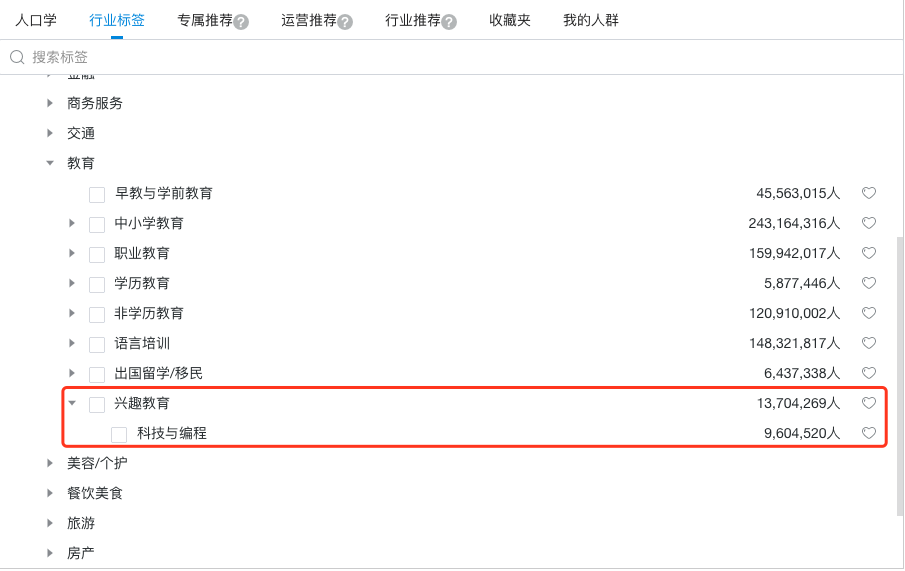  

我们的做法借鉴了巨量，在兴趣培训二级下设置艺术类、技能类两个三级，若某一类人群依旧过多，可以拆分成四级\(体育与运动、声乐与乐器、美术与书法、花艺与手工、舞蹈与表演等\)，为自己留后路，做到**大类不调整，调整通过增删子类别微调**。

再有就是要**契合广告**，像上图两家的中小学教育\(K12\)都按教育年级划分小学、初中、高中，符合人们认知。但实际各广告主投的广告划分多为3-12岁\(启蒙\)，小学至初二\(小升初\)，初三至高二\(中高考\)。当然按年级划分比较符合自然认知，但按小学至初二，初三至高二划分，可以方便我们基于广告计划做指标监控和人群优化。

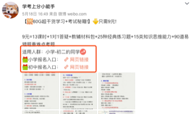 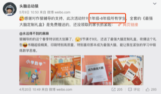 

 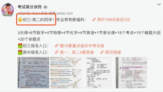 

再让我们回到游戏标签，对于商业标签来说最最重要的一个原则：**听金主的**。下图是百科的分类，可以代表一般人认知了。巨量在此基础上加了消除、卡牌、解谜、跑酷、棋类，可能是这几个类有大的广告主来，故而又开发出这几类。所以用于广告的兴趣标签画像体系，合理只是基础原则，根本还是给广告主服务。

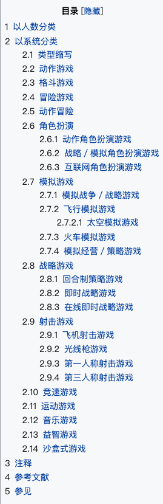

当然再合理的体系设置，每个人理解总会有偏差，所以展示标签的关键词是十分必要的。在这方面走在前面的是巨量，将对应标签的广告的分词作为关键词，但可能还未进行优化，现在不同标签关键词重合有些多，但是一个很好的功能。我们是通过人工筛选部分词汇，作为标签关键词用来给标签释义\(这部分词也作为文本匹配等的词库，虽然繁杂但一举多得，标注一小时，节省调参一整天，有多人工就有多智能\)。

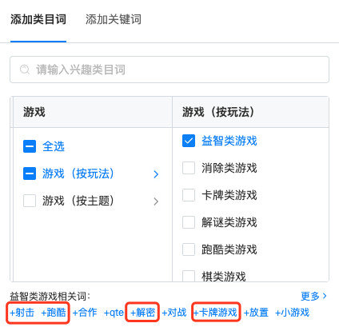

## 人群挖掘

### 算法模型

人群画像各公司多是基于规则挖掘，我们也不例外，这里用算法模型仅是完善解决两个问题：

* 规则挖掘出人数过多的标签类别：进行排序取部分人群，保广告投放效果
* 规则挖掘出人群过少的标签类别：进行扩量增加人数，以供广告进行跑量

基于上述目标，有两种思路可选：

* 这是一个标准多标签问题，采用多标签方法
* 当成相似用户挖掘来做，使用Lookalike进行相似用户计算

#### 多标签

_机器学习：_lightGBM例子

```python
##################################################################
# multiple
##################################################################
from sklearn.multiclass import OneVsRestClassifier
from lightgbm import LGBMClassifier
import numpy as np

train_data = np.random.rand(500, 100)  # 500 entities, each contains 100 features
train_label = np.random.randint(2, size=(500,20))  # 20 targets
val_data = np.random.rand(100, 100)

clf_multilabel = OneVsRestClassifier(LGBMClassifier())
clf_multilabel.fit(train_data,train_label)
val_pred = clf_multilabel.predict(val_data)

##################################################################
# single
##################################################################
from sklearn.datasets import make_classification
from lightgbm import LGBMClassifier

X, y = make_classification(n_samples=1000, n_features=10, n_informative=5, n_redundant=5, random_state=1)
model = LGBMClassifier()
model.fit(X, y)

row = [[2.56999479, -0.13019997, 3.16075093, -4.35936352, -1.61271951, -1.39352057, -2.48924933, -1.93094078, 3.26130366, 2.05692145]]
yhat = model.predict(row)
```

_深度学习：_用了任务的思想，尝试了两种结构level1-3指的兴趣标签1-3级类别，1级:教育、游戏...；2级：教育-K12教育、教育-职业教育...；3级：教育-职业教育-财经考试、教育-职业教育-司法考试...

   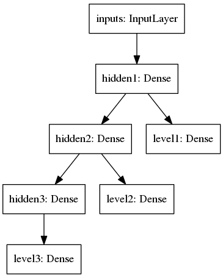   __ 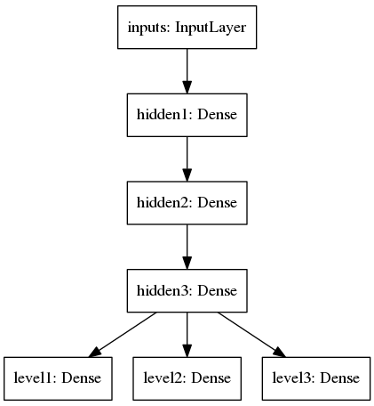 

```python
import tensorflow.python.util.deprecation as deprecation
deprecation._PRINT_DEPRECATION_WARNINGS = False
import numpy as np
from keras.utils import plot_model
from keras.models import Model, Sequential
from keras.layers import Dense, Input, Dropout, Concatenate, Embedding

label1_dim=5
label2_dim=30
label3_dim=100
feature_dim=1000
sample_num=10000

inputs = Input(shape=(feature_dim,), name="inputs")
hidden1 = Dense(units=1000, activation='relu', name="hidden1")(inputs)
hidden2 = Dense(units=500, activation='relu', name="hidden2")(hidden1)
hidden3 = Dense(units=100, activation='relu', name="hidden3")(hidden2)

level1=Dense(label1_dim, activation='sigmoid',name = "level1")(hidden1)
level2=Dense(label2_dim, activation='sigmoid',name = "level2")(hidden2)
level3=Dense(label3_dim, activation='sigmoid',name = "level3")(hidden3)
#level1=Dense(label1_dim, activation='sigmoid',name = "level1")(hidden3)
#level2=Dense(label2_dim, activation='sigmoid',name = "level2")(hidden3)
#level3=Dense(label3_dim, activation='sigmoid',name = "level3")(hidden3)

model= Model(inputs=[inputs], outputs=[level1,level2,level3], name='multiLabelTaskModel')
#model.summary()
model.compile(optimizer='adam',
              loss={'level1': 'binary_crossentropy', 'level2': 'binary_crossentropy', 'level3': 'binary_crossentropy'},
              loss_weights={'level1':3, 'level2': 2, 'level3':1},
              metrics=["accuracy"])
#plot_model(model, to_file="model.png")

train_data = np.random.rand(sample_num, feature_dim)
train_level1 = np.random.randint(2, size=(sample_num,label1_dim))
train_level2 = np.random.randint(2, size=(sample_num,label2_dim))
train_level3 = np.random.randint(2, size=(sample_num,label3_dim))

multiLabelTaskModel = model.fit(train_data, [train_level1,train_level2,train_level3], batch_size=64, epochs=5)
```

#### Lookalike

Lookalike我就不放示例代码了，微信看一看团队的RALM就挺优秀，大家可以进行参考



### 特征工程

论文层出不穷，新的深度学习模型，知识图谱应用...无非是在探寻如何将一些我们认为是强相关的特征加入进去或者模型自己能学到哪些是强相关的特征，学习到更好的特征到类别的映射函数，比如加attention是为了像弹钢琴一样有轻有重抓重点；用RNN为了引入时序特征；将图片、文字、音频映射成向量为了引入多模态信息...个人理解，不管模型多么fancy，其实都是为特征服务的，特征工程做得好，不是很复杂的模型也可以做出很好的效果。

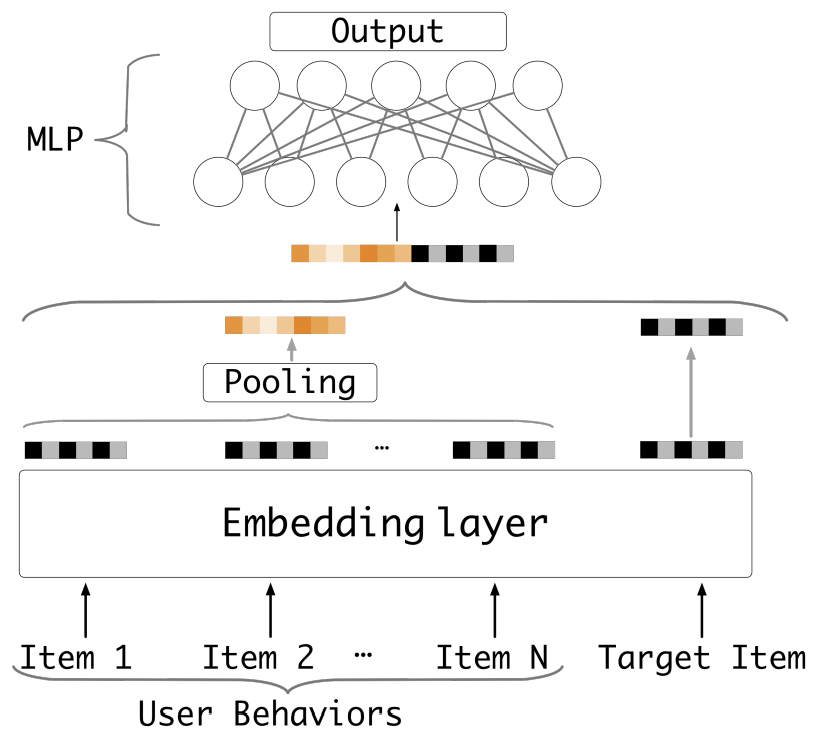

由于也是采用的类Embedding&MLP框架，所以先将特征Embedding生成向量，再输入进模型，模型可以是经典机器学习模型，也可能是深度学习模型。所以我们先想办法把特征搞成向量。

> 我们先设想一个比较完美的特征 Embedding 分配方案，如果它存在，应该是这个样子的：对于高频出现的特征，能够分配给它较长的 Embedding 大小，使其能更充分地编码和表达信息。而对于低频的特征，则希望分配较短的 Embedding，因为对于低频特征，它在训练数据中出现次数少，如果分配了较长的 Embedding，更容易出现过拟合现象，影响模型泛化性能。而对于那些极低频的特征，基本学不了什么知识，反而会带来各种噪音，那么我们可以不分配或者让它们共享一个公有 Embedding 即可。 ----  张俊林

我们采用的特征可大致分为四大类：

* 用户基础画像：性别、年龄、地域、手机型号、登陆频次、在线时长...
* 用户社交行为：关注、转发、评论、点赞、收藏...
* 广告反馈信息：各类别广告不同场景\(广告位置...\)下此用户反馈\(关转评赞点击转化...\)
* 自然热门数据：用户对不同类别UGC反馈、不同频道下时长/行为、原创度、图文...

这里其他三类特征都比较好处理，重点说一下用户社交行为。用户社交行为是广告/推荐系统中极有价值的特征，尤其在微博这样的偏社交的平台下。难点也显而易见，用户社交行为数量巨大。如何既兼顾效率又能产出好的效果，常规的套路分为两种：

* 将社交行为进行one-hot，直接使用sparse向量，或采用PCA等降维方法产出dense的向量
* 利用序列或图谱等信息进行Embedding，直接生成dense的向量

第一种one-hot简单粗暴，比如粉丝量大于10万的账号有100万个，则建立一个100万维的向量，当前用户关注了哪些账号，其对应维度值为1，否则为0，同理转评赞也这样构建，再进行多类型行为向量的拼接进行使用。或着采用PCA进行降维后再拼接，或拼接后降维进行使用。但由于向量过于稀疏，且丢失了大量信息，比如时序信息\(去年关注vs昨天关注等\)还有只是考虑了部分账号\(如果全网20亿账号，应当建立20亿维度\)，效果比较一般。本次重构采用了第二种利用序列或图谱等信息直接进行Embedding生成dense的向量。

现在有很多比较fancy的文章，但实际上能参考的不多，工业界数据过于巨大，十亿级的用户，千亿级的关注关系，转评赞行为更甚且增量巨大。所以我们结合工业界的几篇论文，根据自身特点进行了用户社交行为的Embedding。

让我们来分析一下现状：

> _不太可能也没有必要使用用户全部历史社交行为数据，一个是计算成本过高，其次是不论男女都善变，兴趣会随着时间变化。 ---  EGES, Alibaba_

再有我们有关注、转发、评论、点赞\(还有收藏等等\)，至少四种维度的关系，是异构的。


## 相关任务

### 冷启动

对于冷启动问题，新用户身上无任何标签，我们也要给他曝光广告。给他打什么标签？曝光什么广告？这里我们基于模拟退火思想，制定了一系列冷启动解决方案。

> 模拟退火算法来源于固体退火原理，将固体加温至充分高，再让其徐徐冷却，加温时，固体内部粒子随温升变为无序状，内能增大，而徐徐冷却时粒子渐趋有序，在每个温度都达到平衡态，最后在常温时达到基态，内能减为最小。  ----  百度百科

* 若 $$J(Y_{i+1})>=J(Y_i)$$ ，即移动后得到更优解，则总是接受该移动
* 若 $$J(Y_{i+1})<J(Y_{i})$$ ，即移动后的解比当前解要差，则以一定的概率接受移动，而且这个概率随着时间推移逐渐降低（逐渐降低才能趋向稳定）

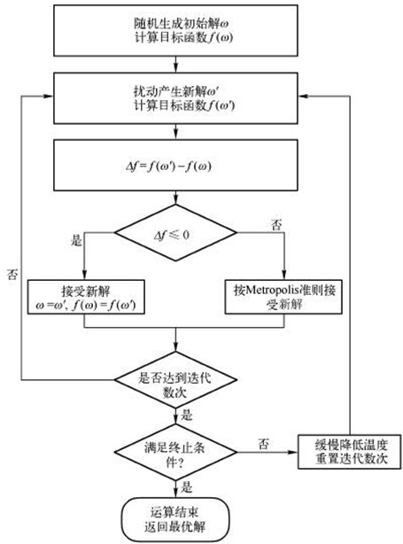

针对我们的场景，先试探性给用户打上兴趣标签，根据其对相应UGC内容和广告的反馈，调节之前的兴趣标签，各标签试探概率随着时间逐渐降低，最终趋于稳定。不同于随机生成初始解，我们预先生成了不同用户类的初始兴趣标签概率解，这里的用户类基于可拿到的维度数据\(地域、手机、上线时间等\)，比如 $$\text{User}\text{(beijing,\ ios, afternoon)}$$ 初始都是 $$[0.6,0.8,0.4]$$ ，其中每维代表购物、游戏、教育。

