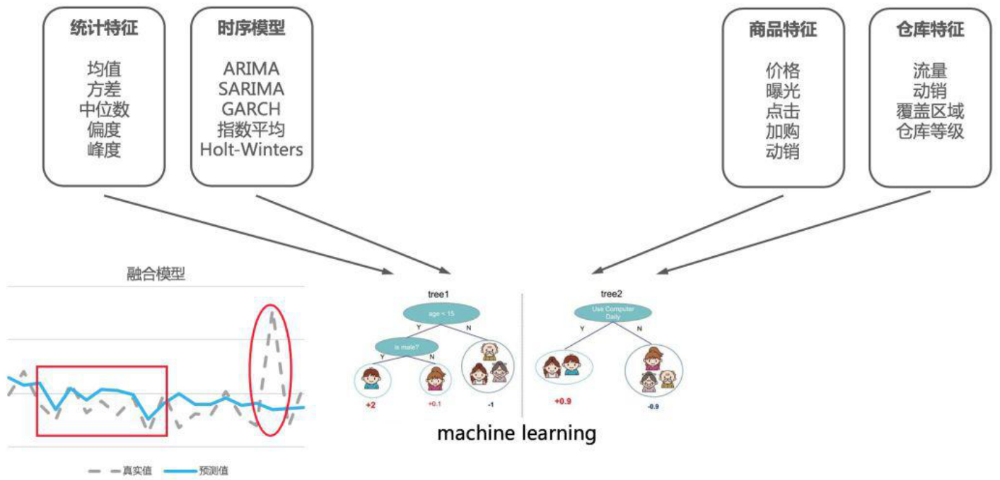
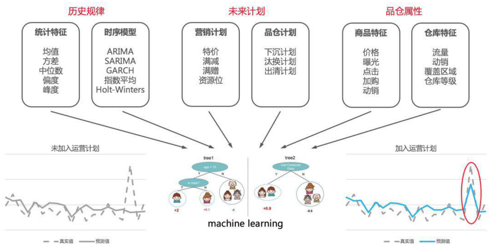

# 机器学习

时序预测是一种典型的回归问题。因此我们可以用机器学习的标准范式和流程进行解决，这里就不再具体详述，主要向大家分享两点在阿里需求预测实际处理中的经验：

1、特征工程。不同于其它机器学习模型，需求预测所构建的特征大多都是从历史的时间序列得到的。因此，如何从历史的时间序列中抽取特征就成为决定模型预测是否准确的关键。通常的时间序列抽取方法有滑动窗口平均值\(比如过去 7 天平均、过去 30 天平 均等\)，序列统计特征\(最大最小值、方差、偏度、峰度等\)。除此之外，我们在实践中还构建了很多高阶的特征，比如利用时间序列模型得到的预测值，还有通过多项式拟合时间序列得到的多项式系数等。除了历史的时间序列特征，我们还抽取了品仓的特征，作为该单品的固定属性。

上面讲到的无论时间序列模型还是机器学习模型，都只使用了历史的数据进行需求的预测。这些数据在通常的时间序列预测问题中已足够。未来所发生的某些数据波动都可以当作模型的“噪声”。但在新零售的场景中，未来的某些数据波动有可能是人为造成的\(比如双 11 大促等\)。如果我们提前知道了未来的运营计划，就可以对这些“噪声”进行较为准确的预测。营销对未来的需求产生作用的手段无非就是“引流”和“降价”两种。前者增加了某个商品的曝光量，而后者主要提升了单品的曝光转化率。这两种手段都会在不同程度上刺激了用户的需求，带来销量的提升。从数据和算法的角度，如果我们知道历史上已经发生了哪些营销活动\(比如去年的双 11 活动\)，并分析出它对营销期间销量的影响，就可以大致估计出未来的营销计划对需求的拉动作用，作出营销期间较准确的需求预测。除了营销的影响，供应链运营的某些行动也会导致销量的波动。比如单品从上级仓转换到下级仓\(下沉\)，品仓的汰换，出清等等。如果我们提前知道了这些运营计划，就能对未来的品仓进行准确的预测。在零售通的需求预测实践中，我们主要通过将营销计划转化为特征的方式来引入到机器学习模型中。

2、模型的个数。我们时序预测的品仓个数多达上万个，每个品仓的销量尺度都大小不一。有的品仓每天的销量多达上万个，有的却不足十个。在这样大尺度的品仓销量下，我们应该构建多少个机器学习模型对数据拟合并预测呢？有两种极端的方法。一种是对每个品仓进行建模。这种方法在实际操作中这是不可取的，一方面它会构建上万个机器学习模型，消耗大量的计算资源，导致模型难以计算和维护；另一方面模型没有用到品与品之间的相似性，无法得到准确的预测结果。另外一种方法是对所有的品仓构建一个统一的模型。这种方法虽然技术上最容易实现，但是它对模型本身的要求变得极高，需要模型在处理不同尺度上的预测都具有很好的表现。我们在实践过程中采取了折衷的方法。首先对品仓按照销量进行分层，然后对不同分层的品仓集合单独建模。一方面，同一层的品仓在销量尺度上大致一直，降低了对模型本身的要求；另一方面又可以用到品仓之间的相似性，提升了模型的泛化能力。同时，少量的模型也易于计算和维护。

