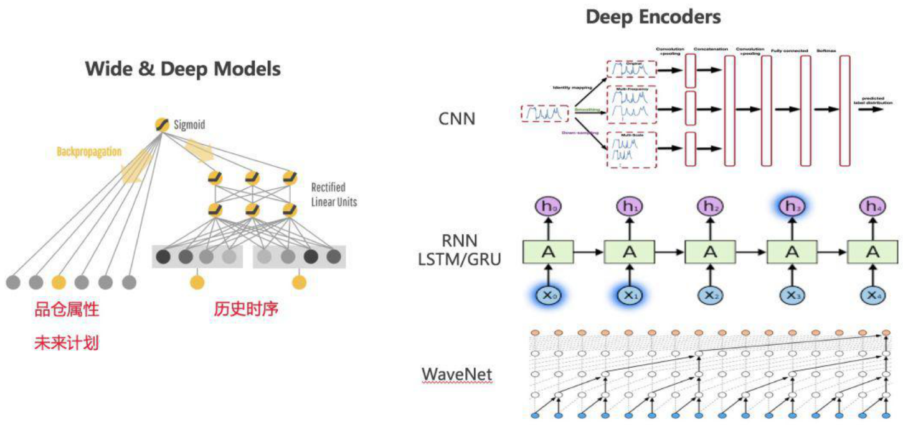

# 深度学习

传统机器学习的一个弊端就是需要人工构建模型的特征，而在某些场景下深度学习可以自动生成显著的特征，端到端的解决模型预测问题。在零售通的需求预测里，我们也做了一部分深度学习的尝试。我们可以对获取到的数据分为两类。一类是历史的销量，流量，转化率等时间序列连续特征，它们可以通过深度学习模型进行特征编码。另一类是营销计划，品仓属性等离散特征，比如活动玩法，仓库所覆盖的城市等。它们由于特征的稀疏性，很难直接通过深度学习模型进行特征编码\(embedding除外\)因此，我们借鉴了推荐搜索中的 Wide & Deep mode，将时间序列特征放在 Deep 部分，强化它们的特征编码能力，同时将离散特征放在 Wide 部分，引入到模型的最后一层中进行预测。

为了更加适应历史时序这种特殊的数据结构，我们修改了 Deep 部分的网络结构，从全连接层变换到CNN、RNN等Deep encoders。这样，处理时序模型的各种深度学习技术\(比如注意力机制等\)都可以引入到该框架中。在某些品仓中，我们的深度学习模型得到了比传统机器学习更加稳定和优异的效果。

## 

