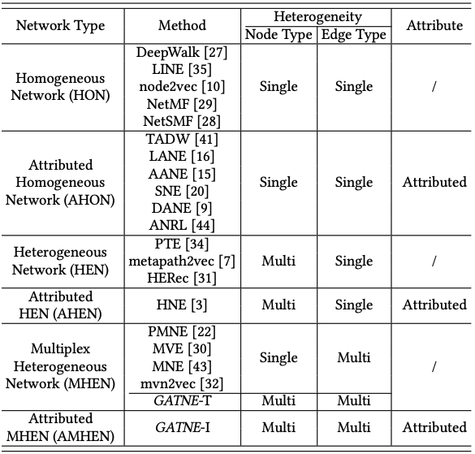

# 真·图神经网络

**现在主流的知识图谱应用基本都是经过图表示学习后，再代入神经网络进行相关任务计算。**是一种串行的方法。所以现在大家的关注点都在如何进行Network Embedding\(Graph Embedding\)上。在探索怎样才能将图信息数字化/量化成 $$n$$ 维向量后，尽可能保证节点、链接和属性信息，即网络局部结构、全局结构、时序信息...

然而将图转化成向量，做到完美也不可避免的会损失掉部分信息，只能做到尽可能的保留重要信息。但是对于不同的场景\(搜索引擎、社交网络、电商网络...\)以及不同的后续任务\(搜索、推荐...\)，特征信息的重要程度是不一致的，但是都采用相同的数字化/量化\(Graph Embedding\)方法，这是不合理的。

上图是[GATNE](https://github.com/THUDM/GATNE)论文列出的针对不同类型网络的不同Embedding方法。比如不同场景相同任务，微信/微博给账号推文章 vs 淘宝/京东给账号推商品，都是账号、物料\(文章/商品\)两种类型Node，可以采用单边 - \[阅读/购买\] 或 多边 - \[\(阅读、转发、点赞...\)/\(浏览、加购物车、购买...\)\]；相同场景不同任务，淘宝给账号返回搜索结果 vs 返回推荐结果。这些任务涉及的一个用户账号都采用同一种方法产生的同一个向量进行计算，如果Embedding方法十分完美，可以保留几乎全部信息，那不会存在问题。

但问题是只要进行数字化/量化\(Graph Embedding\)肯定有信息损失，所以我在这里探究不进行Graph Embedding，直接进行图与神经网络的融合，来解决不同场景下的不同任务。总体思路简单来说，每个节点就是神经网络里的一个神经元，是一个函数 $$f(x)$$ ，而非向量，将 $$f(x)$$ 理解为激活函数，各节点链接相当于非随机的drop-out，整个网络就是一个类深度学习的神经网络。因为不像常规深度学习的网络有一层到深层逐步的顺序计算，有全链接层和输出层，所以只能称为类深度学习的神经网络。总体思路分为三步：

1. 通过已有真实网络学习出各节点的 $$f(x)$$ 
2. 利用学习得到的各节点 $$f(x)$$ 模拟构造真实网络
3. 基于真实网络和模拟构造网络的不同解决相关问题

到这里同学们可能非常困惑，有两个关键问题：

* 怎么学习得到各节点 $$f(x)$$ ？按我的描述，算法又没有定向输出，Loss怎么定？
* 这个到底怎么用，能解决什么问题？

我这里先对优化约束作解释，我们的约束是基于网络性质的启发式：

* **Small-world性质：**平均路径长度 $$\mu_L$$大小和 $$n$$\(网络中节点数\)对数比例相关： $$\mu_L \propto \log\ n$$ 
* **Clustering effect：**如果两个节点有相同邻居，那么这两个节点链接的概率高
* **Scale-free性质\(幂定律分布\)：** 绝大多数节点有很少量的度\(边\)，而小部分节点有很大的度\(边\)。一个节点有 $$k$$ 度的概率： $$f(k) \propto k^{-\gamma}$$ 。log-log图上为一条直线： $$\log f(k) = \log(\alpha k^{-\gamma})=-\gamma \log k\ +\ \log\alpha $$ 

换成易于理解的解释即：

* **Small-world性质：**真实网络的平均路径长度我们是可以计算得到的，我们模拟构造的网络平均路径长度要和真实的一致或接近。
* **Clustering effect：**我们生成模拟网络时，节点 $$a$$ 与全部 $$N-1$$ 个节点\(刨除节点 $$a$$ 自链接\)是否有链接，理论上应该算 $$N-1$$ 个概率后判断应该与哪些相连。我们的候选集

  基于clustering effect性质，不再需要计算全部 $$N-1$$ 个。

* **Scale-free性质\(幂定律分布\)：**幂定律即少量的节点有很多的链接，大量的节点有很少的链接。从两个方面来看\(以社交网络举例\)：1、有10000粉丝的号，粉丝变成10001的概率要比有100粉丝的号，粉丝变成101的概率要大；2、关注了1000个账号的账号，关注第1001个账号的概率要比关注10个账号，再关注第11个的概率要大。

简单解释了优化约束，下面我阐述问题，关于动态网络，我们更关注节点间新增链接及新增节点

