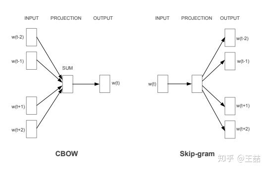
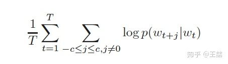
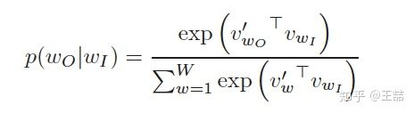
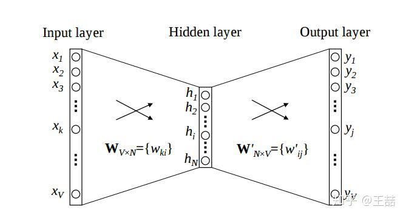
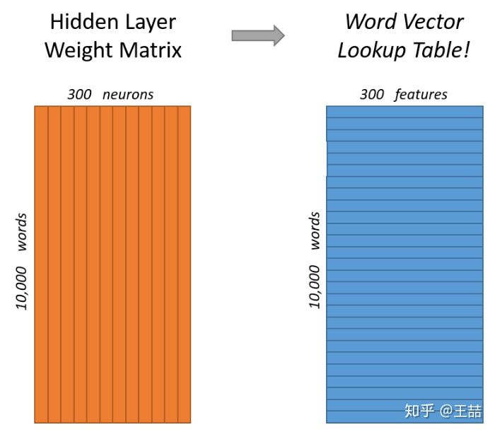
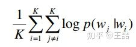
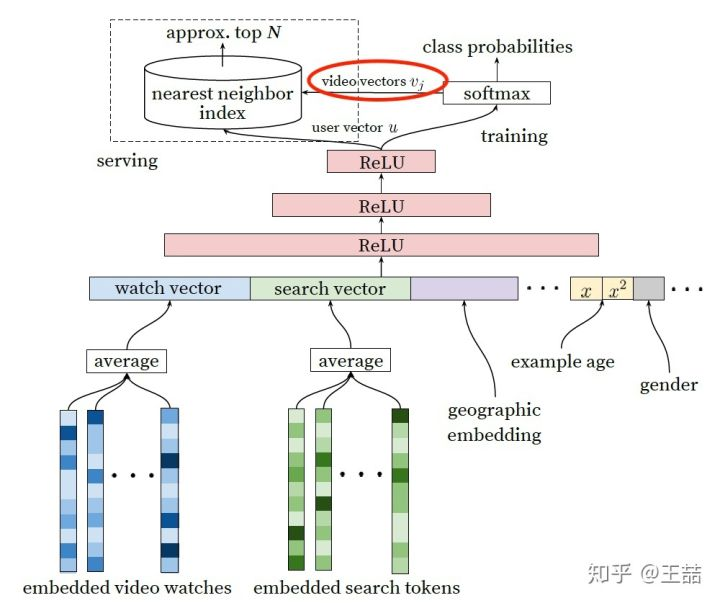

# Embedding

## 什么是embedding？为什么说embedding是深度学习的基本操作？

简单来说，embedding就是用一个低维的向量表示一个物体，可以是一个词，或是一个商品，或是一个电影等等。这个embedding向量的性质是能使距离相近的向量对应的物体有相近的含义，比如 Embedding\(复仇者联盟\)和Embedding\(钢铁侠\)之间的距离就会很接近，但 Embedding\(复仇者联盟\)和Embedding\(乱世佳人\)的距离就会远一些。

除此之外Embedding甚至还具有数学运算的关系，比如Embedding（马德里）-Embedding（西班牙）+Embedding\(法国\)≈Embedding\(巴黎\)

从另外一个空间表达物体，甚至揭示了物体间的潜在关系，上次体会这样神奇的操作还是在学习傅里叶变换的时候，从某种意义上来说，Embedding方法甚至具备了一些本体论的哲学意义。

言归正传，Embedding能够用低维向量对物体进行编码还能保留其含义的特点非常适合深度学习。在传统机器学习模型构建过程中，我们经常使用one hot encoding对离散特征，特别是id类特征进行编码，但由于one hot encoding的维度等于物体的总数，比如阿里的商品one hot encoding的维度就至少是千万量级的。这样的编码方式对于商品来说是极端稀疏的，甚至用multi hot encoding对用户浏览历史的编码也会是一个非常稀疏的向量。而深度学习的特点以及工程方面的原因使其不利于稀疏特征向量的处理（这里希望大家讨论一下为什么?）。因此如果能把物体编码为一个低维稠密向量再喂给DNN，自然是一个高效的基本操作。

## 使embedding空前流行的word2vec

对word的vector表达的研究早已有之，但让embedding方法空前流行，我们还是要归功于google的word2vec。我们简单讲一下word2vec的原理，在NLP的文本向量化章节会详细讲解。

既然我们要训练一个对word的语义表达，那么训练样本显然是一个句子的集合。假设其中一个长度为 $$T$$ 的句子为 $$w_1,w_2,\dots,w_T$$ 。这时我们假定每个词都跟其相邻的词的关系最密切，换句话说每个词都是由相邻的词决定的（CBOW模型的动机），或者每个词都决定了相邻的词（Skip-gram模型的动机）。如下图，CBOW的输入是 $$w_t$$ 周边的词，预测的输出是 $$w_t$$ ，而Skip-gram则反之，经验上讲Skip-gram的效果好一点，所以本文从Skip-gram模型出发讲解模型细节。

那么为了产生模型的正样本，我们选一个长度为2c+1（目标词前后各选c个词）的滑动窗口，从句子左边滑倒右边，每滑一次，窗口中的词就形成了我们的一个正样本。

有了训练样本之后我们就可以着手定义优化目标了，既然每个词 $$w_t$$ 都决定了相邻词 $$w_{t+j}$$ ，基于极大似然，我们希望所有样本的条件概率 $$p(w_{t+j}|w_t)$$ 之积最大，这里我们使用log probability。我们的目标函数有了：

接下来的问题是怎么定义 $$p(w_{t+j}|w_t)$$ ，作为一个多分类问题，最简单最直接的方法当然是直接用softmax函数，我们又希望用向量 $$v_w$$ 表示每个词 $$w$$ ，用词之间的距离 $$v_i^\top v_j$$ 表示语义的接近程度，那么我们的条件概率的定义就可以很直观的写出。

看到上面的条件概率公式，很多同学可能会习惯性的忽略一个事实，就是

我们用 $$w_t$$ 去预测 $$w_{t+j}$$ ，但其实这二者的向量表达并不在一个向量空间内。

就像上面的条件概率公式写的一样， $$v'_w$$ 和 $$v_w$$ 分别是词 $$w$$ 的输出向量表达和输入向量表达。那什么是输入向量表达和输出向量表达呢？我们画一个word2vec的神经网络架构图就明白了。

根据 $$p(w_{t+j}|w_t)$$ 的定义，我们可以把两个vector的乘积再套上一个softmax的形式转换成上面的神经网络架构（需要非常注意的一点事hidden layer的激活函数，大家要思考一下，到底是sigmoid函数还是普通的线性函数，为什么？）。在训练过程中我们就可以通过梯度下降的方式求解模型参数了。那么上文所说的输入向量表达就是input layer到hidden layer的权重矩阵 $$W_{V\times N}$$ ，而输出向量表达就是hidden layer到output layer的权重矩阵 $$W'_{N\times V}$$ 。

那么到底什么是我们通常意义上所说的词向量 $$v_w$$ 呢？

其实就是我们上面所说的输入向量矩阵 $$W_{V\times N}$$ 中每一行对应的权重向量。于是这个权重矩阵自然转换成了word2vec的lookup table。

那么问题也来了，我们能把输出矩阵 $$W'_{N\times V}$$ 的列向量当作word的vector表达吗？大家可以讨论一下。

当然在训练word2vec的过程中还有很多工程技巧，比如用negative sampling或Hierarchical Softmax减少词汇空间过大带来的计算量，对高频词汇进行降采样避免对于这些低信息词汇的无谓计算等。我们在之前的专栏文章中有过讨论，在具体实现的时候最好参考Google的原文[Distributed Representations of Words and Phrases and their Compositionality](http://link.zhihu.com/?target=https%3A//github.com/wzhe06/Reco-papers/tree/master/Famous%2520Machine%2520Learning%2520Papers)

## 从word2vec到item2vec

在word2vec诞生之后，embedding的思想迅速从NLP领域扩散到几乎所有机器学习的领域，我们既然可以对一个序列中的词进行embedding，那自然可以对用户购买序列中的一个商品，用户观看序列中的一个电影进行embedding。而广告、推荐、搜索等领域用户数据的稀疏性几乎必然要求在构建DNN之前对user和item进行embedding后才能进行有效的训练。

具体来讲，如果item存在于一个序列中，item2vec的方法与word2vec没有任何区别。而如果我们摒弃序列中item的空间关系，在原来的目标函数基础上，自然是不存在时间窗口的概念了，取而代之的是item set中两两之间的条件概率。

具体可以参考item2vec的原文 [Item2Vec:Neural Item Embedding for Collaborative Filtering](http://link.zhihu.com/?target=https%3A//github.com/wzhe06/Reco-papers/blob/master/Recommendation/Item2Vec%2520-%2520Neural%2520Item%2520Embedding%2520for%2520Collaborative%2520Filtering.pdf)

但embedding的应用又远不止于此，事实上，由于我们也可以把输出矩阵的列向量当作item embedding，这大大解放了我们可以用复杂网络生成embedding的能力。读过我专栏上一篇文章 [YouTube深度学习推荐系统的十大工程问题](https://zhuanlan.zhihu.com/p/52504407) 的同学肯定知道，YouTube在serve其candidate generation model的时候，只将最后softmax层的输出矩阵的列向量当作item embedding vector，而将softmax之前一层的值当作user embedding vector。在线上serving时不用部署整个模型，而是只存储user vector和item vector，再用最近邻索引进行快速搜索，这无疑是非常实用的embedding工程经验，也证明了我们可以用复杂网络生成user和item的embedding。

## Source



