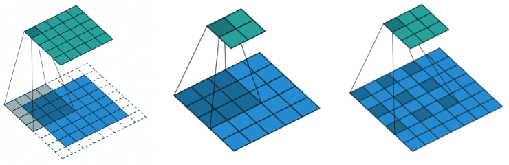
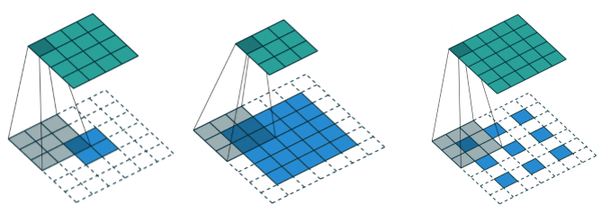
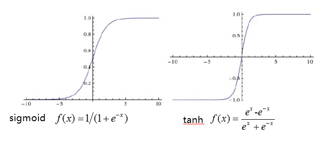
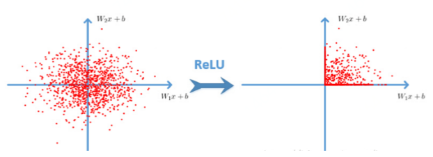
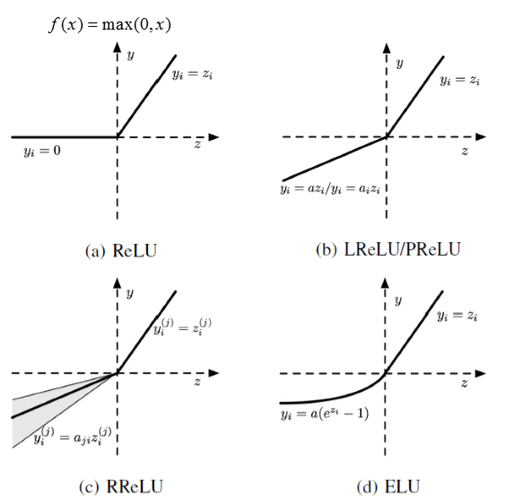
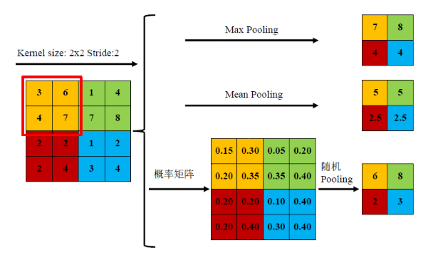
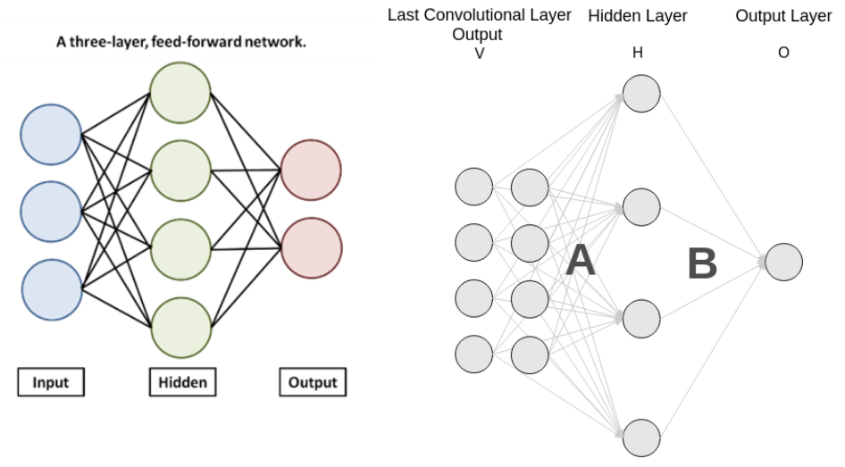

# 基础结构

## 基本组成单元

卷积\(Convolution\)、激活函数\(Active Function\)、池化\(Pooling\)、全连接\(Softmax\)

## 神经网络需要解决的问题

1、特征表达

2、模型优化（过拟合、欠拟合）

#### AlexNet提出的方案 

1、修正线性单元\(Rectified Linear Unit, ReLU\) --&gt; 加速训练和收敛

2、Dropout --&gt; 降低过拟合

3、数据增强 --&gt; 降低过拟合

4、双GPU训练 --&gt; 加快训练速度

## 卷积神经网络 

### 卷积\(Convolution\) 

### 激活函数\(Active Function\) 

模仿人类神经元、非线性变换增强特征的表达能力、同时考虑优化时梯度消失问题 \(轻轻抚摸一个人可能感觉不到，但重击一个人会有明显感觉，激活函数作相似事情，增加特征表达能力\)

### 池化\(Pooling\) 

 降低计算复杂度，增强特征的空间变换不变性

### 全连接\(Softmax\) 

 全连接操作的特点：需要固定维度、参数多，计算量大，占整个网络的参数量、计算量的一半以上

                                    Softmax： $$f(z_j) = \frac{e^{z_j}}{\sum_{k=1}^K e^{z_k} } , \ \ for j= 1,2\dots, K$$ 

### Dropout 

以一定概率丢弃全连接层中的节点，用以对抗过拟合问题

