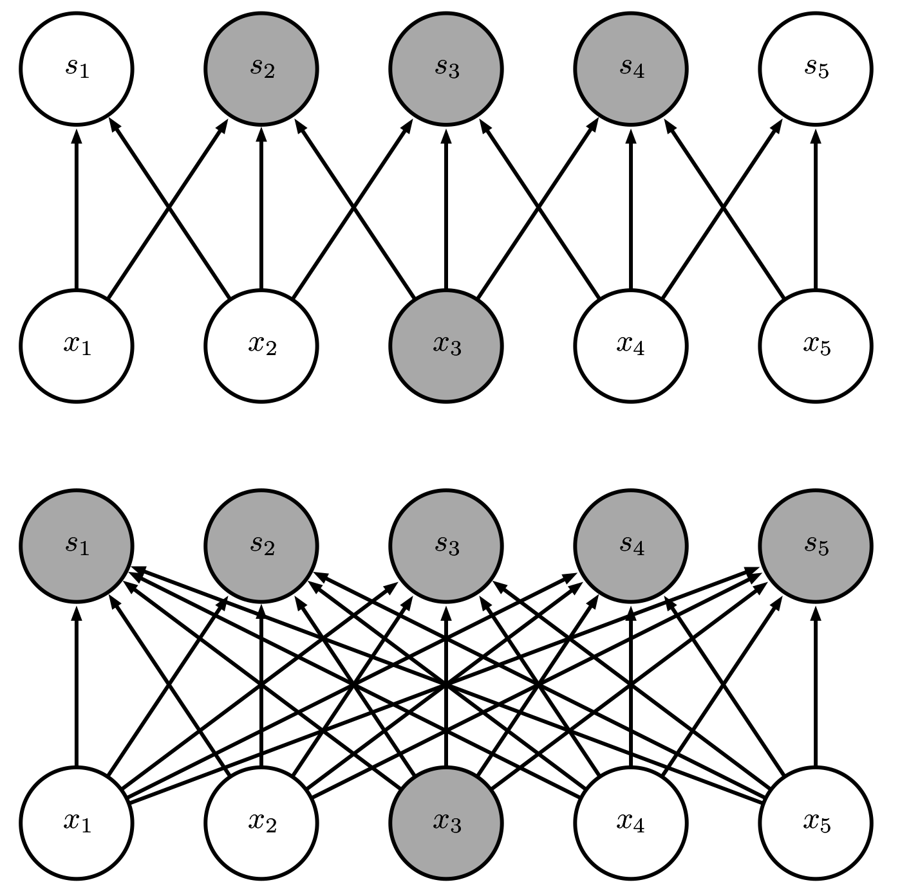
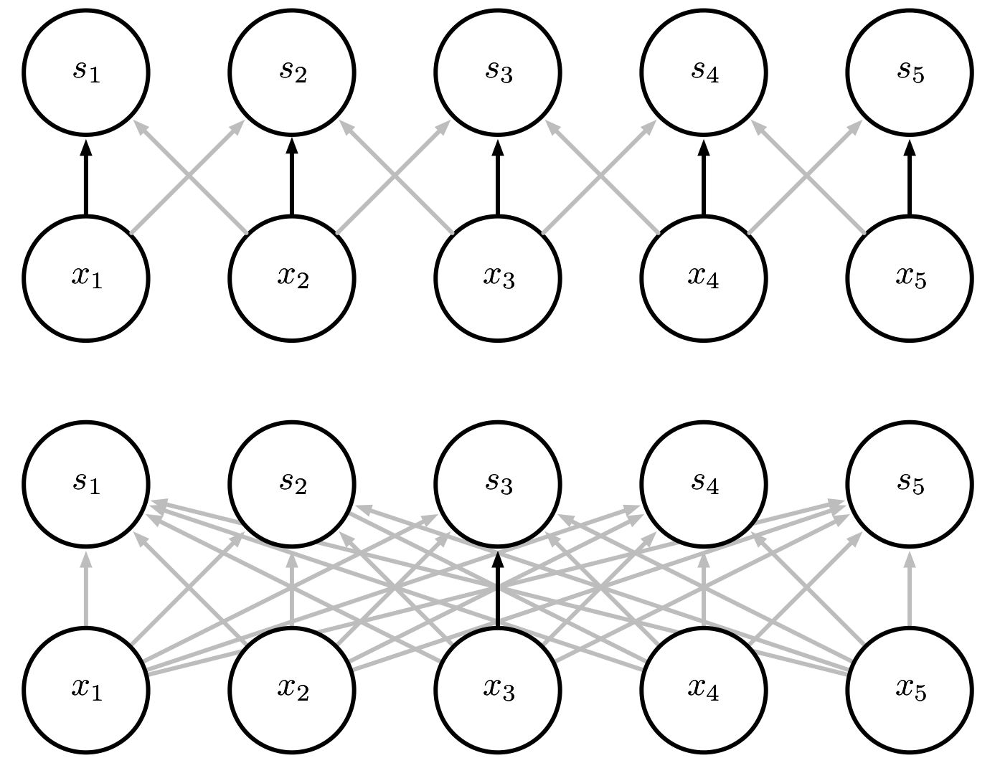

# 卷积动机

卷积运算通过三个重要的思想来帮助改进机器学习系统：稀疏交互\(sparse interactions\)、参数共享\(parameter sharing\)、等变表示\(equivariant representations\)。另外，卷积提供了一种处理大小可变的输入方法。

## 稀疏交互

传统的神经网络使用矩阵乘法来建立输入与输出的连接关系。其中，参数矩阵中每一个单独的参数都描述了一个输入单元与一个输出单元间的交互。这意味着每一个输出单元与每一个输入单元都产生交互。然而，卷积网络具有稀疏交互\(sparse interactions\)\(也叫做 稀疏连接\(sparse connectivity\)或者稀疏权重 \(sparse weights\)\)的特征。这是使核的大小远小于输入的大小来达到的。举个例子，当处理一张图像时，输入的图像可能包含成千上万个像素点，但是我们可以通过只占用几十到上百个像素点的核来检测一些小的有意义的特征，例如图像的边缘。这意味着我们需要存储的参数更少，不仅减少了模型的存储需求，而且提高了它的统计效率。这也意味着为了得到输出我们只需要更少的计算量。这些效率上的提高往往是很显著的。如果有 $$m$$ 个输入和 $$n$$ 个输出，那么矩阵乘法需要 $$m\times n$$ 个参数并且相应算法的时间复杂度为  $$O(m\times n)$$ \(对于每一个例子\)。如果我们限制每一个输出拥有的连接数为 $$k$$ ，那么稀疏的连接方法只需要 $$k\times n$$ 个参数以及 $$ O(k \times n)$$ 的运行时间。在很多实际应用中，只需保持 $$k$$ 比 $$m$$ 小几个数量级，就能在机器学习的任务中取得好的表现。在深度卷积网络中，处在网络深层的单元可能与绝大部分输入是间接交互的。这允许网络可以通过只描述稀疏交互的基石来高效地描述多个变量的复杂交互。

## 参数共享

参数共享\(parameter sharing\)是指在一个模型的多个函数中使用相同的参数。 在传统的神经网络中，当计算一层的输出时，权重矩阵的每一个元素只使用一次，当它乘以输入的一个元素后就再也不会用到了。作为参数共享的同义词，我们可以说 一个网络含有绑定的权重\(tied weights\)，因为用于一个输入的权重也会被绑定在 其他的权重上。在卷积神经网络中，核的每一个元素都作用在输入的每一位置上\(是否考虑边界像素取决于对边界决策的设计\)。卷积运算中的参数共享保证了我们只需要学习一个参数集合，而不是对于每一位置都需要学习一个单独的参数集合。这虽然没有改变前向传播的运行时间\(仍然是 $$a = b$$ \)，但它显著地把模型的存储需求降低至 $$k$$ 个参数，并且 $$k$$ 通常要比 $$m$$ 小很多个数量级。因为 $$m$$ 和 $$a = b$$ 通常有着大致相同的大小， $$k$$ 在实际中相对于 $$m\times n$$ 是很小的。因此，卷积在存储需求和统计效率方面极大地优于稠密矩阵的乘法运算。

## 等变表示

对于卷积,参数共享的特殊形式使得神经网络层具有对平移等变\(equivariance\) 的性质。如果一个函数满足输入改变，输出也以同样的方式改变这一性质，我们就说它是等变 \(equivariant\) 的。特别地，如果函数 $$f(x)$$ 与 $$g(x)$$ 满足 $$f (g(x)) = g(f (x))$$ , 我们就说 $$f(x)$$ 对于变换 $$g$$ 具有等变性。对于卷积来说，如果令 $$g$$ 是输入的任意平移函数，那么卷积函数对于 $$g$$ 具有等变性。举个例子，令 $$I$$ 表示图像在整数坐标上 的亮度函数， $$g$$ 表示图像函数的变换函数\(把一个图像函数映射到另一个图像函数 的函数\)使得 $$I'=g(I)$$，其中图像函数 $$I'$$ 满足 $$I'(x, y) = I(x − 1, y)$$ 。这个函数把 $$I$$ 中的每个像素向右移动一个单位。如果我们先对 $$I$$ 进行这种变换然后进行卷积操作所得到的结果，与先对 $$I$$ 进行卷积然后再对输出使用平移函数 $$g$$ 得到的结果是一样的 。当处理时间序列数据时，这意味着通过卷积可以得到一个由输入中出现不同特征的时刻所组成的时间轴。如果我们把输入中的一个事件向后延时，在输出中仍然,会有完全相同的表示，只是时间延后了。图像与之类似，卷积产生了一个 $$2$$ 维映射来表明某些特征在输入中出现的位置。如果我们移动输入中的对象，它的表示也会在输出中移动同样的量。当处理多个输入位置时，一些作用在邻居像素的函数是很有用的。例如在处理图像时，在卷积网络的第一层进行图像的边缘检测是很有用的。 相同的边缘或多或少地散落在图像的各处，所以应当对整个图像进行参数共享。但在某些情况下，我们并不希望对整幅图进行参数共享。例如，在处理已经通过剪裁而使其居中的人脸图像时，我们可能想要提取不同位置上的不同特征\(处理人脸上部的部分网络需要去搜寻眉毛，处理人脸下部的部分网络就需要去搜寻下巴了\)。卷积对其他的一些变换并不是天然等变的，例如对于图像的放缩或者旋转变换,，需要其他的一些机制来处理这些变换。

