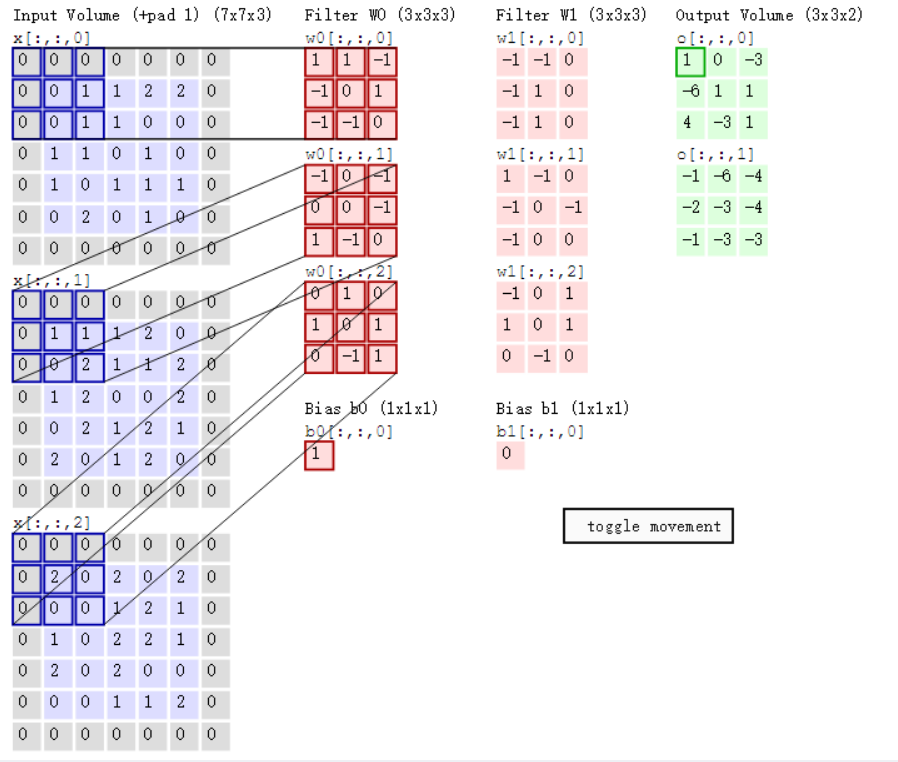
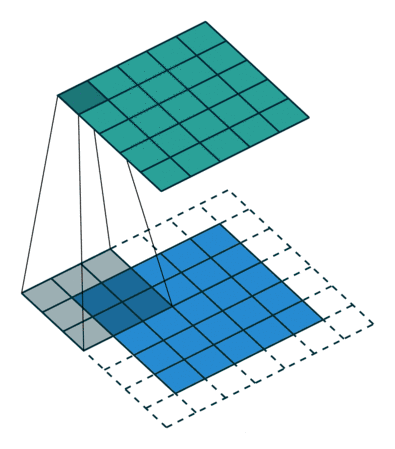
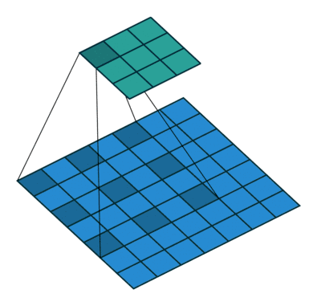
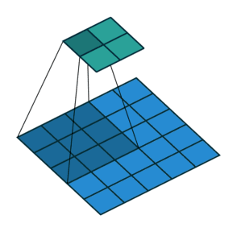
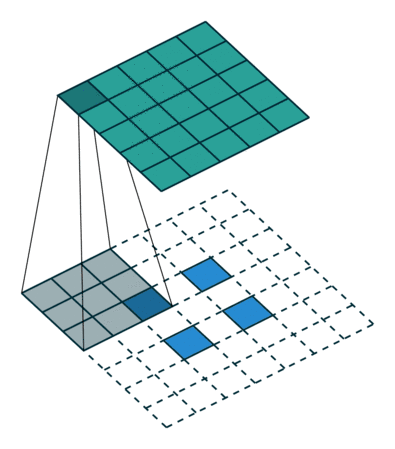
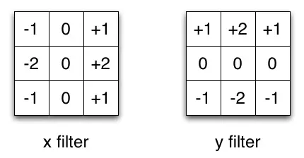

# 卷积运算

对图像（不同的数据窗口数据）和滤波矩阵（一组固定的权重：因为每个神经元的多个权重固定，所以又可以看做一个恒定的滤波器filter）做内积（逐个元素相乘再求和）的操作就是所谓的“卷积”操作，也是卷积神经网络的名字来源。

非严格意义上来讲，下图中红框框起来的部分便可以理解为一个滤波器，即带着一组固定权重的神经元。多个滤波器叠加便成了卷积层。

在下图对应的计算过程中，输入是一定区域大小\(width\*height\)的数据，和滤波器filter（带着一组固定权重的神经元）做内积后等到新的二维数据。具体来说，左边是图像输入，中间部分就是滤波器filter（带着一组固定权重的神经元），不同的滤波器filter会得到不同的输出数据，比如颜色深浅、轮廓。相当于如果想提取图像的不同特征，则用不同的滤波器filter，提取想要的关于图像的特定信息：颜色深浅或轮廓。

## 卷积运算过程

比如下图，图中左边部分是原始输入数据，图中中间部分是滤波器filter，图中右边是输出的新的二维数据

上图中，中间滤波器filter（卷积核）与数据窗口做内积，计算过程为

              $$4*0+0*0+0*0+0*0+0*1+0*1+0*0+0*1+-4*2=-8$$ 

### 相关参数

在CNN中，滤波器filter（带着一组固定权重的神经元）对局部输入数据进行卷积计算。每计算完一个数据窗口内的局部数据后，数据窗口不断平移滑动，直到计算完所有数据。这个过程中，有这么几个参数：

* 内核大小：即卷积核\(滤波器filter\)大小，定义了卷积的视野。二维常见的选择是 $$3*3$$ 或 $$5*5$$ 。
* 深度：神经元个数，决定输出的深度厚度。同时代表卷积核\(滤波器filter\)数量。
* 步长：步幅定义了遍历图像时内核移动的步长，即运算完后移动多少。
* 填充：定义样本的边框如何处理。

输入和输出通道：卷积层需要一定数量的输入通道 $$I$$ ，并计算出特定数量的输出通道 $$O$$ 。可以通过 $$I*O*K$$ 来计算这样一层所需的参数，其中 $$K$$ 等于内核中的值的数量。

### 运算过程

cs231n课程中的经典卷积动图如下，清晰描述了卷积的运算过程：左边为输入（7_7_3中，7\*7代表图像的像素/长宽，3代表R、G、B 三个颜色通道）。最右边是两个不同的输出（绿色）。这个例子里内核大小为 $$3*3$$ ，深度为 $$2$$ （分别为下图中两个红色Filter w0和w1\(每个各三个因为RGB三颜色通道\)），步长为 $$2$$ （每次移动 $$2$$ 个单位），填充为 $$1$$ （即图中原数据四周灰色填 $$0$$ 区域）。

随着左边数据窗口的平移滑动，滤波器Filter w0 / Filter w1对不同的局部数据进行卷积计算。具体运算以第一个输出为例（两个输出上面的那个中左上第一项 $$1$$ 如何来的）：当前卷积核w1与每个维度数据第一个局部区域做内积，然后三个内积相加，最后加偏置项记为对应输出，如下图所示：

0维：$$1*0+1*0+(-1)*0+(-1)*0+0*0+1*1+(-1)*0+(-1)*0+0*1=1$$ 

1维： $$(-1)*0+0*0+(-1)*0+0*0+0*1+(-1)*1+1*0+(-1)*0+0*2=-1$$ 

2维： $$0*0+1*0+0*0+1*0+0*2+1*0+0*0+(-1)*0+1*0=0$$ 

求和加偏置项b0： $$1+(-1)+0+1=1$$ 

值得一提的是：

1、左边数据在变化，每次滤波器都是针对某一局部的数据窗口进行卷积，这就是所谓的CNN中的**局部感知机制**。打个比方，滤波器就像一双眼睛，人类视角有限，一眼望去，只能看到这世界的局部。如果一眼就看到全世界，你会累死，而且一下子接受全世界所有信息，你大脑接收不过来。当然，即便是看局部，针对局部里的信息人类双眼也是有偏重、偏好的。比如看美女，对脸、胸、腿是重点关注，所以这3个输入的权重相对较大。

2、数据窗口滑动，导致输入在变化，但中间滤波器Filter w0的权重（即每个神经元连接数据窗口的权重）是固定不变的，这个权重不变即所谓的CNN中的**参数（权重）共享机制**。再打个比方，某人环游全世界，所看到的信息在变，但采集信息的双眼不变。btw，不同人的双眼 看同一个局部信息 所感受到的不同，即一千个读者有一千个哈姆雷特，所以不同的滤波器 就像不同的双眼，不同的人有着不同的反馈结果。

## 不同卷积类型

### 常规卷积

### 扩张卷积（Dilated Convolutions）

又名阿鲁斯卷积。扩张卷积引入另一个卷积层的参数被称为扩张率。这定义了内核中值之间的间距。扩张速率为 $$2$$ 的 $$3\times 3$$ 内核将具有与 $$5\times 5$$ 内核相同的视野，而只使用 $$9$$ 个参数。 想象一下，使用 $$5\times 5$$ 内核并删除每个间隔的行和列。

它使得系统能够以相同的计算成本提供更广泛的观察范围。扩张卷积在实时分割领域特别受欢迎。 如果你需要更大的观察范围，且无法承受多个卷积或更大的内核，请考虑使用它。：

### 转置卷积（Transposed Convolutions）

又名反卷积或分段缠绕卷积。一些人使用反卷积这个名称，这不是特别恰当的，因为它不是一个反卷积。使事情变得更糟糕的反卷积确实存在，但在深度学习领域并不常见。实际的反卷积是反转卷积的过程。想象一下，将图像输入到单个卷积层。现在开始输出，把放置到一个黑盒子里，然后将你的原始图像再次输出。这个黑盒子进行了一个反卷积操作。这就是卷积层的数学反演。

转置的卷积在某种程度上来说是相似的，因为它和一个假设的反卷积层所产生的空间分辨率是相同的。但是，正在执行的实际数学运算在值上是不同的。转置卷积层执行的是常规卷积，但它会恢复其空间变换。关于这一点你可能会感到困惑，所以让我们来看一个具体的示例。将一个 $$5\times 5$$ 的图像馈送到卷积层。其步幅设置为 $$2$$ ，padding禁用，内核为 $$3\times 3$$ 。结果是产生一个 $$2\times 2$$ 的图像。

如果我们想反转这个过程，我们需要反数学运算，以便从我们输入的每个像素中生成 $$9$$ 个值。之后，我们以 $$2$$ 步幅的设置来遍历输出图像。这将是一个反卷积。

而转置卷积将不会进行此类操作。唯一的共同之处在于它保证输出也将是一个 $$5\times 5$$ 的图像，同时仍然执行正常的卷积运算。为了实现这一点，我们需要在输入上执行一些漂亮的padding。正如你现在可以想象的，这一步并不会从上面扭转这个过程。 至少不包括数值。它只是在以往的基础上重建空间分辨率并执行卷积操作。这可能不是数学的反演，但是对于Encoder-Decoder架构来说，它仍然非常有用。这样，我们可以将图像的缩放与卷积相结合，而不是将两个过程单独分开进行。

### 可分离卷积（Separable Convolutions）

在一个可分离卷积中，我们可以将内核操作拆分成多个步骤。我们用 $$y = \text{conv}(x，k）$$ 表示卷积，其中$$y$$ 是输出图像， $$x$$ 是输入图像， $$k$$ 是内核。这一步很简单。接下来，我们假设 $$k$$ 可以由下面这个等式计算得出： $$k = k1 \dot（k2）$$ 。这将使它成为一个可分离的卷积，因为我们可以通过对 $$k_1$$ 和 $$k_2$$ 做 $$2$$ 个一维卷积来取得相同的结果，而不是用 $$k$$ 做二维卷积。

我们以通常用于图像处理的Sobel内核为例。你可以通过乘以向量\[1，0，-1\]和\[1,2,1\] .T获得相同的内核。在执行相同的操作时，你只需要6个而不是9个参数。

上面的示例显示了所谓的空间可分离卷积，据我所知，这并不是在深度学习中使用的。我只是想确保在他人费劲地操作时，你不会受到如此困惑。在神经网络中，我们通常使用的是一种叫做深度可分离卷积的神经网络。

这将执行一个空间卷积，同时保持通道独立，然后进行深度卷积操作。在我看来，为了加深了解，可以用一个示例作为典范。

假设我们在一个16输入通道和32输出通道上有一个3x3的卷积层。那么将要发生的就是16个通道中的每一个都由32个3x3的内核进行遍历，从而产生512（16x32）的特征映射。接下来，我们通过将每个输入通道中的特征映射相加从而合成一个大的特征映射。由于我们可以进行此操作32次，因此我们得到了期望的32个输出通道。

那么，针对同一个示例，深度可分离卷积的表现又是怎样的呢？我们遍历16个通道，每一个都有一个3x3的内核，可以给出16个特征映射。现在，在做任何合并操作之前，我们将遍历这16个特征映射，每个都含有32个1x1的卷积，然后才逐此开始添加。这导致与上述4608（16x32x3x3）个参数相反的656（16x3x3 + 16x32x1x1）个参数。

该示例是深度可分离卷积的具体实现，其中所谓的深度乘数为1。而这是目前为止这些层最常见的设置。

我们这样做是因为假设空间和深度信息是可以去耦的。而反观Xception模型的表现，可以发现这个理论似乎是有效的。其实，可移动设备中也可以使用深度可分离卷积。因为它们的参数是可以有效利用的。

## Source







{% embed url="https://www.jiqizhixin.com/articles/a-deeper-understanding-of-nnets?from=synced&keyword=%E5%8D%B7%E7%A7%AF%20%E5%8A%A8%E5%9B%BE" %}

