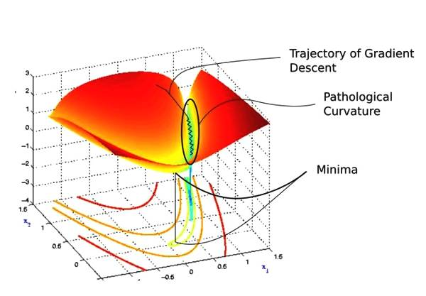
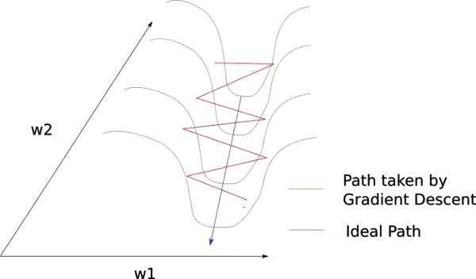
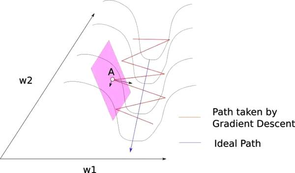
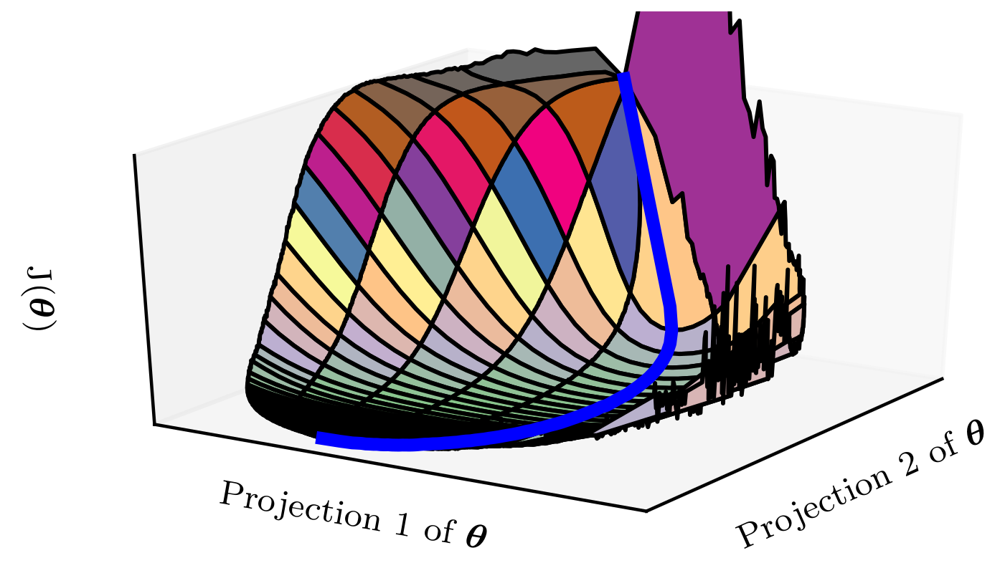
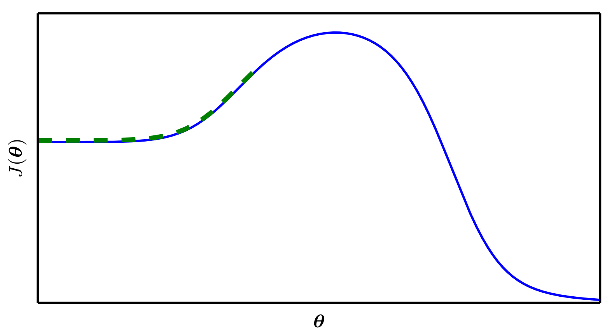

# 神经网络优化中的挑战

优化通常是一个极其困难的任务。传统的机器学习会小心设计目标函数和约束，以确保优化问题是凸的， 从而避免一般优化问题的复杂度。在训练神经网络时，我们肯定会遇到一般的非凸情况。 即使是凸优化，也并非没有任何问题。在这一节中，我们会总结几个训练深度模型时会涉及到的主要挑战。

## 病态

在优化凸函数时，会遇到一些挑战。这其中最突出的是Hessian矩阵 $$H$$ 的病态。这是数值优化、凸优化或其他形式的优化中普遍存在的问题。

病态问题一般被认为存在于神经网络训练过程中。病态体现在随机梯度下降会“卡”在某些情况，此时即使很小的更新步长也会增加代价函数。

代价函数的二阶泰勒级数展开预测梯度下降中的 $$-\epsilon g$$ 会增加

                                                                    $$\frac{1}{2} \epsilon^2 g^\top Hg - \epsilon g^\top g$$ 

到代价中。当 $$\frac{1}{2} \epsilon^2 g^\top Hg$$ 超过 $$\epsilon g^\top g$$ 时，梯度的病态会成为问题。判断病态是否不利于神经网络训练任务，我们可以监测平方梯度范数 $$g^\top g$$ 和 $$g^\top Hg$$ 。在很多情况中，梯度范数不会在训练过程中显著缩小，但是 $$g^\top Hg$$ 的增长会超过一个数量级。其结果是尽管梯度很强，学习会变得非常缓慢，因为学习率必须收缩以弥补更强的曲率。如下图所示，成功训练的神经网络中，梯度显著增加

尽管病态还存在于除了神经网络训练的其他情况中，有些适用于其他情况的解 决病态的技术并不适用于神经网络。例如，牛顿法在解决带有病态条件的Hessian矩阵的凸优化问题时，是一个非常优秀的工具，但是我们将会在以下小节中说明牛顿法运用到神经网络时需要很大的改动。

考虑上图，我们在进入一个以蓝色为标志的像沟一样的区域之前是随机的。这些颜色实际上代表了在特定点上的损失函数的值，红色代表最高的值，蓝色代表最低的值。我们想要下降到最低点，因此，需要穿过峡谷。这个区域就是所谓的病态曲率。为了了解为何将其称为病态曲率，让我们再深入研究。放大了看，病态曲率就像这样。

要知道这里发生的事情并不难。梯度下降沿着峡谷的山脊反弹，向最小的方向移动的速度非常慢。这是因为山脊的曲线在 $$w_1$$ 方向上弯曲的更陡。考虑下图山脊表面的 $$A$$ 点。我们看到，梯度在这点可以分解为两个分量，一个沿着 $$w_1$$ 方向，另外一个沿着 $$w_2$$ 方向。如果 $$f$$ 显著下降的唯一方向是低曲率的，那么优化可能会变得太慢而不切实际，甚至看起来完全停止，造成局部最小值的假象。

正常情况下，我们使用一个较慢的学习率来解决这种山脊间反弹的问题，。然而，这却产生了麻烦。

当我们接近最小值时，慢下来是有意义的，我们想要收敛于它。但是考虑一下梯度下降进入病态曲率的区域，以及到最小值的绝对距离。如果我们使用较慢的学习率，可能需要花费更多的时间才能到达极小值点。事实上，有研究论文报道过使用足够小的学习率来阻值山脊间的反弹可能导致参与者以为损失根本没有改善，从而放弃训练。

如果 $$f$$ 显著下降的唯一方向是低曲率的，那么优化可能会变得太慢而不切实际，甚至看起来完全停止，造成局部最小值的假象。也许我们想要的是能让我们慢慢进入病态曲率底部的平坦区域，然后在最小值的方向上加速。二阶导数可以帮助我们做到这一点。

## 局部极小值

凸优化问题的一个突出特点是其可以简化为寻找一个局部极小点的问题。任何 一个局部极小点都是全局最小点。有些凸函数的底部是一个平坦的区域，而不是单 一的全局最小点,但该平坦区域中的任意点都是一个可以接受的解。优化一个凸问 题时，若发现了任何形式的临界点,我们都会知道已经找到了一个不错的可行解。

 对于非凸函数时，如神经网络，有可能会存在多个局部极小值。事实上，几乎所 有的深度模型基本上都会有非常多的局部极小值。然而，我们会发现这并不是主要 问题。

由于模型可辨识性\(model identifiability\)问题，神经网络和任意具有多个等效参数化潜变量的模型都会具有多个局部极小值。如果一个足够大的训练集可以唯 一确定一组模型参数，那么该模型被称为可辨认的。带有潜变量的模型通常是不可辨认的，因为通过相互交换潜变量我们能得到等价的模型。例如，考虑神经网络的第一层，我们可以交换单元 $$i$$ 和单元 $$j$$ 的传入权重向量、传出权重向量而得到等价的模型。如果神经网络有 $$m$$ 层,每层有 $$n$$ 个单元,那么会有 $$(n!)^m$$ 种排列隐藏单元的方式。这种不可辨认性被称为权重空间对称性\(weight space symmetry\)。

除了权重空间对称性，很多神经网络还有其他导致不可辨认的原因。例如，在任意整流线性网络或者maxout网络中，我们可以将传入权重和偏置扩大 $$\alpha$$ 倍,然 后将传出权重扩大 $$\frac{1}{\alpha}$$ 倍,而保持模型等价。这意味着，如果代价函数不包括如权重衰减这种直接依赖于权重而非模型输出的项，那么整流线性网络或者maxout网络的每一个局部极小点都在等价的局部极小值的 $$(m\times n)$$ 维双曲线上。

这些模型可辨识性问题意味着神经网络代价函数具有非常多、甚至不可数无限多的局部极小值。然而，所有这些由于不可辨识性问题而产生的局部极小值都有相 同的代价函数值。因此，这些局部极小值并非是非凸所带来的问题。

如果局部极小值相比全局最小点拥有很大的代价，局部极小值会带来很大的隐患。我们可以构建没有隐藏单元的小规模神经网络，其局部极小值的代价比全局最小点的代价大很多。如果具有很大代价的局部极小值是常见的，那么这将给基于梯度的优化算法带来极大的问题。

对于实际中感兴趣的网络，是否存在大量代价很高的局部极小值，优化算法是否会碰到这些局部极小值，都是尚未解决的公开问题。多年来，大多数从业者认为局部极小值是困扰神经网络优化的常见问题。如今，情况有所变化。这个问题仍然是学术界的热点问题，但是学者们现在猜想，对于足够大的神经网络而言，大部分局部极小值都具有很小的代价函数，我们能不能找到真正的全局最小点并不重要，而是需要在参数空间中找到一个代价很小\(但不是最小\)的点。

很多从业者将神经网络优化中的所有困难都归结于局部极小值。我们鼓励从业者要仔细分析特定的问题。一种能够排除局部极小值是主要问题的检测方法是画出梯度范数随时间的变化。如果梯度范数没有缩小到一个微小的值，那么该问题既不是局部极小值，也不是其他形式的临界点。在高维空间中，很难明确证明局部极小值是导致问题的原因。许多并非局部极小值的结构也具有很小的梯度。

## 高原、鞍点和其他平坦区域

对于很多高维非凸函数而言，局部极小值\(以及极大值\)事实上都远少于另一 类梯度为零的点：鞍点。鞍点附近的某些点比鞍点有更大的代价，而其他点则有更小的代价。在鞍点处，Hessian 矩阵同时具有正负特征值。位于正特征值对应的特征向量方向的点比鞍点有更大的代价，反之，位于负特征值对应的特征向量方向的点有更小的代价。我们可以将鞍点视为代价函数某个横截面上的局部极小点，同时也 可以视为代价函数某个横截面上的局部极大点。

多类随机函数表现出以下性质：低维空间中，局部极小值很普遍。在更高维空间中，局部极小值很罕见,而鞍点则很常见。对于这类函数 $$f:\mathbb{R^n}\to \mathbb{R}$$ 而言，鞍 点和局部极小值的数目比率的期望随 $$n$$ 指数级增长。我们可以从直觉上理解这种现象——Hessian矩阵在局部极小点处只有正特征值。而在鞍点，,Hessian 矩阵则同时具有正负特征值。试想一下，每个特征值的正负号由抛硬币决定。在一维情况下,，很容易抛硬币得到正面朝上一次而获取局部极小点。在 $$n$$ 维空间中，要抛掷 $$n$$ 次硬币都正面朝上的难度是指数级的。

很多随机函数一个惊人性质是，当我们到达代价较低的区间时，Hessian 矩阵的特征值为正的可能性更大。和抛硬币类比，这意味着如果我们处于低代价的临界点时，抛掷硬币正面朝上 $$n$$ 次的概率更大。这也意味着，局部极小值具有低代价的可能性比高代价要大得多。具有高代价的临界点更有可能是鞍点。具有极高代价的临界点就很可能是局部极大值了。

以上现象出现在许多种类的随机函数中。那么是否在神经网络中也有发生呢？理论上证明，不具非线性的浅层自编码器只有全局极小值和鞍点，没有代价比全局极小值更大的局部极小值。他们还发现这些结果能够扩展到不具非线性的更深的网络上，不过没有证明。这类网络的输出是其输入的线性函数，但它们仍然有助于分析非线性神经网络模型，因为它们的损失函数是关于参数的非凸函数。这类网络本质上是多个矩阵组合在一起。这些模型的学习能够捕捉到许多在训练具有非线性激活函数的深度模型时观察到的定性特征。通过实验表明，真实的神经网络也存在包含很多高代价鞍点的损失函数。

鞍点激增对于训练算法来说有哪些影响呢？对于只使用梯度信息的一阶优化算法而言，目前情况还不清楚。鞍点附近的梯度通常会非常小。另一方面，实验中梯度下降似乎可以在许多情况下逃离鞍点。下图给了例子，这些可视化显示，在突出的鞍点附近，代价函数都是平坦的，权重都为零。但是他们也展示了梯度下降轨迹能够迅速逸出该区间。应该可以通过分析来表明连续时间的梯度 下降会逃离而不是吸引到鞍点，但对梯度下降更现实的使用场景来说,情况或许会有所不同。

对于牛顿法而言，鞍点显然是一个问题。梯度下降旨在朝 ‘‘下坡’’ 移动，而非明确寻求临界点。而牛顿法的目标是寻求梯度为零的点。如果没有适当的修改，牛顿法就会跳进一个鞍点。高维空间中鞍点的激增或许解释了在神经网络训练中为什么二阶方法无法成功取代梯度下降。Dauphin et al. \(2014\) 介绍了二阶优化的 无鞍牛顿法\(saddle-free Newton method\)，并表明和传统算法相比有显著改进。二阶方法仍然难以扩展到大型神经网络，但是如果这类无鞍算法能够扩展的，,还是很有希望的。

除了极小值和鞍点,，存在其他梯度为零的点。例如从优化的角度看与鞍点很 相似的极大值，很多算法不会被吸引到极大值，除了未经修改的牛顿法。和极小值一 样，许多种类的随机函数的极大值在高维空间中也是指数级稀少。

也可能存在恒值的、宽且平坦的区域。在这些区域，梯度和 Hessian 矩阵都是零。这种退化的情形是所有数值优化算法的主要问题。在凸问题中，一个宽而平坦的区间肯定包含全局极小值，但是对于一般的优化问题而言，这样的区域可能会对应着目标函数中一个较高的值。

## 悬崖和梯度爆炸

多层神经网络通常存在像悬崖一样的斜率较大区域，如下图所示。这是由于几 个较大的权重相乘导致的。遇到斜率极大的悬崖结构时，梯度更新会很大程度地改变参数值,通常会完全跳过这类悬崖结构。

不管我们是从上还是从下接近悬崖,情况都很糟糕，但幸运的是我们可以用使用启发式梯度截断\(gradient clipping\)来避免其严重的后果。其基本想法源自梯度并没有指明最佳步长，只说明了在无限小区域内的最佳方向。当传统的梯度下降算法提议更新很大一步时，启发式梯度截断会干涉来减小步长，从而使其不太可能走出梯度近似为最陡下降方向的悬崖区域。悬崖结构在循环神经网络的代价函数中很常见,因为这类模型会涉及到多个因子的相乘，其中每个因子对应一个时间步。因此，长期时间序列会产生大量相乘。

## 长期依赖

当计算图变得极深时,神经网络优化算法会面临的另外一个难题就是长期依 赖问题——由于变深的结构使模型丧失了学习到先前信息的能力,让优化变得极 其困难。深层的计算图不仅存在于前馈网络,还存在于之后介绍的循环网络中\(在 第十章中描述\)。因为循环网络要在很长时间序列的各个时刻重复应用相同操作来构 建非常深的计算图,并且模型参数共享,这使问题更加凸显。

例如，假设某个计算图中包含一条反复与矩阵 $$W$$ 相乘的路径。那么 $$t$$ 步后,相 当于乘以 $$W^t$$ 。假设 $$W$$ 有特征值分解 $$W=V\text{diag}(\lambda)V^{-1}$$ 。在这种简单的情况下, 很容易看出

                                            $$W^t = (V \text{diag}(\lambda) V^{-1})^t = V\text{diag}(\lambda)^t  V^{-1}$$ 

当特征值 $$\lambda_i$$ 不在 $$1$$ 附近时，若在量级上大于 $$1$$ 则会爆炸；若小于 $$1$$ 时则会消失。梯度消失与爆炸问题\(vanishing and exploding gradient problem\)是指该计算图上的梯度也会因为 $$\text{diag}(\lambda)^t$$ 大幅度变化。梯度消失使得我们难以知道参数朝哪个方向移 动能够改进代价函数,而梯度爆炸会使得学习不稳定。之前描述的促使我们使用梯 度截断的悬崖结构便是梯度爆炸现象的一个例子。

此处描述的在各时间步重复与 $$W$$ 相乘非常类似于寻求矩阵 $$W$$ 的最大特征值及对应特征向量的幂方法\(power method\)。从这个观点来看， $$x^\top W^t$$ 最终会丢弃 $$x$$ 中所有与 $$W$$ 的主特征向量正交的成分。

循环网络在各时间步上使用相同的矩阵 $$W$$ ，而前馈网络并没有。所以即使使用非常深层的前馈网络，也能很大程度上有效地避免梯度消失与爆炸问题 \(Sussillo, 2014\)。

## 非精确梯度

大多数优化算法的先决条件都是我们知道精确的梯度或是 Hessian 矩阵。在实践 中，通常这些量会有噪声,甚至是有偏的估计。几乎每一个深度学习算法都需要基于采样的估计,至少使用训练样本的小批量来计算梯度。

在其他情况,我们希望最小化的目标函数实际上是难以处理的。当目标函数不 可解时,通常其梯度也是难以处理的。在这种情况下，我们只能近似梯度。这些问题主要出现在第三部分中更高级的模型中。例如，对比散度是用来近似玻尔兹曼机中难以处理的对数似然梯度的一种技术。

各种神经网络优化算法的设计都考虑到了梯度估计的缺陷。我们可以选择比真实损失函数更容易估计的代理损失函数来避免这个问题。

## 局部和全局结构的弱对应

迄今为止,我们讨论的许多问题都是关于损失函数在单个点的性质——若 $$J(\theta)$$ 是当前点 $$\theta$$ 的病态条件，或者 $$\theta$$ 在悬崖中，或者 $$\theta$$ 是一个下降方向不明显的鞍点, 那么会很难更新当前步。

如果该方向在局部改进很大,但并没有指向代价低得多的遥远区域,那么我们 有可能在单点处克服以上所有困难,但仍然表现不佳。

Goodfellow et al. \(2015\) 认为大部分训练的运行时间取决于到达解决方案的轨 迹长度。如下图所示，学习轨迹将花费大量的时间探寻一个围绕山形结构的宽弧。 

大多数优化研究的难点集中于训练是否找到了全局最小点、局部极小点或是鞍点，但在实践中神经网络不会到达任何一种临界点。图神经网络通常不会到达梯度很小的区域。甚至，这些临界点不一定存在。例如，损失函数 $$-\log p(y|x;\theta)$$ 可以没有全局最小点，而是当随着训练模型逐渐稳定后，渐近地收敛于某个值。对 于具有离散的 $$y$$ 和 softmax 分布 $$p(y|x)$$ 的分类器而言，若模型能够正确分类训练集上的每个样本，则负对数似然可以无限趋近但不会等于零。同样地，实值模型 $$p(y|x)=\mathcal{N}(y;f(\theta),\beta^{-1})$$ 的负对数似然会趋向于负无穷——如果 $$f(\theta)$$ 能够正确预测所有训练集中的目标 $$y$$ ，学习算法会无限制地增加 $$\beta$$ 。上图给出了一个失败的例子，即使没有局部极小值和鞍点，该例还是不能从局部优化中找到一个良好的代价函数值。

未来的研究需要进一步探索影响学习轨迹长度和更好地表征训练过程的结果。

许多现有研究方法在求解具有困难全局结构的问题时,旨在寻求良好的初始点, 而不是开发非局部范围更新的算法。

梯度下降和基本上所有的可以有效训练神经网络的学习算法,都是基于局部较小更新。之前的小节主要集中于为何这些局部范围更新的正确方向难以计算。我们也许能计算目标函数的一些性质，如近似的有偏梯度或正确方向估计的方差。在这些情况下，难以确定局部下降能否定义通向有效解的足够短的路径，但我们并不能真的遵循局部下降的路径。目标函数可能有诸如病态条件或不连续梯度的问题，使得梯度为目标函数提供较好近似的区间非常小。在这些情况下，步长为 $$\epsilon$$ 的局部下降可能定义了到达解的合理的短路经，但是我们只能计算步长为 $$\delta\ll \epsilon$$ 的局部下降方向。在这些情况下，局部下降或许能定义通向解的路径，但是该路径包含很多次更新，因此遵循该路径会带来很高的计算代价。有时，比如说当目标函数有一个宽而平的区域，或是我们试图寻求精确的临界点\(通常来说后一种情况只发生于显式 求解临界点的方法,如牛顿法\)时，局部信息不能为我们提供任何指导。在这些情况 下，局部下降完全无法定义通向解的路径。在其他情况下，局部移动可能太过贪心，朝着下坡方向移动，却和所有可行解南辕北辙，如图 8.4 所示，或者是用舍近求远的方法来求解问题，如图 8.2 所示。目前，我们还不了解这些问题中的哪一个与神经网络优化中的难点最相关，这是研究领域的热点方向。

不管哪个问题最重要，如果存在一个区域，我们遵循局部下降便能合理地直接到达某个解，并且我们能够在该良好区域上初始化学习，那么这些问题都可以避免。 最终的观点还是建议在传统优化算法上研究怎样选择更佳的初始化点，以此来实现目标更切实可行。

## 优化的理论限制

一些理论结果表明,我们为神经网络设计的任何优化算法都有性能限制 \(Blum and Rivest, 1992; Judd, 1989; Wolpert and MacReady, 1997\)。通常这些结果不影响神经网络在实践中的应用。

一些理论结果仅适用于神经网络的单元输出离散值的情况。然而，大多数神经网络单元输出光滑的连续值，使得局部搜索求解优化可行。一些理论结果表明，存在某类问题是不可解的，但很难判断一个特定问题是否属于该类。其他结果表明，寻找给定规模的网络的一个可行解是很困难的，但在实际情况中，我们通过设置更多参数，使用更大的网络，能轻松找到可接受的解。此外，在神经网络训练中，我们通常不关注某个函数的精确极小点，而只关注将其值下降到足够小以获得一个良好的泛化误差。对优化算法是否能完成此目标进行理论分析是非常困难的。因此，研究优化算法更现实的性能上界仍然是学术界的一个重要目标。

## Source



