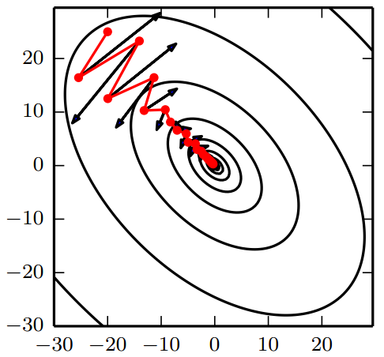
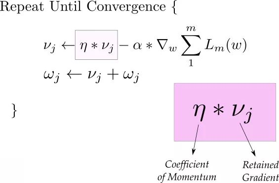
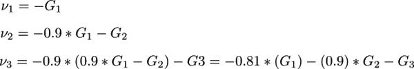
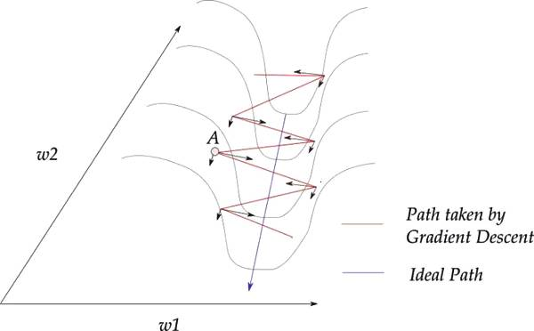
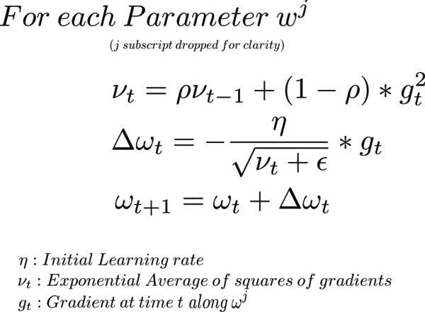
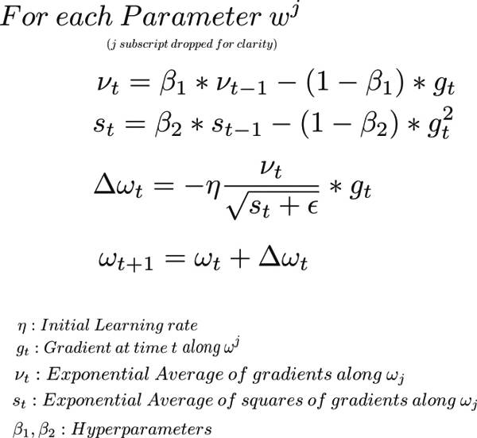
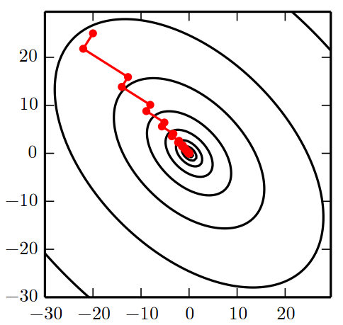

# 优化算法

## 算法对比与选择

### 算法对比

在下图中，我们看到不同算法在损失曲面的等高线上走的不同路线。所有的算法都是从同一个点出发并选择不同路径到达最优点。注意：Adagrad，Adadelta和RMSprop能够立即转移到正确的移动方向上并以类似的速度收敛，而动量法和NAG会导致偏离，想像一下球从山上滚下的画面。然而，NAG能够在偏离之后快速修正其路线，因为NAG通过对最优点的预见增强其响应能力。

下图展示了不同算法在鞍点出的行为，鞍点即为一个点在一个维度上的斜率为正，而在其他维度上的斜率为负，正如我们前面提及的，鞍点对SGD的训练造成很大困难。这里注意，SGD，动量法和NAG在鞍点处很难打破对称性，尽管后面两个算法最终设法逃离了鞍点。而Adagrad，RMSprop和Adadelta能够快速想着梯度为负的方向移动，其中Adadelta走在最前面。

### 算法选择

我们应该选择使用哪种优化算法呢？如果输入数据是稀疏的，选择任一自适应学习率算法可能会得到最好的结果。选用这类算法的另一个好处是无需调整学习率，选用默认值就可能达到最好的结果。

总的来说，RMSprop是Adagrad的扩展形式，用于处理在Adagrad中急速递减的学习率。RMSprop与Adadelta相同，所不同的是Adadelta在更新规则中使用参数的均方根进行更新。最后，Adam是将偏差校正和动量加入到RMSprop中。在这样的情况下，RMSprop、Adadelta和Adam是很相似的算法并且在相似的环境中性能都不错。Kingma等人\[9\]指出在优化后期由于梯度变得越来越稀疏，偏差校正能够帮助Adam微弱地胜过RMSprop。综合看来，Adam可能是最佳的选择。

有趣的是，最近许多论文中采用不带动量的SGD和一种简单的学习率的退火策略。已表明，通常SGD能够找到最小值点，但是比其他优化的SGD花费更多的时间，与其他算法相比，SGD更加依赖鲁棒的初始化和退火策略，同时，SGD可能会陷入鞍点，而不是局部极小值点。因此，如果你关心的是快速收敛和训练一个深层的或者复杂的神经网络，你应该选择一个自适应学习率的方法。

## 基本算法

### 批梯度下降

Vanilla梯度下降法，又称为批梯度下降法（batch gradient descent），在整个训练数据集上计算损失函数关于参数 $$\theta$$ 的梯度。因为在执行每次更新时，我们需要在整个数据集上计算所有的梯度，所以批梯度下降法的速度会很慢，同时，批梯度下降法无法处理超出内存容量限制的数据集。批梯度下降法同样也不能在线更新模型，即在运行的过程中，不能增加新的样本。

对于给定的迭代次数，首先，我们利用全部数据集计算损失函数关于参数向量的梯度向量。然后，我们利用梯度的方向和学习率更新参数，学习率决定我们将以多大的步长更新参数。对于凸误差函数，批梯度下降法能够保证收敛到全局最小值，对于非凸函数，则收敛到一个局部最小值。

### 随机梯度下降\(SGD\)

随机梯度下降\(SGD\)及其变种很可能是一般机器学习中应用最多的优化算法，特别是在深度学习中。与批梯度下降使用全部数据不同，随机梯度下降按照数据生成分布抽取 $$m$$ 个小批量（独立同分布的）样本，通过它们梯度均值，我们可以得到梯度的无偏估计。

SGD算法中的一个关键参数是学习率。之前，我们介绍的SGD使用固定的学习率。在实践中，有必要随着时间的推移降低学习率，因此我们将第 $$k$$ 步迭代的学习率记作 $$\epsilon_k$$ 。

这是因为SGD中梯度估计引入的噪声源（ $$m$$ 个训练样本的随机采样）并不会在极小点处消失。相比之下，当我们使用批量梯度下降到极小点时，整个代价函数的真实梯度会变得很小，之后为 $$0$$ ，因此批量梯度下降可以使用固定的学习率。保证SGD收敛地一个充分条件是 $$\sum\limits_{k=1}^\infty\epsilon_k=\infty$$ 且 $$\sum\limits_{k=1}^\infty\epsilon_k^2<\infty$$ 。

实践中，一般会线性衰减学习率知道第 $$\tau$$ 次迭代：

                                                                     $$\epsilon_k=(1-\alpha)\epsilon_0+\alpha\epsilon_\tau$$ 

其中 $$\alpha=\frac{k}{\tau}$$ 。在 $$\tau$$ 步迭代之后，一般使 $$\epsilon$$ 保持常数。

学习率可通过试验和误差来选取，通常最好的选择方法是监测目标函数值随时间变化的学习曲线。与其说是科学，这更像是一门艺术，我们应该谨慎地参考关于这个问题的大部分指导。使用线性策略时，需要选择的参数为 $$\epsilon_0,\ \epsilon_\tau,\ \tau$$ 。通常 $$\tau$$ 被设为需要反复遍历训练集几百次的迭代数。通常 $$\epsilon_\tau$$ 应设为大约 $$\epsilon_0$$ 的 $$1\%$$ 。主要问题是如何设置 $$\epsilon_0$$：若 $$\epsilon_0$$ 太大，学习曲线将会剧烈震荡，代价函数值通常会明显增加；温和的震荡是良好的，容易在训练随机代价函数（例如使用Dropout的代价函数）时出现；如果学习率太小，那么学习过程会很缓慢。如果初始学习率太低，那么学习可能会卡在一个相当高的代价值。通常，就总训练时间和最终代价值而言，最优初始学习率会高于大约迭代 $$100$$ 次左右后达到最佳效果的学习率。因此，通常最好是检测最早的几轮迭代，选择一个比在效果上表现最佳的学习率更大的学习率，但又不能太大导致严重的震荡。

SGD及相关的小批量亦或更广义的基于梯度优化的在线学习算法，一个重要的性质是每一步更新的计算时间不依赖训练样本数目的多寡。即使训练样本数目非常大时，它们也能收敛。对于足够大的数据集，SGD可能会在处理整个训练集之前就收敛到最终测试集误差的某个固定容差范围内。

研究优化算法的收敛率，一般会衡量额外误差\(excess error\) $$J(\theta-\min_\theta J(\theta))$$ ，即当前代价函数超过最低可能代价的量。SGD应用于凸问题时， $$k$$ 步迭代后的额外误差量级是 $$O(\frac{1}{\sqrt{k}})$$ ，在强凸情况下式 $$O(\frac{1}{k})$$ 。除非假定额外的条件，否则这些界限不能进一步改进。批量梯度下降在理论上比随机梯度下降有更好的收敛率，然而，泛化误差的下降速度不会快于 $$O(\frac{1}{k})$$ 。对于大数据集，SGD只需非常少量样本计算梯度从而实现初始快速更新，远远超过了其缓慢地渐进收敛。我们也可以在学习过程中逐渐增大小批量的大小，以此权衡批梯度下降和随机梯度下降两者的优点。

#### 算法过程

初始化：学习率 $$\epsilon_k$$ ，初始参数 $$\theta$$ 

* while 停止准则为满足 do：
*            从训练集中采包含 $$m$$ 个样本 $$\{x^{(1)},\dots,x^{(m)}\}$$ 的小批量，其中 $$x^{(i)}$$ 对应目标为 $$y^{(i)}$$ 
*            计算梯度估计： $$\hat{g}\gets \frac{1}{m}\nabla_\theta\sum\limits_i^m L(f(x^{(i)};\theta),y^{(i)})$$ 
*            应用更新：$$\theta \gets \theta- \epsilon\hat{g}$$ 

### 动量\(Momentum\)

虽然随机梯度下降仍然是非常受欢迎的优化方法，但其学习过程有时会很慢。动量方法旨在加速学习，特别是处理高曲率、小但一致的梯度，或是带噪声的梯度。动量算法积累了之前梯度指数级衰减的移动平均，并且继续沿该方向移动。

SGD很难通过陡谷，即在一个维度上的表面弯曲程度远大于其他维度的区域，这种情况通常出现在局部最优点附近。在这种情况下，SGD摇摆地通过陡谷的斜坡，同时，沿着底部到局部最优点的路径上只是缓慢地前进，这个过程如下图黑线所示。动量法是一种帮助SGD在相关方向上加速并抑制摇摆的一种方法。动量法将历史步长的更新向量的一个分量增加到当前的更新向量中。

动量的主要目的是解决两个问题：Hessian矩阵的病态条件和随机梯度的方差。我们通过上图说明动量如何客服这两个问题的第一个。等高线描绘了一个二次损失函数（具有病态条件的Hessian矩阵）。横跨轮廓的红色路径表示动量学习规则所遵循的路径，它使该函数最小化。我们在该路径的每个步骤画一个箭头，表示梯度下降将在该店采取的步骤。我们可以看到，一个病态的二次目标函数看起来想一个长而窄的山谷或具有陡峭边的峡谷。动量正确地纵向穿过峡谷，而普通的梯度步骤则会浪费时间在峡谷的窄轴上来回移动

从形式上看，动量算法引入了变量 $$v$$ 充当速度角色——它代表参数在参数空间移动的方向和速率。速度被设为负梯度的指数衰减平均。名称动量\(momentum\)来自物理类比，根据牛顿运动定律，负梯度是移动参数空间中粒子的力。动量在物理学上定义为质量乘以速度。在动量学习算法中，我们假设是单位质量，因此速度向量 $$v$$ 也可以看作是粒子的动量。超参数 $$\alpha\in[0,1)$$ 决定了之前梯度的贡献衰减得有多快。更新规则如下：

                                                    $$v = \alpha v-\epsilon\nabla_\theta(\frac{1}{m}\sum\limits_{i=1}^mL(f(x^{(i)};\theta),y^{(i)}))$$ 

                                                    $$\theta \gets \theta+v$$ 

速度 $$v$$ 积累了梯度元素 $$\nabla_\theta(\frac{1}{m}\sum\limits_{i=1}^mL(f(x^{(i)};\theta),y^{(i)}))$$ 。相对于 $$\epsilon$$ ， $$\alpha$$ 越大，之前梯度对现在方向的影响也越大。第一个式子有两项。第一项是上一次迭代的梯度，乘上一个被称为「Momentum 系数」的值，可以理解为取上次梯度的比例。

我们设 v 的初始为 0，动量系数为 0.9，那么迭代过程如下：

我们可以看到之前的梯度会一直存在后面的迭代过程中，只是越靠前的梯度其权重越小。（说的数学一点，我们取的是这些梯度步长的指数平均） 这对我们的例子有什么帮助呢？观察下图，注意到大部分的梯度更新呈锯齿状。我们也注意到，每一步的梯度更新方向可以被进一步分解为 w1 和 w2 分量。如果我们单独的将这些向量求和，沿 w1 方向的的分量将抵消，沿 w2 方向的分量将得到加强。

对于权值更新来说，将沿着 w2 方向进行，因为 w1 方向已抵消。这就可以帮助我们快速朝着极小值方向更新。所以，动量也被认为是一种抑制迭代过程中锯齿下降问题的技术。 这种方法还可以提高收敛速度，但如果超过极小值，可能需要使用模拟退化算法 我们通常初始化动量为 $$0.5$$ ，并且在一定循环次数后逐渐退火到 $$0.9$$ 。

之前，步长只是梯度范数乘以学习率。现在，步长取决于梯度序列的大小和排列。当许多连续的梯度指向相同方向时，步长最大。如果动量算法总是观测到梯度 $$g$$ ，那么它会在方向 $$-g$$ 上不停加速，知道达到最终速度，其中步长大小为 $$\frac{\epsilon||g||}{1-\alpha}$$ 。因此将动量的超参数视为 $$\frac{1}{1-\alpha}$$ 有助于理解。例如， $$\alpha=0.9$$ 对应着最大速度 $$10$$ 倍于梯度下降算法。

在实践中， $$\alpha$$ 的一般取值为 $$0.5$$ ， $$0.9$$ 和 $$0.99$$ 。和学习率一样， $$\alpha$$ 也会随着时间不断调整。一般初始值是一个较小的值，随后会慢慢变大。随着时间推移调整 $$\alpha$$ 没有收缩 $$\epsilon$$ 重要。

我们可以将动量算法视为模拟连续时间下牛顿动力学下的粒子。这种物理类比有助于直觉上理解动量和梯度下降算法是如何表现的。粒子在任意时间点的为止由 $$\theta(t)$$ 给定。粒子会受到净力 $$f(t)$$ 。该力会导致粒子加速

                                                                        $$f(t)=\frac{\partial^2}{\partial t^2}\theta(t)$$ 

将其视为位置的二阶微分方程，我们不如引入表示粒子在时间 $$t$$ 处速度的变量 $$v(t)$$ ，将牛顿动力学重写为一阶微分方程：

                                                                         $$v(t)=\frac{\partial}{\partial t}\theta(t)$$ 

                                                                         $$f(t)=\frac{\partial}{\partial t}v(t)$$ 

由此，动量算法包括通过数值模型求解微分方程。求解微分方程的一个简单数值方法是欧拉方法，通过在每个梯度方向上小且有限的步来简单模拟该等式定义的动力学。

这解释了动量更新的基本形式，但具体什么是力呢？力正比于代价函数的负梯度 $$-\nabla_\theta J(\theta)$$ 。该力推动粒子沿着代价函数表面下坡的方向移动。梯度下降算法基于每个梯度简单地更新一步，而使用动量算法的牛顿方案则使用该力改变粒子的速度。我们可以将粒子视作在冰面上滑行的冰球。每当它沿着表面最陡的部分下降时，它会积累继续在该方向上滑行的速度，直到其开始向上滑动为止。

另一个力也是必要的。如果代价函数的梯度是唯一的力，那么粒子可能永远不会停下来。想象一下，假设理想情况下冰面没有摩擦，一个冰球从山谷的一端下滑，上升到另一端，永远来回震荡。要解决这个问题，我们添加另一个正比于 $$-v(t)$$ 的力。在物理术语中，此力对应于粘性阻力，就像例子必须通过一个抵抗介质，如糖浆。这会导致粒子随着时间推移逐渐失去能量，最终收敛到局部极小点。

为什么要特别使用 $$-v(t)$$ 和粘性阻力呢？部分原因是因为 $$-v(t)$$ 在数学上的变量——速度的整数幂很容易处理。然而，其他物理系统具有基于速度的整数幂类型的阻力，例如，颗粒通过空气时会收正比于速度平方的湍流阻力，而颗粒沿着地面移动时会受到恒定大小的摩擦力。这些选择都不合适。湍流阻力，正比于速度的平方，在速度很小时会很弱。不够强到使粒子停下来。非零值初始速度的粒子仅受到湍流阻力，会从初始位置永远地移动下去，和初始位置的距离大概正比于 $$O(\log t)$$ 。因此我们必须使用速度较低幂次的力。如果幂次为零，相当于干摩擦，那么力太强了。当代价函数的梯度表示的力很小但非零时，由于摩擦导致的恒力会使得粒子在达到局部极小点之前就停下来。粘性阻力避免了这两个问题——它足够弱，可以使梯度引起的运动直到达到最小，但有足够强，使得坡度不够时可以阻止运动。

#### 算法过程

初始化：学习率 $$\epsilon_k$$，动量参数 $$\alpha$$，初始速度$$v$$，初始参数 $$\theta$$ 

* while 停止准则为满足 do：
*            从训练集中采包含 $$m$$ 个样本 $$\{x^{(1)},\dots,x^{(m)}\}$$ 的小批量，其中 $$x^{(i)}$$ 对应目标为 $$y^{(i)}$$ 
*            计算梯度估计： $$g\gets \frac{1}{m}\nabla_\theta\sum\limits_i^m L(f(x^{(i)};\theta),y^{(i)})$$ 
*            计算速度更新： $$v\gets \alpha v-\epsilon g$$ 
*            应用更新：$$\theta \gets \theta + v$$ 

### Nesterov动量

受Nesterov加速梯度下降法（Nesterov accelerated gradient，NAG）启发，提出了动量算法的一个变种。这种情况的更新规则如下：

                                               $$v\gets \alpha v-\epsilon\nabla_\theta[\frac{1}{m}\sum\limits_{i=1}^mL(f(x^{(i)};\theta+\alpha v),y^{(i)})]$$ 

                                               $$\theta\gets\theta+v$$ 

其中参数 $$\alpha$$ 和 $$\epsilon$$ 发挥了和标准动量方法中类似的作用。Nesterov动量和标准动量之间的区别体现在梯度计算上。Nesterov动量中，梯度计算在施加当前速度之后。因此，Nesterov动量可以解释为往标准动量方法中添加了一个校正因子。

在凸批量梯度的情况下，Nesterov动量将额外误差收敛从 $$O(\frac{1}{k})$$ （ $$k$$ 步后）改进到 $$O(\frac{1}{k^2})$$ 。遗憾的是，在随机梯度的情况下，Nesterov动量没有改进收敛率。

#### 算法过程

初始化：学习率 $$\epsilon_k$$，动量参数 $$\alpha$$，初始速度$$v$$，初始参数 $$\theta$$ 

* while 停止准则为满足 do：
*            从训练集中采包含 $$m$$ 个样本 $$\{x^{(1)},\dots,x^{(m)}\}$$ 的小批量，其中 $$x^{(i)}$$ 对应目标为 $$y^{(i)}$$ 
*            应用临时更新： $$\tilde{\theta}\gets\theta+\alpha v$$ 
*            计算梯度（在临时点）： $$g\gets \frac{1}{m}\nabla_{\tilde{\theta}}\sum\limits_i^m L(f(x^{(i)};\tilde{\theta}),y^{(i)})$$ 
*            计算速度更新： $$v\gets \alpha v-\epsilon g$$ 
*            应用更新：$$\theta \gets \theta + v$$ 

## 自适应学习率算法

### AdaGrad

AdaGrad是这样的一种基于梯度的优化算法：让学习率适应参数，对于出现次数较少的特征，我们对其采用更大的学习率，对于出现次数较多的特征，我们对其采用较小的学习率。因此，AdaGrad非常适合处理稀疏数据。Dean等人发现AdaGrad能够极大提高了SGD的鲁棒性并将其应用于Google的大规模神经网络的训练，其中包含了YouTube视频中的猫的识别。此外，Pennington等人利用AdaGrad训练Glove词向量，因为低频词比高频词需要更大的步长。

前面，我们每次更新所有的参数 $$\theta$$ 时，每个参数 $$\theta_i$$ 都使用相同的学习率 $$\eta$$ 。由于AdaGrad在 $$t$$ 时刻对每一个参数 $$\theta_i$$ 使用了不同的学习率，我们首先介绍AdaGrad对每一个参数的更新，然后我们对其向量化。为了简洁，令 $$g_{t,i}$$ 为在 $$t$$ 时刻目标函数关于参数 $$\theta_i$$ 的梯度：

                                                                     $$g_{t,i} = \nabla_\theta J(\theta_i)$$ 

在 $$t$$ 时刻，对每个参数 $$\theta_i$$ 的更新过程变为：

                                                                $$\theta_{t+1,i}=\theta_{t,i}-\eta\cdot g_{t,i}$$ 

对于上述的更新规则，在 $$t$$ 时刻，基于对 $$\theta_i$$ 计算过的历史梯度，Adagrad修正了对每个参数 $$\theta_i$$ 的学习率

                                                         $$\theta_{t+1,i}=\theta_{t,i}-\frac{\eta}{\sqrt{G_{t,ii}+\epsilon}}\cdot g_{t,i}$$ 

其中， $$G_t\in\mathbb{R}^{d\times d}$$ 是一个对角矩阵，对角线上的元素 $$i,i$$ 是直到 $$t$$ 时刻为止，所有关于 $$\theta_i$$ 的梯度的平方和（Duchi等人将该矩阵作为包含所有先前梯度的外积的完整矩阵的替代，因为即使是对于中等数量的参数 $$d$$ ，矩阵的均方根的计算都是不切实际的。）， $$\epsilon$$ 是平滑项，用于防止除数为 $$0$$ 。比较有意思的是，如果没有平方根的操作，算法的效果会变得很差。

由于 $$G_t$$ 的对角线上包含了关于所有参数 $$\theta$$ 的历史梯度的平方和，现在，我们可以通过 $$G_t$$ 和 $$g_t$$ 之间的元素向量乘法 $$\odot$$ 向量化上述操作：

                                                            $$\theta_{t+1}=\theta_{t}-\frac{\eta}{\sqrt{G_{t}+\epsilon}}\odot g_{t}$$ 

AdaGrad算法的一个主要优点是无需手动调整学习率。在大多数的应用场景中，通常采用常数 $$0.01$$ 。AdaGrad的一个主要缺点是它在分母中累加梯度的平方：由于没增加一个正项，在整个训练过程中，累加的和会持续增长。这会导致学习率变小以至于最终变得无限小，在学习率无限小时，AdaGrad算法将无法取得额外的信息。接下来的算法旨在解决这个不足。

#### 算法过程

初始化：全局学习率$$\epsilon$$，初始参数$$\theta$$，小常数$$\delta$$\(为了数值稳定大约设为$$10^{-7}$$\)，初始化梯度累积变量$$r = 0$$

* while 停止准则为满足 do：
*            从训练集中采包含 $$m$$ 个样本 $$\{x^{(1)},\dots,x^{(m)}\}$$ 的小批量，其中 $$x^{(i)}$$ 对应目标为 $$y^{(i)}$$ 
*            计算梯度： $$g\gets \frac{1}{m}\nabla_\theta\sum\limits_i^m L(f(x^{(i)};\theta),y^{(i)})$$ 
*            累积平法梯度： $$r\gets r+g\odot g$$ 
*            计算更新： $$\Delta\theta\gets -\frac{\epsilon}{\sqrt{r}+\delta}\odot g$$ 
*            应用更新：$$\theta \gets \theta + \Delta\theta$$ 

### Adadelta

Adadelta是Adagrad的一种扩展算法，以处理Adagrad学习速率单调递减的问题。不是计算所有的梯度平方，Adadelta将计算历史梯度的窗口大小限制为一个固定值 $$w$$ 。

在Adadelta中，无需存储先前的 $$w$$ 个平方梯度，而是将梯度的平方递归地表示成所有历史梯度平方的均值。在 $$t$$ 时刻的均值 $$E[g^2]_t$$ 只取决于先前的均值和当前的梯度（分量 $$\gamma$$ 类似于动量项）：

                                                       $$E[g^2]_t=\gamma E[g^2]_{t-1}+(1-\gamma)g^2_t$$ 

我们将 $$\gamma$$ 设置成与动量项相似的值，即 $$0.9$$ 左右。为了简单起见，我们利用参数更新向量 $$\Delta\theta_t$$ 重新表示SGD的更新过程：

                                                                     $$\Delta \theta_t=-\eta\cdot g_{t,i}$$ 

                                                                    $$\theta_{t+1}=\theta_t+\Delta \theta_t$$ 

我们先前得到的Adagrad参数更新向量变为：

                                                                 $$\Delta\theta_{t}=-\frac{\eta}{\sqrt{G_{t}+\epsilon}}\odot g_{t}$$ 

现在，我们简单讲对角矩阵 $$G_t$$ 替换成历史梯度的均值 $$E[g^2]_t$$ ：

                                                                 $$\Delta\theta_{t}=-\frac{\eta}{\sqrt{E[g^2]_t+\epsilon}} g_{t}$$ 

由于分母仅仅是梯度的均方根（root mean squared，RMS）误差，我们可以简写为：

                                                                  $$\Delta\theta_{t}=-\frac{\eta}{\text{RMS}[g]_t} g_{t}$$ 

作者指出上述更新公式中的每个部分（与SGD，动量法或者Adagrad）并不一致，即更新规则中必须与参数具有相同的假设单位。为了实现这个要求，作者首次定义了另一个指数衰减均值，这次不是梯度平方，而是参数的平方的更新：

                                                    $$E[\Delta\theta^2]_t=\gamma E[\Delta\theta^2]_{t-1}+(1-\gamma)\Delta\theta_t^2$$ 

因此，参数更新的均方根误差为：

                                                            $$\text{RMS}[\Delta\theta]_t=\sqrt{E[\Delta\theta^2]_t+\epsilon}$$ 

由于 $$\text{RMS}[\Delta\theta]_t$$ 是未知的，我们利用参数的均方根误差来近似更新。利用 $$\text{RMS}[\Delta\theta]_{t-1}$$ 替换先前的更新规则中的学习率 $$\eta$$ ，最终得到Adadelta的更新规则：

                                                                  $$\Delta\theta_t=-\frac{\text{RMS}[\Delta\theta]_{t-1}}{\text{RMS}[g]_t}g_t$$ 

                                                                     $$\theta_{t+1}=\theta_t+\Delta\theta_t$$ 

使用Adadelta算法，我们甚至都无需设置默认的学习率，因为更新规则中已经移除了学习率。

### RMSPprop

RMSProp 算法也旨在抑制梯度的锯齿下降，但与动量相比， RMSProp 不需要手动配置学习率超参数，由算法自动完成。 更重要的是，RMSProp 可以为每个参数选择不同的学习率。在 RMSprop 算法中，每次迭代都根据下面的公式完成。 它是对每个参数单独迭代。

在第一个方程中，我们计算一个梯度平方的指数平均值。由于我们需要针对每个梯度分量分别执行平方，所以此处的梯度向量 $$g_t$$ 对应的是正在更新的参数方向的梯度各个方向的投影分量。为此，我们将上一次更新的超参数乘 $$\rho$$ 。然后将当前的梯度平方乘 $$(1-\rho)$$ 。最后我们将他们加到一起得到这一时刻的指数平均

我们之所以使用指数平均是因为在 momentum 例子中看到的那样，它可以使得间隔和权重成正比例变化。实际上使用「指数」一词是因为前面项的权重呈指数级下降（最近的项权重是 $$\rho$$ ，次近的 $$\rho$$ 方，然后是 $$\rho$$ 立方，以此类推）。注意我们表示病态曲率的图，梯度沿 w1 方向的分量比沿 w2 方向的分量大的多。我们以平方的方式将 w1 和 w2 叠加，w1 不会发生抵消，w2 在指数平均后会更小。

第二个方程定义了步长，我们沿负梯度方向移动，但是步长受到指数平均值的影响。我们设置了一个初始学习率 $$\eta$$ ，用它除指数平均值。在我们的例子中，因为 w1 平均后比 w2 大很多，所以 w1 的迭代步长就比 w2 要小很多。因此这将避免我们在山脊之间跳跃而朝着正确的方向移动。

第三个方程是更新操作，超参数 $$\rho$$ 通常选为 $$0.9$$ ，但是你可能需要调整它。方程 2 中的 $$\epsilon$$ 是为了防止被 $$0$$ 除，通常取 $$10^{-6}$$ 。

还要注意的是，RMSProp 隐含的执行模拟退火，假设我们正朝着极小值前进并且我们想要放慢速度避免越过极小值。当步长很大时 RMSProp 将自动减小梯度更新的步长（大步长容易越过极小值点）。

#### 算法过程\(RMSProp算法\)

初始化：全局学习率$$\epsilon$$，衰减速率 $$\rho$$ ，初始参数$$\theta$$，小常数$$\delta$$\(通常设为$$10^{-6}$$，用于被小数除时的数值稳定\)，初始化累积变量 $$r = 0$$ 

* while 停止准则为满足 do：
*            从训练集中采包含 $$m$$ 个样本 $$\{x^{(1)},\dots,x^{(m)}\}$$ 的小批量，其中 $$x^{(i)}$$ 对应目标为 $$y^{(i)}$$ 
*            计算梯度： $$g\gets \frac{1}{m}\nabla_\theta\sum\limits_i^m L(f(x^{(i)};\theta),y^{(i)})$$ 
*            累积平方梯度： $$r\gets \rho r+(1-\rho)g\odot g$$ 
*            计算参数更新： $$\Delta\theta\gets -\frac{\epsilon}{\sqrt{r+\delta}}\odot g$$ （ $$\frac{1}{\sqrt{r+\delta}}$$ 逐元素应用）
*            应用更新：$$\theta \gets \theta + \Delta\theta$$ 

#### 算法过程\(使用Nesterov动量的RMSProp算法\)

初始化：全局学习率$$\epsilon$$，衰减速率 $$\rho$$ ，动量系数 $$\alpha$$ ，初始参数$$\theta$$，初始参数 $$v$$ ，初始化累积变量 $$r = 0$$ 

* while 停止准则为满足 do：
*            从训练集中采包含 $$m$$ 个样本 $$\{x^{(1)},\dots,x^{(m)}\}$$ 的小批量，其中 $$x^{(i)}$$ 对应目标为 $$y^{(i)}$$ 
*            计算临时更新：  $$\tilde{\theta}\gets \theta+\alpha v$$ 
*            计算梯度： $$g\gets \frac{1}{m}\nabla_\tilde{\theta}\sum\limits_i^m L(f(x^{(i)};\tilde{\theta}),y^{(i)})$$ 
*            累积梯度： $$r\gets \rho r+(1-\rho)g\odot g$$ 
*            计算速度更新： $$v\gets \alpha v-\frac{\epsilon}{\sqrt{r}}\odot g$$ （ $$\frac{1}{\sqrt{r}}$$ 逐元素应用）
*            应用更新：$$\theta \gets \theta + v$$ 

### Adam

到目前为止，我们已经对比了 RMSProp 和 Momentum 两种方法。尽管 Momentum 加速了我们对极小值方向的搜索，但 RMSProp 阻碍了我们在振荡方向上的搜索。Adam 或 Adaptive Moment Optimization 算法将 Momentum 和 RMSProp 两种算法结合了起来。 这里是迭代方程。

我们计算了每个梯度分量的指数平均和梯度平方指数平均（方程 1、方程 2）。为了确定迭代步长我们在方程 3 中用梯度的指数平均乘学习率（如 Momentum 的情况）并除以根号下的平方指数平均（如 Momentum 的情况），然后方程 4 执行更新步骤。超参数 $$\beta_1$$ 一般取 $$0.9$$ 左右， $$\beta_2$$ 取 $$0.99$$ 。 $$\epsilon$$ 一般取 $$10^{-8}$$ 。

#### 算法过程

初始化：步长 $$\epsilon$$ \(建议默认为： $$0.001$$ \)，矩估计的指数衰减速率 $$\rho_1,\ \rho_2$$ 在区间 $$[0,1)$$ 内（建议默认为：超参数 $$\rho_1$$ 一般取 $$0.9$$ 左右， $$\rho_2$$ 取 $$0.99$$ ），用于数值稳定的小常数 $$\delta$$ （建议默认为： $$10^-8$$ ），初始化参数 $$\theta$$ ，初始化一阶和二阶矩阵变量 $$s = 0,\ r=0$$ ，初始化时间步 $$t = 0$$ 

* while 停止准则为满足 do：
*            从训练集中采包含 $$m$$ 个样本 $$\{x^{(1)},\dots,x^{(m)}\}$$ 的小批量，其中 $$x^{(i)}$$ 对应目标为 $$y^{(i)}$$ 
*            计算梯度： $$g\gets \frac{1}{m}\nabla_\theta\sum\limits_i^m L(f(x^{(i)};\theta),y^{(i)})$$ 
*            $$t\gets t+1$$ 
*            更新有偏一阶矩估计： $$s\gets \rho_1 s+(1-\rho_1)g$$ 
*            更新有偏二阶矩估计： $$r\gets \rho_2 r+(1-\rho_2)g\odot g$$ 
*            修正一阶矩的偏差： $$\hat{s}\gets\frac{s}{1-\rho_1^t}$$ 
*            修正二阶矩的偏差： $$\hat{r}\gets\frac{r}{1-\rho_2^t}$$ 
*            计算更新： $$\Delta\theta\gets -\epsilon\frac{\hat{s}}{\sqrt{\hat{r}}+\delta}$$ （逐元素应用）
*            应用更新：$$\theta \gets \theta + \Delta\theta$$ 

## 二阶近似方法

### 牛顿法

牛顿法时基于二阶泰勒级数展开在某点 $$\theta_0$$ 附近来近似 $$J(\theta)$$ 的优化方法，其忽略了高阶导数：

                          $$J(\theta)\approx J(\theta_0)+(\theta-\theta_0)^\top\nabla_\theta J(\theta_0)+\frac{1}{2}(\theta-\theta_0)^\top H(\theta-\theta_0)$$ 

其中 $$H$$ 是 $$J$$ 相对于 $$\theta$$ 的Hessian矩阵在 $$\theta_0$$ 处的估计。如果我们再求解这个函数的临界点，我们将得到牛顿参数更新规则：

                                                                   $$\theta^*=\theta_0-H^{-1}\nabla_\theta J(\theta_0)$$ 

因此，对于局部的二次函数（具有正定的 $$H$$ ），用 $$H^{-1}$$ 重新调整梯度，牛顿法会直接跳到极小值。如果目标函数是凸的但非二次的（有高阶项），该更新将是迭代的，得到和牛顿法相关的算法。

在深度学习中，目标函数的表面通常非凸（有很多特征），如鞍点。因此使用牛顿法时有问题的。如果Hessian矩阵的特征值并不都是正的，例如，靠近鞍点处，牛顿法实际上会导致更新朝错误的方向移动。这种情况可以通过正则化Hessian矩阵来避免。常用的正则化策略包括在Hessian矩阵对角线上增加常数 $$\alpha$$ 。正则化更新变为

                                                   $$\theta^*=\theta_0-[H(f(\theta_0))+\alpha I]^{-1}\nabla_\theta f(\theta_0)$$ 

这个正则化策略用于牛顿法的近似，例如Levenberg-Marquardt算法，只要Hessian矩阵的负特征值仍然相对接近零，效果就会很好。在曲率方向更极端的情况下， $$\alpha$$ 的值必须足够大，以抵消负特征值。然而， 如果 $$\alpha$$ 持续增加，Hessian矩阵会变得由对角矩阵 $$\alpha I$$ 主导，通过牛顿法所选择的方向会收敛到普通梯度除以 $$\alpha$$ 。当很强的负曲率存在时， $$\alpha$$ 可能需求特别大，以致于牛顿法比选择合适学习率的梯度下降的步长更小。

除了目标函数的某些特征带来的挑战，如鞍点，牛顿法用于训练大型神经网络还受限于其显著的计算负担。Hessian矩阵中元素数目时参数数量的平方，因此，如果参数数目为 $$k$$ （甚至是在非常小的神经网络中 $$k$$ 也可能是百万级别），牛顿法需要计算 $$k\times k$$ 矩阵的逆，计算复杂度为 $$O(k^3)$$ 。另外，由于参数将每次更新都会改变，每次训练迭代都需要计算Hessian矩阵的逆。其结果是，只有参数很少的网络才能在实际中用牛顿法训练。

#### 算法过程

初始化：初始参数 $$\theta_0$$ ，包含 $$m$$ 个样本的训练集

* while 停止准则为满足 do：
*            计算梯度： $$g\gets \frac{1}{m}\nabla_\theta\sum\limits_i^m L(f(x^{(i)};\theta),y^{(i)})$$ 
*            计算Hessian矩阵： $$H \gets\frac{1}{m}\nabla^2_\theta\sum\limits_i^m L(f(x^{(i)};\theta),y^{(i)})$$ 
*            计算Hessian逆： $$H^{-1}$$ 
*            计算更新： $$\theta=-H^{-1}g$$ 
*            应用更新：$$\theta \gets \theta+\Delta\theta$$ 

### 共轭梯度

共轭梯度是一种通过迭代下降的共轭方向以有效避免Hessian矩阵求逆计算的方法。这种方法的灵盖来自于最速下降法弱点的仔细研究，其中先搜索迭代地用于梯度相关的方向上。下图说明了该方法在二次碗型目标中如何表现得，是一个相当抵消的来回往复，锯齿模式。这是因为每一个由梯度给定的线搜索方向，都保证正交于上一个线搜索方向。

假设上一个搜索方向是 $$d_{t-1}$$ 。在极小值处，线搜索终止，方向 $$d_{t-1}$$ 处的方向导数为零： $$\nabla_\theta J(\theta)\cdot d_{t-1}=0$$ 。因为该点的梯度定义了当前的搜索方向， $$d_t=\nabla_\theta J(\theta)$$ 将不会贡献于方向 $$d_{t-1}$$ 。因此方向 $$d_t$$ 正交于 $$d_{t-1}$$ 。最速下降多次迭代中，方向 $$d_{t-1}$$ 和 $$d_t$$ 之间的关系如上图所示。如图战士的，下降正交方向的选择不会保持前一搜索方向上的最小值。这产生了锯齿形的过程。在当前梯度方向下降到极小值，我们必须重新最小化之前梯度方向上的目标。因此，通过遵循每次线搜索结束时的梯度，我们在某种程度上撤销了在之前线搜索的方向上取得的进展。共轭梯度试图解决这个问题。

在共轭梯度法中，我们寻求一个和先前线搜索方向共轭的搜索方向，即它不会撤销该方向上的进展。在训练迭代 $$t$$ 时，下一步的搜索方向 $$d_t$$ 的形式如下：

                                                            $$d_t=\nabla_\theta J(\theta)+\beta_t d_{t-1}$$ 

其中，系数 $$\beta_t$$ 的大小控制我们应沿方向 $$d_{t-1}$$ 加回多少到当前搜索方向上。

如果 $$d_t^\top Hd_{t-1}=0$$ ，其中 $$H$$ 是Hessian矩阵，则两个方向 $$d_t$$ 和 $$d_{t-1}$$ 被称为共轭的。

适应共轭的直接方法会涉及到 $$H$$ 特征向量的计算以选择 $$\beta_t$$ 。这将无法满足我们的开发目标：寻找在大问题比牛顿法计算更加可行的方法。我们能否不进行这些计算而得到共轭方向？幸运的是这个问题的答案是肯定的。两种用于计算 $$\beta_t$$ 的流形方法是：

1、Fletcher-Reeves： $$\beta_t=\frac{\nabla_\theta J(\theta_t)^\top\nabla_\theta J(\theta_t)}{\nabla_\theta J(\theta_{t-1})^\top\nabla_\theta J(\theta_{t-1})}$$ 

2、Polak-Ribiere： $$\beta_t=\frac{(\nabla_\theta J(\theta_{t})-\nabla_\theta J(\theta_{t-1}))^\top\nabla_\theta J(\theta_t)}{\nabla_\theta J(\theta_{t-1})^\top\nabla_\theta J(\theta_{t-1})}$$ 

对于二次曲面而言，共轭方向确保梯度沿着前一方向大小不变。因此，我们在前一方向上仍然是极小值。其结果是，在 $$k$$ 维参数空间中，共轭梯度只需要至多 $$k$$ 次线搜索就能达到极小值。

#### 算法过程

初始化：初始参数 $$\theta_0$$ ，包含 $$m$$ 个样本的训练集，初始化 $$\rho_0=0$$ ， $$g_0 = 0$$ ， $$t = 1$$ 

* while 停止准则为满足 do：
*            初始化梯度： $$g_t=0$$ 
*            计算梯度： $$g\gets \frac{1}{m}\nabla_\theta\sum\limits_i^m L(f(x^{(i)};\theta),y^{(i)})$$ 
*            计算 $$\beta_t=\frac{(g_t-g_{t-1})^\top g_t}{g_{t-1}^\top g_{t-1}}$$\(非线性共轭梯度：视情况可重置 $$\beta_t$$ 为零，例如 $$t$$ 是常数 $$k$$ 的倍数时\)
*            计算搜索方向： $$\rho_t=-g_t+\beta_t\rho_{t-1}$$ 
*            执行线搜索寻找： $$\epsilon^* = \mathop{\arg\min}\limits_\theta \frac{1}{m}\nabla_\theta\sum\limits_i^m L(f(x^{(i)};\theta+\epsilon \rho_t),y^{(i)})$$ \(对于真正二次的代价函
*                                             数，存在解析解，无需显式地搜索\)
*            应用更新：$$\theta_{t+1} \gets \theta_t+\epsilon^*\rho_t$$ 
*             $$t\gets t+1$$ 

### BFGS

Broyden-Fletcher-Goldfarb-Shanno\(BFGS\)算法具有牛顿法的一些优点，但没有牛顿法的计算负担。在这方面，BFGS和CG很像。然而，BFGS使用了一个更直接的方法近似牛顿更新。回顾牛顿更新由下式给出：

                                                                $$\theta^*=\theta_0-H^{-1}\nabla_\theta J(\theta_0)$$ 

其中， $$H$$ 是 $$J$$ 相对于 $$\theta$$ 的Hessian矩阵在 $$\theta_0$$ 处的估计。运用牛顿法的主要计算难点在于计算Hessian逆 $$H^{-1}$$ 。拟牛顿法所采用的方法（BFGS是其中最突出的）是使用矩阵 $$M_t$$ 近似逆，迭代地低秩更新精度以更好地近似 $$H^{-1}$$ 。

当Hessian逆近似 $$M_t$$ 更新时，下降方向 $$\rho_t$$ 为 $$\rho_t=M_tg_t$$ 。该方向上的线搜索用于决定该方向上的步长 $$\epsilon^*$$ 。参数的最后更新为：

                                                                     $$\theta_{t+1}=\theta_t+\epsilon^*\rho_t$$ 

和共轭梯度法相似，BFGS算法迭代一系列线搜索，其方向含二阶信息。然而和共轭梯度不同的是，该方法的成功并不严重依赖于线搜索寻找该方向上和真正极小值很近的一点。因此，相比于共轭梯度，BFGS的优点是其花费较少的时间改进每个线搜索。在另一方面，BFGS算法必须存储Hessian逆矩阵 $$M$$ ，需要 $$O(n^2)$$ 的存储空间，使BFGS不适用于大多数具有百万级参数的现代深度学习模型。

存储受限的BFGS（或L-BFGS）通过避免存储完整的Hessian逆近似 $$M$$ ，BFGS算法的存储代价可以明显降低。L-BFGS算法使用核BFGS算法相同的方法计算 $$M$$ 的近似，但起始假设是 $$M^{(t-1)}$$ 是单位矩阵，而不是一步一步都要存储近似。如果使用精确的线搜索，L-BFGS定义的方向会使相互共轭的。然而，不同于共轭梯度法，即使只是近似线搜索的极小值，该过程的效果仍然不错。这里描述的无存储的L-BFGS方法可以扩展为包含Hessian矩阵更多的信息，每步存储一些用于更新 $$M$$ 的向量，且每步的存储代价是 $$O(n)$$ 。

## Source







