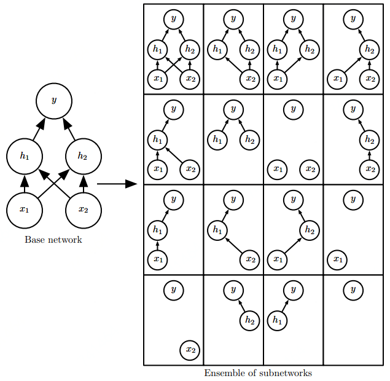
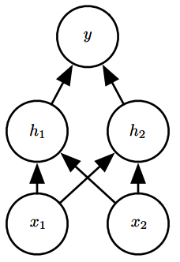
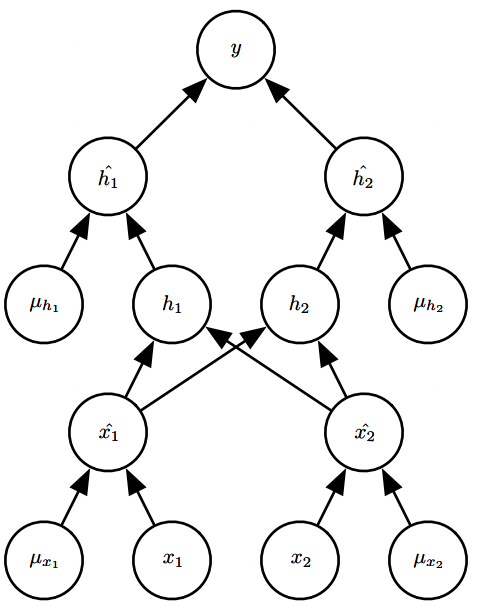

# Dropout

Dropout提供了正则化一大类模型的方法，计算方便但功能强大。Dropout可以被认为是集成大量深层神经网络的实用Bagging方法。Bagging涉及训练多个模型，并在每个测试样本上评估多个模型。当每个模型都是一个很大的神经网络时，这并不现实，因为训练和评估这样的网络需要花费大量的时间和内存。Dropout提供了一种廉价的Bagging集成近似，能够训练和评估指数级数量的神经网络。

具体而言，Dropout训练的集成包括所有从基础网络除去非输出单元后形成的子网络，如下图所示。

神经网络基于一系列仿射变换和非线性变换，我们只需将一些单元的输出乘零就能有效地删除一个单元。这个过程需要对模型进行一些修改，为了简单起见，我们这里提出乘零的简单Dropout算法，但是它被简单修改后，可以与从网络中移除单元的其他操作结合使用。

回想一下Bagging学习，我们定义 $$k$$ 个不同的模型，从训练集有放回采样构造 $$k$$ 个不同的数据集，然后在训练集 $$i$$ 上训练模型 $$f_i$$ 。Dropout的目标是在指数级数量的神经网络上近似这个过程。具体来说，在训练中使用Dropout时，我们会使用基于小批量产生较小步长的学习算法，如随机梯度下降等。我们每次在小批量中加载一个样本，然后随机抽样应用于网络中所有输入和隐藏单元的不同二值掩码。对于每个单元，掩码是独立采样的。掩码值为 $$1$$ 的采样概率（导致包含一个单元）是训练开始前一个固定的超参数。它不是模型当前参数值或输入样本的函数。通常在每一个小批量训练的神经网络中，一个输入单元被包括的概率为 $$0.8$$ ，一个隐藏单元被包括的概率为 $$0.5$$ 。然后，我们运行和之前一样的前向传播、反向传播以及学习更新。下图说明了Dropout下的前向传播

                                     

左图为我们使用的具有两个输入单元，具有两个隐藏单元以及一个输出单元的前馈网络。右图为为了执行具有Dropout的前向传播，我们随机地对向量 $$\mu$$ 进行采样，其中网络中的每个输入或隐藏单元对应一项。 $$\mu$$ 中的每项都是二值的且独立于其他项采样。超参数的采样概率为 $$1$$ ，隐藏层的采样概率通常为 $$0.5$$ ，输入的采样概率通常为 $$0.8$$ .网络中的每个单元乘以相应的掩码，然后正常地继续沿着网络的其余部分前向传播。相当于右图中随机选择一个子网络并沿着前向传播。简单来说，每个单元的掩码 $$\mu$$ 其实就是决定这个单元要不要被drop掉或者drop掉多少的一个概率。

更正式地说，假设一个掩码向量 $$\mu$$ 指定被包括的单元， $$J(\theta,\mu)$$ 是由参数 $$\theta$$ 和掩码 $$\mu$$ 定义的模型代价。那么Dropout训练的目标是最小化 $$\mathbb{E}_\mu J(\theta,\mu)$$ 。这个期望包含多达指数级的项，但我们可以通过抽样 $$\mu$$ 获得梯度的无偏估计。

Dropout训练与Bagging训练不太一样。在Bagging的情况下，所有模型都是独立的。在Dropout的情况下，所有模型共享参数，其中每个模型继承父神经网络参数的不同子集。

