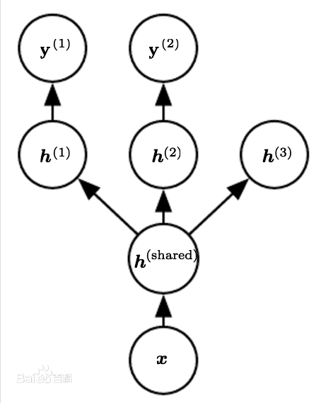

# 多任务学习

多任务学习是通过合并几个任务中的样例（可以视为对参数施加的软约束）来提高泛化的一种方式。额外的训练样本以同样的方式将模型的参数推向泛化更好的方向，当模型的一部分在任务之间共享时，模型的这一部分更多地被约束为良好的值（假设共享是合理的），往往能更好地泛化。

下图是深度学习中多任务学习的一个例子，网络中的输入层和第一个隐藏层是在多个任务之间共享的，上层的 $$h^{(1)}$$ 和 $$h^{(2)}$$ \(对应一个无监督学习任务\)是不同任务特有的参数。这里假设 $$h^{(shared)}$$ 是对原始输入的某种公共的抽象表示，可以在多个任务间共享。

因为共享参数，其统计强度可大大提高（共享参数的样本数量相对于单任务模式增加的比例），并能改善泛化和泛化误差的范围。当然，仅当不同的任务之间存在某些统计关系的假设是合理（意味着某些参数能通过不同任务共享）时才会发生这种情况。

从深度学习的观点看，底层的先验知识如下：能解释数据变化（在与之相关联的不同任务中观察到）的因素中，某些因素是跨两个或更多任务共享的。例如，在出来图像识别相关的任务时卷积层和pooling层可以在多个任务间共享。

