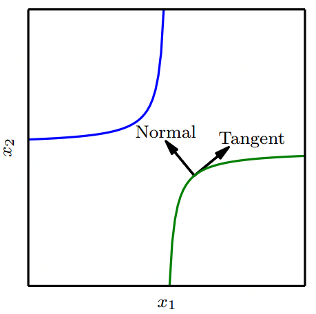

# 切面距离、正切传播和流形正切分类器

许多机器学习通过假设数据位于低维流形附近来克服维数灾难。

## 切面距离

一个利用流形假设的早期尝试是切面距离算法。它是一种非参数的最近邻算法，其中使用的度量不是通过欧几里得距离，而是根据邻近流形关于聚集概率的知识导出的。这个算法假设我们尝试分类的样本和同一流形上的样本具有相同的类别。由于分类器应该对局部因素（对应于流形上的移动）的变化保持不变，一种合理的度量是将点 $$x_1$$ 和 $$x_2$$ 各自所在流形 $$M_1$$ 和 $$M_2$$ 的距离作为点 $$x_1$$ 和 $$x_2$$ 之间的最近邻距离。然而这可能在计算上是困难的（它需要解决一个寻找 $$M_1$$ 和 $$M_2$$ 最近点对的优化问题），一种局部合理的廉价替代是使用 $$x_i$$ 点处切平面近似 $$M_i$$ ，并测量两条切平面或一个切平面和点之间的距离。这可以通过求解一个低维线性系统（就流形的维数而言）来实现。当然，这种算法需要指定那些切向量。

## 正切传播

正切传播算法训练带有额外惩罚的神经网络分类器，使神经网络的每个输出 $$f(x)$$ 对已知的变化因素是局部不变的。这些变化因素对应于沿着的相同样本聚集的流形的移动。这里实现局部不变性的方法是要求 $$\nabla_xf(x)$$ 与已知流形的切向 $$v^{(i)}$$ 正交，或者等价地通过正则化惩罚 $$\Omega$$ 使 $$f$$ 在 $$x$$ 的 $$v^{(i)}$$ 方向的导数较小

                                                     $$\Omega(f)=\sum\limits_i((\nabla_xf(x)^Tv^{(i)}))^2$$ 

这个正则化项当然可以通过适当的超参数缩放，并且对于大多数神经网络，我们需要对许多输出求和（此处为描述简单， $$f(x)$$ 为唯一输出）。与切面距离算法一样，我们根据切向量推到先验，通常从变换（如平移、旋转和缩放图像）的效果获得形式知识。正切传播不仅用于监督学习，还在强化学习中有所应用。

正切传播与数据集增强密切相关。在这两种情况下，该算法的用户通过指定一组应当不会改变网络输出的转换，将其先验知识编码至算法中。不同的是在数据增强的情况下，网络显式地训练正确分类这些施加大量变换后产生的不同输入。正切传播不需要显式访问一个新的输入点。取而代之，它解析地对模型正则化从而在指定转换的方向抵抗扰动。虽然这种解析方法是聪明优雅的，但是它有两个主要的缺点。首先，模型的正则化只能抵挡无穷小的扰动。显式的数据集增强能抵抗较大的扰动。其次，我们很难再基于ReLU的模型上使用无限小的方法。这些模型只能通过关闭单元或缩小它们的权重才能缩小它们的导数。它们不想sigmoid或tanh单元一样通过较大权重在高处饱和以收缩导数。数据集增强在ReLU上工作得很好，因为不同的ReLU会在米一个原始输入的不同转换版本上被激活。

正切传播也和双反向传播以及对抗训练有关联。双反向传播正则化使Jacobian矩阵偏小，而对抗训练找到原输入附近的点，训练模型在这些点上产生与原来输入相同的输出。正切传播和手动指定转换的数据集增强都要求模型在输入变化的某些特定的方向上保持不变。双反向传播和对抗训练都要求模型对输入所有方向中的变化（只要该变化较小）都应当保持不变。正如数据集增强是正切传播非无限小的版本，对抗训练时双反向传播非无限小的版本。

## 流形正切分类器

流形正切分类器无需知道切线向量的先验。流形正切分类器使用自编码器估计流形的切向量来避免用户指定切向量。这些估计的切向量不仅对图像经典几何变换（如转化、旋转和缩放）保持不变，还必须掌握对特定对象（如正在移动的身体某些部分）保持不变的因素。因此根据流形正切分类器提出的算法相当简单：（1）使用自编码器通过无监督学习来学习流形的结构，以及（2）如正切传播一样使用这些切面正则化神经网络分类器。

