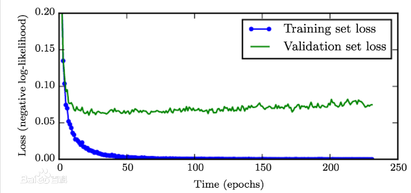

# 提前终止

在模型训练过程中经常出现随着不断迭代，训练误差不断减少，但是验证误差先减少然后开始增长，如下图所示。这种现象机会一定会出现。

提前停止（Early Stopping）的策略是：在验证误差不在提升后，提前结束训练；而不是一直等待验证误差到最小值。该策略可以用于任意的模型，不限于深度学习。GBDT算法天然适合采用Early Stopping策略来确定需要训练多少颗子树，因为GBDT是一个加法模型，采用提前终止策略都不需要额外存储模型的副本。

