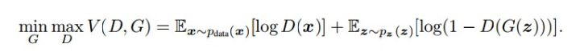
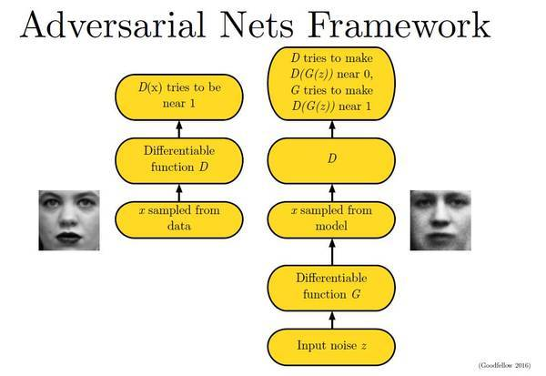
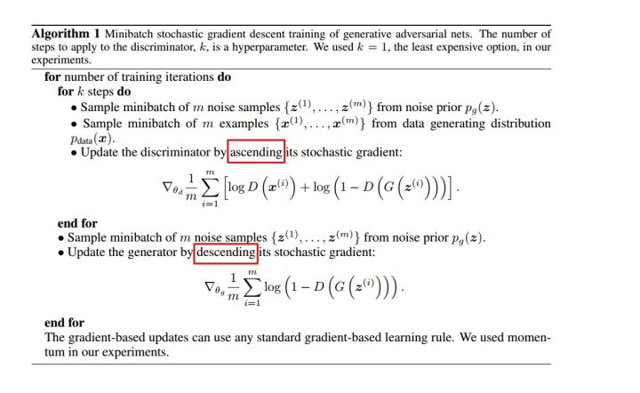

# 生成对抗网络

## [GAN原理介绍](https://arxiv.org/abs/1406.2661)

### 原理思想

生成对抗网络\(Generative adversarial network, GAN\)的基本原理其实非常简单，这里以生成图片为例进行说明。假设我们有两个网络， $$G$$ （Generator）和 $$D$$ （Discriminator）。正如它的名字所暗示的那样，它们的功能分别是：

* $$G$$ 是一个生成图片的网络，它接收一个随机的噪声 $$z$$ ，通过这个噪声生成图片，记做 $$G(z)$$ 。
* $$D$$ 是一个判别网络，判别一张图片是不是“真实的”。它的输入参数是 $$x$$ ， $$x$$ 代表一张图片，输出 $$D(x)$$ 代表x为真实图片的概率，如果为 $$1$$ ，就代表 $$100\%$$ 是真实的图片，而输出为 $$0$$ ，就代表不可能是真实的图片。

在训练过程中，**生成网络** $$G$$ **的目标就是尽量生成真实的图片去欺骗判别网络** $$D$$ **。而** $$D$$ **的目标就是尽量把** $$G$$ **生成的图片和真实的图片分别开来。**这样， $$G$$ 和 $$D$$ 构成了一个动态的“博弈过程”。最后博弈的结果是什么？在最理想的状态下， $$G$$ 可以生成足以“以假乱真”的图片 $$G(z)$$ 。对于 ****$$D$$ 来说，它难以判定 $$G$$ 生成的图片究竟是不是真实的，因此 $$D(G(z)) = 0.5$$ 。这样我们的目的就达成了：我们得到了一个生成式的模型 $$G$$ ，它可以用来生成图片。

### 公式描述

以上只是大致说了一下GAN的核心原理，如何用数学语言描述呢？这里直接摘录论文里的公式：

简单分析一下这个公式：

* 整个式子由两项构成。 $$x$$ 表示真实图片， $$z$$ 表示输入 $$G$$ 网络的噪声，而 $$G(z)$$ 表示 $$G$$ 网络生成的图片。
* $$D(x)$$ 表示 $$D$$ 网络判断真实图片是否真实的概率（因为 $$x$$ 就是真实的，所以对于 $$D$$ 来说，这个值越接近 $$1$$ 越好）。而 $$D(G(z)) $$ 是 $$D$$ 网络判断 $$G$$ 生成的图片的是否真实的概率。
* $$G$$ 的目的：上面提到过， $$D(G(z)) $$ 是 $$D$$ 网络判断 $$G$$ 生成的图片是否真实的概率， $$G$$ 应该希望自己生成的图片“越接近真实越好”。也就是说， $$G$$ 希望 $$D(G(z))$$ 尽可能得大，这时 $$V(D, G)$$ 会变小。因此我们看到式子的最前面的记号是 $$\min\limits_G$$ 。
* $$D$$ 的目的： $$D$$ 的能力越强， $$D(x)$$ 应该越大， $$D(G(x))$$ 应该越小。这时 $$V(D, G)$$ 会变大。因此式子对于 $$D$$ 来说是求最大 $$\max\limits_D$$ 

 下面这幅图片很好地描述了这个过程：

那么如何用随机梯度下降法训练D和G？论文中也给出了算法：

这里红框圈出的部分是我们要额外注意的。第一步我们训练 $$D$$ ， $$D$$ 是希望 $$V(G, D)$$ 越大越好，所以是加上梯度\(ascending\)。第二步训练 $$G$$ 时， $$V(G, D)$$ 越小越好，所以是减去梯度\(descending\)。整个训练过程交替进行。

## Code实现



## Source





