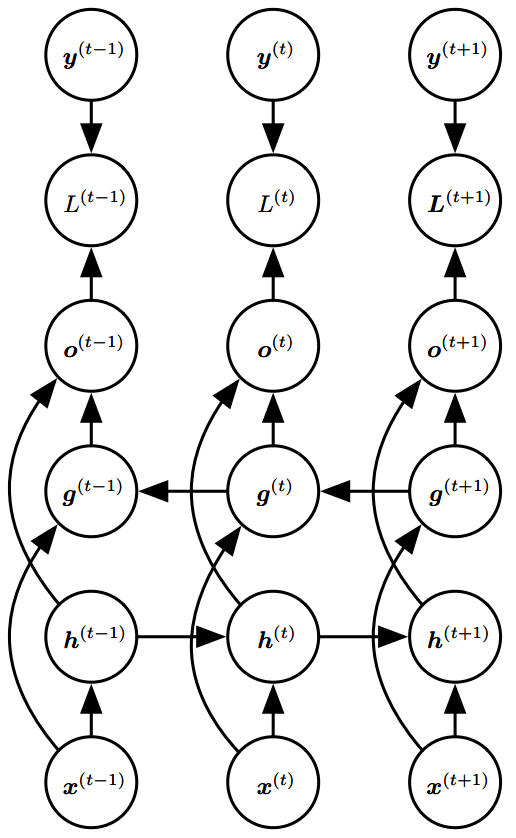

# 循环神经网络

基于图展开和参数共享的思想，我们可以设计各种循环神经网络。循环神经网络中一些重要的设计模式包括以下几种：

## 前向传播

现在我们研究每个时间步都有输出，并且隐藏单元之间有循环连接的循环网络的前向传播公式，即下图

这幅图描述了在序列索引号 $$t$$ 附近RNN的模型。其中：

（1） $$x^{(t)}$$ 代表在序列索引号 $$t$$ 时训练样本的输入。同样的， $$x^{(t-1)}$$ 和 $$x^{(t+1)}$$ 代表在序列索引号 $$t-1$$和 $$t+1$$ 时训练样本的输入。

（2） $$h^{(t)}$$ 代表在序列索引号 $$t$$ 时模型的隐藏状态。 $$h^{(t)}$$ 是由 $$x^{(t)}$$ 和 $$h^{(t-1)}$$ 共同决定。

（3） $$o^{(t)}$$ 代表在序列索引号 $$t$$ 时模型的输出。 $$o^{(t)}$$ 只由模型当前的隐藏状态 $$h^{(t)}$$ 决定。

（4） $$L^{(t)}$$ 代表在序列索引号 $$t$$ 时模型的损失函数。

（5） $$y^{(t)}$$ 代表在序列索引号 $$t$$ 时训练样本序列的真实输出。

（6） $$U, W, V$$ 这三个矩阵是我们的模型的线性关系参数，它在整个RNN网络中是共享的。也正因为是共享的，它体现了RNN的模型的“循环反馈”的思想。

有了上面的模型，RNN的前向传播算法就很容易得到了：

对于任意一个序列索引号 $$t$$ ，我们隐藏状态 $$h^{(t)}$$ 由 $$x^{(t)}$$ 和 $$h^{(t-1)}$$ 得到：

                                              $$h^{(t)}=\sigma(z^{(t)})=\sigma(Ux^{(t)}+Wh^{(t-1)}+b)$$ 

其中 $$\sigma$$ 为RNN的激活函数，一般为tanh， $$b$$ 为线性关系的偏倚。

序列索引号 $$t$$ 时的模型的输出 $$o^{(t)}$$ 的表达式比较简单：

                                                                   $$o^{(t)}=Vh^{(t)}+c$$ 

在最终在序列索引号 $$t$$ 时我们的预测输出为：

                                                                      $$\hat{y}^{(t)}=\sigma'(o^{(t)})$$ 

通常RNN是分类模型，所以上面这个激活函数 $$\sigma'$$ 一般是softmax。

通过损失函数 $$L^{(t)}$$ ，比如对数似然损失函数，我们可以量化模型在当前位置的损失，即 $$\hat{y}^{(t)}$$ 和 $$y^{(t)}$$ 差距

## 反向传播

RNN反向传播算法的思路和DNN是一样的，即通过梯度下降法一轮轮的迭代，得到合适的RNN模型参数 $$U,W,V,b,c$$ 。由于我们是基于时间反向传播，所以RNN的反向传播有时也叫做BPTT（back-propagation through time）。当然这里的BPTT和DNN也有很大的不同点，即这里所有的 $$U,W,V,b,c$$ 在序列的各个位置是共享的，反向传播时我们更新的是相同的参数。

为了简化描述，这里的损失函数我们为对数损失函数，输出的激活函数为softmax函数，隐藏层的激活函数为tanh函数。对于RNN，由于我们在序列的每个位置都有损失函数，因此最终的损失 $$L$$ 为：

                                                                            $$L = \sum\limits_{t=1}^\tau L^{(t)}$$ 

由 $$o^{(t)}=Vh^{(t)}+c$$ ，可计算 $$V,c$$ 的梯度：

                             $$\frac{\partial L}{\partial c}=\sum\limits_{t=1}^\tau\frac{\partial L^{(t)}}{\partial c}=\sum\limits_{t=1}^\tau\frac{\partial L^{(t)}}{\partial o^{(t)}}\frac{\partial o^{(t)}}{\partial c}=\sum\limits_{t=1}^\tau\frac{\partial L^{(t)}}{\partial \hat{y}^{(t)}}\frac{\partial \hat{y}^{(t)}}{\partial o^{(t)}}\frac{\partial o^{(t)}}{\partial c}=\sum\limits_{t=1}^\tau\hat{y}^{(t)}-y^{(t)}$$ 

                                         $$\frac{\partial L}{\partial V}=\sum\limits_{t=1}^\tau\frac{\partial L^{(t)}}{\partial V}=\sum\limits_{t=1}^\tau\frac{\partial L^{(t)}}{\partial o^{(t)}}\frac{\partial o^{(t)}}{\partial V}=\sum\limits_{t=1}^\tau(\hat{y}^{(t)}-y^{(t)})(h^{(t)})^\top$$ 

对于 $$c$$ 的求导，，由于激活函数是softmax，损失函数是对数损失，因此该推导过程与[深度学习（二）：DNN损失函数和激活函数的选择](https://blog.csdn.net/anshuai_aw1/article/details/84666595)里的公式（4）完全一样。

对于 $$V$$ 的求导，为什么 $$(h^{(t)})^\top$$ 会放在后面，那是因为在实际矩阵求导得链式法则里面，对于两步的链式法则：

（1）如果是**标量对矩阵求导**改成链式法则，那么求导得后半部分不用提前。比如 $$y=f(u),u=f(x)$$ ， $$y$$ 为标量， $$u,x$$ 为矩阵，则： $$\frac{\partial y}{\partial x}=\frac{\partial y}{\partial u}(\frac{\partial u}{\partial x})^\top$$ 

（2）如果是**标量对向量求导**改成链式法则，那么求导得后半部分不用提前。比如 $$y=f(u),u=f(x)$$ ， $$y$$ 为标量， $$u,x$$ 为向量，则： $$\frac{\partial y}{\partial x}=(\frac{\partial u}{\partial x})^\top\frac{\partial y}{\partial u}$$ 

但是 $$W,U,b$$ 的梯度计算就比较复杂了。从RNN的模型可以看出，在反向传播时，在某一序列位置 $$t$$ 的梯度损失由当前位置的输出对应的梯度损失和序列索引位置 $$t-1$$ 时的梯度损失两部分共同决定。对于 $$W$$ 在某一序列位置 $$t$$ 的梯度损失需要反向传播一步步的计算。我们定义序列索引 $$t$$ 位置的隐藏状态的梯度为

                                                                            $$\delta^{(t)}=\frac{\partial L}{\partial h^{(t)}}$$ 

这里我们可以像DNN一样从 $$\delta^{(t+1)}$$ 递推 $$\delta^{(t)}$$ 

            $$\delta^{(t)}=\frac{\partial L}{\partial o^{(t)}}\frac{\partial o^{(t)}}{\partial h^{(t)}}+\frac{\partial L}{\partial h^{(t+1)}}\frac{\partial h^{(t+1)}}{\partial h^{(t)}}=V^\top(\hat{y}^{(t)}-y^{(t)})+W^\top\delta^{(t+1)}\text{diag}(1-(h^{(t+1)})^2)$$     （8）

                                                       $$\delta^{(\tau)}=\frac{\partial L}{\partial o^{(\tau)}}\frac{o^{(\tau)}}{h^{(\tau)}}=V^\top(\hat{y}^{(\tau)}-y^{(\tau)})$$                                                       （9）

公式（8）中两部分相加的原因是：

                                                  $$h^{(t)}\to o^{(t)}\to L$$       $$h^{(t)}\to h^{(t+1)}\to L$$ 

所以 $$L$$ 对 $$h^{(t)}$$ 求导时，要分别经过 $$o^{(t)}$$ 和 $$h^{(t+1)}$$ 对 $$h^{(t)}$$ 进行求导。

$$\frac{\partial L}{\partial o^{(\tau)}}\frac{o^{(\tau)}}{h^{(\tau)}}$$的导数是 $$V^\top(\hat{y}^{(\tau)}-y^{(\tau)})$$ ，这是显然的。重点是 $$\frac{\partial L}{\partial h^{(t+1)}}\frac{\partial h^{(t+1)}}{\partial h^{(t)}}$$ 的导数怎么求。根据公式

                                                $$h^{(t)}=\sigma(z^{(t)})=\sigma(Ux^{(t)}+Wh^{(t-1)}+b)$$ 

在前面我们假设隐含层的激活函数是tanh，即 $$y=\text{tanh}(x)$$ ，它的导数为 $$y' = 1-y^2$$ 。结合[深度学习（一）：DNN前向传播算法和反向传播算法](https://blog.csdn.net/anshuai_aw1/article/details/84615935)中公式（12），有

                $$\frac{\partial L}{\partial h^{(t+1)}}\frac{\partial h^{(t+1)}}{\partial h^{(t)}}=W^\top\delta^{(t+1)}\odot(1-(h^{(t+1)})^2)=W^\top\delta^{(t+1)}\text{diag}(1-(h^{(t+1)})^2)$$ 

这里是双曲正切激活函数，用矩阵中对角线元素表示向量中各个值的导数，可以去掉哈达马乘积，转化为矩阵乘法。

对于 $$W^\top\delta^{(t+1)}\text{diag}(1-(h^{(t+1)})^2)$$ ，正确的运算顺序应该是先 $$\delta^{(t+1)}\text{diag}(1-(h^{(t+1)})^2)$$ （注意这里的哈德玛乘积的意思，即 $$n$$ 个元素对应位置相乘，并非 $$n*1$$ 乘以 $$n*n$$ ），然后再用 $$W^\top$$ 与上面的结果运算。 即先进行哈德玛乘积。

有了 $$\delta^{(t)}$$ ，计算 $$W,U,b$$ 就容易了，这里给出对应的梯度计算表达式：

                              $$\frac{\partial L}{\partial W}=\sum\limits_{t=1}^\tau\frac{\partial L}{\partial h^{(t)}}\frac{\partial h^{(t)}}{\partial 6W}=\sum\limits_{t=1}^\tau\text{diag}(1-(h^{(t)})^2)\delta^{(t)}(h^{(t-1)})^\top$$ 

                                      $$\frac{\partial L}{\partial b}=\sum\limits_{t=1}^\tau\frac{\partial L}{\partial h^{(t)}}\frac{\partial h^{(t)}}{\partial b}=\sum\limits_{t=1}^\tau\text{diag}(1-(h^{(t)})^2)\delta^{(t)}$$ 

                                $$\frac{\partial L}{\partial U}=\sum\limits_{t=1}^\tau\frac{\partial L}{\partial h^{(t)}}\frac{\partial h^{(t)}}{\partial U}=\sum\limits_{t=1}^\tau\text{diag}(1-(h^{(t)})^2)\delta^{(t)}(x^{(t)})^\top$$ 

## 双向RNN

前为止我们考虑的所有循环神经网络有一个“因果”结构，意味着在时刻 $$t$$ 的状态只能从过去的序列 $$x^{(1)},\dots,x^{(t-1)}$$ 以及当前的输入 $$x^{(t)}$$ 捕获信息。然而，在许多应用中，我们要输出的 $$y^{(t)}$$ 的预测可能依赖于整个输入序列。例如，在语音识别中，由于协同发音，当前声音作为音素的正确解释可能取决于未来几个音素，甚至潜在的可能取决于未来的几个词，因为词与附近的词之间的存在语义依赖：如果当前的词有两种声学上的合理的解释，我们可能要在更远的未来（和过去）寻找信息区分它们。这在手写识别和许多其他序列到序列学习的任务中也是如此。

双向循环神经网络（或双向RNN）为满足这种需要而被发明。顾名思义，双向RNN结合时间上从序列起点开始移动的RNN和另一个时间上从序列末尾开始移动的RNN。下图展示了典型的双向RNN，其中 $$h^{(t)}$$ 代表通过时间向前移动的子RNN的状态， $$g^{(t)}$$ 代表通过时间向后移动的子RNN的状态。这允许输出单元 $$o^{(t)}$$ 能够计算同时依赖于过去和未来且对时刻 $$t$$ 的输入值最敏感的表示，而不必指定 $$t$$ 周围固定大小的窗口。

这个想法可以自然地扩展到 $$2$$ 维输入，如图像，由四个RNN组成，每一个沿着四个方向中的一个计算：上、下、左、右。如果RNN能够学习到承载长期信息，那在 $$2$$ 维网格每个点 $$(i,j)$$ 的输出 $$O_{i,j}$$ 就能计算一个能捕捉到大多局部信息但仍依赖于长期输入的表示。相比卷积网络，应用于图像的RNN计算成本通常更高，但允许同一特征图的特征之间存在长期横向的相互作用。实际上，对于这样的RNN，前向传播公式可以写成表示使用卷积的形式，计算自底向上到每一层的输入（在整合横向相互作用的特征图的循环传播之前）。

## RNN变体

### 单层网络

在学习RNN之前，首先要了解一下最基本的单层网络，它的结构如图：

输入是 $$x$$ ，经过变换 $$Wx+b$$ 和激活函数 $$f$$ 得到输出 $$y$$ 。相信大家对这个已经非常熟悉了。

### 经典的RNN结构（N vs. N）

 在实际应用中，我们还会遇到很多序列形的数据：

 如：

* 自然语言处理问题。 $$x_1$$ 可以看做是第一个单词， $$x_2$$ 可以看做是第二个单词，依次类推。
* 语音处理。此时， $$x_1,x_2,x_3\dots$$ 是每帧的声音信号。
* 时间序列问题。例如每天的股票价格等等。

序列形的数据就不太好用原始的神经网络处理了。为了建模序列问题，RNN引入了隐状态 $$h$$ （hidden state）的概念， $$h$$ 可以对序列形的数据提取特征，接着再转换为输出。先从 $$h_1$$ 的计算开始看：

图示中记号的含义是：

* 圆圈或方块表示的是向量。
* 一个箭头就表示对该向量做一次变换。如上图中 $$h_0$$ 和 $$x_1$$ 分别有一个箭头连接，就表示对 $$h_0$$ 和 $$x_1$$ 各做了一次变换。

在很多论文中也会出现类似的记号，初学的时候很容易搞乱，但只要把握住以上两点，就可以比较轻松地理解图示背后的含义。

$$h_2$$ 的计算和 $$h_1$$ 类似。要注意的是，在计算时，每一步使用的参数 $$U,W,b$$ 都是一样的，也就是说每个步骤的参数都是共享的，这是RNN的重要特点，一定要牢记。

 依次计算剩下来的（使用相同的参数 $$U,W,b$$ ）：

我们这里为了方便起见，只画出序列长度为4的情况，实际上，这个计算过程可以无限地持续下去。 我们目前的RNN还没有输出，得到输出值的方法就是直接通过h进行计算：

正如之前所说，一个箭头就表示对对应的向量做一次类似于 $$f(Wx+b)$$ 的变换，这里的这个箭头就表示对 $$h_1$$ 进行一次变换，得到输出 $$y_1$$ 。剩下的输出类似进行（使用和 $$y_1$$ 同样的参数 $$V$$ 和 $$c$$ ）：

OK！大功告成！这就是最经典的RNN结构，我们像搭积木一样把它搭好了。它的输入是 $$x_1,x_2,\dots,x_n$$ ，输出为 $$y_1,y_2,\dots,y_n$$ ，也就是说，输入和输出序列必须要是等长的。由于这个限制的存在，经典RNN的适用范围比较小，但也有一些问题适合用经典的RNN结构建模，如：

* 计算视频中每一帧的分类标签。因为要对每一帧进行计算，因此输入和输出序列等长。
* 输入为字符，输出为下一个字符的概率。这就是著名的[Char RNN](http://karpathy.github.io/2015/05/21/rnn-effectiveness/)，Char RNN可以用来生成文章，诗歌，甚至是代码，非常有意思。

### N vs. 1

有的时候，我们要处理的问题输入是一个序列，输出是一个单独的值而不是序列，应该怎样建模呢？实际上，我们只在最后一个 $$h$$ 上进行输出变换就可以了：

这种结构通常用来处理序列分类问题。如输入一段文字判别它所属的类别，输入一个句子判断其情感倾向，输入一段视频并判断它的类别等等。

### 1 vs. N

 输入不是序列而输出为序列的情况怎么处理？我们可以只在序列开始进行输入计算：

 还有一种结构是把输入信息X作为每个阶段的输入：

下图省略了一些X的圆圈，是一个等价表示：

 这种1 VS N的结构可以处理的问题有：

* 从图像生成文字（image caption），此时输入的 $$X$$ 就是图像的特征，而输出的 $$y$$ 序列就是一段句子
* 从类别生成语音或音乐等

### Seq2Seq或Encoder-Decoder（N vs. M）

下面我们来介绍RNN最重要的一个变种：N vs M。这种结构又叫Encoder-Decoder模型，也可以称之为Seq2Seq模型。原始的N vs. N RNN要求序列等长，然而我们遇到的大部分问题序列都是不等长的，如机器翻译中，源语言和目标语言的句子往往并没有相同的长度。

为此，Encoder-Decoder结构先将输入数据编码成一个上下文向量c：

得到 $$c$$ 有多种方式，最简单的方法就是把Encoder的最后一个隐状态赋值给 $$c$$ ，还可以对最后的隐状态做一个变换得到 $$c$$ ，也可以对所有的隐状态做变换。拿到 $$c$$ 之后，就用另一个RNN网络对其进行解码，这部分RNN网络被称为Decoder。具体做法就是将 $$c$$ 当做之前的初始状态 $$h_0$$ 输入到Decoder中：

还有一种做法是将 $$c$$ 当做每一步的输入：

 由于这种Encoder-Decoder结构不限制输入和输出的序列长度，因此应用的范围非常广泛，比如：

* 机器翻译。Encoder-Decoder的最经典应用，事实上这一结构就是在机器翻译领域最先提出的
* 文本摘要。输入是一段文本序列，输出是这段文本序列的摘要序列。
* 阅读理解。将输入的文章和问题分别编码，再对其进行解码得到问题的答案。
* 语音识别。输入是语音信号序列，输出是文字序列。
* ... ... ...

## Source









