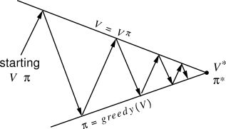

# 已知环境模型的问题

## Agent的目标

由于动态规划法需要知道环境模型的具体信息，因此在这里我们需要对模型做出定义。Agent在发出动作前已经知道了如下信息：

* 模型的状态转移概率 $$p(S_{t+1}=s'|S_t=s,A_t=a)$$ 
* 模型的奖励函数 $$r(s,a,s')=E[R_{t+1}|A_t=a,S_t=s,S_{t+1}=s']$$ 

根据上面的信息求解出最优策略 $$\pi(A_t=a|S_t)$$ 。当然，在前面的章节我们已经论证过，当获得了最优的价值函数后，就可以找到最优策略，这个过程可能会比较耗时，但是一定可以实现。我们将利用这个性质进行求解。

## 策略迭代法（Policy Iteration）

策略迭代法过程可以拆解成两个部分：策略评估（Policy Evaluation）和策略改进（Policy Improvement）

### 策略评估

策略评估是指从策略到价值函数的推导。也就是说，对于某个策略 $$\pi$$ ，求出利用这个策略所产生的价值函数 $$v_\pi(s)$$ 。利用贝尔曼方程，可以推导出求解价值函数的公式：

                                     $$v_\pi(s)=E_\pi[R_{t+1}+\gamma R_{t+2}+\gamma^2 R_{t+3}+\cdots|S_t=s]$$ 

                                                  $$= E_\pi[R_{t+1}+\gamma v_\pi(S_{t+1})|S_t=s]$$ 

                                                 $$= \sum\limits_a\pi(a|s)\sum\limits_{s'}p(s'|s,a)[r(s,a,s')+\gamma v_\pi(s')]$$ 

由于我们假设已经知道了环境模型的全部信息，所以在上面的公式中唯一未知的就是价值函数。求解这个公式有两种方法：一种是求公式的闭式解，也就是把它当成一个方程组去求解。如果模型中有 $$|S|$$ 个状态，那么这个方程组中就有 $$|S|$$ 个未知数。另一种是采用迭代的方式求解，由于上式中的 $$\gamma<1$$ ，所以价值函数最终会收敛。因此可以将价值函数初始化成 $$0$$ ，然后反复利用上面的公式进行迭代，直到价值函数收敛为止。关于判断价值函数收敛的方法，我们可以比较前后两轮价值函数数值的差距，当差距小于某一个确定的值时，就认为价值函数已经收敛。有关迭代式的价值评估可以用下面的算法来进行计算：

输入：需要评估的策略 $$\pi$$ 

初始化 $$v(s)=0,\forall s\in S^+$$ 

* Repeat
*          $$\Delta\gets 0$$ 
*          $$\text{For each } s\in S$$ :
*                   $$\text{temp} \gets v(s)$$ 
*                   $$v(s)\gets \sum_a\pi(a|s)\sum_{s'}p(s'|s,a)[r(s,a,s')+\gamma v(s')]$$ 
*                   $$\Delta \gets \max(\Delta,|\text{temp}-v(s))$$ 
* until $$\Delta<\theta$$ 

输出： $$v\simeq v_\pi$$ 

### 策略改进

策略评估完成了从策略到价值函数的转化，这就为下一步——寻找更好的策略打好了基础。寻找更好的策略需要调整策略内容，那么问题来了：当策略被调整后，价值函数会如何变化？对于某个状态 $$s$$ ，利用之前的策略，Agent会采用动作 $$a$$ ，最终状态 $$s$$ 的价值函数是 $$v_\pi(s)$$ 。如果把动作 $$a$$ 换成了 $$a'$$ ，并在后面的动作中继续使用之前的策略，价值函数会发生怎样的变化呢？

                                     $$q_\pi(s,a)=E_\pi[R_{t+1}+\gamma v_\pi(S_{t+1})|S_t=s,A_t=a]$$ 

                                                      $$=\sum\limits_{s'}p(s'|s,a)[r(s,a,s')+\gamma v_\pi(s')]$$ 

如果 $$q_\pi(s,a')$$ 比 $$v_\pi(s)$$ 大，那么证明对于状态 $$s$$ ，采用 $$a'$$ 这个动作会更好，反之则更差。如果 $$a'$$ 更好，则可以推理出，对于所有出现状态 $$s$$ 的场景，都可以用 $$a'$$ 替换掉原来的策略。于是我们就可以给出策略改进理论的定义：令 $$\pi$$ 和 $$\pi'$$ 是一对确定的策略，如果对所有的状态 $$s$$ ，都有：

                                                                    $$q_\pi(s,\pi'(s))\geq v_\pi(s)$$ 

那么策略 $$\pi'$$ 一定不弱于 $$\pi$$ 。也就是说，采用 $$\pi'$$ 评估的价值函数一定不会低于采用 $$\pi$$ 评估的价值函数：

                                                                          $$v'_\pi(s)\geq v_\pi(s)$$ 

这就是策略改进的方法，先对既有策略进行评估，然后尝试寻找每一个状态 $$s$$ 可能的改进策略。

                                   $$\pi'(s)=\arg \max\limits_a q_\pi(s,a)$$ 

                                              $$= \arg \max\limits_a E[R_{t+1}+\gamma v_\pi(S_{t+1})|S_t=s,A_t=a]$$   

                                              $$ = \arg \max\limits_a\sum\limits_{s'}p(s'|s,a)[r(s,a,s')+\gamma v_\pi(s')]$$   

从公式中可以看出，想让整体策略最优，那么每一步的策略都必须和其他策略配合，尽可能地保证最优。这和动态规划中最优子结构的思想十分一致。所以策略改进的目标就是利用上面的公式找到更好的字部分最优策略，然后利用动态规划中的最优子结构的特性将它们拼接起来，这样就完成了策略改进的工作。

### 策略迭代

当了解了上面提到的两个子步骤——策略评估和策略改进之后，我们将这两个部分串联起来，就得到了策略迭代的算法，如下面公式所示：

                                       $$\pi_0\xrightarrow[]{E}v_{\pi_0}\xrightarrow[]{I}\pi_1\xrightarrow[]{E}v_{\pi_1}\xrightarrow[]{I}\pi_2\cdots\xrightarrow[]{I}\pi_*\xrightarrow[]{E}v_*$$ 

其中的 $$E$$ 步就是策略评估，求出当前策略的价值函数； $$I$$ 步就是策略改进，根据当前的价值函数求出更好的策略。当策略不再改变时，算法收敛结束。整体上，策略迭代的算法可以由如下步骤表示。

（1）初始化： $$v(s)\in R,\pi(s)\in A(s),\forall s\in S$$ 

（2）策略评估：

* Repeat
*          $$\Delta\gets 0$$ 
*          $$\text{For each } s\in S$$ :
*                   $$\text{temp} \gets v(s)$$ 
*                   $$v(s)\gets \sum_a\pi(a|s)\sum_{s'}p(s'|s,a)[r(s,a,s')+\gamma v(s')]$$ 
*                   $$\Delta \gets \max(\Delta,|\text{temp}-v(s))$$ 
* until $$\Delta<\theta$$ 

（3）策略改进：

* $$\text{policy stable}\gets \text{true}$$ 
* $$\text{For each} s\in S$$ ：
*          $$a \gets\pi(s)$$ 
*          $$\pi(s)\gets\arg\max\limits_a\sum\limits_{s'}p(s'|s,a)[r(s,a,s')+\gamma v(s')]$$ 
*          $$\text{If}\  a \neq \pi(s),\text{then policy stable} \gets \text{False} $$ 
*          If policy\_stable, then stop and return $$v$$ and $$\pi$$ ；else go to（2）

## 价值迭代（Value Iteration）

策略迭代存在一个问题，就是在做策略评估的过程中，为了保证价值函数可以收敛，需要做很多轮的迭代计算，这实际上也比较消耗时间。那么一定要等待它完全收敛吗？如果在不完全收敛的情况下就停止策略评估的过程会不会有问题呢？实际上提前停止迭代时可以的，不需要等到价值函数完全收敛，只要保证它有一定的更新即可。价值迭代就是基于这样的思想产生的，它的算法结构和策略迭代完全相同，但是在策略评估过程中选择了最为激进的策略——只做一轮迭代就结束。算法如下：

随机初始化数组 $$v$$ （例如： $$v(s)=0,\forall s\in S^+$$ ）

* Repeat
*           $$\Delta \gets 0$$ 
*           $$\text{For each }s\in S$$ ：
*                      $$\text{temp} \gets v(s)$$ 
*                      $$v(s)\gets \max_a\sum_{s'}p(s'|s,a)[r(s,a,s')+\gamma v(s')]$$ 
*                      $$\Delta \gets \max(\Delta,|\text{temp}-v(s)|)$$ 
* until $$\Delta < \theta$$ 

输出：满足如下条件的策略 $$\pi$$ ： $$\pi(s)=\arg\max_a\sum_{s'}p(s'|s,a)[r(s,a,s')+\gamma v(s')]$$ 

## 策略函数和价值函数关系

从前面的两种算法中可以看出，策略函数和价值函数在求解中都起到关键性作用，那么两者的关系如何呢？从策略迭代法中可以看出，当策略函数固定时，数需要求解价值函数，当价值函数固定时，策略函数又可以变动；在价值迭代法中，当策略函数固定时，可以求出新的当前最优价值函数，当价值函数固定时，新的策略又可以被确定下来。所以两种算法本质上都是采用固定其中一个优化另一个的方式进行的，只是在方法上稍有不同，但在思想上是完全一致的。而这个思想就是所谓的“泛化策略迭代”（Generalized Policy Iteration），如下图所示。

根据这样的思路，我们可以灵活地调配优化策略和优化价值这两部分，使得算法更好地完成收敛。比如可以采用两轮迭代的策略迭代法，这样策略评估的计算会更精确一些，由此带来的整体的迭代轮数也会相应地减少一些。一旦构建出这样一个泛化策略迭代的框架之后，我们就可以根据实际问题的需要调整价值函数和策略函数各自计算的权重了。

