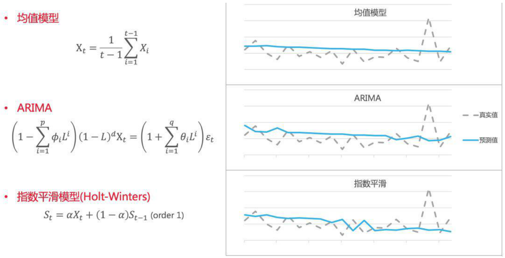
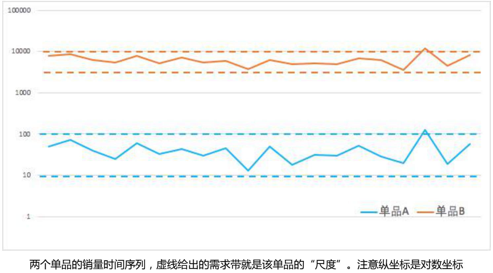

# 时序预测

时序预测是最核心也是最玄学的问题，核心有多核心？销量预测准，明天就是共产主义；玄学有多玄学？股票、天气，星盘周易。由于时序预测这种既核心又玄学的特性，大量的人扑上去研究去做，本篇整理比较大的几个方向思路，只根据个人应用经验，整理各方法适合的场景。

为节省大家时间，在这里先写下个人使用经验：

* **阿里、京东等电商的销量预测，短期预测使用机器学习，长期预测使用统计时序结合效果较好，深度学习在某些场景中效果较好。**因为已知影响销量的关键特征：商品特征\(价格、曝光、点击、加购、动销...\)、营销计划\(特价、资源位、满减、满赠...\)、用户画像\(消费力、购物习惯...\)等等。举例比如，同一商品其他都一样，一个时期资源位在首页曝光，一个时期在较深位置，销量变化明显；商品换了曝光宣传图，其他也都不变，也会发现销量变化等等。根据对比实验或经验可以得到影响销量特征，加入模型中即可得到短期预测较好效果。针对长期有季节性特征等测试Holt-Winters等时序模型效果较优。
* **微博、百度、知乎、B站等信息获取平台的流量预测，均值模型加模式学习。**流量状态大致可分为三种情况：常规时期，流量稳定；可预测非常规时期，比如国庆节，关于国庆内容流量增加；不可预测非常规时期，比如某明星出轨了等突发事件引起的流量暴涨。流量稳定和可预测非常规时期比较好处理，但不可预测的非常规时期，我们无法提前预知突发事件的发生，但可以通过模型学习不同突发事件发生后流量的增长及衰退模式，进行预测。
* **股票、期货等金融产品，不论采取什么模型方法，进行长期预测。**由于牵扯人群博弈，影响因素多，有发财报等可预知变化时期和中美关系缓和等不可预知变化时期。建议融合个人经验，进行长期低频操作。

## 统计时序

统计模型和时间序列模型是分析时间序列并进行预测的一种最通用的方法。在金融领域中，该方法得到了最广泛的应用。它主要通过对历史序列的分析和建模，将序列中的“趋势”和“白噪声”分离出来，最后通过对趋势的预测得到未来一段时间需求的变化。一些典型的时间序列模型有自回归滑动平均模型\(ARMA\)，差分整合移动平均自回归模型\(ARIMA\)，自回归条件异方差模型\(GARCH\)；还有一系列指数平滑模型，比如三次指数平滑模型\(Holt-Winters\)等。

均值模型顾名思义，对历史一段时间求均值，并作为未来每个时刻的需求预测：

                                                              $$X_t=\frac{1}{T}\sum\limits_{i=1}^TX_i$$

均值模型有很多变化，滑动均值，窗口可以开7天，14天...去峰谷平均，近5天值去掉一个最大值一个最小值，剩下3个值取平均作为预测...显然，均值模型过于简单，并且在实际应用中往往无法达到较好的效果。但是，构建均值模型具有以下两个重要意义：

1. 均值模型为需求预测提供了准确率的基线。如果要从 0 到 1 构建一个预测模型，第一步不是去构建一个复杂的模型，而是先看看简单的预测能达到什么样的准确率，作为后续模型迭代评估的标准。比如对于两个时间序列，机器学习模型预测的准确率分别是 70%和 80%，但是均值模型给出的的基线准确率分别是 50%和 75%，说明前者使用机器学习模型得到的提升更大。
2. 均值模型为预测值提供了合理的尺度。一般来说，某个单品的需求都在某个范围之内波动\(促销和缺货除外\)。需求不可能短时间激增，也不可能短时间骤减。因此这个波动的范围就是该单品需求的“尺度”，它可以通过均值模型简单得出。在机器学习回归模型中，某些单品销量的的预测值和真实值有时候会差一个量级。\(比如真实销量 1000 个，但模型预测 100 个。\)如果在模型中加入均值模型作为校准，就可以避免这样的偏差发生。

## 机器学习

时序预测是一种典型的回归问题。因此我们可以用机器学习的标准范式和流程进行解决，这里就不再具体详述，主要向大家分享两点在阿里需求预测实际处理中的经验：

1、特征工程。不同于其它机器学习模型，需求预测所构建的特征大多都是从历史的时间序列得到的。因此，如何从历史的时间序列中抽取特征就成为决定模型预测是否准确的关键。通常的时间序列抽取方法有滑动窗口平均值\(比如过去 7 天平均、过去 30 天平 均等\)，序列统计特征\(最大最小值、方差、偏度、峰度等\)。除此之外，我们在实践中还构建了很多高阶的特征，比如利用时间序列模型得到的预测值，还有通过多项式拟合时间序列得到的多项式系数等。除了历史的时间序列特征，我们还抽取了品仓的特征，作为该单品的固定属性。

上面讲到的无论时间序列模型还是机器学习模型，都只使用了历史的数据进行需求的预测。这些数据在通常的时间序列预测问题中已足够。未来所发生的某些数据波动都可以当作模型的“噪声”。但在新零售的场景中，未来的某些数据波动有可能是人为造成的\(比如双 11 大促等\)。如果我们提前知道了未来的运营计划，就可以对这些“噪声”进行较为准确的预测。营销对未来的需求产生作用的手段无非就是“引流”和“降价”两种。前者增加了某个商品的曝光量，而后者主要提升了单品的曝光转化率。这两种手段都会在不同程度上刺激了用户的需求，带来销量的提升。从数据和算法的角度，如果我们知道历史上已经发生了哪些营销活动\(比如去年的双 11 活动\)，并分析出它对营销期间销量的影响，就可以大致估计出未来的营销计划对需求的拉动作用，作出营销期间较准确的需求预测。除了营销的影响，供应链运营的某些行动也会导致销量的波动。比如单品从上级仓转换到下级仓\(下沉\)，品仓的汰换，出清等等。如果我们提前知道了这些运营计划，就能对未来的品仓进行准确的预测。在零售通的需求预测实践中，我们主要通过将营销计划转化为特征的方式来引入到机器学习模型中。

2、模型的个数。我们时序预测的品仓个数多达上万个，每个品仓的销量尺度都大小不一。有的品仓每天的销量多达上万个，有的却不足十个。在这样大尺度的品仓销量下，我们应该构建多少个机器学习模型对数据拟合并预测呢？有两种极端的方法。一种是对每个品仓进行建模。这种方法在实际操作中这是不可取的，一方面它会构建上万个机器学习模型，消耗大量的计算资源，导致模型难以计算和维护；另一方面模型没有用到品与品之间的相似性，无法得到准确的预测结果。另外一种方法是对所有的品仓构建一个统一的模型。这种方法虽然技术上最容易实现，但是它对模型本身的要求变得极高，需要模型在处理不同尺度上的预测都具有很好的表现。我们在实践过程中采取了折衷的方法。首先对品仓按照销量进行分层，然后对不同分层的品仓集合单独建模。一方面，同一层的品仓在销量尺度上大致一直，降低了对模型本身的要求；另一方面又可以用到品仓之间的相似性，提升了模型的泛化能力。同时，少量的模型也易于计算和维护。

## 深度学习

传统机器学习的一个弊端就是需要人工构建模型的特征，而在某些场景下深度学习可以自动生成显著的特征，端到端的解决模型预测问题。在零售通的需求预测里，我们也做了一部分深度学习的尝试。我们可以对获取到的数据分为两类。一类是历史的销量，流量，转化率等时间序列连续特征，它们可以通过深度学习模型进行特征编码。另一类是营销计划，品仓属性等离散特征，比如活动玩法，仓库所覆盖的城市等。它们由于特征的稀疏性，很难直接通过深度学习模型进行特征编码\(embedding除外\)因此，我们借鉴了推荐搜索中的 Wide & Deep mode，将时间序列特征放在 Deep 部分，强化它们的特征编码能力，同时将离散特征放在 Wide 部分，引入到模型的最后一层中进行预测。

为了更加适应历史时序这种特殊的数据结构，我们修改了 Deep 部分的网络结构，从全连接层变换到CNN、RNN等Deep encoders。这样，处理时序模型的各种深度学习技术\(比如注意力机制等\)都可以引入到该框架中。在某些品仓中，我们的深度学习模型得到了比传统机器学习更加稳定和优异的效果。

## SOURCE

新零售中的智能补货（II）— 需求预测  阿里零售通算法团队

