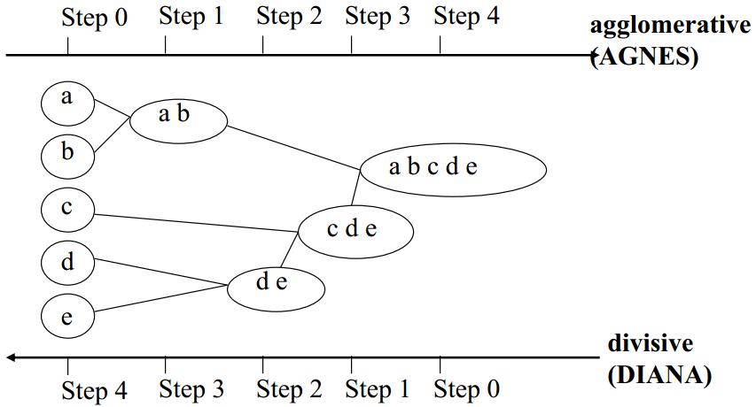
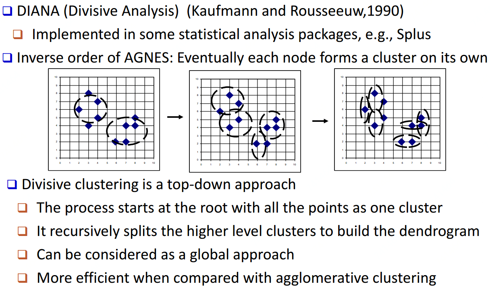
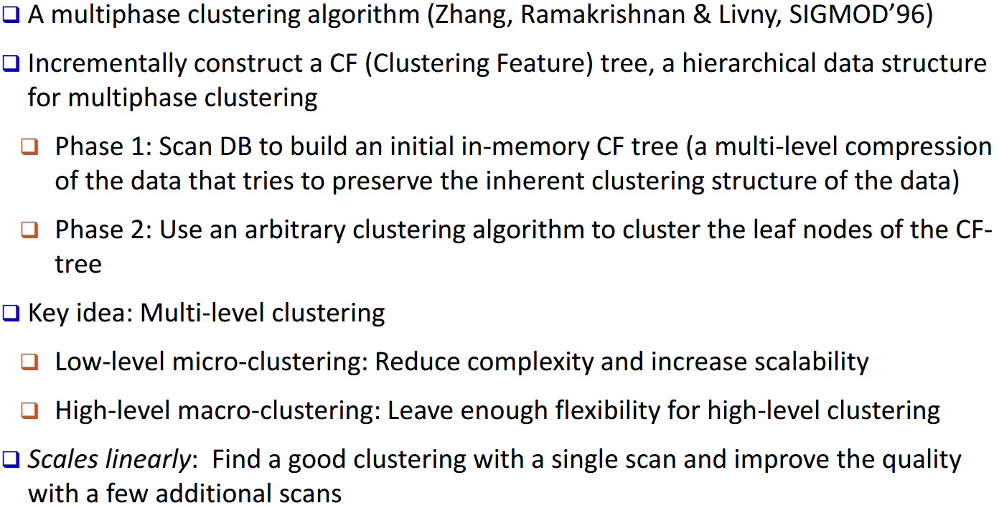
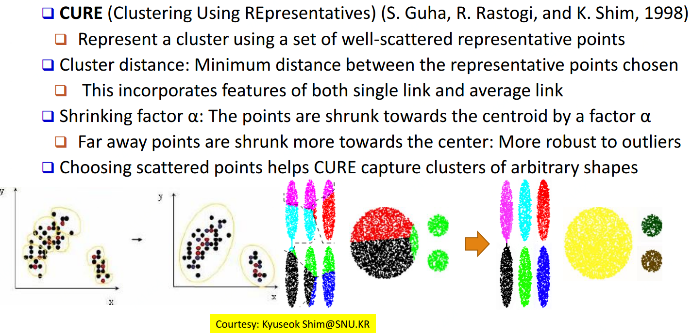
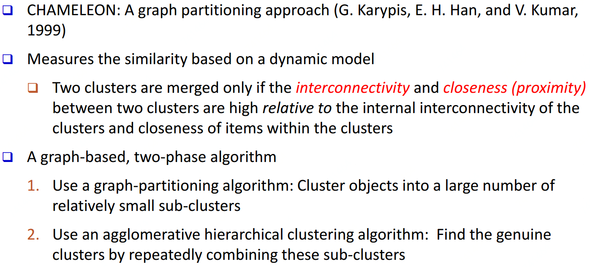
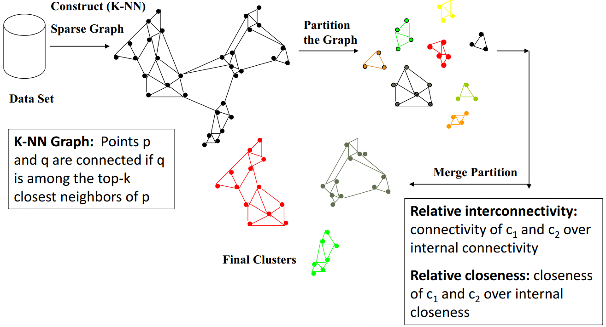

# 聚类分析

聚类即将给定的点分到与其尽可能相似的点的集合中。即与同类内元素相似，与其他类元素区分。

## 划分方法\(Partitioning Methods\)

### K-Means

K-Means即每一簇类使用类的中心来表示

```text
初始化：选取K个点作为起始中心点
迭代(收敛或变化小于阈值停止)：
    根据指定的中心点形成K个簇类
    重新计算每一簇类的中心点
```

常用的距离测量方法：马氏距离\( $$L_1$$norm \)、欧氏距离（ $$L_2$$norm ）、余弦距离


### K-Medoids

K-Means对异常值敏感，如果一个极端值会干扰结果。这时可以使用K-Medoids

```text
初始化：从数据点集中随机选择k个点，作为初始中心点；将待聚类的数据点集中的点，指派到最近的中心点
迭代(收敛或变化小于阈值停止)：
    对每中心点，和其每一个非中心点交换，计算交换后划分所生成的代价值，若交换造成代价增加，则取消交换
```


### K-Medians&K-Modes

相较均值\(mean\)，中位数\(median\)更不易被异常值影响，所以也可使用K-Medians，即将均值换为中位数

K-Means不好处理类别数据\(不好计算距离\)，此时可使用K-Modes\(众数\)。 K-Modes是用每个聚类中的众数（mode）做中心点。距离的定义也不同，通常K-Means较多使用欧式距离，K-Modes一般是汉明距离，也就是对于每个特征来说，如果不同记为1，相同则为0。

#### [K-Modes例子](http://sofasofa.io/forum_main_post.php?postid=1000500)

| 手机 | 国家 | 人群 | 颜色 |
| :---: | :---: | :---: | :---: |
| 1 | 中 | 青年 | 白 |
| 2 | 日 | 青年 | 黑 |
| 3 | 中 | 青年 | 蓝 |
| 4 | 中 | 青年 | 黑 |
| 5 | 日 | 青年 | 白 |
| 6 | 日 | 中年 | 黑 |
| 7 | 美 | 中年 | 蓝 |
| 8 | 美 | 中年 | 白 |
| 9 | 中 | 中年 | 黑 |
| 10 | 美 | 中年 | 黑 |

 假定我们选择聚类的数量K=2，初始点为手机1（中，青年，白）和手机6（日，中年，黑），得到

|  | 与手机1距离 | 与手机6距离 |
| :---: | :---: | :---: |
| 2 | 2 | 1 |
| 3 | 1 | 3 |
| 4 | 1 | 2 |
| 5 | 1 | 2 |
| 7 | 3 | 2 |
| 8 | 2 | 2 |
| 9 | 2 | 1 |
| 10 | 3 | 1 |

距离越小属于同一类别，若到距离相同则可以随机归于一类。

### Kernel K-Means

对于非凸簇类，可使用核函数映射到高维，再进行聚类。


## 层级方法\(Hierarchical Methods\)

生成一个聚类层级（用树状图展示），分为凝聚和分裂两种方法



凝聚方法：AGNES    分裂方法：DIANA    其他层级方法：BIRCH、CURE、CHAMELEON

### AGNES\(Agglomerative Nesting\)


### DIANA\(Divisive Analysis\)



### BIRCH\(Balanced Iterative Reducing and Clustering Using Hierarchies\)



### CURE\(Clustering Using Representatives\)



### CHAMELEON\(Hierarchical Clustering Using Dynamic Modeling\)





## 基于密度/网格方法\(Density- and Grid-Based Methods\)

基于密度方法：DBSCAN、OPTICS    基于网格方法：STING、CLIQUE

### DBSCAN\(Density-Based Spatial Clustering of Applications with Noise\)


### OPTICS\(Ordering Points To Identify Clustering Structure\)


### STING\(A Statistical Information Grid Approach\)


### CLIQUE\(Grid-Based Subspace Clustering\)


## Source






