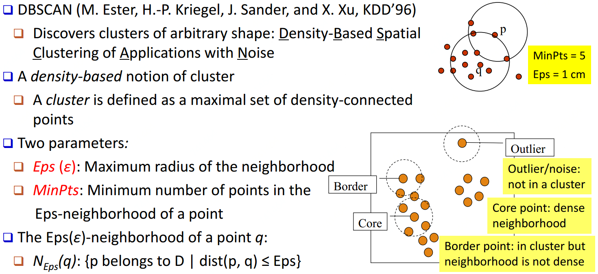
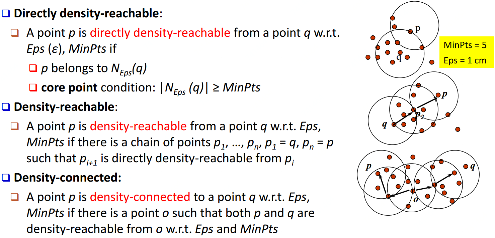
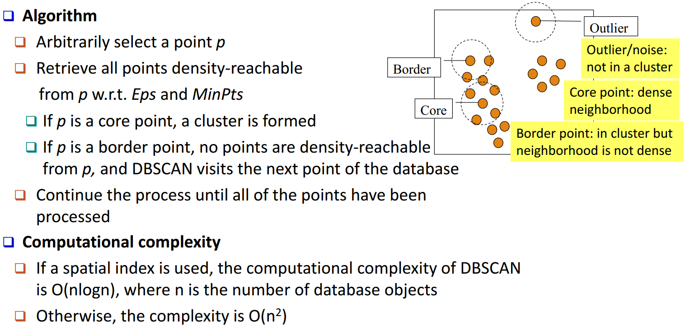
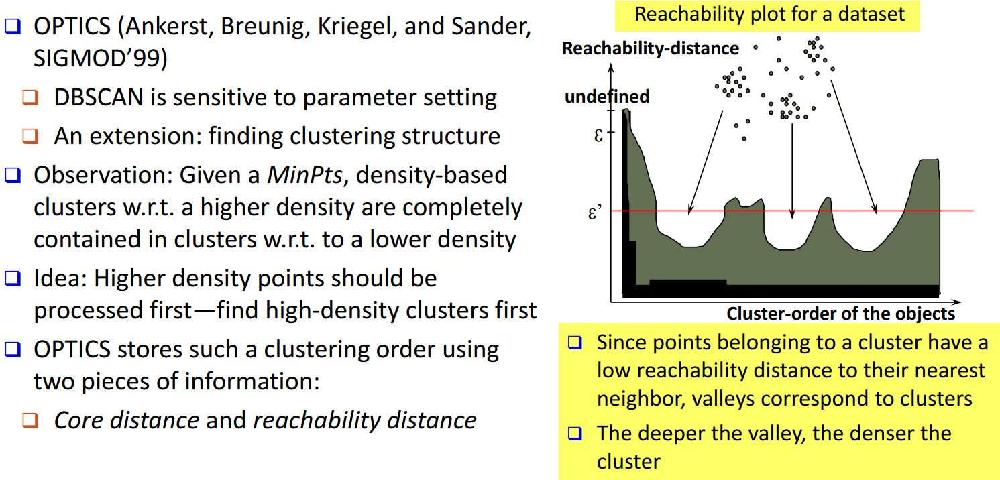
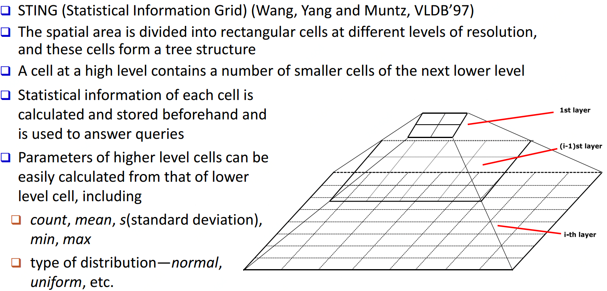
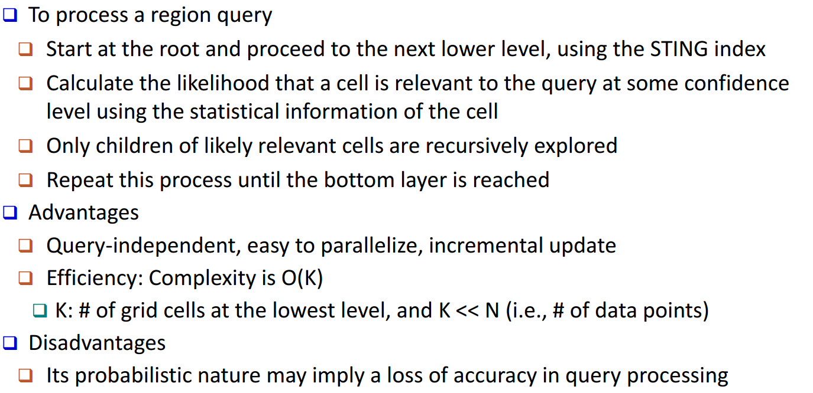
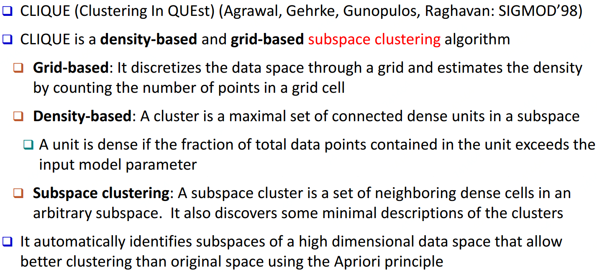
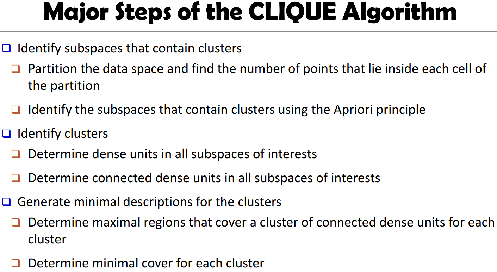

# 密度/网格聚类

基于密度方法：DBSCAN、OPTICS    基于网格方法：STING、CLIQUE

## DBSCAN\(Density-Based Spatial Clustering of Applications with Noise\)

## OPTICS\(Ordering Points To Identify Clustering Structure\)

## STING\(A Statistical Information Grid Approach\)

## CLIQUE\(Grid-Based Subspace Clustering\)

## 

