# 模式挖掘

## 概念定义

**模式\(pattern\)：**在一个数据集中经常一起出现的子集、子序列、子结构等

**项集\(Itemset\)：**一个或多个数据组成的集合；k项集\(k-itemset\)：有k项的项集 $$X=\{x_1,\dots,x_k\}$$ 

**\(绝对\)支持度\(count\)：** $$X$$ 在数据集中出现的次数或频率

**\(相对\)支持度\(Support, s\)：** $$X$$ 出现在某数据子集的概率； $$s(X) \geq \sigma_{threshold}$$表示 $$X$$ 为频繁项集

**置信度\(Confidence, c\)：**一个交易含有 $$ X$$ 又有 $$Y$$ 的条件概率 $$c = \frac{sup(X\cup Y)}{sup(X)}$$   

**闭合模式\(Closed Pattern\)：** $$X$$ 为频繁项集且不存在 $$Y \supset X$$和 $$X$$ 有相同支持度

**最大模式\(Max-Pattern\)：** $$X$$ 为频繁项集且不存在 $$Y \supset X$$ 

## 频繁项集挖掘

### Apriori

找到支持度大于 $$\sigma_{threshold}$$ 的项集，若 $$s({a,b})<\sigma_{threshold}$$ 了，那 $$s(a,b,c)$$ 更小，所以 $$(a,b,c)$$ 不可能是频繁项集，所以就不用计算了。反之， $$s(a,b,c)\geq \sigma_{threshold}$$ 那肯定 $$s(a,b)\geq \sigma_{threshold}$$。Apriori就基于此思想迭代和剪枝

```text
扫描数据库，生成高频1-项集(只有1项的)
while:
     根据上一轮k-项集生成(k+1)-项集作为候选集
     扫描数据库测试生成的(k+1)-项集候选集是否高频(这里构造时，新加的项必须也满足支持度)
     k = k+1
     Until: 没有大于阈值的 或 没有新候选集可生成
return: 返回所有满足频繁项集
```

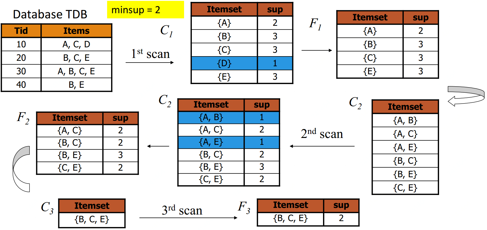

### FP-Growth

也基于了若k-项集都不满足支持度，那含k-项集的\(k+1\)项集也不满足的思想

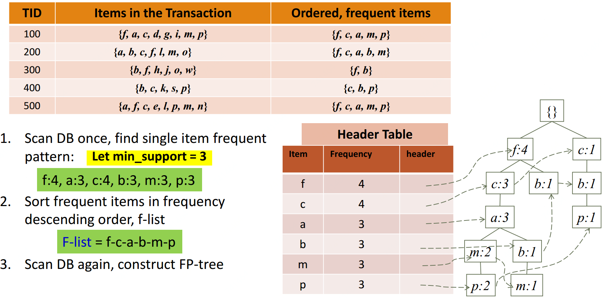

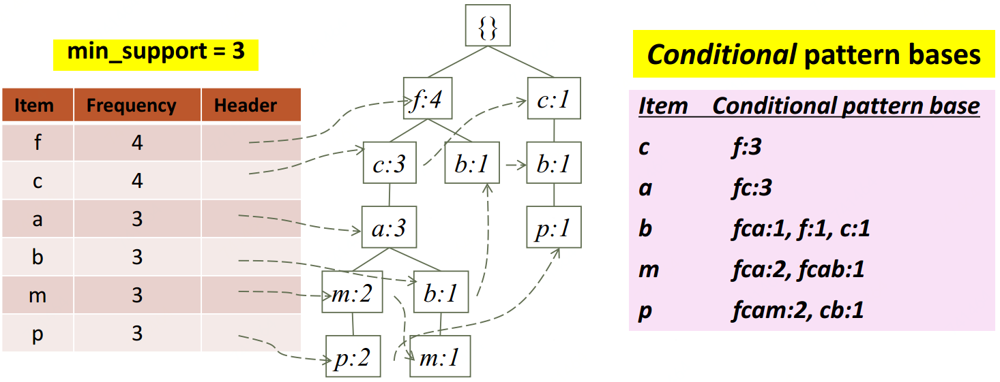

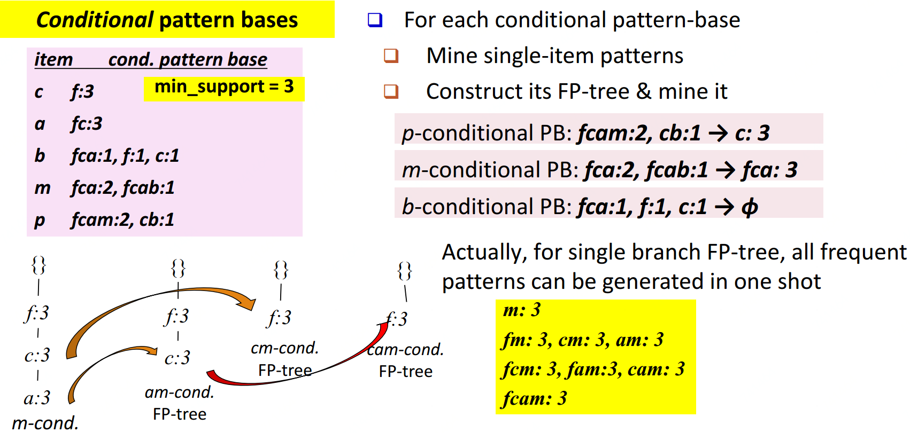

### 项集衡量

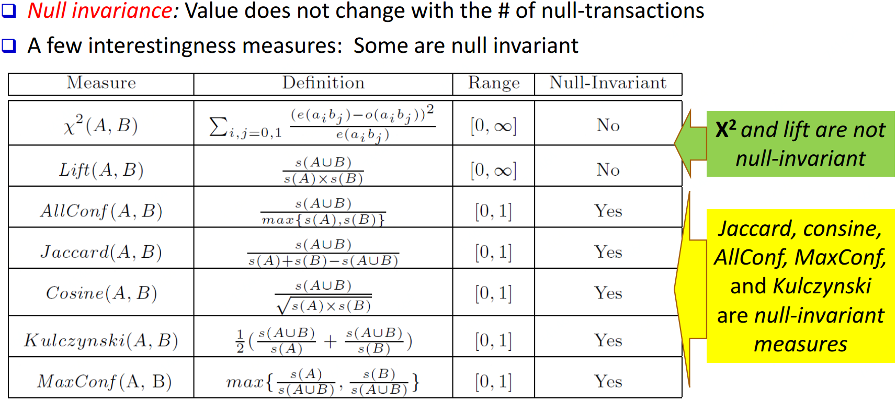

## 多样项集挖掘

### **多等级频繁项集**

比如在level 1中牛奶的支持度为0.1，level 2中脱脂牛奶为0.02，非脱脂牛奶为0.06

一般用最小的min-support传递给下一次level来解决

### 多维度频繁项集

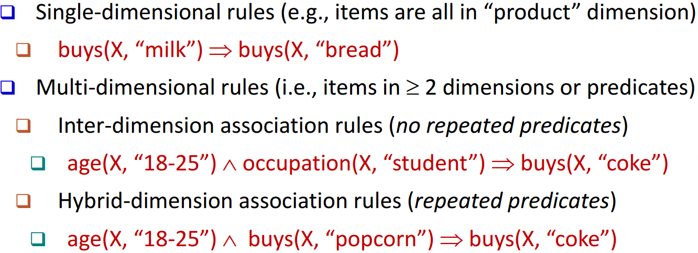

### 数值关联挖掘

比如年龄与薪水，两个数值型数据同时出现的相关问题的讨论

1、基于预分层级的静态离散分析：数据立方聚合

2、基于数据分布的动态离散分析

3、聚类：每个维度聚类，再相关联

4、偏差分析：性别\(女\)-&gt;薪水\(均值$7/hr\(两性一共$9/hr\)\)

### **稀有模式与**负模式挖掘

**稀有模式：**有一些项集支持度非常低\(比如买很贵的手表交易在所有订单中\)

**负模式：**不太可能同时出现的模式\(限牌，一顾客同时买两辆汽车\) $$sup(A\cup B) \ll sup(A)\times sup(B)$$ 

### 压缩及低冗余项集挖掘

**压缩数据：**  

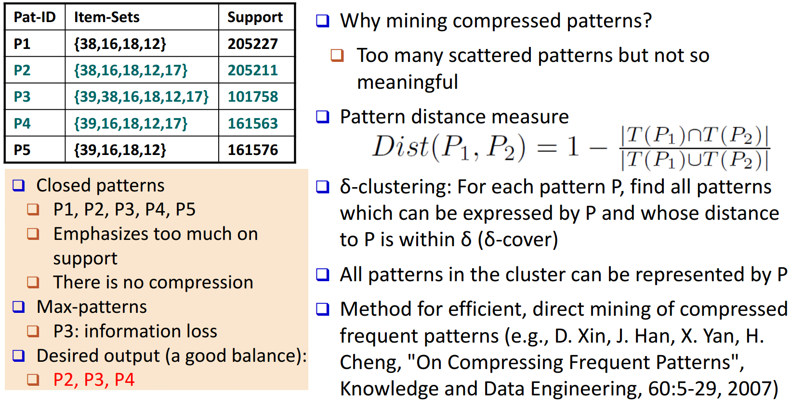

**低冗余：**

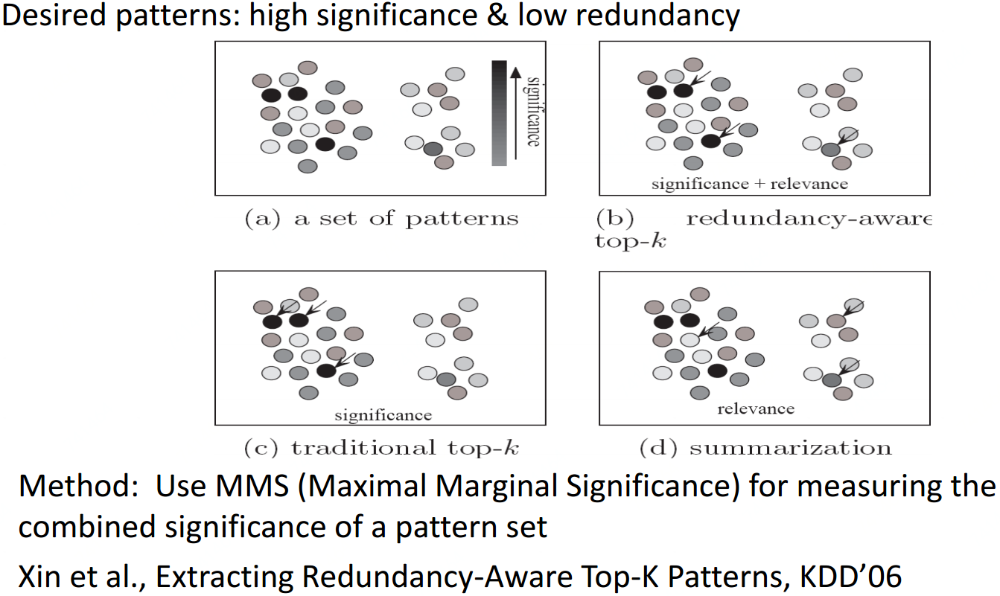

## 基于约束条件的频繁项集挖掘

有时我们并不关心所有的频繁项集，只想了解我们关心的。加约束条件去挖掘既灵活又可加快速度。

### 模式空间剪枝约束

#### **Anti-monotonic:** If constraint $$c$$ is violated, its further mining can be terminated

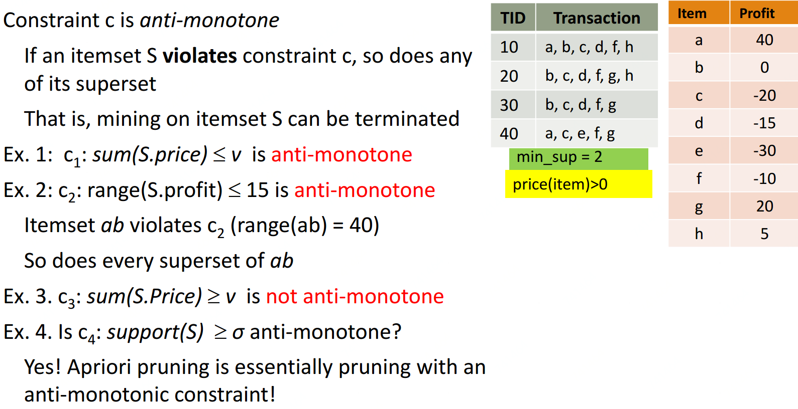

#### **Monotonic:** If $$c$$ is satisfied, no need to check $$c$$ again

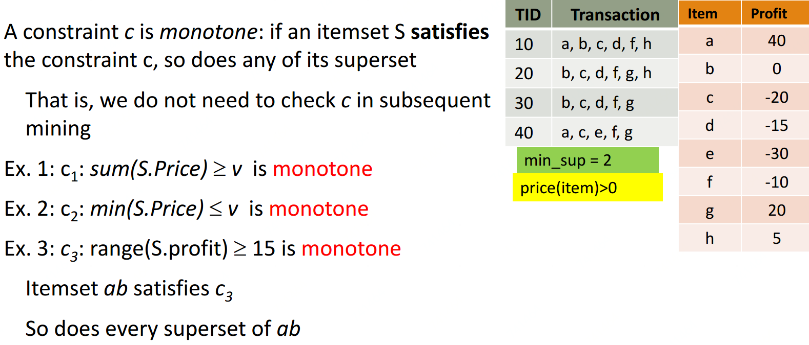

#### **Succinct:** If the constraint $$c$$ can be enforced by directly manipulating the data


#### **Convertible:**$$c$$ can be converted to monotonic or anti-monotonic if items can be ordered in processing

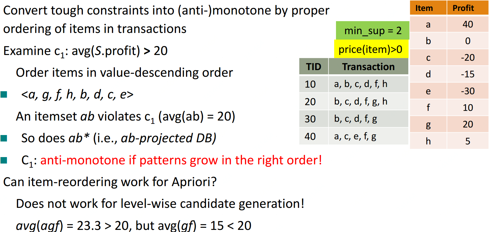

### 数据空间剪枝约束

#### **Data succinct:** Data space can be pruned at the initial pattern mining process


#### **Data anti-monotonic:** If a transaction $$t$$ does not satisfy $$c$$ ,then $$t$$ can be pruned to reduce data processing effort

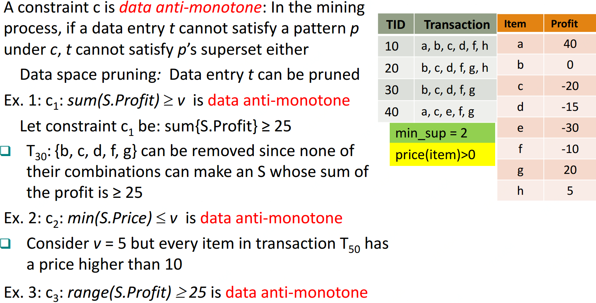

## 高维数据及庞大项集挖掘

```text
初始化：利用一个算法挖掘粗所有项比较少的频繁项集，比如3-项集
迭代：
    在每一轮，随机从当前的模式池选择出K种子模式
    对于每个的选择出的种子模式，我们找到所有以种子模式为中心且在界限内的模式(聚类)
    所有这些被找到的模式融合一起生成一个父模式集合
    所有的父模式集合作为下一轮的模式池进入下一次迭代
终止：在此轮迭代开始时，当前模式池包含不超过K模式
```

## 序列模式挖掘

### GSP

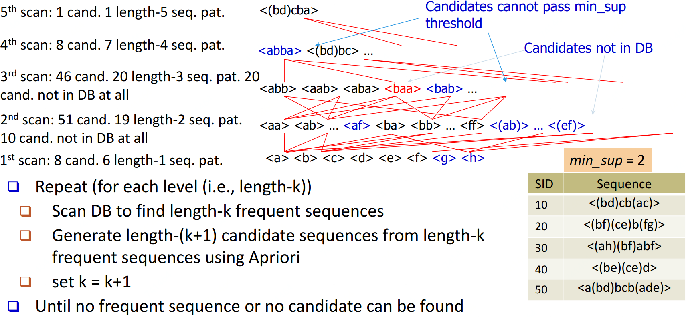

### SPADE

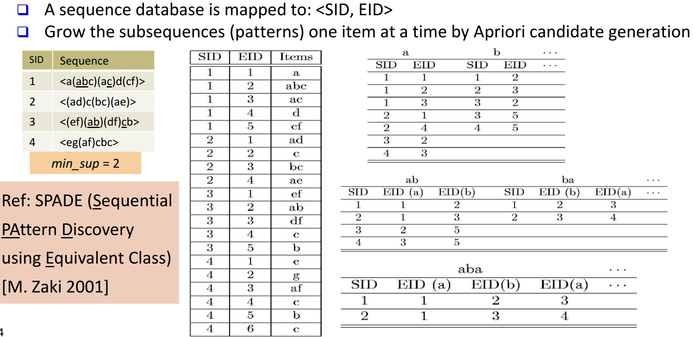

### PrefixSpan

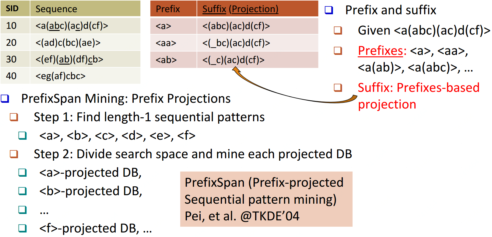

### CloSpan\(针对closed sequential patterns\)

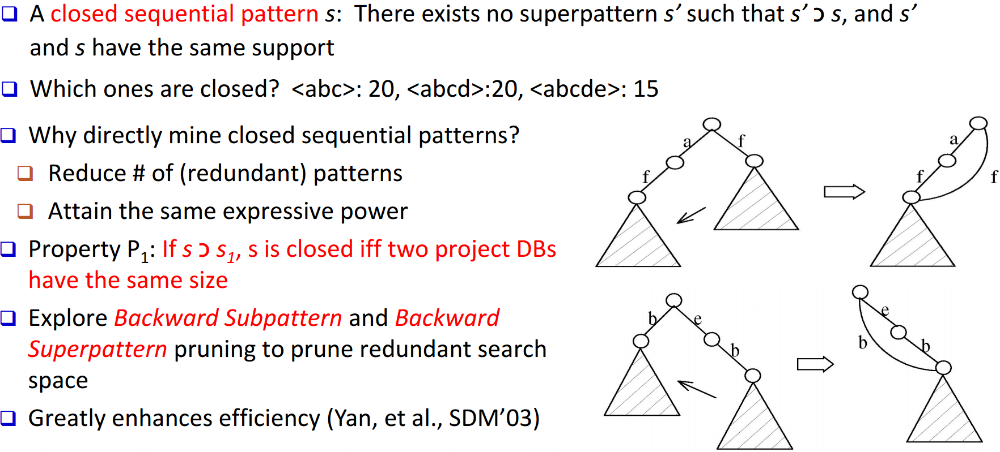

### 基于约束的序列模式挖掘

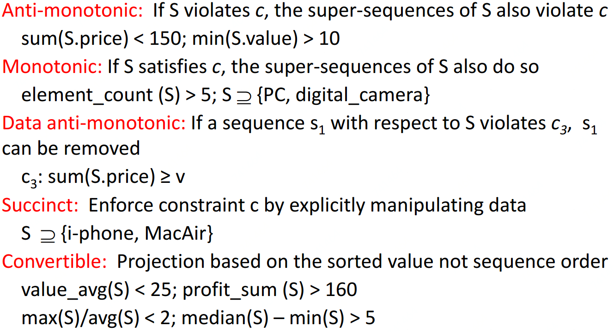

### 基于时间约束的序列模式挖掘

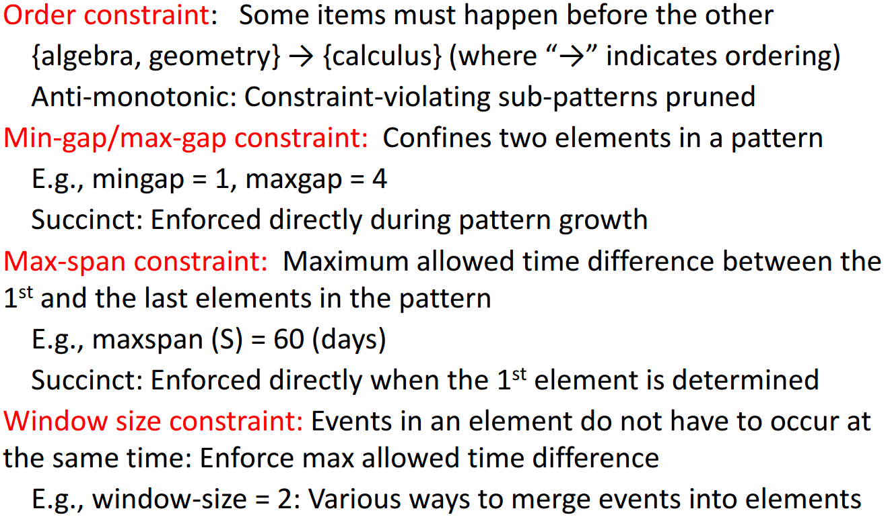

## 图模式挖掘

### 方法分类

候选集生成方式：Apriori vs. Pattern growth \(FSG vs. gSpan\)

搜索顺序：广度 vs. 深度

重复子图剔除：被动 vs. 主动\(gSpan\)

支持度计算：GASTON, FFSM, MoFa

模式发现顺序：Path-&gt;Tree-&gt;Graph \(GASTON\)

### 基于Apriori的方法

候选集生成 -&gt; 候选集剪枝 -&gt; 支持度计算 -&gt; 候选集剔除  迭代这四步至无法生成候选集或不满足支持度

候选集生成时扩展节点\(AGM算法\)还是扩展边\(FSG算法\)都可以，但是经测试是扩展边更高效

### 基于Pattern-Growth的方法

按深度优先来扩展边，从k边子图-&gt;\(k+1\)边子图-&gt;\(k+2\)边子图...

问题：这样会生成很多重复子图

解决：1、定义一个子图生成顺序  2、DFS生成树，用深度优先搜索扁平图  3、gSpan

#### gSpan

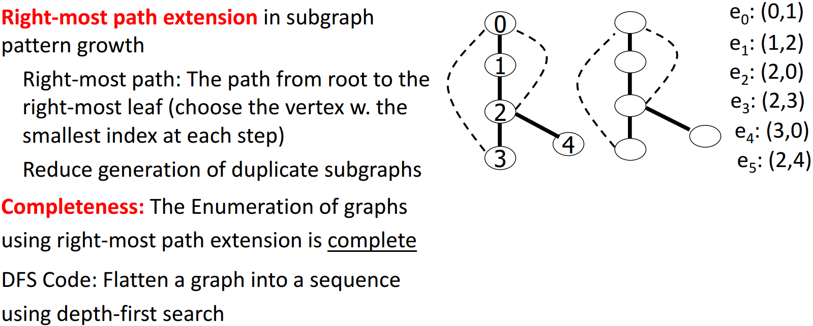

### 闭合图模式挖掘

如果不存在与高频图 $$G$$ 有相同支持度的父图 $$G'$$ ，则 $$G$$ 是闭合的；算法：CloseGraph

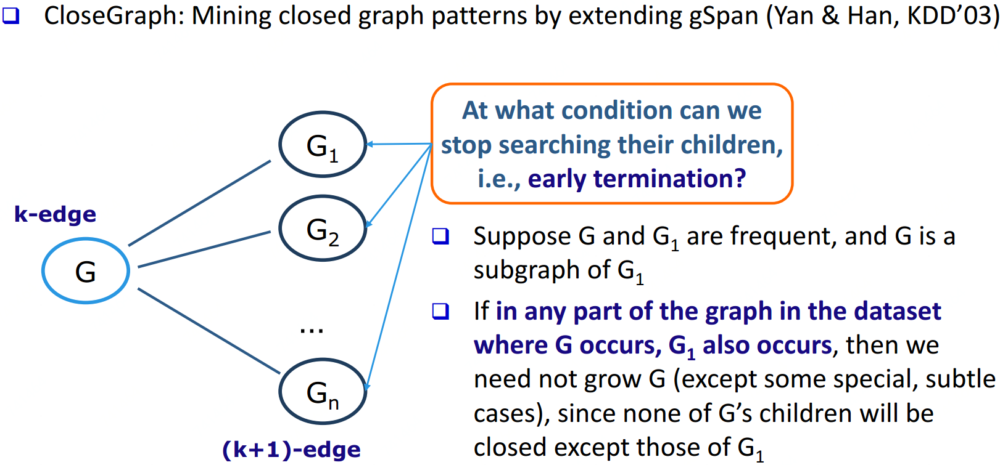

## Source




