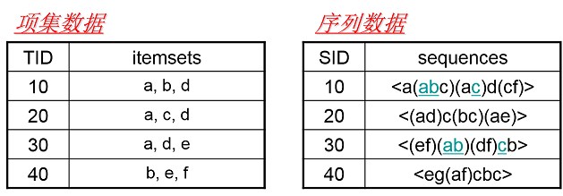
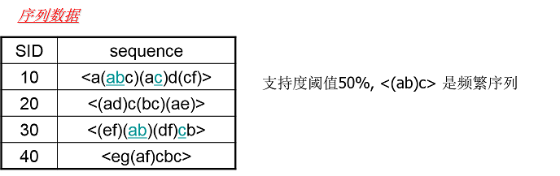
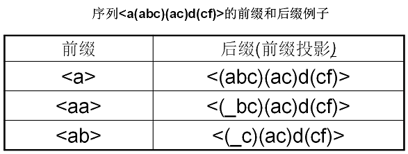
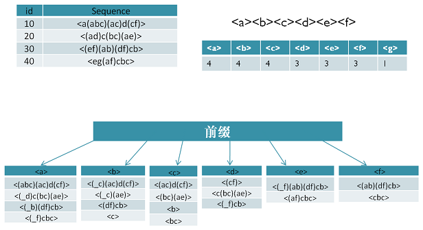
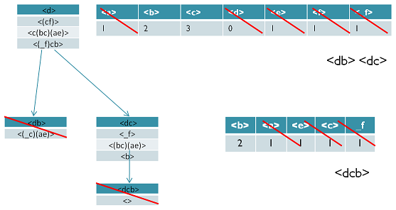

# 序列模式

## 项集数据和序列数据

首先我们看看项集数据和序列数据有什么不同，如下图所示。

左边的数据集就是项集数据，在Apriori和FP Tree算法中我们也已经看到过了，每个项集数据由若干项组成，这些项没有时间上的先后关系。而右边的序列数据则不一样，它是由若干数据项集组成的序列。比如第一个序列 $$\langle a(abc)(ac)d(cf)\rangle$$ ，它由a,abc,ac,d,cf共5个项集数据组成，并且这些项集有时间上的先后关系。对于多于一个项的项集我们要加上括号，以便和其他的项集分开。同时由于项集内部是不区分先后顺序的，为了方便数据处理，我们一般将序列数据内所有的项集内部按字母顺序排序。

注:序列模式的序列是指项集是有相互顺序的，但项集内部是没有顺序的。

## 子序列与频繁序列

了解了序列数据的概念，我们再来看看什么是子序列。子序列和我们数学上的子集的概念很类似，也就是说，如果某个序列 $$A$$ 所有的项集在序列 $$B$$ 中的项集都可以找到，则AA就是BB的子序列。当然，如果用严格的数学描述，子序列是这样的：

对于序列 $$a_1,a_2,\dots,a_m$$ 和序列 $$b_1,b_2,\dots,b_n$$ ，如果存在数字序列 $$1\leq j_1\leq j_2\leq \dots \leq j_n \leq m$$ ，满足 $$a_1\subseteq b_{j_1},a_2\subseteq b_{j_2},\dots,a_n\subseteq b_{j_n}$$ ，则称 $$A$$ 是 $$B$$ 的子序列。当然反过来说， $$B$$ 是 $$A$$ 的超序列。

而频繁序列则和我们的频繁项集很类似，也就是频繁出现的子序列。比如对于下图，支持度阈值定义为50%，也就是需要出现两次的子序列才是频繁序列。而子序列 $$\langle(ab)c\rangle$$ 是频繁序列，因为它是图中的第一条数据和第三条序列数据的子序列，对应的位置用蓝色标示。

## GSP

## SPADE

## PrefixSpan

PrefixSpan算法的全称是Prefix-Projected Pattern Growth，即前缀投影的模式挖掘。里面有前缀和投影两个词。那么我们首先看看什么是PrefixSpan算法中的前缀prefix。

在PrefixSpan算法中的前缀prefix通俗意义讲就是序列数据前面部分的子序列。如果用严格的数学描述，前缀是这样的：对于序列 $$A=a_1,a_2,\dots,a_n$$ 和序列 $$B=b_1,b_2,\dots,b_m$$ ， $$n\leq m$$ 。满足 $$a_1=b_1,a_2=b_2,\dots,a_{n-1}=b_{n-1}$$ ，而 $$a_n\subseteq b_n$$ ，则称 $$A$$ 是 $$B$$ 的前缀。比如对于序列数据 $$B=\langle a(abc)(ac)d(cf)\rangle$$ ，而 $$A=\langle a(abc)a\rangle$$ ，则 $$A$$ 是 $$B$$ 的前缀。当然 $$B$$ 的前缀不止一个，比如 $$\langle a(ab)\rangle$$ 也是 $$B$$ 的前缀。

看了前缀，我们再来看前缀投影，其实前缀投影这儿就是我们的后缀，有前缀就有后缀嘛。前缀加上后缀就可以构成一个我们的序列。下面给出前缀和后缀的例子。对于某一个前缀，序列里前缀后面剩下的子序列即为我们的后缀。如果前缀最后的项是项集的一部分，则用一个“\_”来占位表示。

下面这个例子展示了序列 $$\langle a(abc)(ac)d(cf)\rangle$$ 的一些前缀和后缀，还是比较直观的。要注意的是，如果前缀的末尾不是一个完全的项集，则需要加一个占位符。

在PrefixSpan算法中，相同前缀对应的所有后缀的结合我们称为前缀对应的投影数据库。

### 算法思路

现在我们来看看PrefixSpan算法的思想，PrefixSpan算法的目标是挖掘出满足最小支持度的频繁序列。那么怎么去挖掘出所有满足要求的频繁序列呢。回忆Aprior算法，它是从频繁1项集出发，一步步的挖掘2项集，直到最大的K项集。PrefixSpan算法也类似，它从长度为1的前缀开始挖掘序列模式，搜索对应的投影数据库得到长度为1的前缀对应的频繁序列，然后递归的挖掘长度为2的前缀所对应的频繁序列...以此类推，一直递归到不能挖掘到更长的前缀挖掘为止。

比如对应于我们第二节的例子，支持度阈值为50%。里面长度为1的前缀包括 $$\langle a\rangle  ,\langle b\rangle  ,\langle c\rangle  ,\langle d\rangle  ,\langle e\rangle  ,\langle f\rangle  ,\langle g\rangle $$ ，我们需要对这7个前缀分别递归搜索找各个前缀对应的频繁序列。如下图所示，每个前缀对应的后缀也标出来了。由于 $$g$$ 只在序列4出现，支持度计数只有1，因此无法继续挖掘。我们的长度为1的频繁序列为 $$\langle a\rangle  ,\langle b\rangle  ,\langle c\rangle  ,\langle d\rangle  ,\langle e\rangle  ,\langle f\rangle $$ 。去除所有序列中的 $$g$$ ，即第4条记录变成 $$\langle e(af)cbc\rangle$$ 。

现在我们开始挖掘频繁序列,分别从长度为1的前缀开始。这里我们以 $$d$$ 为例子来递归挖掘，其他的节点递归挖掘方法和 $$d$$ 一样。

方法如下图，首先我们对 $$d$$ 的后缀进行计数，得 $$\{a:1, b:2, c:3, d:0, e:1, f:1, \_f:1\}$$ 。注意 $$f$$ 和 $$\_f$$ 不一样的，因为前者是在和前缀 $$d$$ 不同的项集，而后者是和前缀 $$d$$ 同项集。由于此时 $$a,d,e,f,\_f$$ 都达不到支持度阈值，因此我们递归得到的前缀为 $$d$$ 的2项频繁序列为 $$\langle db\rangle$$ 和 $$\langle dc\rangle$$ 。

接着我们分别递归 $$\langle db\rangle$$ 和 $$\langle dc\rangle$$为前缀所对应的投影序列。首先看 $$\langle db\rangle$$ 前缀，此时对应的投影后缀只有 $$\langle \_c(ae)\rangle$$ ，此时 $$\_c,a,e$$ 支持度均达不到阈值，因此无法找到以 $$\langle db\rangle$$ 为前缀的频繁序列。现在我们来递归另外一个前缀 $$\langle dc\rangle$$。以 $$\langle dc\rangle$$为前缀的投影序列为 $$\langle\_f\rangle, \langle(bc)(ae)\rangle,\langle b\rangle$$ ，此时我们进行支持度计数，结果为 $$\{b:2, a:1, c:1, e:1, \_f:1\}$$ ，只有 $$b$$ 满足支持度阈值，因此我们得到前缀为 $$\langle dc\rangle$$的三项频繁序列为 $$\langle dcb\rangle$$ 。

我们继续递归以 $$\langle dcb\rangle$$ 为前缀的频繁序列。由于前缀 $$\langle dcb\rangle$$ 对应的投影序列 $$\langle(\_c)ae\rangle$$ 支持度全部不达标，因此不能产生4项频繁序列。至此以 $$d$$ 为前缀的频繁序列挖掘结束，产生的频繁序列为 $$\langle d\rangle\langle db\rangle\langle dc\rangle\langle dcb\rangle$$ 。

同样的方法可以得到其他以 $$\langle a\rangle,\langle b\rangle,\langle c\rangle,\langle e\rangle,\langle f\rangle$$ 为前缀的频繁序列。

### 算法流程

### 算法实践

## CloSpan\(针对closed sequential patterns\)

## 基于约束的序列模式挖掘

## 基于时间约束的序列模式挖掘

## Source



