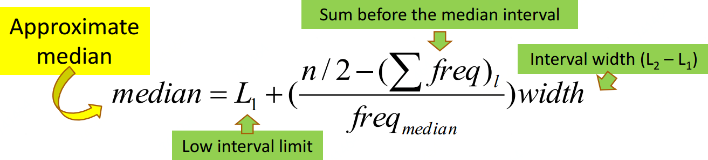
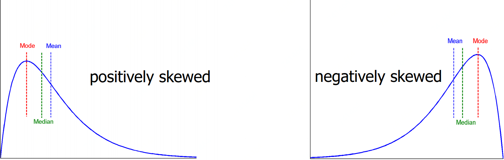
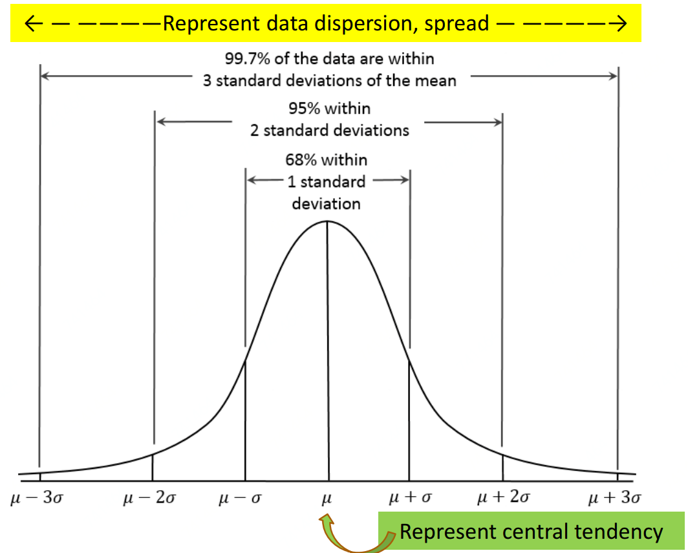
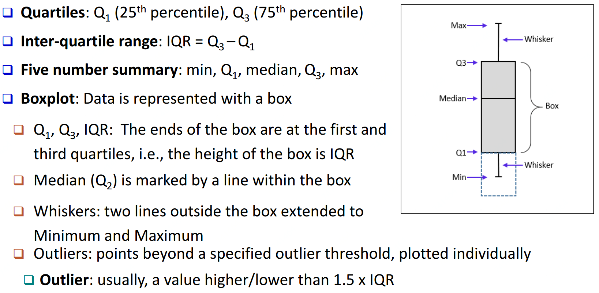
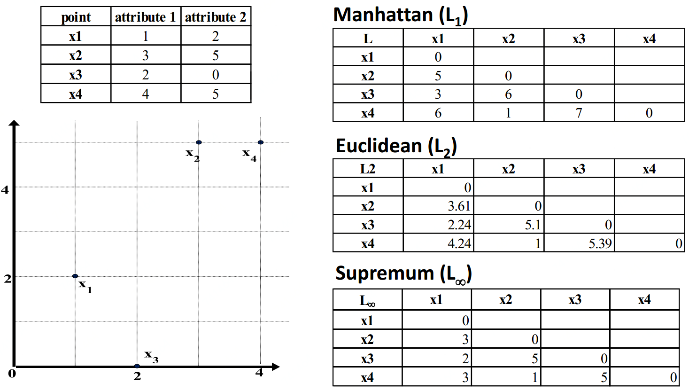
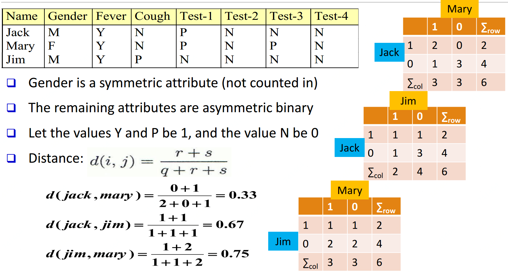
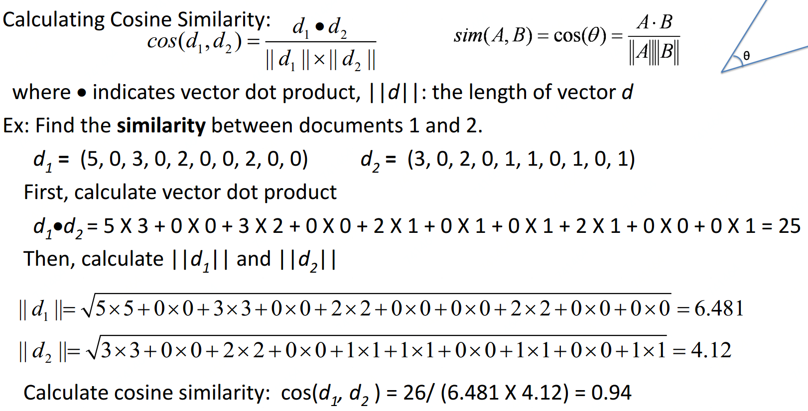
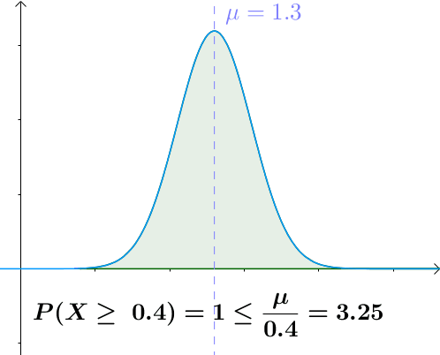
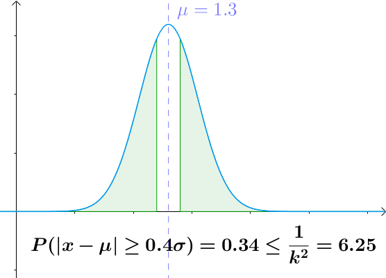

# 数据预分析

## 数据及属性

### 数据类型

**1\) 记录数据:** 关系型记录\(数据库中\)、数据矩阵、交易数据、文档数据等

**2\) 图&网络:** 交通网络、万维网、分子结构、社交网络等

**3\) 有序数据:** 视频数据\(连续图片\)、时间数据\(时间序列\)、顺序数据\(连续交易记录、基因序列\)等

**4\) 空间、图片与多媒体数据：**地图 ****、图片、视频等

### 结构化数据的四个特征

**1、维度\(Dimensionality\)                                           2、稀疏程度\(Sparsity\)**

**3、解析度\(Resolution\)\[比如全脂牛奶是牛奶的细分一级\]           4、分布\(Distribution\)**

### 属性

#### 非数字类型的属性：

1、名词性属性：类别状态的数据，或者一类名称（比如，红、绿、蓝）

2、二元性属性：只有 $$2$$ 个状态的数据（比如，男/女）

3、有序属性：有一定排序含义的数据（比如，小、中、大）

#### 数字类型的属性

1、数量性属性：整数或实数等

2、间隔性属性：基于等间隔测量的属性（比如，日历）

3、比率性属性： 百分比等

### 离散属性 vs. 连续属性

#### Discrete Attribute:

1、Has only a finite or countably infinite set of values

2、Sometimes, represented as integer variables

3、Binary attributes are a special case of discrete attributes

#### Continuous Attribute:

1、Has real numbers as attribute values

2、Practically, real values can only be measured and represented using a finite number of digits

3、Continuous attributes are typically represented as floating-point variables

## 统计指标

### 衡量中心趋势

#### 均值\(Mean\)

$$n$$ 是sample的大小: $$\overline{x} = \frac{1}{n}\sum \limits_{i=1}^n x_i$$，$$N$$是population的大小: $$\mu = \frac{\sum x}{N}$$，加权算数平均: $$\overline{x} = \frac{\sum \limits_{i=1}^n w_i x_i}{\sum \limits_{i=1}^n w_i}$$ 

#### 中位数\(Median\)

$$median = L_1 + (\frac{n/2-(\sum freq)_l}{freq_{median}})width$$ 

#### 众数\(mode\)

众数：数据集中出现频率最高的

Empirical formula\(单众数情况\)： $$mean-mode = 3\times(mean-median)$$ 

#### 对称与倾斜数据\(Symmetric vs. Skewed data\)

  

### 衡量数据分布

#### 正态\(高斯\)分布性质

#### 方差与标准差

方差：$$sample: s^2, population: \sigma^2$$ 

$$s^2 = \frac{1}{n-1}\sum_{i=1}^n(x_i-\overline{x})^2=\frac{1}{n-1}[\sum \limits_{i=1}^nx_i^2-\frac{1}{n}(\sum \limits_{i=1}^nx_i)^2]$$ 

$$\sigma^2 = \frac{1}{N}\sum \limits_{i=1}^n(x_i-\mu)^2 = \frac{1}{N}\sum \limits_{i=1}^n x_i^2 - \mu^2$$ 

标准差：方差的平方根

### 图示数据离散

箱型图\(Boxplot\)：只展示5个数\( $$min,\ Q_1,\ median,\ Q_3,\ max$$ \)的总结

分位图\(Quantile plot\)：每个 $$x_i$$ 值对应的 $$f_i$$ 表示大概 $$f_i \%$$ 的数据比 $$x_i$$ 小

柱状图\(Histogram\)： 横轴表示值，纵轴表示频率

点图\(Scatter plot\)：散点图

## 数据可视化

### 几何映射可视化\(Geometric Projection Visualization Techniques\)

1、Direct visualization    2、Scatter plot and scatter plot matrices    3、Landscapes    

4、Projection pursuit technique    5、Prosection views    6、Hyperslice    7、Parallel coordinates

### 基于图标的可视化\(Icon-based Visualization Techniques\)

经典方法：Chernoff Faces, Stick Figures

常规方法：

    Shape coding：用形状表示某种信息编码特性

    Color icons：用带颜色图标表示更多信息

    Tile bars：用小图标表示文档检索相关特征向量

### 层级可视化\(Hierarchical Visualization Techniques\)

1、Dimensional Stacking    2、Worlds-within-Worlds    3、Tree-Map    4、Cone Trees    5、InfoCube

### 复杂数据及其关系可视化\(Complex Data and Relations\)

1、Tag Cloud    2、Social Network

## 相似度与距离

### 数字数据属性

#### Z-score

    $$z= \frac{x-\mu}{\sigma}$$ ， $$x$$ 是需要标准化数据， $$\mu$$ 是统计均值， $$\sigma$$ 是标准差。即计算与均值差几个标准差

#### 马氏距离\(Mahalanobis distance\)

                     $$d(i,j)=\sqrt[p]{|x_{i1}-x_{j1}|^p+|x_{i2}-x_{j2}|^p+\cdots+|x_{il}-x_{jl}|^p}$$ 

其中， $$p=1$$: \($$L_1$$ norm\) **Manhattan \(or city block\) distance**

                     ****$$d(i,j) = |x_{i1}-x_{j1}|+|x_{i2}-x_{j2}|+\cdots+|x_{il}-x_{jl}|$$ ****

其中， $$p=2$$: \($$L_2$$ norm\) **Euclidean distance**

                     ****$$d(i,j)=\sqrt{|x_{i1}-x_{j1}|^2+|x_{i2}-x_{j2}|^2+\cdots+|x_{il}-x_{jl}|^2}$$ ****

其中， $$p\to \infty$$: \($$L_{max}$$ norm, $$L_{\infty}$$ norm\) **"Supremum" distance**

                     ****$$d(i,j) = \mathop{lim} \limits_{p\to\infty}\sqrt[p]{|x_{i1}-x_{j1}|^p+|x_{i2}-x_{j2}|^p+\cdots+|x_{il}-x_{jl}|^p} = \mathop{max} \limits_{f=1}^l |x_{if}-x_{jf}|$$ 

### 二元数据属性

|  |  | object j | object j | object j |
| :---: | :---: | :---: | :---: | :---: |
|  |  | 1 | 0 | sum |
| object i | 1 | q | r | q+r |
| object i | 0 | s | t | s+t |
| object i | sum | q+s | r+t | p |

对称二元变量： $$d(i,j)=\frac{r+s}{q+r+s+t}$$ 

非对称二元变量： $$d(i,j)=\frac{r+s}{q+r+s}$$ 

Jaccard系数\(非对称二元变量的相似度\)： $$sim_{Jaccard}(i,j) = \frac{q}{q+r+s}$$ 

### 分类数据属性

比如颜色\(红，黄，蓝，绿...\)

#### Simple matching

$$d(i,j)= \frac{p-m}{p}$$ ，$$m$$：$$\#$$ of match，$$p$$： $$\#$$ of variables

#### Use a large number of binary attributes

Creating a new binary attribute for each of the $$M$$ nominal states

### 有序数据属性

比如年级\(大一，大二，大三，大四\)

用 $$z_{if}= \frac{r_{if}-1}{M_f-1}$$ 映射到 $$[0,1]$$ 区间  eg.大一：0；大二：1/3；大三：2/3；大四：1

### 混合数据属性

包含多种类型属性： $$d(i,j)=\frac{\sum \limits_{f=1}^p w_{ij}^{(f)}d_{ij}^{(f)}}{\sum \limits_{f=1}^p w_{ij}^{(f)}}$$ ，即加权去算

### 比较两向量

余弦距离： $$cos(d_1,d_2)=\frac{d_1\cdot d_2}{||d_1||\times||d_2||}$$ ，分子为向量点积，分母为向量长度相乘

### 比较两概率分布

KL散度\(KL Divergence\)：

离散数据： $$D_{KL}(p(x)||q(x))=\sum \limits_{x\in X}ln\frac{p(x)}{q(x)}$$ 

连续数据： $$D_{KL}(p(x)||q(x))=\int_{-\infty}^{\infty}p(x)ln\frac{p(x)}{q(x)}dx$$ 

## [马尔可夫与切比雪夫不等式](https://www.zhihu.com/question/27821324)

 切比雪夫不等式，描述了这样一个事实，事件大多会集中在平均值附近，比如假如中国男人平均身高1.7m，那么不太可能出现身高17m的巨人。而切比雪夫不等式是马尔可夫不等式的一个特殊形式。

### 马尔可夫不等式

                                                     $$P(X\geq a)\leq \frac{E(X)}{a}$$ , 其中 $$X \geq 0$$ 

#### 马尔可夫不等式证明

如上图， $$P(X\geq a)$$ 其实就是绿色部分面积：

                                             $$P(X\geq a) = \int_{a}^{+\infty}f(x)dx$$ 

由于 $$X\geq 0$$ 且 $$X\geq a$$ 所以 $$\frac{X}{a}\geq 1$$：

                                 $$P(X\geq a) = \int_{a}^{+\infty}f(x)dx \leq \int_{a}^{+\infty}\frac{X}{a} f(x)dx$$ 

根据期望的定义：

                                   $$E(\frac{X}{a}) = \int_{-\infty}^a \frac{X}{a}f(x)dx+\int_{a}^{+\infty} \frac{X}{a}f(x)dx$$ 

显然 $$\int_{-\infty}^a \frac{X}{a}f(x)dx \geq 0$$，所以综合上面两式：

$$P(X\geq a) = \int_{a}^{+\infty}f(x)dx \leq \int_{a}^{+\infty}\frac{X}{a} f(x)dx \leq E(\frac{X}{a}) = \int_{-\infty}^a \frac{X}{a}f(x)dx+\int_{a}^{+\infty} \frac{X}{a}f(x)dx$$

因为 $$a$$ 为常数， $$E(\frac{X}{a})=\frac{E(X)}{a}$$：

                                            $$P(X\geq a)\leq E(\frac{X}{a}) = \frac{E(X)}{a}$$ 

#### 马尔可夫不等式例子

计算百万年薪人概率，数据人均收入 $$\mu$$：51350元，人均收入标准差 $$\sigma$$ ：44000元

根据马尔可夫不等式： $$P(X\geq 1000000) \leq \frac{51350}{1000000} \approx 5.14\%$$ 

也就是说20个人中就有一个年薪百万的

### 切比雪夫不等式

                                                           $$P(|X-\mu|\geq k\sigma) \leq \frac{1}{k^2}$$ 

#### 切比雪夫不等式证明

将 $$|X-\mu|$$ 代入马尔可夫不等式 $$P(X\geq a) \leq \frac{E(X)}{a}$$ ：

                                             $$P(|X-\mu|\geq a) \leq \frac{E(|X-\mu|)}{a}$$ 

等价于：

                                         $$P((X-\mu)^2\geq a^2) \leq \frac{E((X-\mu)^2)}{a^2} = \frac{\sigma^2}{a^2}$$ 

令 $$k=\frac{a}{\sigma}$$ \(可知 $$k > 0$$ \)：

                                                    $$P(|X-\mu|\geq k\sigma) \leq \frac{1}{k^2}$$ 

#### 切比雪夫不等式例子

还是之前的数据：计算百万年薪人概率，数据人均收入 $$\mu$$：51350元，人均收入标准差 $$\sigma$$ ：44000元

根据马尔可夫不等式： $$P(|X-51350|\geq 21\times 44000) \leq \frac{1}{21^2} \approx 0.22\%$$ 

也就是说1000个人中就有两个年薪百万的

**知道数据均值、方差等数据，根据切比雪夫不等式可以得到置信区间大于多少的至少需要多少数据量：**

                                                   ****$$P(|X-E{X}|\geq \epsilon) < \frac{\sigma^2}{n\epsilon^2}$$ ****

## Source





