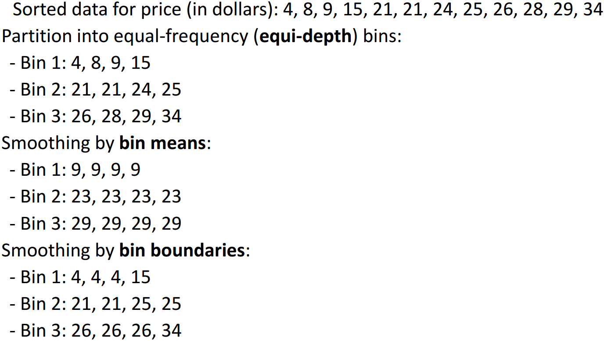
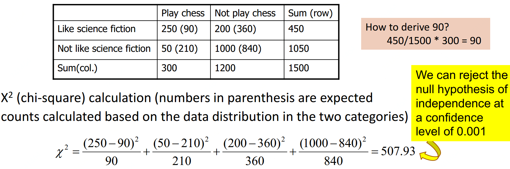
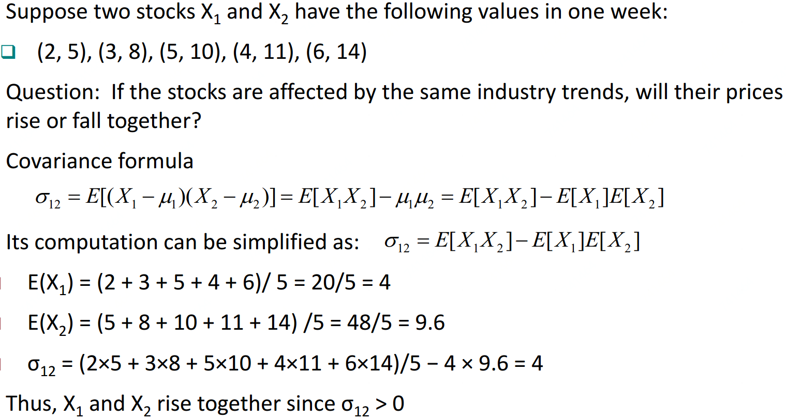
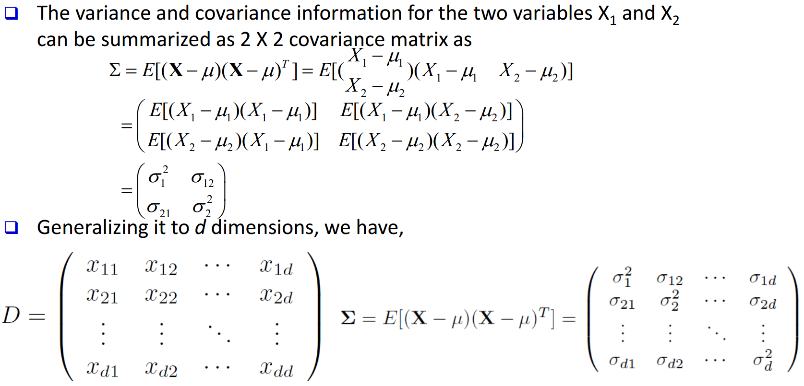

# 数据预处理

## 数据预处理主要任务

**数据清洗\(Data cleaning\)：**填充空值、平滑噪声、移出异常...

**数据整合\(Data integration\)：**整合多个数据库、数据立方或者文件等

**数据缩减\(Data reduction\)：**降维、数量缩减、数据压缩

**数据转化\(Data transformation\)：**数据标准化、层级划分

## 数据清洗

**1、不完整数据：**例如数据缺属性值等

方法：1、给一个新值类别，比如"unknown"，2、给这个属性的均值、众数或其他统计指标

            3、样本聚类，给这一类样本中这个属性的均值、众数或其他统计指标

            4、用贝叶斯或者决策树等去推测此属性可能的值

**2、噪声：**例如薪水为 $$-10$$ 元

方法：1、分桶\(平滑\)    2、回归\(平滑\)     3、聚类\(检测与移除\)    4、机器计算结合人工打标\(检测与移除\)

**3、矛盾数据：**例如年龄为 $$42$$ 岁，但生日在 $$2010$$ 年

方法：写规则整理数据

**4、非合理数据：**例如每个人的生日数据都是1月1日

方法：进一步研究或写规则整理数据

## 数据整合

由于数据从不同源头来，可能出现很多问题比如格式不一或冗余等，比如：鞋号，EU 42和UK 8.0及JP 260其实是表示同样大小鞋子；一个数据来源包含鞋盒长宽数据，另一数据源含鞋盒底面积。

冗余数据可用 correlation analysis 和 covariance analysis来检测

#### Correlation analysis （针对分类型数据）

$$\chi^2$$ 检测： $$\chi^2=\sum \limits_i^n\frac{O_i-E_i}{E_i}\ ,\ \ \ O_i$$为观测值 $$E_i$$为期望值  

#### 方差\[Variance\]\(针对数值型数据\(单变量\)\)

$$\sigma^2 = var(X) = E[(X-\mu)]^2 = \begin{equation} \left\{              \begin{array}{lr}              \sum \limits_x (x-\mu)^2f(x)\ \ \ \ \ \ \  \ \ if\ X\ is \ discrete  \\ \int_{-\infty}^{\infty}(x-\mu)^2f(x)dx\ \ if\ X\ is\ continuous              \end{array} \right. \end{equation}$$ 

#### 协方差\[Covariance\]\(针对数值型数据\(两变量\)\)

      $$\sigma_{12} = E[(X_1-\mu_1)(X_2-\mu_2)] = E[X_1X_2]-\mu_1 \mu_2 = E[X_1X_2]-E[X_1]E[X_2]$$ 

      其中 $$\mu_1 = E[X_1]$$ ， $$\mu_2 = E[X_2]$$ ，其实就是期望与加权均值一致

      如果 $$X_1$$与 $$X_2$$相互独立，则 $$\sigma_{12}=0$$。不可反推！

#### 协方差矩阵\[Covariance matrix\]

由数据集中两两变量的协方差组成。矩阵的第 $$(i,j)$$ 个元素是数据集中第 $$(i,i)$$ 和 $$(j,j)$$ 个元素的协方差。例如，三维数据的协方差矩阵如下：

                               $$C =  \left[  \begin{matrix}    cov(x_1,x_1) \ \  cov(x_1,x_2)\ \ cov(x_1,x_3)\\    cov(x_2,x_1)\ \ cov(x_2,x_2)\ \ cov(x_2,x_3)\\ cov(x_3,x_1)\ \ cov(x_3,x_2)\ \ cov(x_3,x_3)   \end{matrix}   \right] $$ 

#### Correlation Analysis\(针对数值型数据\)

$$X_1$$ 与 $$X_2$$ 的相关性通过协方差与他们的标准差获得：$$\rho_{12} = \frac{\sigma_{12}}{\sigma_1\sigma_2} = \frac{\sigma_{12}}{\sqrt{\sigma_1^2\sigma_2^2}}$$ 

如果$$\rho_{12}>0$$则两者正相关，反之负相关，为 $$0$$ 则两者独立。

## 数据缩减

**目的：**1、降维    2、数值减少    3、数据压缩

**方法：**   1、Regression and Log-Linear Models        2、Histograms, clustering, sampling

               3、Data cube aggregation          4、Data compression

## 数据转化

**目的：**1、标准化    2、概念层次生成

**方法：**

**1、平滑：**将噪声从数据中移除

**2、属性/特征构造：**从旧特征构造新特征，比如由长宽数据构造面积数据

**3、整合：**概要（比如各种统计指标均值，方差...），数据立方构造

**4、标准化**

min-max 标准化： $$v' = \frac{v-min_A}{max_A-min_A}(new\_max_A-new\_min_A)+new\_min_A$$ 

z-score 标准化： $$v'=\frac{v-\mu_A}{\sigma_A}$$ 

十进制缩放标准化： $$v' = \frac{v}{10^j}$$, where $$j$$ is the smallest integer such that $$Max(|v'|)<1$$

softmax： $$v_i'=\frac{e^{v_i}}{\sum_{k=1}^K e^{v_k}}$$ 

数据标准化又叫作数据归一化，是数据挖掘过程中常用的数据预处理方式。当我们使用真实世界中的数据进行分析时，会遇到两个问题：

* 特征变量之间的量纲单位不同
* 特征变量之间的变化尺度\(scale\)不同

特征变量的尺度不同导致参数尺度规模也不同，带来的最大问题就是在优化阶段，梯度变化会产生震荡，减慢收敛速度。经标准化的数据，各个特征变量对梯度的影响变得统一，梯度的变化会更加稳定，如下图

总结起来，数据标准化有以下三个优点：

* 数据标准化能够是数值变化更稳定，从而使梯度的数量级不会变化过大。
* 在某些算法中，标准化后的数据允许使用更大的步长，以提高收敛地速度。
* 数据标准化可以提高被特征尺度影响较大的算法的精度，比如k-means、kNN、带有正则的线性回归。

**5、离散化**

1、分箱    2、直方图分析    3、聚类分析    4、决策树分析    5、相关性分析\( $$\chi^2$$ 等\)

## Source



