# 数据降维

## **方法特性与流形介绍**

### **方法特性**

**缺失值比率：**如果数据集的缺失值太多，我们可以用这种方法减少变量数。 

**低方差滤波：**这个方法可以从数据集中识别和删除常量变量，方差小的变量对目标变量影响不大，所以可以放心删去。

**高相关滤波：**具有高相关性的一对变量会增加数据集中的多重共线性，所以用这种方法删去其中一个是有必要的。 

**随机森林：**这是最常用的降维方法之一，它会明确算出数据集中每个特征的重要性。 前向特征选择和反向

**特征消除：**这两种方法耗时较久，计算成本也都很高，所以只适用于输入变量较少的数据集。 

**因子分析：**这种方法适合数据集中存在高度相关的变量集的情况。 

**PCA：**这是处理线性数据最广泛使用的技术之一。 

**ICA：**ICA非降低维度，而是将数据转换为独立的分量，使用更少的分量来描述数据。 

**kPCA：**适合非线性数据，将数据映射至高维可分后再用PCA。

**MDS：**原始高维空间中样本距离在低维中继续保持。

**ISOMAP：**适合非线性数据处理，流形学习，试图保持近邻样本之间的距离不同。

**LLE：**适合非线性数据处理，流形学习，试图保持邻域内样本之间的线性关系。

**t-SNE：**适合非线性数据处理，可将数据降至2维或3维度方便可视化。

### 流形介绍

流形学习\(manifold learning\)是一类借鉴拓扑流形概念的降维方法。“流形”是在局部与欧氏空间同胚的空间，换言之，它在局部具有欧氏空间的性质，能用欧氏距离来进行距离计算。这给降维方法带来了很大的启发：若低维流形嵌入到高维空间中，则数据样本在高维度空间的分布虽然看上去非常复杂，但在局部上仍具有欧氏空间的性质。因此，可以容易地在局部建立降维映射关系，然后再设法将局部映射关系推广到全局。当维数被降至二维或三维时，能对数据进行可视化展示，因此流形学习也可以被用于可视化。

流形（英语：Manifolds），是局部具有欧几里得空间性质的空间，是欧几里得空间中的曲线、曲面等概念的推广。欧几里得空间就是最简单的流形的实例。地球表面这样的球面则是一个稍微复杂的例子。一般的流形可以通过把许多平直的片折弯并粘连而成。比如下图，地球是三维的，我们可以想象成多个极小二维纸片（地图）拼接而成。

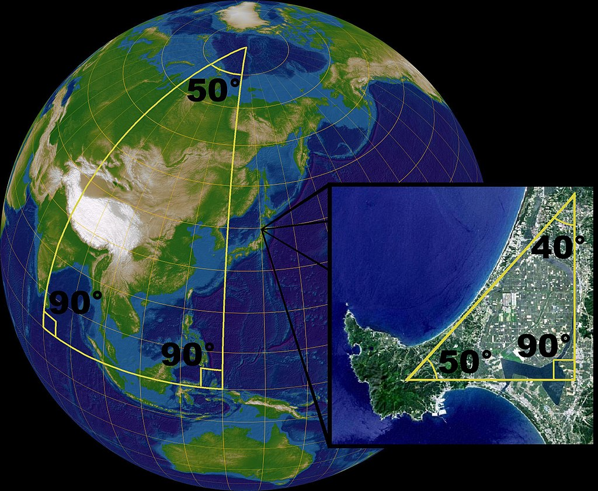

## [常用方法](https://zhuanlan.zhihu.com/p/43225794)

### 缺失值比率\(Missing Value Ratio\)

当缺失值在数据集中的占比过高时，一般会选择直接删除这个变量，因为它包含的信息太少了。但具体删不删、怎么删需要视情况而定，我们可以设置一个阈值，如果缺失值占比高于阈值，删除它所在的列。阈值越高，降维方法越积极。

### **低方差滤波\(Low Variance Filter\)**

如果我们有一个数据集，其中某列的数值基本一致，也就是它的方差非常低，那么这个变量还有价值吗？和上一种方法的思路一致，我们通常认为低方差变量携带的信息量也很少，所以可以把它直接删除。

放到实践中，就是先计算所有变量的方差大小，然后删去其中最小的几个。需要注意的一点是：方差与数据范围相关的，因此在采用该方法前需要对数据做归一化处理。

### **高相关滤波\(High Correlation filter\)**

如果两个变量之间是高度相关的，这意味着它们具有相似的趋势并且可能携带类似的信息。同理，这类变量的存在会降低某些模型的性能（例如线性和逻辑回归模型）。为了解决这个问题，我们可以计算独立数值变量之间的相关性。如果相关系数超过某个阈值，就删除其中一个变量。

### **随机森林\(Random Forest\)**

随机森林是一种广泛使用的特征选择算法，它会自动计算各个特征的重要性，所以无需单独编程。这有助于我们选择较小的特征子集。

在开始降维前，我们先把数据转换成数字格式，因为随机森林只接受数字输入。同时，ID这个变量虽然是数字，但它目前并不重要，所以可以删去。

### **反向特征消除\(Backward Feature Elimination\)**

以下是反向特征消除的主要步骤：

* 1、先获取数据集中的全部n个变量，然后用它们训练一个模型。
* 2、计算模型的性能。
* 3、在删除每个变量（n次）后计算模型的性能，即我们每次都去掉一个变量，用剩余的n-1个变量训练模型。
* 4、确定对模型性能影响最小的变量，把它删除。
* 5、重复此过程，直到不再能删除任何变量。

### **前向特征选择\(Forward Feature Selection\)**

前向特征选择其实就是反向特征消除的相反过程，即找到能改善模型性能的最佳特征，而不是删除弱影响特征。它背后的思路如下所述：

* 1、选择一个特征，用每个特征训练模型n次，得到n个模型。
* 2、选择模型性能最佳的变量作为初始变量。
* 3、每次添加一个变量继续训练，重复上一过程，最后保留性能提升最大的变量。
* 4、一直添加，一直筛选，直到模型性能不再有明显提高。

### **因子分析\(Factor Analysis\)**

因子分析是一种常见的统计方法，它能从多个变量中提取共性因子，并得到最优解。假设我们有两个变量：收入和教育。它们可能是高度相关的，因为总体来看，学历高的人一般收入也更高，反之亦然。所以它们可能存在一个潜在的共性因子，比如“能力”。

在因子分析中，我们将变量按其相关性分组，即特定组内所有变量的相关性较高，组间变量的相关性较低。我们把每个组称为一个因子，它是多个变量的组合。和原始数据集的变量相比，这些因子在数量上更少，但携带的信息基本一致。

## 线性降维方法

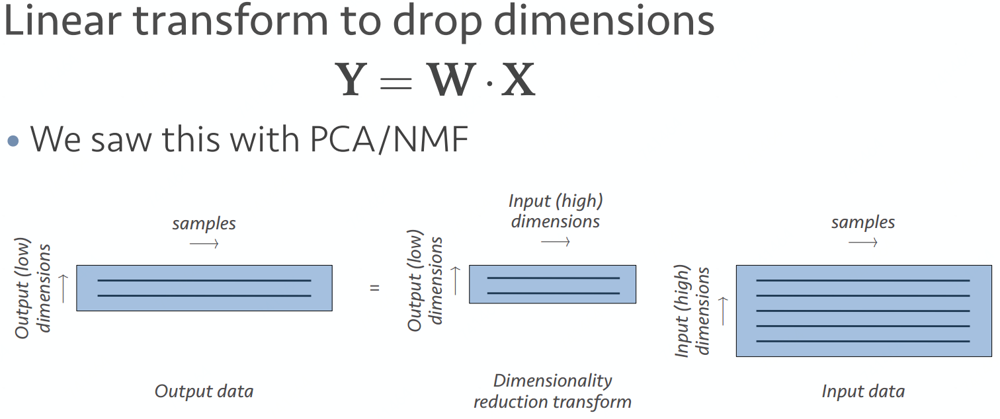

线性降维的方法可以应对像下图这样简单的数据\(比如PCA找方差大的维度进行保留\)

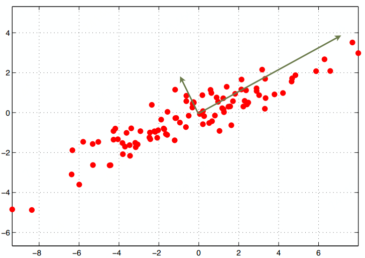 

### 主成分分析\(PCA\)

主成分分析\(Principal Component Analysis，简称PCA\)是最常用的一种降维方法，旨在找到数据中的主成分，并利用这些主成分表征原始数据，从而达到降维的目的。它属于一种线性、非监督、全局的降维算法

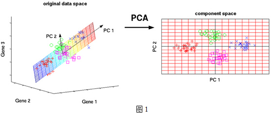

在介绍PCA之前，不妨先考虑这样一个问题：对于正交属性空间中的样本点，如何用一个超平面对所有样本进行恰当的表达？容易想到，若存在这样的超平面，那么它大概应该有这样的性质：

1、最大可分性：样本点在这个超平面上的投影能尽可能分开（最大方差理论）

2、最近重构性：样本点到这个超平面的距离都足够近（最小平方误差理论）

基于这两个性质都可以推导出PCA，这里以最大可分性来推导。

#### [最大可分思想](https://zhuanlan.zhihu.com/p/32412043)

主成分分析顾名思义，就是找出数据里最主要的方面，用数据里最主要的方面来代替原始数据。具体的，假如我们的数据集是$$n$$维的，共有$$m $$个数据$$(x_1,x_2,\dots,x_m)$$。我们希望将这$$m$$个数据的维度从$$n$$维降到$$n'$$维，希望这$$m$$个$$n'$$维的数据集尽可能的代表原始数据集。我们知道数据从$$n$$维降到$$n'$$维肯定会有损失，但是我们希望损失尽可能的小。那么如何让这$$n'$$维的数据尽可能表示原来的数据呢？

我们先看看最简单的情况，也就是$$n=2$$，$$n'=1$$,也就是将数据从二维降维到一维。数据如下图。我们希望找到某一个维度方向，它可以代表这两个维度的数据。图中列了两个向量方向，$$u_1$$和$$u_2$$，那么哪个向量可以更好的代表原始数据集呢？ 例如下图，从直观上也可以看出，$$u_1$$比$$u_2$$好，这就是我们所说的**最大可分性**

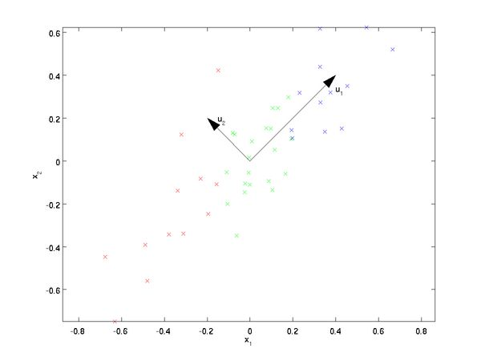

上图是二维空间中经过中心化的一组数据，我们很容易看出主成分所在的轴\(以下称为主轴\)的大致方向，即上图中$$u_1$$所在的轴。因为$$u_1$$所处的轴上，数据分布的更为分散，这也意味着数据在这个方向上方差更大。在信号处理领域，我们认为信号具有较大方差，噪声具有较小方差，信号与噪声之比称为信噪比。信噪比越大意味着数据的质量越好，反之，信噪比越小意味着数据的质量越小。由此我们不难引出PCA的目标，即**最大化投影方差**，也就是让数据在主轴上投影的方差最大。

对于给定的一组数据点$$\{v_1,v_2,\dots,v_n\}$$，其中所有向量均为列向量，中心化后的表示为$$\{x_1,x_2,\dots,x_n\}=\{v_1-\mu,v_2-\mu,\dots,v_n-\mu\}$$，其中$$\mu = \frac{1}{n}\sum\limits_{i=1}^nv_i$$，即每个数据点减样本集均值。我们知道，向量内积在几何上表示为第一个向量投影到第二个向量上的长度，因此向量$$x_i$$在$$w$$\(单位方向向量\)上的投影坐标可以表示为$$(x_i,w)=x_i^Tw$$。所以目标是找到一个投影方向$$w$$，使$$x_1,x_2,\dots,x_n$$在$$w$$上的投影方差尽可能大。易知，投影之后均值为$$0$$\(因为$$\mu'=\frac{1}{n}\sum\limits_{i=1}^nx_i^Tw=(\frac{1}{n}\sum\limits_{i=1}^nx_i^T)w=0$$，这也是我们进行中心化的意义\)，因此投影后的方差可以表示为：

$$D(x)=\frac{1}{n}\sum\limits_{i=1}^n(x_i^Tw)^2=\frac{1}{n}\sum\limits_{i=1}^n(x_i^Tw)^T(x_i^Tw)=\frac{1}{n}\sum\limits_{i=1}^nw^Tx_ix_i^Tw = w^T(\frac{1}{n}\sum\limits_{i=1}^nx_ix_i^T)w$$ 

$$\frac{1}{n}\sum\limits_{i=1}^nw^Tx_ix_i^Tw$$其实就是样本的协方差矩阵，我们将其写作$$\sum$$，且由于$$w$$是单位方向向量，即$$w^Tw=1$$。所以，我们要解决的最大化问题可表示为：

                                                 $$max\{w^T\sum w\},\ \ \ \ s.t.\ \ w^Tw=1$$ 

引入拉格朗日乘子，并对$$w$$求导令其等于$$0$$，便可以推出$$\sum w=\lambda w$$，此时：

                                                   $$D(x)=w^T\sum w = \lambda w^Tw=\lambda$$

熟悉线性代数的马上会发现，原来$$x$$投影后的方差就是协方差矩阵的特征值。我们要找到最大的方差也就是协方差矩阵最大的特征值，最佳投影方向就是最大特征值对应的特征向量。次佳投影方向位于最佳投影方向的正交空间中，是第二大特征值对应的特征向量，以此类推。所以有以下PCA求解方法：

1. 1、对样本数据进行中心化处理
2. 2、求样本协方差矩阵
3. 3、对协方差矩阵进行特征值分解\(SVD\)，将特征值从大到小排列
4. 4、取特征值前$$d$$大对应的特征向量$$w_1,w_2,\dots,w_d$$，通过以下映射将$$n$$维样本映射到$$d$$维：
5.                                                $$x'_i =  \left[  \begin{matrix}    w_1^Tx_i\\    w_2^Tx_i \\ . \\ .\\  w_d^Tx_i  \end{matrix}   \right] $$ 

新的$$x_i'$$的第$$d$$维就是$$x_i$$在第$$d$$个主成分$$w_d$$方向上的投影，通过选取最大的$$d$$个特征值对应的特征向量，我们将方差较小的特征\(噪声\)抛弃，使得每个$$n$$维列向量$$x_i$$被映射为$$d$$维列向量$$x'_i$$，定义降维后的信息占比为： $$\eta=\sqrt{\frac{\sum\limits_{i=1}^d\lambda_i^2}{\sum\limits_{i=1}^n\lambda_i^2}}$$ 

### 线性判别分析\(LDA\)

线性判别分析\(Linear Discriminant Analysis ,LDA\)是一种监督学习的降维技术也可以做分类任务，也就是说它的数据集的每个样本是有类别输出的，这点和PCA不同。PCA是不考虑样本类别输出的无监督降维技术。LDA的思想可以用一句话概括，就是“投影后类内方差最小，类间方差最大”，如下图所示。 我们要将数据在低维度上进行投影，我们投影后希望

1. 1、每一种类别数据的投影点尽可能的接近
2. 2、不同类别的数据的类别中心之间的距离尽可能的大

给定数据集 $$D=\{(x_i,y_i)\}_{i=1}^m,\ \ y_i\in\{0,1\}$$，

第 $$i$$ 类的集合 $$X_i$$，第 $$i$$ 类的均值向量 $$\mu_i$$ ，第 $$i$$ 类的协方差矩阵 $$\sum_i$$， $$i\in\{0,1\}$$ 即一共就两类

两类样本的中心在直线 $$w$$ 上的投影，即直线与原均值向量的内积 $$w^T\mu_0$$ 和 $$w^T\mu_1$$。所有样本点都投影到直线上，则两类样本的协方差为 $$w^T\sum_0w$$和 $$w^T\sum_1w$$ 

1. 1、投影后类内方差最小，即 $$w^T\sum_0w+w^T\sum_1w$$ 尽可能小
2. 2、类间方差最大，即 $$||w^T\mu_0-w^T\mu_1||_2^2$$ 尽可能大

同时考虑优化二者，则可得到欲最大化的目标：

                                       $$J=\frac{||w^T\mu_0-w^T\mu_1||_2^2}{w^T\sum_0w+w^T\sum_1w}=\frac{w^T(\mu_0-\mu_1)(\mu_0-\mu_1)^Tw}{w^T(\sum_0+\sum_1)w}$$ 

定义“类内散度矩阵”：$$S_w=\sum_0+\sum_1=\sum\limits_{x\in X_0}(x-\mu_0)(x-\mu_0)^T+\sum\limits_{x\in X_1}(x-\mu_1)(x-\mu_1)^T$$ 

定义“类间散度矩阵”： $$S_b=(\mu_0-\mu_1)(\mu_0-\mu_1)^T$$ 

所以，我们可将最大化目标函数 $$J$$ 写为：

                                                                       $$J=\frac{w^TS_bw}{w^TS_ww}$$ 

这就是LDA欲最大化的目标，即 $$S_b$$ 与 $$S_w$$ 的“广义瑞利商”\(Generalized Rayleigh Quotient\)

如何确定 $$w$$ 呢？注意到上式的分子和分母都是关于 $$w$$ 的二次项，因此上式的解 $$w$$ 的长度无关，只与其方向有关。不失一般性，令 $$w^TS_ww=1$$ ，上式等价于

                                                   $$\mathop{min}\limits_w( -w^TS_bw)\ \ \ \ s.t.\ \ w^TS_ww=1$$ 

由拉格朗日乘子法，上式等价于

                                                                       $$S_bw=\lambda S_ww$$ 

其中 $$\lambda$$ 是拉格朗日乘子。注意到 $$S_bw$$ 的方向恒为 $$\mu_0-\mu_1$$ ，不妨令 $$S_bw=\lambda(\mu_0-\mu_1)$$ 代入上式

                                                                     $$w=S_w^{-1}(\mu_0-\mu_1)$$ 

考虑到数值解的稳定性，在实践中通常是对 $$S_w$$ 进行奇异值分解，即 $$S_w=U\sum V^T$$ ，这里 $$\sum$$ 是一个对角矩阵，其对角线上的元素是 $$S_w$$ 的奇异值，然后再由 $$S_w^{-1}=V\sum U^T$$ 得到 $$S_w^{-1}$$ 。值得一提的是，LDA可从贝叶斯决策理论的角度来阐述，并可证明，当两类数据同先验，满足高斯分布且协方差相等时，LDA可达到最优分类。

#### 多类别映射\(分类\)

若有很多类别，还是基于LDA基本思想，每个类间距离最大，类内距离最小。假定存在 $$N$$ 个类，且第 $$i$$ 类示例数为 $$m_i$$ ，我们先定义“全局散度矩阵”：

                                                  $$S_t=S_b+S_w=\sum\limits_{i=1}^m(x_i-\mu)(x_i-\mu)^T$$ 

其中 $$\mu$$ 是所有示例的均值向量，将类内散度矩阵 $$S_w$$ 重新定义为每个类别的散度矩阵之和，即

                                            $$S_w=\sum \limits_{i=1}^NS_{w_i}, \ \ \ \ S_{w_i}=\sum\limits_{x\in X_i}(x-\mu_i)(x-\mu_i)^T$$ 

整理上面两式可得

                                                 $$S_b=S_t-S_w=\sum\limits_{i=1}^Nm_i(\mu_i-\mu)(\mu_i-\mu)^T$$ 

显然，多分类LDA可以有多种实现方法：使用 $$S_b$$ , $$S_w$$ , $$S_t$$ 三者中的任何两个即可，常见的一种实现是采用优化目标：

                                                                          $$\mathop{max}\limits_W\ \frac{tr(W^TS_bW)}{tr(W^TS_wW}$$ 

其中 $$W\in \mathbb{R}^{d\times(N-1)}$$，上式可通过广义特征值问题求解： $$S_bW=\lambda S_wW$$ 。$$W$$的闭式解则是 $$S_w^{-1}S_b$$ 的 $$d'$$ 个最大非零广义特征值所对应的特征向量组成的矩阵， $$d'\leq N-1$$ 。

若将 $$W$$ 视为一个投影矩阵，则多分类LDA将样本投影到 $$d'$$ 维空间。 $$d'$$ 通常远小于数据原有的属性数 $$d$$ 于是，可通过这个投影来减少样本点的维数，且投影过程中采用了类别信息，因此LDA也常被视为一种经典的监督降维技术。

#### PCA vs. LDA

#### **相同点**

**1）**两者均可以对数据进行降维。

**2）**两者在降维时均使用了矩阵特征分解的思想。

**3）**两者都假设数据符合高斯分布。

#### **不同点**

**1）**LDA是有监督的降维方法，而PCA是无监督的降维方法

**2）**LDA降维最多降到类别数k-1的维数，而PCA没有这个限制。

**3）**LDA除了可以用于降维，还可以用于分类。

**4）**LDA选择分类性能最好的投影方向，而PCA选择样本点投影具有最大方差的方向。这点可以从下图形象的看出，在某些数据分布下LDA比PCA降维较优。

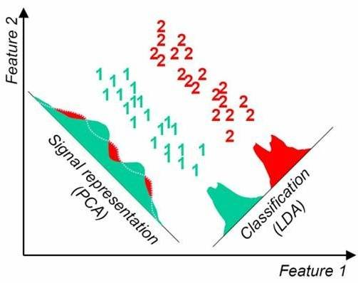

### [独立分量分析**\(ICA\)**](http://danieljyc.github.io/2014/06/13/%E6%9C%BA%E5%99%A8%E5%AD%A6%E4%B9%A015-3--%E7%8B%AC%E7%AB%8B%E6%88%90%E5%88%86%E5%88%86%E6%9E%90ica%EF%BC%88independent-component-analysis%EF%BC%89/)\*\*\*\*

独立分量分析**\(**Independent Component Analysis, ICA\)的最重要的假设就是信号源统计独立，将数据转换为独立的分量，使用更少的分量来描述数据。这个假设在大多数盲信号分离的情况中符合实际情况。即使当该假设不满足时，仍然可以用独立成分分析来把观察信号统计独立化，从而进一步分析数据的特性。独立成分分析的经典问题是“鸡尾酒会问题”（Cocktail Party Problem）。该问题描述的是给定混合信号，如何分离出鸡尾酒会中同时说话的每个人的独立信号。当有 $$N$$ 个信号源时，通常假设观察信号也有 $$N$$ 个（例如 $$N$$ 个麦克风或者录音机）。该假设意味着混合矩阵是个方阵，即 $$J = D$$ ，其中 $$D$$ 是输入数据的维数， $$J$$ 是系统模型的维数。对于 $$J<D$$ 和 $$J>D$$ 的情况，学术界也分别有不同研究。

PCA和ICA之间的主要区别在于，PCA寻找不相关的因素，而ICA寻找独立因素。如果两个变量不相关，它们之间就没有线性关系。如果它们是独立的，它们就不依赖于其他变量。例如，一个人的年龄和他吃了什么/看了什么电视无关。该算法假设给定变量是一些未知潜在变量的线性混合。它还假设这些潜在变量是相互独立的，即它们不依赖于其他变量，因此它们被称为观察数据的独立分量。

经典的鸡尾酒宴会问题（cocktail party problem）。假设在party中有 $$n$$ 个人，他们可以同时说话，我们也在房间中一些角落里共放置了 $$n$$ 个声音接收器（Microphone）用来记录声音。宴会过后，我们从 $$n$$ 个麦克风中得到了一组数据 $$\{x^{(i)}(x^{(i)}_1,x^{(i)}_2,\dots,x^{(i)}_n);i=1,\dots,m\}$$ ， $$i$$ 表示采样的时间顺序，也就是说共得到了 $$m$$ 组采样，每一组采样都是 $$n$$ 维的。我们的目标是单单从这 $$m$$ 组采样数据中分辨出每个人说话的信号。有 $$n$$ 个人说话，就是有 $$n$$ 个信号源 $$s(s_1,s_2,\dots,s_n)^T,\ s\in \mathbb{R}^n$$  每一维都是一个人的声音信号，每个人发出的声音信号独立。 $$A$$ 是一个未知的混合矩阵（mixing matrix），用来组合叠加信号 $$s$$ ，那么

                                                                       $$x = As$$ 

 这里的 $$x$$ 不是一个向量，是一个矩阵。其中每个列向量是 $$x^{(i)},x{(i)}=As^{(i)}$$，即下图

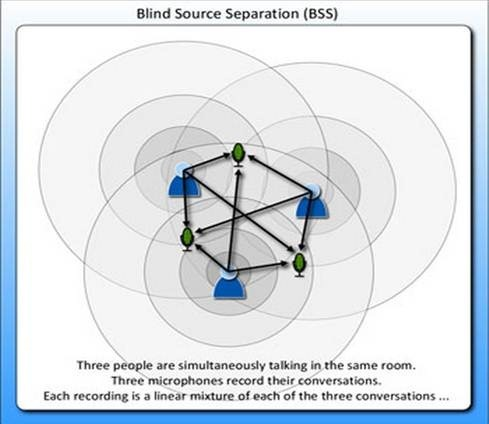

$$x^{(i)}$$ 的每个分量都由 $$s^{(i)}$$ 的分量线性表示。 $$A$$ 和 $$s$$ 都是未知的， $$x$$ 是已知的，我们要想办法根据 $$x$$ 来推出 $$s$$ 。这个过程也称作盲信号分离。令 $$W = A^{-1} $$ ，则

                                                       $$s^{(i)}=A^{(-1)}x^{(i)}=Wx^{(i)}$$ 

                                                           $$W =  \left[  \begin{matrix} -\    w^T_1\ -\\    . \\ . \\ .\\  -\  w_n^T\ -   \end{matrix}   \right] $$ 

最终得到

                                            $$s_j^{(i)}=w_j^Tx^{(i)}$$ ，其 $$s_j^{(i)}$$ 即说话人 $$j$$ 在 $$i$$ 时刻发出的信号

 我们需要知道两个量才能求出另外一个，下面我们进一步分析，先预处理\(中心化、漂白\)一下数据

**中心化：**求出 $$x$$ 均值，然后所有 $$x$$ 减去均值

**漂白：**目的是为了让 $$x$$ 相互独立。将 $$x$$ 乘以一个矩阵变成 $$\widetilde{x}$$ \(其协方差矩阵是 $$I$$ \)

                   $$\widetilde{x}=ED^{-1/2}E^Tx$$ ，其中 $$E\{\widetilde{x}\widetilde{x}^T\} = I$$ 

 使用特征值分解来得到 $$E$$ （特征向量矩阵）和 $$D$$ （特征值对角矩阵） ，公式为 $$E\{x\widetilde{x}\}=EDE^T$$ 

#### ICA算法

我们假设每 $$s_i$$ 有概率密度 $$p_s$$ ，那么给定时刻原信号的联合分布就是

                                $$p(s) = \prod_{i=1}^np_s(s_i)$$ ，每个人发出的声音信号 $$s$$ 各自独立

然后，我们就可以求得 $$p(x)$$ 

                                        $$p(x)=p_s(Wx)|W| = |W|\prod_{i=1}^np_s(w_i^Tx)$$ 

 现在，我们需要知道 $$p(s)$$ 和 $$w$$ ，才能求得 $$p(x)$$，首先我们假设 $$s$$ 的累积分布函数符合sigmoid函数

                   $$g(s) = \frac{1}{1+e^{-s}}$$ ，求导后 $$p_s(s)=g'(s)=\frac{e^s}{(1+e^s)^2}$$ ，这就是 $$s$$ 的密度函数

然后，我们就剩下 $$W$$ 需要求解了，使用最大似然估计的方法求解，使用前面得到的 $$x$$ 的概率密度函数

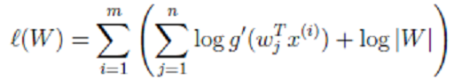

上式括号里的其实就是 $$p(x^{(i)})$$ ，最终，我们可求得

$$W: =W+\alpha (  \left[  \begin{matrix}  1-2g(w_1^Tx^{(i)})\\  1-2g(w_2^Tx^{(i)}) \\ . \\ .\\  1-2g(w_n^Tx^{(i)})   \end{matrix}   \right]x^{(i)^T}+(W^T)^{-1}) $$ ，其中 $$\alpha$$ 是梯度上升速率，人为指定

迭代求出 $$W$$ 后，我们就可以还原出原始信号

                                                                $$s^{(i)}= Wx^{(i)}$$ 

## 非线性降维方法

对于像下图这样复杂一些的数据\(比如我们有些"curvy"数据\)，线性降维的方法就解决不了

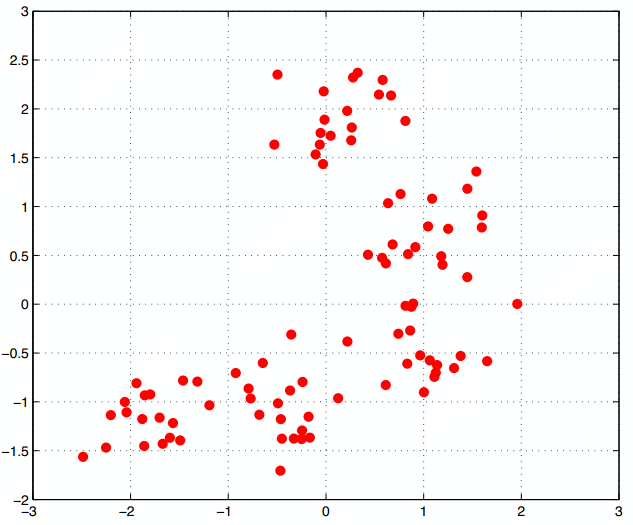 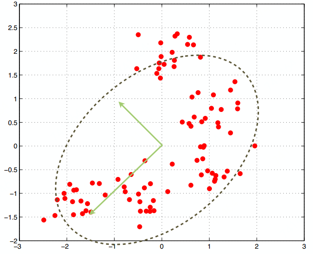 

### [核主成分分析\(Kernel PCA\)](https://blog.csdn.net/qianhen123/article/details/40863753)

假设我们有 $$N$$ 个 $$D$$ 维线性不可分的数据 $$x_n\in \mathbb{R}^D, n=\{1,2,\dots,N\}$$。我们引入一个非线性映射函数 $$\phi$$: $$\mathbb{R}^D\to \mathbb{R}^M,\ x|\to z = \phi(x),\ M>D$$  ，通过这个非线性映射函数可以将原来的线性不可分的样本映射到更高维度，在这个高维空间中，本来在原空间中线性不可分的样本现在线性可分了

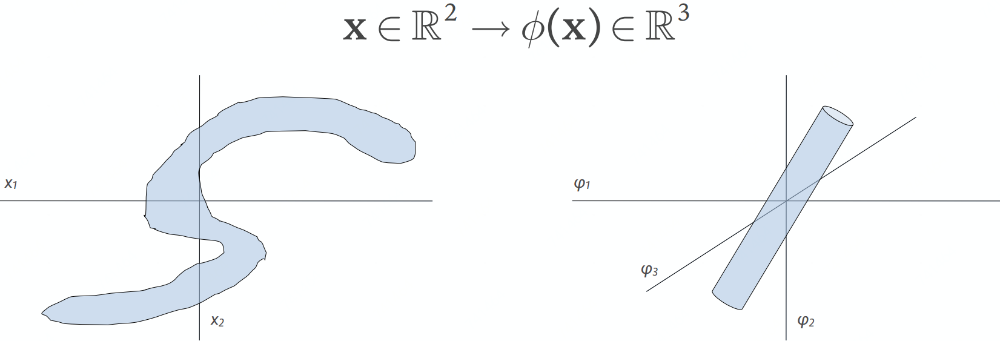

数据在这个高维度空间中线性可分了，这时候我们再用PCA，问题解决。即

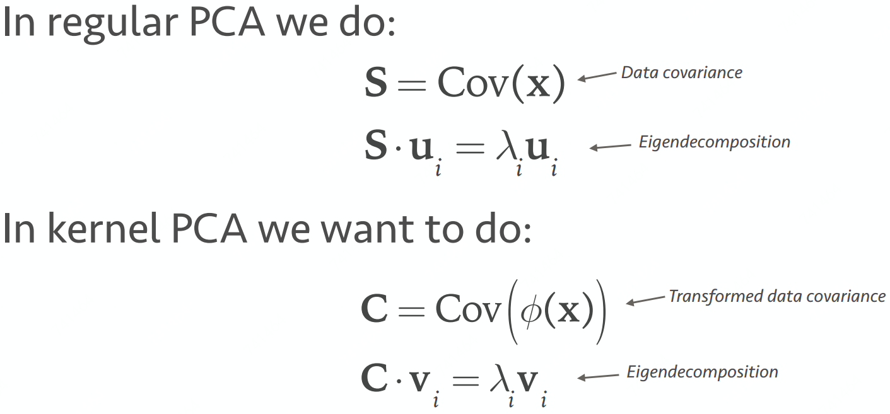

每个特征值向量 $$v_i$$ 都能从输入数据的线性组合得到： $$v_i=\sum \limits_n a_{i,n}\phi(x_n)$$ ，代入上式即可得高维度特征分解的表达式：

         $$C\cdot v_i = \lambda_iv_i \Rightarrow \frac{1}{N}\sum \limits_n \phi(x_n)\phi(x_n)^T\cdot(\sum \limits_m a_{i,m}\phi(x_m)) = \lambda_i(\sum \limits_m a_{i,m}\phi(x_m))$$ 

两边同时左乘 $$\phi(x_l)$$，并引入一个$$N\times N$$的核函数 $$K$$ ，即可得低维度特征分解表达式：

                       $$\frac{1}{N}\sum \limits_nK(x_l,x_n)\sum\limits_ma_{i,m}K(x_l,x_m)=\lambda_i\sum\limits_ma_{i,m}K(x_lx_m)$$ 

                $$a = b$$ 

                $$\Rightarrow K\cdot a_i = \lambda_iN\cdot a_i$$ ，其中 $$K$$ 是 $$N\times N$$ 维核矩阵， $$a_i$$ 是 $$N$$ 维列向量

求解公式的含义就是求K最大的几个特征值所对应的特征向量，由于 $$K$$ 为对称矩阵，所得的解向量彼此之间肯定是正交的。 但是，请注意，这里的 $$a$$ 只是 $$K$$ 的特征向量，但是其不是高维空间中的特征向量，回看 $$v_i=\sum \limits_n a_{i,n}\phi(x_n)$$ 公式，高维空间中的特征向量 $$v$$ 应该是由 $$a$$ 进一步求出。

#### [核函数](https://www.zhihu.com/question/24627666/answer/28440943)\*\*\*\*

下面这张图位于第一、二象限内。我们关注红色的门，以及“北京四合院”这几个字下面的紫色的字母。我们把红色的门上的点看成是“+”数据，紫色字母上的点看成是“-”数据，它们的横、纵坐标是两个特征。显然，在这个二维空间内，“+”“-”两类数据不是线性可分的。

我们现在考虑核函数 $$K(v_1,v_2)=<v_1,v_2>^2$$ ，即“内积平方”。这里面 $$v_1=(x_1,y_1),v_2=(x_2,y_2)$$ 是二维空间中的两个点。

这个核函数对应着二维到三维空间的映射，它的表达式是： $$P(x,y)=(x^2,\sqrt{2}xy,y^2)$$，可以验证：  
 $$<P(v_1),P(v_2)>=<(x_1^2,\sqrt{2}x_1y_1,y_1^2),(x_2^2,\sqrt{2}x_2y_2,y_2^2)>$$ 

                                      $$=x_1^2x_2^2+2x_1x_2y_1y_2+y_1^2y_2^2=(x_1x_2+y_1y_2)^2 = <v_1,v_2>^2=K(v_1,v_2)$$ 

在P这个映射下，原来二维空间中的图在三维空间中的像是这个样子：

注意到绿色的平面可以完美地分割红色和紫色，也就是说，两类数据在三维空间中变成线性可分的了。

而三维中的这个判决边界，再映射回二维空间中是这样的：

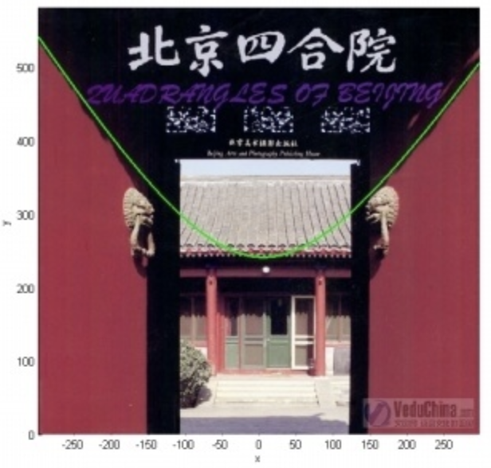

这是一条双曲线，它不是线性的。核函数的作用就是隐含着一个从低维空间到高维空间的映射，而这个映射可以把低维空间中线性不可分的两类点变成线性可分的。它们映射到的高维空间的维数也比例子（三维）高得多，甚至是无穷维的。这样，就可以期待原来并不线性可分的两类点变成线性可分的了。

在机器学习中常用的核函数，一般有这么几类，也就是LibSVM中自带的这几类：  
1\) 线性：  
2\) 多项式：  
3\) Radial basis function：  
4\) Sigmoid：

上面的例子是 2\)多项式核函数中的情况。

核函数要满足的条件称为[Mercer's condition](https://link.zhihu.com/?target=http%3A//www.svms.org/mercer/)。在实用中，基本是试验各种核函数，并扫描其中的参数，选择效果最好的。所以说，至于什么样的核函数适用于什么样的问题还有待讨论。

### 多维缩放\(MDS\)

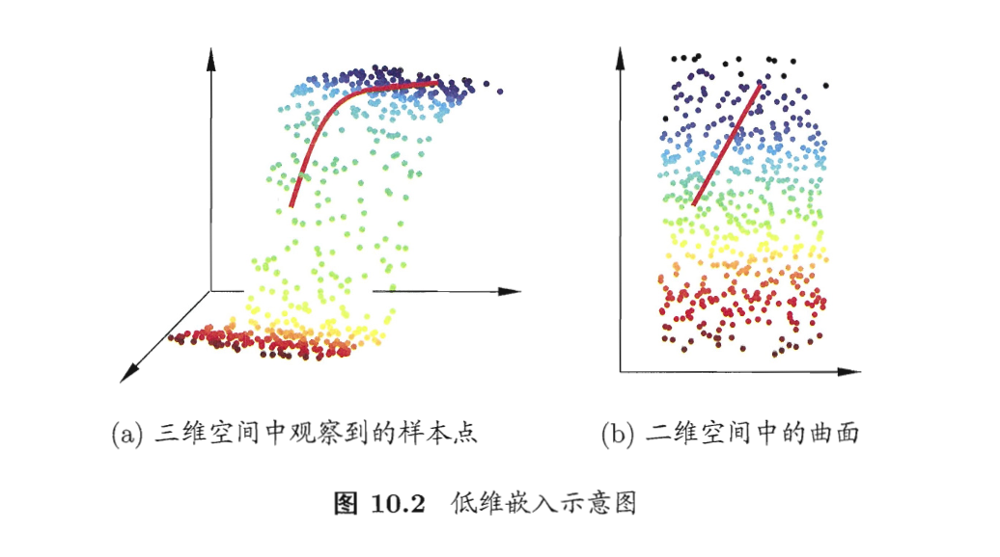

若要求原始空间中样本的距离在低维空间中得以保持，如上图所示，即得到多维缩放\(Multiple Dimensional Scaling, MDS\)。假定 $$m$$ 个样本在原始空间的距离矩阵为 $$D\in \mathbb{R}^{m\times m}$$ ，其第 $$i$$ 行 $$j$$ 列的元素 $$dist_{ij}$$ 为样本 $$x_i$$ 到 $$x_j$$ 的距离。我们的目标是获得样本在 $$d'$$ 维空间的表示 $$Z\in \mathbb{R}^{d'\times m},\ d'\leq d$$ ，且任意两个样本在 $$d'$$ 维空间中欧氏距离等于原始空间中的距离，即 $$||z_i-z_j||=dist_{ij}$$ 

令 $$B=Z^TZ\in \mathbb{R}^{m\times m}$$ ，其中 $$B$$ 为降维后样本的内积矩阵， $$b_{ij}=z_i^Tz_j$$ ，有

                              $$dist_{ij}^2=||z_i||^2+||z_j||^2-2z_i^Tz_j=b_{ii}+b_{jj}-2b_{ij}$$ 

令降维后的样本 $$Z$$ 被中心化，即 $$\sum_{i=1}^mz_i=0$$ 。显然，矩阵 $$B$$ 的行与列之和均为零，即 $$\sum_{i=1}^mb_{ij}=\sum_{j=1}^mb_{ij}=0$$ ，易知

      $$\sum\limits_{i=1}^mdist_{ij}^2=tr(B)+mb_{jj}$$      $$\sum\limits_{j=1}^mdist_{ij}^2=tr(B)+mb_{ii}$$      $$\sum\limits_{i=1}^m\sum\limits_{j=1}^m dist_{ij}^2=2m\ tr(B) $$ 

其中 $$tr(\cdot)$$ 表示矩阵的[迹\(trace\)](https://chmx0929.gitbook.io/machine-learning/shu-xue-ji-chu/untitled/xian-xing-dai-shu)， $$tr(B)=\sum_{i=1}^m||z_i||^2$$ ，令

                 $$dist_{i.}^2=\frac{1}{m}\sum\limits_{j=1}^mdist_{ij}^2$$      $$dist_{.j}^2=\frac{1}{m}\sum\limits_{i=1}^mdist_{ij}^2$$      $$dist{..}^2=\frac{1}{m^2}\sum\limits_{i=1}^m\sum\limits_{j=1}^mdist_{ij}^2$$ 

由上面所有式子可得

                                 $$b_{ij}=-\frac{1}{2}(dist_{ij}^2-dist_{i.}^2-dist_{.j}^2+dist_{..}^2)$$ 

由此即可通过降维前后保持不变的距离矩阵 $$D$$ 求取内积矩阵 $$B$$ 

对矩阵 $$B$$ 做特征值分解， $$B=V\Lambda V^T$$ ，其中 $$\Lambda = diag(\lambda_1,\lambda_2,\dots,\lambda_d)$$ 为特征值构成的对角矩阵， $$\lambda_1\geq \lambda_2\geq \dots \geq \lambda_d$$， $$V$$ 为特征向量矩阵。假定其中有 $$d^*$$ 个非零特征值，它们构成的对角矩阵 $$\Lambda_*=diag(\lambda_1,\lambda_2,\dots,\lambda_{d^*})$$ ，令 $$V_*$$ 表示相应的特征向量矩阵，则 $$Z$$ 可表达为

                                           $$Z=\Lambda_*^{1/2}V_*^T\in\mathbb{R}^{d^*\times m}$$ 

在现实应用中为了有效降维，往往仅需降维后的距离与原始空间中的距离尽可能接近，而不必严格相等。此时可取 $$d'\ll d$$ 个最大特征值构成的对角矩阵 $$\widetilde{\Lambda}=diag(\lambda_1,\lambda_2,\dots,\lambda_{d'})$$ ，令 $$\widetilde{V}$$ 表示相应的特征向量矩阵，则 $$Z$$ 可表达为

                                            $$Z=\widetilde{\Lambda}^{1/2}\widetilde{V}^T\in\mathbb{R}^{d^*\times m}$$ 

#### 算法步骤

1. **输入：**距离矩阵 $$D\in \mathbb{R}^{m\times m}$$，其元素 $$dist_{ij}$$，为样本 $$x_i$$ 到 $$x_j$$ 的距离；低维空间维数 $$d'$$ 
2. **过程：**
3.     ****1：根据上面公式计算 $$dist_{i.}^2$$ ， $$dist_{.j}^2$$ ， $$dist_{..}^2$$ 
4.     2：计算内积矩阵 $$B$$ 
5.     3：对矩阵 $$B$$ 做特征分解
6.     4：取 $$\widetilde{\Lambda}$$ 为 $$d'$$ 个最大特征所构成的对角矩阵， $$\widetilde{V}$$ 为相应的特征向量矩阵
7. **输出：**矩阵 $$\widetilde{V}^T\widetilde{\Lambda}^{1/2}\in\mathbb{R}^{m\times d'}$$ ，每行是一个样本的低维坐标

### 等度量映射\(ISOMAP\)

等度量映射\(Isometric Mapping, Isomap\)的基本出发点，是认为低维流形嵌入到高维空间之后，直接在高维空间中计算直线距离具有误导性，因为高维空间中的直线距离在低维嵌入流形上是不可达的。我们利用流形在局部上与欧氏空间同胚这个性质，对每个点基于欧氏距离找出其近邻点，然后就能建立一个近邻连接图，图中近邻之间存在连接，而非近邻点之间不存在连接，于是，计算两点之间测地线距离的问题，就转变为计算近邻连接图上两点之间的最短路径问题。

在近邻连接图上计算两点间的最短路径，可采用著名Dijkstra算法或Floyd算法，在得到任意两点的距离之后，就可以通过MDS来获得样本点在低维空间中的坐标。

#### 算法步骤

1. **输入：**样本集 $$D=\{x_1,x_2,\dots,x_m\}$$ ；近邻参数 $$k$$ ；低维空间维数 $$d'$$ 
2. **过程：**
3.     ****for $$i=1,2,\dots,m$$ do
4.         确定 $$x_i$$ 的 $$k$$ 近邻
5.         $$x_i$$ 与 $$k$$ 近邻点之间的距离设置为欧氏距离，与其他店的距离设置为无穷大
6.     end for
7.     调用最短路径算法\(eg. Dijkstra\)计算任意两样本点之间距离 $$dist(x_i,x_j)$$ 
8.     将 $$dist(x_i,x_j)$$ 作为MDS算法的输入
9.     return MDS算法的输出
10. **输出：**样本集 $$D$$ 在低维空间的投影 $$Z=\{z_1,z_2,\dots,z_m\}$$ 

### [局部线性嵌入\(LLE\)](https://www.cnblogs.com/pinard/p/6266408.html)

局部线性嵌入\(Locally Linear Embedding, LLE\)与Isomap试图保持近邻样本之间的距离不同，LLE试图保持邻域样本之间的线性关系。

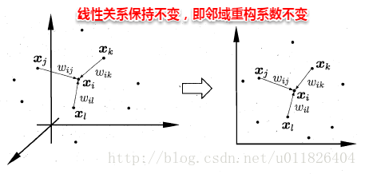

即样本点 $$x_i$$ 的坐标能通过它的领域样本 $$x_j$$ ， $$x_k$$ ， $$x_l$$ 的坐标通过线性组合而重构出来，而这里的权值参数在低维和高维空间是一致的，即

                                                $$x_i=w_{ij}x_j+w_{ik}x_k+w_{il}x_l$$ 

第一步，先为每个样本 $$x_i$$ 找到其近邻下标集合 $$Q_i$$，然后计算出基于 $$Q_i$$ 中的所有的样本点对 $$x_i$$ 进行线性重构系数 $$w_i$$ ，也就是找出每一个样本和其领域内的样本之间的线性关系

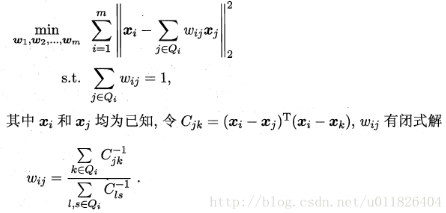

第二步，在低维空间领域重构系数 $$w_i$$ 不变，去求每个样本在低维空间的坐标

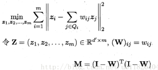

利用M矩阵，可以将问题写成

                                                $$\mathop{min}\limits_Z tr(ZMZ^T)\ \ \ \ s.t.ZZ^T=I$$ 

问题就成了对 $$M$$ 矩阵进行特征分解，然后取最小的 $$d'$$ 个特征值对应的特征向量组成低维空间的坐标 $$Z$$ 

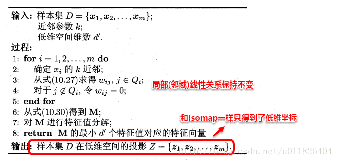

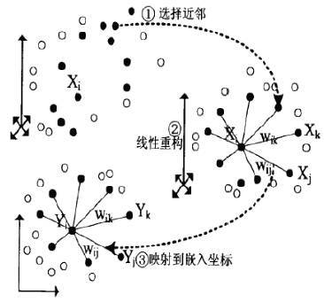

### [t-分布随机近邻嵌入\(t-SNE\)](http://www.datakit.cn/blog/2017/02/05/t_sne_full.html)

t-SNE\(t-distributed stochastic neighbor embedding\)是一种非线性降维算法，非常适用于高维数据降维到2维或者3维，进行可视化。我们看到t-SNE模型是非监督的降维，他跟kmeans等不同，他不能通过训练得到一些东西之后再用于其它数据\(比如kmeans可以通过训练得到k个点，再用于其它数据集，而t-SNE只能单独的对数据做操作，也就是说他只有fit\_transform，而没有fit操作\)。t-SNE是由SNE\(Stochastic Neighbor Embedding, SNE\)发展而来。我们先介绍SNE的基本原理，之后再扩展到t-SNE。

#### SNE\(Stochastic Neighbor Embedding\)

SNE是通过仿射\(affinitie\)变换将数据点映射到概率分布上，主要包括两个步骤：

1. 1、SNE构建一个高维对象之间的概率分布，使得相似的对象有更高的概率被选择，而不相似的对象有较低的概率被选择。
2. 2、SNE在低维空间里在构建这些点的概率分布，使得这两个概率分布之间尽可能的相似。

SNE先将欧氏距离转换为条件概率来表达点与点之间的相似度。具体来说，给定 $$N$$ 个高维数据 $$x_1,x_2,\dots,x_N$$，先计算概率 $$p_{ij}$$，正比于 $$x_i$$ 和 $$x_j$$ 之间的相似度\(这种概率是我们自己构建的\)，即

                                            $$p_{j|i} = \frac{exp(-||x_i-x_j||^2/(2\sigma_i^2))}{\sum_{k\neq i}exp(-||x_i-x_k||^2/(2\sigma_i^2))}$$ 

$$\sigma_i$$ 依据不同的 $$x_i$$ 取值不同，此外因为我们关注的是两两之间的相似度，所以设置 $$p_{x|x}=0$$ 。对于低维度下的 $$y_i$$ ，我们可以指定高斯分布的方差为 $$\frac{1}{\sqrt{2}}$$ ，因此它们之间的相似度如下

                                           $$q_{j|i} = \frac{exp(-||x_i-x_j||^2)}{\sum_{k\neq i}exp(-||x_i-x_k||^2)}$$ ，同样设定 $$q_{x|x}=0$$ 

如果姜维的效果比较好，局部特征保留完整，那么 $$p_{i|j}=q_{i|j}$$ ，因此我们优化两个分布之间的距离 $$KL$$ 散度，那么目标函数如下

                                              $$C=\sum\limits_iKL(P_i||Q_i)=\sum\limits_i\sum\limits_jp_{j|i}log\frac{p_{j|i}}{q_{j|i}}$$ 

这里的 $$P_i$$ 表示了给定 $$x_i$$ 下，其他所有数据点的条件概率分布。需要注意的是KL散度具有不对称性，在低维映射中不同距离对应的惩罚权重是不同的，具体来说：距离较远的两个点来表达距离较近的两个点会产生更大的cost，相反，用较近的两个点来表达较远的两个点产生的cost相对较小，即用较小的 $$q_{j|i}=0.2$$ 来建模较大的 $$p_{j|i}=0.8$$ ，cost为 $$plog(\frac{p}{q})=1.11$$ ，同样用较大的 $$q_{j|i}=0.8$$ 来建模较大的 $$p_{j|i}=0.2$$ ，cost为 $$plog(\frac{p}{q})=-0.277$$，因此，SNE会倾向于保留数据中的局部特征。

首先，不同的点具有不同的 $$\sigma_i$$ ， $$P_i$$ 的熵会随着 $$\sigma_i$$ 的增加而增加。SNE使用[困惑度](https://baike.baidu.com/item/%E5%9B%B0%E6%83%91%E5%BA%A6/22742666?fr=aladdin)的概念，用二分搜索的方式来寻找一个最佳的 $$\sigma$$。

                                困惑度： $$Perp(P_i)=2^{H(p_i)}$$ ，熵： $$H(p_i)=-\sum\limits_jp_{j|i}log_2p_{j|i}$$ 

困惑度可以解释为一个点附近的有效近邻点个数。SNE对困惑度的调整比较有鲁棒性，通常选在 $$5$$ 至 $$50$$ 之间，给定之后，使用二分搜索的方式寻找合适的 $$\sigma$$ 

那么核心问题就是如何求解梯度了，目标函数等价于 $$\sum\sum-plog(q)$$ 这个式子与softmax非常相似，我们知道softmax的目标函数是 $$\sum\sum-ylog(p)$$ ，对应的梯度是 $$y-p$$  \(注：这里的softmax中y表示label，p表示预估值\)。  同样我们可以推导SNE的目标函数中的 $$i$$ 在 $$j$$ 下的条件概率情况的梯度是 $$2(p_{i|j}-q_{i|j})(y_i-y_j)$$， 同样j在i下的条件概率的梯度是 $$2(p_{j|i}−q_{j|i})(y_i−y_j)2(p_{j|i}−q_{j|i})(y_i−y_j)$$ , 最后得到完整的梯度公式如下：

                                 $$\frac{\delta C}{\delta y_i} = 2\sum\limits_j(p_{j|i}-q_{j|i}+p_{i|j}-q_{i|j})(y_i-y_j)$$ 

在初始化中，可以用较小的 $$\sigma$$ 下的高斯分布来进行初始化。为了加速优化过程和避免陷入局部最优解，梯度中需要使用一个相对较大的动量。即参数更新中除了当前梯度，还要引入之前的梯度累加的指数衰退项，如下：

                                 $$Y^{(t)}=Y^{(t-1)}+\eta\frac{\delta C}{\delta Y}+\alpha(t)(Y^{(t-1)}-Y^{(t-2)})$$ 

这里的 $$Y^{(t)}$$ 表示迭代 $$t$$ 次的解， $$\eta$$ 表示学习速率， $$\alpha(t)$$ 表示迭代 $$t$$ 次的动量。

 此外，在初始优化的阶段，每次迭代中可以引入一些高斯噪声，之后像模拟退火一样逐渐减小该噪声，可以用来避免陷入局部最优解。因此，SNE在选择高斯噪声，以及学习速率，什么时候开始衰减，动量选择等等超参数上，需要跑多次优化才可以。

#### t-SNE

 尽管SNE提供了很好的可视化方法，但是他很难优化，而且存在”crowding problem”\(拥挤问题\)， t-SNE在低维空间下使用更重长尾分布的t分布来避免crowding问题和优化问题。t-SNE与SNE不同主要如下：

1. 1、使用对称版的 SNE，简化梯度公式
2. 2、低维空间下，使用 $$t$$ 分布代替高斯分布表达两点之间的相似度

对称版SNE使用联合概率分布来替换条件概率分布，即 $$P$$ 是高维空间里各个点的联合概率分布， $$Q$$ 是低维空间下的，目标函数为：

                                        $$C=KL(P||Q)=\sum\limits_i\sum\limits_jp_{i,j}log\frac{p_{ij}}{q_{ij}}$$ 

这里的 $$p_{ii}$$ 和 $$q_{ii}$$ 我们依旧设置为 $$0$$ ，我们将这种SNE称之为对称SNE，因为假设了对于任意 $$i$$ ， $$p_{ij}=p_{ji}$$ ， $$q_{ij}=q_{ji}$$ ，因此概率分布可以改写为：

                          $$p_{ij} = \frac{exp(-||x_i-x_j||^2/(2\sigma_i^2))}{\sum_{k\neq l}exp(-||x_k-x_l||^2/(2\sigma_i^2))}$$       $$q_{ij} = \frac{exp(-||x_i-x_j||^2)}{\sum_{k\neq l}exp(-||x_k-x_l||^2)}$$ 

这种表达方式使得整体简洁了很多，但是会有引入异常值的问题。比如 $$x_i$$ 是异常值，那么 $$||x_i-x_j||^2$$ 很会大，对应的所有的 $$x_j$$ ， $$p_{ij}$$ 都会很小，导致低维映射下的 $$y_i$$ 对cost影响很小。为了解决这个问题，我们将联合分布修正为： $$p_{ij}=\frac{p_{i|j}+p_{j|i}}{2}$$ ，这保证了 $$\sum_jp_{ij}>\frac{1}{2n}$$ ，使得每个点对于cost都会有一定的贡献。对称SNE的最大优点是梯度计算变得简单，如下：

                                            $$\frac{\delta C}{\delta y_i}=4\sum\limits_j(p_{ij}-q_{ij})(y_i-y_j)$$ 

拥挤问题就是说各个簇聚集在一起，无法区分。比如有一种情况，高维度数据在降维到10维下，可以有很好的表达，但是降维到两维后无法得到可信映射，比如降维如10维中有11个点之间两两等距离的，在二维下就无法得到可信的映射结果\(最多3个点\)。 进一步的说明，假设一个以数据点 $$x_i$$ 为中心，半径为 $$r$$ 的 $$m$$ 维球\(三维空间就是球\)，其体积是按 $$r^m$$ 增长的，假设数据点是在 $$m$$ 维球中均匀分布的，我们来看看其他数据点与 $$x_i$$ 的距离随维度增大而产生的变化。

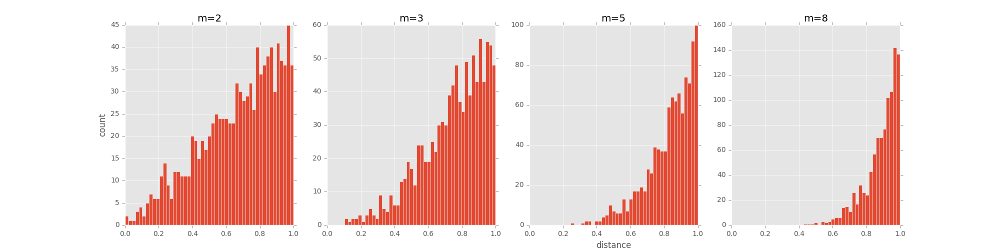

 从上图可以看到，随着维度的增大，大部分数据点都聚集在 $$m$$ 维球的表面附近，与点 $$x_i$$ 的距离分布极不均衡。如果直接将这种距离关系保留到低维，就会出现拥挤问题。为了解决拥挤问题， Cook et al.\(2007\) 提出一种slight repulsion的方式，在基线概率分布\(uniform background\)中引入一个较小的混合因子 $$\rho$$ ，这样 $$q_{ij}$$ 就永远不会小于 $$\frac{2\rho}{n(n-1)}$$ \(因为一共了 $$n(n-1)$$ 个pairs\)，这样在高维空间中比较远的两个点之间的 $$q_{ij}$$ 总是会比 $$p_{ij}$$ 大一点。这种称之为UNI-SNE，效果通常比标准的SNE要好。优化UNI-SNE的方法是先让 $$\rho$$ 为0，使用标准的SNE优化，之后用模拟退火的方法的时候，再慢慢增加 $$\rho$$ 。直接优化UNI-SNE是不行的\(即一开始 $$\rho$$ 不为0\)，因为距离较远的两个点基本是一样的 $$q_{ij}$$ \(等于基线分布\), 即使 $$p_{ij}$$ 很大，一些距离变化很难在 $$q_{ij}$$ 中产生作用。也就是说优化中刚开始距离较远的两个聚类点，后续就无法再把他们拉近了。

 对称SNE实际上在高维度下 另外一种减轻”拥挤问题”的方法：在高维空间下，在高维空间下我们使用高斯分布将距离转换为概率分布，在低维空间下，我们使用更加偏重长尾分布的方式来将距离转换为概率分布，使得高维度下中低等的距离在映射后能够有一个较大的距离。

 我们对比一下高斯分布和t分布\(如上图,code见probability/distribution.md\), t分布受异常值影响更小，拟合结果更为合理，较好的捕获了数据的整体特征。 使用了t分布之后的q变化，如下：

                                                     $$q_{ij}=\frac{(1+||y_i-y_j||^2)^{-1}}{\sum_{k\neq l(1+||y_i-y_j||^2)^{-1}}}$$ 

 此外，t分布是无限多个高斯分布的叠加，计算上不是指数的，会方便很多。优化的梯度如下：

                                   $$\frac{\delta C}{\delta y_i}=4\sum\limits_j(p_{ij}-q_{ij})(y_i-y_j)(1+||y_i-y_j||^2)^{-1}$$ 

 t-sne的有效性，也可以从上图中看到：横轴表示距离，纵轴表示相似度, 可以看到，对于较大相似度的点，t分布在低维空间中的距离需要稍小一点；而对于低相似度的点，t分布在低维空间中的距离需要更远。这恰好满足了我们的需求，即同一簇内的点\(距离较近\)聚合的更紧密，不同簇之间的点\(距离较远\)更加疏远。 总结一下，t-SNE的梯度更新有两大优势：

1. 1、对于不相似的点，用一个较小的距离会产生较大的梯度来让这些点排斥开来。
2. 2、这种排斥又不会无限大\(梯度中分母\)，避免不相似的点距离太远。

#### 算法过程

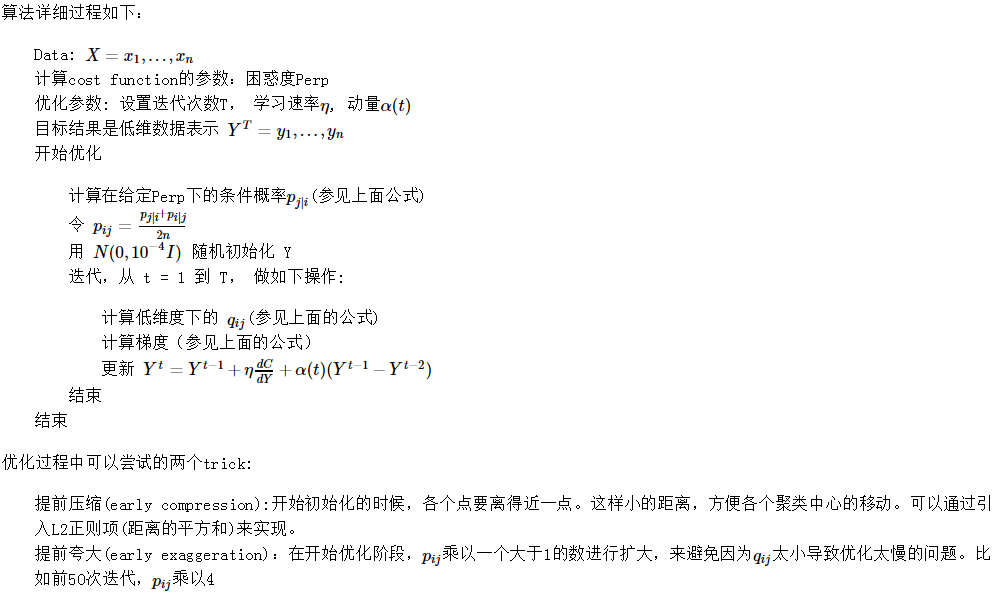

优化过程如下

 主要不足：

主要用于可视化，很难用于其他目的。比如测试集合降维，因为他没有显式的预估部分，不能在测试集合直接降维；比如降维到10维，因为t分布偏重长尾，1个自由度的t分布很难保存好局部特征，可能需要设置成更高的自由度。

t-SNE倾向于保存局部特征，对于本征维数\(intrinsic dimensionality\)本身就很高的数据集，是不可能完整的映射到2-3维的空间。

t-SNE没有唯一最优解，且没有预估部分。如果想要做预估，可以考虑降维之后，再构建一个回归方程之类的模型去做。但是要注意，t-sne中距离本身是没有意义，都是概率分布问题。

训练太慢。有很多基于树的算法在t-sne上做一些改进

## Source





