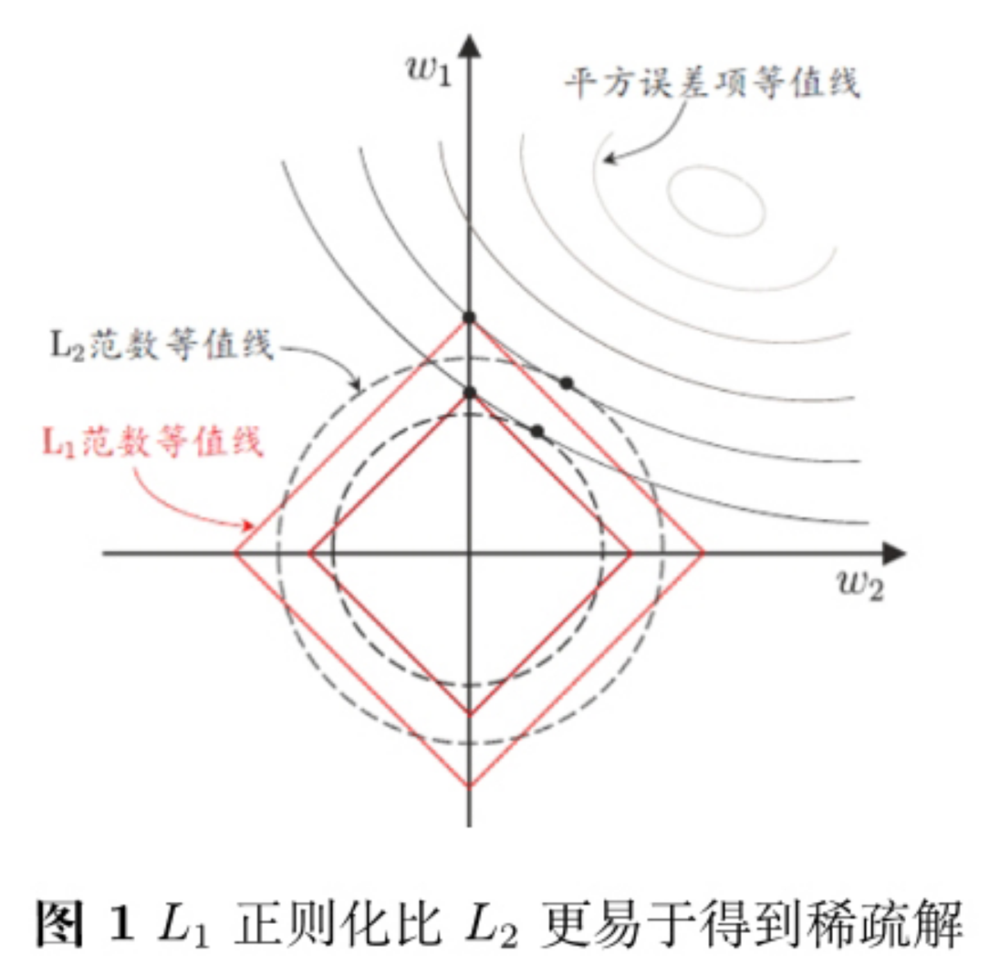

# 特征选择

我们能用很多属性描述一个西瓜，例如色泽、根蒂、敲声、纹理等，但有经验的恶人往往只看根蒂、听听敲声就知道是否好瓜。换言之，对一个学习任务来说，给定属性集，其中有些属性可能很关键、很有用，另一些属性则可能没什么用。我们将属性称为“特征”，对当前学习任务有用的属性称为“相关特征”、没什么用的属性称为“无关特征”。从给定的特征集合中选择出相关特征子集的过程，称为“特征选择”。

进行“特征选择”有两个重要原因：

（1）我们在现实任务中经常会遇到维数灾难问题，这是由于属性过多而造成的，若能从中选择出重要的特征，使得后续学习过程仅需一部分特征上构建模型，则维数灾难问题会大为减轻。

（2）去除不相关特征往往会降低学习任务的难度，这就像侦探破案一样，若将纷繁复杂的因素抽丝剥茧，只留下关键因素，则真相往往更易看清。

## 子集搜索与评价

特征选择过程必须确保不丢失重要特征，否则后续学习过程会因为重要信息的缺失而无法获得好的性能。欲从初始的特征集合中选取一个包含了所有重要信息的特征子集，若没有任何领域知识作为先验假设，那就只好遍历所有可能的子集了；然而这在计算上却是不可行的，因为这样会遭遇组合爆炸，特征个数稍微多就无法进行了。可行的做法是产生一个“候选子集”，评价出它的好坏，基于评价结果产生下一个候选子集，再对其进行评价。这个过程持续下去，直至无法找到更好的候选子集为止。这里涉及两个关键环节：（1）如何根据评价结果获取下一个候选特征子集 （2）如何评价候选子集的好坏

### 子集搜索

给定特征集合 $$\{a_1,a_2,\dots,a_d\}$$ ，我们可将每个特征看作一个候选子集，对这 $$d$$ 个候选单特正子集进行评价，假定 $$\{a_2\}$$ 最优，于是将 $$\{a_2\}$$ 作为第一轮的候选集；然后，在上一轮的选定集中加入一个特征，构成包含两个特征的候选子集，假定在这 $$d-1$$ 个候选两特征子集中 $$\{a_2,a_4\}$$ 最优，且优于 $$\{a_2\}$$ ，于是将 $$\{a_2,a_4\}$$ 作为本轮的选定集；……假定第 $$k+1$$ 轮时，最优的候选 $$(k+1)$$ 特征子集不如上一轮的选定集，则停止生成候选子集，并将上一轮选定的 $$k$$ 特征集合作为特征选择结果。这样逐渐增加相关特征的策略称为“前向”搜索。类似的，若我们从完整的特征集开始，每次尝试去掉一个无关特征，这样逐渐减少特征的策略称为“后向”搜索。还可将前向与后向搜索结合起来，每一轮逐渐增加选定的相关特征（这些特征在后续轮中将确定不会被去除）、同时减少无关特征，这样的策略称为“双向”搜索。

### 子集评价

给定数据集 $$D$$ ，假定 $$D$$ 中第 $$i$$ 类样本所占的比例为 $$p_i(i-=1,2,\dots,|\mathcal{Y}|)$$ 。假定样本属性均为离散型。对属性子集 $$A$$ ，假定根据其取值将 $$D$$ 分成 $$V$$ 个子集 $$\{D^1,D^2,\dots,D^V\}$$ ，每个子集中的样本在 $$A$$ 上取值相同，于是我们可计算属性子集 $$A$$ 的信息增益

                                              $$Gain(A)=Ent(D)-\sum\limits_{v=1}^V\frac{|D^v|}{|D|}Ent(D^v)$$ 

其中信息熵定义为

                                                           $$Ent(D)=-\sum\limits_{k=1}^{|\mathcal{Y}|}p_k\log_2p_k$$ 

信息增益 $$Gain(A)$$ 越大，意味着特征子集 $$A$$ 包含的有助于分类的信息越多。于是，对每个候选特征子集，我们可基于训练数据集 $$D$$ 来计算其信息增益，以此作为评价准则。

将特征子集搜索机制与子集评价机制相结合，即可得到特征选择方法。例如将前向搜索与信息熵相结合，这显然与决策树算法非常相似。事实上，决策树可用于特征选择，树结点的划分属性所组成的集合就是选择出的特征子集。其他的特征选择方法未必像决策树特征选择这么明显，但它们在本质上都是显式或隐式地结合了某种（或多种）子集搜索机制和子集评价机制。

常见的特征选择方法大致可分为三类：过滤式\(Filter\)、包裹式\(Wrapper\)和嵌入式\(Embedding\)

## 过滤式选择

过滤式方法先对数据集进行特征选择，然后再训练学习器，特征选择过程与后续学习器无关。这相当于先用特征选择过程对初始特征进行“过滤”，再用过滤后的特征来训练模型。

Relief\(Relevant Features\)是一种著名的过滤式特征选择方法，该方法设计了一个“相关统计量”来度量特征的重要性。该统计量是一个向量，其每个分量分别对应一个初始特征，而特征子集的重要性则由子集中每个特征所对应的相关统计量分量之和来确定。于是，最终只需指定一个阈值 $$\tau$$ ，然后选择比 $$\tau$$ 大的相关统计量分量所对应的特征即可；也可指定欲选取的特征个数 $$k$$ ，然后选择相关统计量分量最大的 $$k$$ 个特征。

显然，Relief的关键是如何确定相关统计量。给定训练集 $$\{(x_1,y_1),(x_2,y_2),\dots,(x_m,y_m)\}$$ ，对每个示例 $$x_i$$ ，Relief先在 $$x_i$$ 的同类样本中寻找其最近邻 $$x_{i,nh}$$ ，称为“猜中近邻”，再从 $$x_i$$ 的异类样本中寻找其最近邻 $$x_{i,nm}$$ 称为“猜错近邻”，然后，相关统计量对应属性 $$j$$ 的分量为

                                            $$\delta^j=\sum\limits_i-diff(x_i^j,x_{i,nh}^j)^2+diff(x_i^j,x_{i,nm}^j)^2$$ 

其中 $$x_a^j$$ 表示样本 $$x_a$$ 在属性 $$j$$ 上的取值， $$diff(x_a^j,x_b^j)$$ 取决于属性 $$j$$ 的类型：若属性 $$j$$ 为离散型，则 $$x_a^j=x_b^j$$ 时 $$diff(x_a^j,x_b^j)=0$$ ，否则为 $$1$$ ；若属性 $$j$$ 为连续型，则 $$diff(x_a^j,x_b^j)=|x_a^j-x_b^j|$$ ，注意 $$x_a^j,x_b^j$$ 已规范化到 $$[0,1]$$ 区间。

从 $$\delta^j=\sum\limits_i-diff(x_i^j,x_{i,nh}^j)^2+diff(x_i^j,x_{i,nm}^j)^2$$ 可以看出，若 $$x_i$$ 与其猜中近邻 $$x_{i,nh}$$ 在属性 $$j$$ 上的距离小于 $$x_i$$ 与其猜错近邻 $$x_{i,nm}$$ 的距离，则说明属性 $$j$$ 对区分同类与异类样本是有益的，于是增大属性 $$j$$ 所对应的统计分量；反之，则减小所对应的统计分量。最后，对基于不同样本得到的估计结果进行平均，就得到各属性的相关统计量分量，分量值越大，则对应属性的分类能力就越强。

Relief是为二分类问题设计的，其扩展变体Relief-F为处理多分类问题，相关统计量对应于属性 $$j$$ 的分量

                              $$\delta^j=\sum\limits_i-diff(x_i^j,x_{i,nh}^j)^2+\sum\limits_{l\neq k}(p_l\times diff(x_i^j,x_{i,nm}^j)^2))$$ 

其中 $$p_l$$ 为第 $$l$$ 类样本在数据集 $$D$$ 中所占的比例。

## 包裹式选择

与过滤式特征选择不考虑后续学习器不同，包裹式特征选择直接把最终将要适用的学习器的性能作为特征子集的评价标准。换言之，包裹式特征选择的目的就是为给定学习器学者最有利于性能、“量身定做”的特征子集。

LVW\(Las Vegas Wrapper\)是一个典型的包裹式特征选择方法。它在[拉斯维加斯方法\(Las Vegas method\)](https://www.zhihu.com/question/20254139/answer/33572009)框架下使用随机策略来进行子集搜索，并以最终分类器的误差为特征子集评价准则。算法描述：

输入：数据集 $$D$$ ，特征集 $$A$$ ，学习算法 $$f$$ ，停止条件控制参数 $$T$$ 

过程：

* 初始化：$$E=\infty$$ ， $$d = |A|$$ ， $$A^* = A$$ ， $$t = 0$$ 
* while $$t<T$$ ：
*            随机生成特征子集 $$A'$$ ， $$d'=|A'|$$ 
*            $$E' = Cross\ Validation(f(D^{A'}))$$ 
*             if $$(E'<E)\vee ((E'=E)\wedge(d'<d))$$ ：
*                       $$t = 0$$ ， $$E=E'$$ ， $$d = d'$$ ， $$A^*=A'$$ 
*             else：
*                       $$t = t+1$$ 

通过在数据集 $$D$$ 上使用交叉验证来估计学习器的误差，注意这个误差是在仅考虑特征子集 $$A'$$ 时得到的，即特征子集 $$A'$$ 上的误差。然后if判断若它比当前特征子集 $$A$$ 上的误差更小，或者误差相当但 $$A'$$ 中包含的特征数更少，则将 $$A'$$ 保留下来。

## 嵌入式选择与正则化

在过滤式和包裹式特征选择方法中，特征选择过程与学习器训练过程有明显的分别；与此不同，嵌入式特征选择是将特征选择过程与学习器过程融为一体，两者在同一个优化过程中完成，即在学习器训练过程中自动地进行了特征选择。

给定数据集 $$D=\{(x_1,y_1),(x_2,y_2),\dots,(x_m,y_m)\},\ x\in \mathbb{R}^d,\ y\in \mathbb{R}$$ 我们考虑最简单的线性回归模型，以平方误差为损失函数，则优化目标为

                                                              $$\min\limits_w\sum\limits_{i=1}^m(y_i-w^T x_i)^2$$ 

当样本特征很多，而样本数相对较少时，上式很容易过拟合，为了缓解过拟合问题，可引入正则化项。若使用 $$L_2$$ 范数正则化，则有

                                                      $$\min\limits_w\sum\limits_{i=1}^m(y_i-w^T x_i)^2+\lambda||w||^2_2$$ 

其中正则化参数 $$\lambda>0$$ 。上式“岭回归”\(ridge regression\)，通过引入 $$L_2$$ 范数正则化，确能显著降低过拟合的风险。

当然也可以将正则化项中的 $$L_2$$ 范数替换为 $$L_p$$ 范数，若令 $$p = 1$$ ，即采用 $$L_1$$ 范数，则有

                                                       $$\min\limits_w\sum\limits_{i=1}^m(y_i-w^T x_i)^2+\lambda||w||_1$$ 

其中正则化参数 $$\lambda>0$$ 。上式称为LASSO\(Least Absolute Shrinkage and Selection Operator\)。

$$L_1$$ 范数和 $$L_2$$ 范数正则化都有助于降低过拟合风险，但前者还会带来一个额外的好处： $$L_1$$ 比 $$L_2$$ 更易获得“稀疏”解，即它求得的 $$w$$ 会有更少的非零分量。比如如下例子：假定 $$x$$ 仅有两个属性，于是无论岭回归还是LASSO解出的 $$w$$ 都只有两个分量，即 $$w_1,w_2$$ ，我们将其作为两个坐标轴，然后在图中绘制出第一项的“等值线”，即在 $$(w_1,w_2)$$ 空间中平方误差取值相同的点的连线，再分别绘制出 $$L_1$$ 范数与 $$L_2$$ 范数的等值线，即在 $$(w_1,w_2)$$ 空间中 $$L_1$$ 范数取值相同的点的连线，以及 $$L_2$$ 范数取值相同的点的连线。

岭回归和LASSO的解要在平方误差项与正则化项之间折中，即出现在图中平方误差项等值线与正则化等值线相交处。由上图可看出，采用 $$L_1$$ 范数时平方误差项等值线与正则化项等值线的焦点经常出现在坐标轴上，即 $$w_1$$ 或 $$w_2$$ 为 $$0$$ ，而采用 $$L_2$$ 范数时，两者的交点常出现在某个象限中，即 $$w_1$$ 和 $$w_2$$ 为 $$0$$；换言之，采用 $$L_1$$ 范数比 $$L_2$$ 范数更易于得到稀疏解。

## Source



