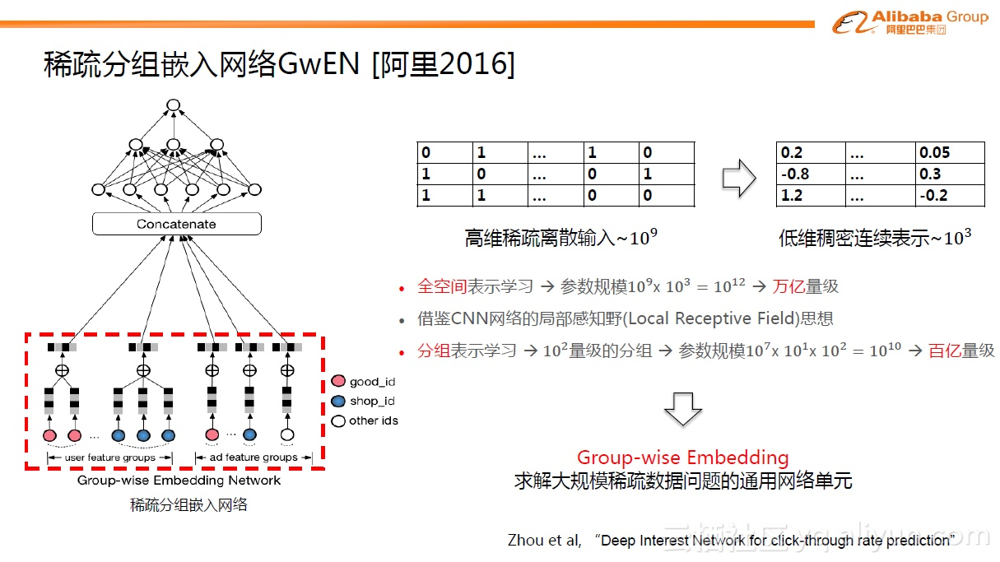

# 点击预估

## CTR介绍

CTR（Click-Through-Rate）即点击通过率，是互联网广告常用的术语，指网络广告（图片广告/文字广告/关键词广告/排名广告/视频广告等）的点击到达率，即该广告的实际点击次数除以广告的展现量。点击率预估（Click-Through Rate Prediction）是互联网主流应用\(广告、推荐、搜索等\)的核心算法问题，包括Google、Facebook等业界巨头对这个问题一直进行着持续投入和研究。 CTR预估是互联网计算广告中的关键技术环节，预估准确性直接影响公司广告收入。广告领域的CTR预估问题，面临的是超高维离散特征空间中模式发现的挑战——如何拟合现有数据的规律，同时又具备推广性。

### CTR问题特点与挑战

以阿里定向广告为例介绍CTR预估问题的特点与挑战：

下图中可以看到手机淘宝端的定向广告形态。左边是首焦场景，在淘宝顶端的位置会有浮动的Banner广告。右边是往下滑动时候的导购场景（猜你喜欢区块），投放的是Item广告。这些不同形态的定向广告背后其实有一些内在的、从machine learning视角来看相似的特征。简单来说，可以归纳为几个方面，一个方面是广告中展现的创意图片，第二个是图片的文字信息，还有一些在背后看不到摸不到的统一的ID体系，比如某件商品是什么商品，属于哪个品牌等等信息。定向广告复杂多样的富媒介形态以及高维海量数据空间，给广告点击率预估问题带来了不小的挑战。

下图是电商环境下CTR预估问题的数学化模拟。假设一位用户登录手机淘宝，我们首先可以拿到用户的一些历史行为数据，这些行为数据构成了我们对用户兴趣的表达刻画。那么下一步需要预估给用户展现某个候选商品candidate，用户发生点击/购买的概率是多少。那么如何实现预估？我们需要利用历史行为数据建模出用户的兴趣偏好。

将用户的行为按照时间排列，可以构成一个行为时间轴。每个时刻点可以称为行为结构体，它包含了一系列表征行为的关键信息：比如此刻的行为类型，点击or购买某个商品；某个商品的文本描述信息；对应的创意图片；行为发生的时间，行为发生的频次；或者行为背后的粒度体系是什么，对应的是什么商品、什么店铺以及什么品牌等等。

这些大量的行为信息可以足够表达用户的兴趣偏好。时间轴左边是历史的静态信息，称为feature；右边就是待预测的用户的未来行为，如点击行为（点击概率）、购买行为（购买概率）等等。电商场景下的广告预估问题相比于大家熟知的静态预估模型有更大的挑战。

第一个挑战，在淘宝端每天有数亿的用户会登陆，并产生大量的行为。同时我们有海量的商品候选集，在淘宝中有大概10亿到20亿的商品，当然聚焦到广告商品，可能会有所减少，但依然达到了千万的数量级。如此，广告预估问题就变成了数亿用户与千万商品配对的点击概率预估问题，规模极其庞大。

第二个挑战，每个用户行为特征背后，有大量的信号源，比如图像信号、文字信号、品牌偏好信号等等，这些信号如何去捕捉，如何进行统一建模？

第三个挑战，在电商场景下用户的行为非常丰富，反映出用户的兴趣多样多变，寻找与建模用户点击某个广告商品背后的规律是高度非线性的问题。

### 传统CTR算法及其不足

业界传统的CTR预估解法是广义线性模型LR\(logistic regression，逻辑斯特回归\)+人工特征工程。LR使用了Logit变换将函数值映射到0~1区间，映射后的函数值就是CTR的预估值。LR这种线性模型很容易并行化，处理上亿条训练样本不是问题。但这种解法的不足是，因为线性模型的学习能力有限，需要引入大量的领域知识来人工设计特征以及特征之间的交叉组合来间接补充算法的非线性学习能力，非常消耗人力和机器资源，迁移性不够友好。

另外，目前业界也有一些效果不错的非线性模型不断被提出来，并被工程实践且取得不错效果，但这些模型都或多或少存在一些不足。比如Kernel方法，因为复杂度太高而不易实现；比如Tree based方法，这个是由Facebook团队在2014年首先提出，有效地解决了LR模型的特征组合问题，但缺点就是仍然是对历史行为的记忆，缺乏推广性；还有FM（factorization machine）模型，能自动学习高阶属性的权值，不用通过人工的方式选取特征来做交叉，但FM模型只能拟合特定的非线性模式，如最常用的2阶FM只能拟合特征之间的线性关系和二次关系。深度神经网络非线性拟合能力足够强，但面对广告这样的大规模工业级稀疏数据，适合数据规律的、具备推广性的网络结构业界依然在探索中，尤其是要做到端到端规模化上线，这里面的技术挑战依然很大。

所以，如何设计算法从大规模数据中挖掘出具有推广性的非线性模式即急需探索问题。

在Deep Learning时代启动初期，有着巨大的挑战，具体包括：

* 从数百维统计特征到数十亿离散特征，训练程序要做重大升级，从数据并行模式要升级到模型并行方式，且非线性模型复杂度高，需要充分利用数据的结构化特点进行加速；
* 在这种互联网尺度\(百亿参数&样本\)的数据上，模型能不能学习到兼具拟合能力与泛化能力的范式？
* 超大规模数据上的非凸优化\(MLR加入正则后进一步变成非光滑\)学术界鲜有先例。它的收敛性是一个巨大的问号。

## [MLR\(Mixed Logistic Regression\)](https://arxiv.org/abs/1704.05194)

2011-2012年期间，阿里妈妈资深专家盖坤（花名靖世）突破了主流大规模线性模型的思路，创新性地提出了MLR\(mixed logistic regression, 混合逻辑斯特回归\)算法，引领了广告领域CTR预估算法的全新升级。MLR算法创新地提出并实现了直接在原始空间学习特征之间的非线性关系，基于数据自动发掘可推广的模式，相比于人工来说效率和精度均有了大幅提升。

阿里自主研发的MLR模型是对线性LR模型的推广，它利用分片线性方式对数据进行拟合。基本思路是采用分而治之的策略：如果分类空间本身是非线性的，则按照合适的方式把空间分为多个区域，每个区域里面可以用线性的方式进行拟合，最后MLR的输出就变为了多个子区域预测值的加权平均。在今天看来，MLR模型是带有一个隐层的神经网络。

如下图， $$X$$ 是大规模的稀疏输入数据，MLR模型第一步是做了一个Embedding操作，分为两个部分，一种叫聚类Embedding（绿色），另一种是分类Embedding（红色）。两个投影都投到低维的空间，纬度为M，对应的是MLR模型中的分片数。完成投影之后，通过很简单的内积（Inner Product）操作便可以进行预测，得到输出Y。右边是不同节点上的激活函数Activation Function，已按不同颜色区分。

MLR可以看做是对LR的一个自然推广，它采用分而治之的思路，用分片线性的模式来拟合高维空间的非线性分类面，其形式化表达如下：

                                        $$f(x)=\sum\limits_{i=1}^m\pi_i(x)\cdot \eta_i(x)=\sum\limits_{i=1}^m\frac{e^{\mu_i\cdot x}}{\sum_{j=1}^me^{\mu_j\cdot x}}\cdot\frac{1}{1+e^{-w_i\cdot x}}$$ 

这里面超参数分片数 $$m$$ 可以较好地平衡模型的拟合与推广能力。当 $$m=1$$ 时MLR就退化为普通的LR， $$m$$ 越大模型的拟合能力越强，但是模型参数规模随 $$m$$ 线性增长，相应所需的训练样本也随之增长。因此实际应用中 $$m$$ 需要根据实际情况进行选择。例如，在我们的场景中， $$m$$ 一般选择为12。下图中MLR模型用4个分片可以完美地拟合出数据中的菱形分类面。

MLR算法适合于工业级的大规模稀疏数据场景问题，如广告CTR预估。背后的优势体现在两个方面：

1. 端到端的非线性学习：从模型端自动挖掘数据中蕴藏的非线性模式，省去了大量的人工特征设计，这 使得MLR算法可以端到端地完成训练，在不同场景中的迁移和应用非常轻松。
2. 稀疏性：MLR在建模时引入了L1和L2,1范数正则，可以使得最终训练出来的模型具有较高的稀疏度， 模型的学习和在线预测性能更好。当然，这也对算法的优化求解带来了巨大的挑战。

### 算法高级特性

**1）结构先验。**基于领域知识先验，灵活地设定空间划分与线性拟合使用的不同特征结构。例如精准定向 广告中验证有效的先验为：以user特征空间划分、以ad特征为线性拟合。直观来讲这是符合人们的认知的：不同人群具有聚类特性，同一类人群对广告有类似的偏好，例如高消费人群喜欢点击高客单价的广告。结构先验有助于帮助模型缩小解空间的探索范围，收敛更容易。

**2）线性偏置。**这个特性提供了一个较好的方法解决CTR预估问题中的bias特征，如位置、资源位等。实际应用中我们对位置bias信息的建模，获得了4%的RPM提升效果。

**3）模型级联。**MLR支持与LR模型的级联式联合训练，这有点类似于wide&deep learning。在我们的实践经验中，一些强feature配置成级联模式有助于提高模型的收敛性。例如典型的应用方法是：以统计反馈类特征构建第一层模型，它的输出\(如下图中的FBCtr\)级联到第二级大规模稀疏ID特征体系中去，这样能够有助于获得更好的提升效果。

**4）增量训练。**实践证明，MLR通过结构先验进行pretrain，然后再增量进行全空间参数寻优训练，会获得进一步的效果提升。同时增量训练模式下模型达到收敛的步数更小，收敛更为稳定。在我们的实际应用中，增量训练带来的RPM增益达到了3%。

### 大规模分布式实现

MLR算法面向的是工业级的数据，例如亿级特征，百亿级参数，千亿级样本。因此我们设计了一套分布式架构，以支持模型的高效并行训练。下图是架构示意图，它跟传统的parameter server架构略有区别，主要不同点在于我们在每一个分布式节点上同时部署了worker和server两种角色，而不是将server单独剥离出去部署。这背后的考虑是充分利用每个节点的CPU和内存，从而保证最大化机器的资源利用率。

此外，针对个性化广告场景中数据的结构化特性，我们提出并实现了common feature的trick，可以大幅度压缩样本存储、加速模型训练。例如下图示意，在展示广告中，一般来说一个用户在一天之内会看到多条广告展现，而一天之内这个用户的大量的静态特征（如年龄、性别、昨天以前的历史行为）是相同的，通过common feature压缩，我们对这些样本只需要存储一次用户的静态特征，其余样本通过索引与其关联；在训练过程中这部分特征也只需要计算一次。在实践中应用common feature trick使得我们用近1/3的资源消耗获得了12倍的加速。

### 商业落地应用

#### 基于MLR的定向广告CTR预估算法

基于MLR算法的非线性学习能力，阿里妈妈的定向广告CTR预估采用了大规模原始ID特征+MLR算法的架构。具体地，我们刻画一次广告展现为特征向量，它由三部分独立构成：用户部分特征（包括userid、profile信息、用户在淘宝平台上的历史行为特征（浏览/购买过的宝贝/店铺/类目上的id和频次等）、广告部分特征（包括adid、campainid、广告对应的卖家店铺id、类目id等）、场景部分特征（包括时间、位置、资源位等）。这些特征之间无传统的交叉组合，维度在2亿左右。然后我们将数据直接喂给MLR算法，并且应用了结构化先验、pretrain+增量训练、线性偏置等高级技巧，让模型从数据中自动去总结和拟合规律。实践证明，相比于传统的LR+特征工程思路，这种解法更为高效和优雅，模型精度更高，在实际生产中的可迭代更强。

#### 基于MLR的定向广告Learning to Match算法

Match算法是定向广告中的一个重要环节，它的核心使命是基于用户的人口属性、历史行为等信息来猜测用户可能感兴趣的广告集合。传统的Match算法更多采用的是规则匹配、协同过滤等方法，方法的扩展性不强。在阿里妈妈定向广告系统中，我们研发了基于MLR的learning to match算法框架。简单来说，用模型的方法基于用户的行为历史来学习用户个性化的兴趣，从而召回高相关性的候选广告集。同样地，基于MLR算法的非线性能力，我们可以很容易地将不同的特征源、标签体系融合到框架中，不需要过多地关注和设计特征的交叉组合，使得框架的灵活性大大增强。

### 算法问题挑战

虽然目前取得了非常不错的成绩，但是未来的挑战也不小：比如初值问题、非凸问题的局部极值、虽然MLR比LR好，但不知道和全局最优相比还有多远；第二，在初值的Pre-train方面需要改进和优化模型函数等等；第三，目前规模化能力方面也需要能够吞吐更多特征和数据，比如采用更快的收敛算法等等；最后，整体的MLR算法的抽象能力也需进一步得到强化。

## 基于深度学习的CTR预估算法演化

传统的图像领域或NLP领域内，深度学习已经取得非常多的成果，在大多的问题上成为了state-of-the-art的方法。如图中显示，不同的领域有不同的适用结构。如图像领域内的CNN结构、语音的RNN结构。那么回到广告领域内，究竟什么结构是合适的？广告预估问题有很强的特点，它的特征极其的大规模和稀疏。典型的数量级从百万级，千万级到数亿级都有，而且大都是0或1这类没有直接意义的数据。这个问题一度成为广告预估问题引入深入学习的关键点。

### DSSM

如果说MLR模型是阿里巴巴初次对于深度学习方面的探索，在深度学习真正引入到广告预估问题中之后，出现了更多演变的模型。Deep Structured Semantic Model（DSSM）模型是微软2013年提出的。虽然在最初DSSM模型不是用于广告预估，但是现在看来，它为广告预估提供了一个很好的思路。这里主要关注下图中红色框内的部分，原理是把query/doc中的关键信息（Term Vector）提取出来进行简单的Word Hashing之后，把query/doc域分别投影到300维的子空间去。query里的每个word都对应一个300维的向量，一个query里会有多个向量，后面用sum求和操作得到一个汇总的300维向量，这是一个典型的Embedding操作。从图中可以看到，30k是指word字典的长度，300是embedding维数，30k\*300≈千万量级的参数。DSSM模型第一次探索了如何把大量稀疏的ID进行稠密表达的路径。

当然，DSSM模型本意不是用于广告预估问题。在深度学习最初引入CTR预估问题时，当时业界的一些公司如Google、百度等已经在探索如何把大量的稀疏数据进行降维的方法。一个典型的做法是用辅助的方式分两阶段进行：第一阶段，用FM模型把大量的稀疏ID学习到对应的embedding表达，跟DSSM模型类似，能够得到几百维的稠密向量。第二阶段是基于稠密的输入用多层全连接网络预测最后的目标。从今天的视角来看，这种两阶段的方式是不如整体的端到端模型的。这个思考点在2013年-2014年左右一直有人进行尝试，但当时一是因为深入学习框架的没能普及，二是对整个计算力的估计不足，因此没有达到比较好的进展，直到2016年左右，才有所突破，当然这里面很重要的一点是得益于优秀的深度学习框架如TensorFlow、MXNet等的开源和普及，进一步促进了整个工业界的思考和前进。

### GwEN

下面以阿里2016年的网格框架为例进行介绍。整个稀疏分组嵌入网络结构（GwEN）分为两部分，如下图左边所示。第一部分，把大规模的稀疏特征ID用Embedding操作映射为低维稠密的Embedding向量，然后把每个特征组的 Embedding进行简单的sum或average的pooling操作，得到Group-wise的Embedding向量。第二部分，多个特征组的向量通过Concatenate操作连接在一起，构成原始样本的完整稠密表达，喂给后续的全连接层。

GwEN网络结构是比较基础的，但同样也非常重要。因为在最初大家普遍的直观思考是，假设有个高维的稀疏输入，典型的数量级是，然后将每个ID学习到一个表达，如果表达太小，便不足以客刻画信息本身，那么设想投影维度控制在数百上千估计是合适的。早期百度或Google的探索中，大概是一样的量级。这样算来，全空间便达到万亿的量级，极其恐怖，一方面对于训练样本的要求，另一方面对于背后的计算能力的要求都非常高。Group-wise Embedding的核心想法是借鉴CNN网络的局部感知野（Local Receptive Field）的思想。以整体输出表达向量为例，其实不需要每个ID达到千维的表达，因为在分组表示学习中每个特征组可以分别得到一个低维的表达，一共个分组，组里面的每个ID只需要学习的表达即可。这样，整个参数规模可以直接压缩到百亿的量级，这是工业界比较舒服的量级。尽管GwEN这种网络结构非常简单，但提出了非常重要的Group-wise Embedding 的概念，现在也称为求解大规模稀疏数据问题的通用网络单元。GwEN网格结构在2016年左右在阿里内部已经上线。

15年的时候，基于MLR的算法迭代进入瓶颈。当时认识到，要想进一步发挥MLR模型的非线性能力，需要提高模型的分片数——模型的参数相应地会线性增长，需要的训练样本量同样要大幅度增加，这不太现实。期间我们做了些妥协，从特征的角度进行优化，比如设计了一些直观的复合特征，典型的如”hit类特征”：用户历史浏览过商品A/B/C，要预估的广告是商品C，通过集合的”与”操作获得”用户历史上浏览过广告商品”这个特征。细心的读者应该很容易联想到后来我们进一步发展出来的DIN模型，通过类似attention的技巧拓展了这一方法。后来进一步引入一些高阶泛化特征，如user-item的PLSA分解向量、word2vec embedding等。但这些特征引入的代价大、收益低、工程架构复杂。

15年底16年初的时候我们开始认真地思考突破MLR算法架构的限制，向DL方向迈进。这个时间在业界不算最早的，原因如前所述，MLR是DL之前我们对大规模非线性建模思路的一个可行解，它助力了业务巨大的腾飞，因此当时够用了——能解决实际问题就是好武器，这很重要。在那个时间点，业界已经有了一些零散的DL建模思路出现，最典型的是B家早期的两阶段建模解法——先用LR/FM等把高维离散特征投影为数千规模的稠密向量，然后再训练一个MLP模型。我们最初也做过类似的尝试如w2v+MLR/DNN，但是效果不太显著，看不到打败MLR的希望\(不少团队从LR发展过来，这种两阶段建模打败LR应该是可行的\)。这里面关键点我们认为是端到端的建模范式。

实践和思考不久催生了突破。16年5-6月份我构思出了第一代端到端深度CTR模型网络架构\(内部代号GwEN, group-wise embedding network\)，如上图所示。对于这个网络有多种解释，它也几乎成为了目前业界各个团队使用深度CTR模型最基础和内核的版本。图1给出了思考过程，应该说GwEN网络脱胎换骨于MLR模型，是我们对互联网尺度离散数据上端到端进行非线性建模的第二次算法尝试。当然跟大规模MLR时期一样，我们再一次遭遇了那三个关键挑战：

* 从数百维统计特征到数十亿离散特征，训练程序要做重大升级，从数据并行模式要升级到模型并行方式，且非线性模型复杂度高，需要充分利用数据的结构化特点进行加速；
* 在这种互联网尺度\(百亿参数&样本\)的数据上，模型能不能学习到兼具拟合能力与泛化能力的范式？
* 超大规模数据上的非凸优化\(MLR加入正则后进一步变成非光滑\)学术界鲜有先例。它的收敛性是一个巨大的问号。

### Wide & Deep Learning

与阿里同时期，Google推出了Wide & Deep Learning（WDL）模型，一个非常出名的模型。详细内容可以从论文中查询Cheng et al, “Wide & deep learning for recommender systems” 。WDL模型也非常简单，但巧妙的将传统的特征工程与深度模型进行了强强联合。Wide部分是指人工先验的交叉特征，通过LR模型的形式做了直接的预测。右边是Deep部分，与GwEN网络结构一样，属于分组的学习方式。WDL相当于LR模型与GwEN结合训练的网络结构。

### FNN/PNN/DeepFM

GwEN和WDL是目前比较常用的模型，非常简单，所有后续人们继续做了很多改进，例如FNN，PNN以及DeepFM等。这些模型基础的部分与上面的GwEN和WDL模型类似，即Group-wise Embedding。改进的地方主要在后面的部分，引入了代数式的先验pattern，如FM模式，比较简单直接，可以给MLP 提供先验的结构范式。虽然理论上说，MLP可以表达任意复杂的分类函数，但越泛化的表达，拟合到具体数据的特定模式越不容易，也就是著名的“No Free Lunch”定理。因此代数式的先验结构引入确实有助于帮助MLP更好的学习。当然从另外的视角看，这种设定的结构范式比较简单，过于底层，也使得学习本身比较低效。

### DIN

另外一个工作是阿里在2017年发表的用户兴趣分布网络DIN模型。与上面的FNN,PNN等引入低阶代数范式不同，DIN的核心是基于数据的内在特点，引入了更高阶的学习范式。互联网上用户兴趣是多种多样的，从数学的角度来看，用户的兴趣在兴趣空间是一个多峰分布。在预测多兴趣的用户点击某个商品的概率时，其实用户的很多兴趣跟候选商品是无关的，也就是说我们只需要考虑用户跟商品相关的局部兴趣。所以DIN网络结构引入了兴趣局部激活单元，它受attention机制启发，从用户大量的行为集合中捕获到与candidate商品相关的行为子簇，对于用户行为子簇，通过Embedding操作，做weighted sum便可很好的预估出用户与candidate相关的兴趣度。传统的GwEN、WDL、FNN等模型在刻画用户兴趣分布时，会简单的将用户兴趣特征组做sum或average的pooling操作，这会把用户真正相关的兴趣淹没在pooling过程中。DIN模型的具体细节可以参考论文：Zhou et al, “Deep Interest Network for click-through rate prediction” 。

## 外部演化探索方向

假设固定网络结构，那么外部演化则考虑的是有没有一些更好的特征输入或样本的方式可以帮助模型学习的更好。如下图所示，为阿里在两个方向上探索的模型例子。

外部演化具体可分为三个方向：多模态信号输入、多场景迁移学习、深度个性化质量分网络

### 多模态信号输入

首先介绍阿里在2017年发表的用户行为ID+图像的多模态学习模型的工作。用户在看到某个商品之后，映入眼帘的除了商品是什么的信息外，还有一系列的图片创意内容。比如下图是一款儿童画板商品，画板的大小、颜色甚至小宝宝可爱的模样等信息可能激发了用户点击的欲望。这类信息是无法单纯地通过画板这个ID完全表达的。所以这里面我们主要做的事情就是对于用户行为，除了商品ID之外，把对应的图像也放进来，统一表征用户的行为。

下图中左边部分描述了整个结构。与上面的DIN网络结构一致的是也使用了attention机制，引入Ad与User之间的相关性，不同的是网络结构将用户行为的ID特征与图片特征两种不同模态很自然的揉合在一起，解决了预测问题。这种做法在算法中非常直观，但事实上在背后真正建立模型时工程上面有很大的挑战。假设某个业务场景中有100亿的样本，每个样本有500个对应的用户行为ID特征，每个ID背后都有对应的图片。从图片视角来看，图片训练集有5亿张，多达8T数据，如果将图片训练装配到样本中平铺开来会接近800TB的数据。就算存储在SSD（2TB）磁盘上，也需要400台机器存储，何况要考虑更复杂的网络操作、图片加载到内存进行计算的巨大开销等等。为此，阿里研发设计了一种更高阶的AMS深度学习训练架构，AMS比传统的Parameter Server\(PS\)架构更高阶，具体细节可参见论文Ge et al, “Image Matters: Visually modeling user behaviors using Advanced Model Server” 。

### 多场景迁移学习

对于模型而言，如果有更多的数据进行模型训练，效果一般都能得到提高。在手机淘宝端，我们有很多不同场景的广告位，如首页焦点图，导购场景等等。每个场景蕴含了用户的不同兴趣的表达。将不同场景直接进行合并用来训练模型，结果不是很乐观。因为不同场景之间的样本分布存在diff，直接累加样本会导致效果负向。

随着深度学习发展，发现用Multi-task learning\(MTL\)的方式可以很漂亮的解决这个问题。如上图中左边的例子，分为两个task，即分为两个子网络，对于底层的难以学习的Embedding层（或称为特征稀疏表达层）做了表示学习的共享（Shared Lookup Table），这种共享有助于大样本的子任务帮助小样本的子任务，使得底层的表达学习更加充分。对于上层的子网络，不同的task是分拆为不同的子网络，这样每个子网络可以各自去拟合自己task对应的概念分布。当然，在一些更复杂的问题中，需要进一步考虑不同task之间存在的关系，这种关系也可以帮助task达到更好的预测效果，这里叫做Label Information Transfer。MTL给跨场景迁移应用打开了一扇新的大门，可以充分的挖掘不同场景之间的独立性和关联性，从而帮助每个场景达到更好的效果。

### 深度个性化质量分网络

当用户在访问手机淘宝时，一瞬间，系统会有数千万的候选广告可以展现给用户，那具体展现哪些广告？下图中有简单的筛选过程。最开始通过一层匹配算法，圈出10万量级广告。这些广告需要在几十毫秒内展现给用户，如果全部进行复杂的模型打分，计算量是无法想象的，所以一般是分阶段进行：第一步利用简单的质量分数进行海选（Qscore是对每个Ad点击率的简单度量）。第二步利用DQM模型进行初排，这是一个从1万到1千的筛选过程。最后，用最复杂精细的模型，如DIN ，从1千中获取10个非常精准的广告。

在第二步中，因为需要在几个毫秒内完成近万广告的打分过程，所以这个模型结构不能过于复杂。DQM模型类似与DSSM模型，分成不同域，如用户域，广告域以及场景域。将这些域表达成向量形式，最后的输出是通过向量间的简单操作，如内积操作，生成分数。相比传统的静态质量分Qscore模型，DQM引入了个性化，所以比Qscore好很多。

## Source









